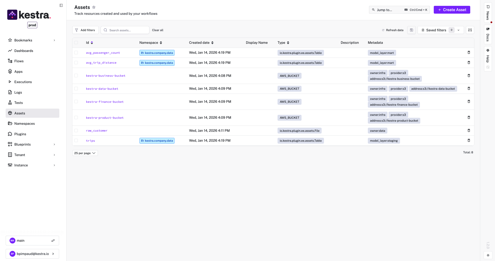

If you’ve ever tried to understand which workflow updated a table in production, why a downstream job suddenly broke, or what depends on a critical dataset, you’ve seen the limits of orchestration without context. Workflows run, but the knowledge of what they touch and produce is scattered across logs, code, and people’s heads.

**Kestra Assets** solves this by making governance a **byproduct of execution**.
>
 This approach is **technology-agnostic by design**. Whether a workflow runs a **SQL query**, a **Python script**, a **dbt transformation**, an **API call**, a **CLI command**, or provisions infrastructure, you can attach asset declarations to any task. **Unlike language- or code-centric solutions** (such as Python decorators), Kestra Assets are **declarative and universal**. No matter the tool or language used under the hood, inputs and outputs can be captured as named assets. In short: *if your workflow touches it, you can track it.*
>
The result is a catalog you can trust and lineage that reflects reality without manual documentation or guesswork. Data and infrastructure artifacts become **discoverable, traceable, and reusable**, enabling safer pipelines and better collaboration across data, platform, and engineering teams.

In this post, we’ll explore what Kestra Assets are, how they work (in a **language-agnostic** way that goes beyond just Python code), and why they matter for building modern, governed platforms.

*(Spoiler: Assets unify the best of orchestration and data cataloging. You get automatic **data lineage graphs**, clear ownership of resources, impact analysis on changes, and much more, all **without any manual documentation**.)*

## What Are Kestra Assets?

At its core, a **Kestra Asset** represents a **resource** that your workflow interacts with. This could be a table in a database, a file in cloud storage, a VM instance, a dataset, or any resource type you define. Each Asset has:

- **An ID** (unique name within its namespace)
- **A Type** (e.g. `Table`, `File`, `VM`, or a custom string for your own category)
- **Optional Metadata** (key-value attributes to describe the asset, like `owner`, `system`, `environment`, `model_layer`, etc.)

**How are assets defined?** You declare them **directly in your workflow’s tasks**. Kestra extends the YAML syntax to allow each task to list which assets it **consumes** and which assets it **produces**. We use an `assets:` block with two sections:

- **`inputs`** – Assets that the task reads or depends on (but does not modify).
- **`outputs`** – Assets that the task creates or writes to.

For example, if a task creates a new database table, you’d list that table as an output asset. If another task reads from an existing table, you’d list that table as an input asset. Kestra then automatically **registers** those assets in a global inventory and links them to the task (and flow) that used them.

## Data Assets: Governed analytics with end-to-end lineage

In an analytics platform, data rarely lives in a single place or a single workflow. Raw datasets are ingested, transformed, aggregated, and reused across teams. Without governance, understanding how analytics tables are built, and what depends on them, quickly becomes difficult.

With Kestra Assets, analytics datasets are modeled explicitly as part of the orchestration layer.

A typical pattern looks like this:

id: data-pipeline-assets
namespace: kestra.company
```yaml
tasks:
  - id: create_staging_layer_asset
    type: io.kestra.plugin.jdbc.duckdb.Query
    sql: |
      CREATE TABLE IF NOT EXISTS trips AS
      select VendorID, passenger_count, trip_distance from sample_data.nyc.taxi limit 10;
    assets:
      inputs:
        - id: sample_data.nyc.taxi
      outputs:
        - id: trips
          namespace: "{{flow.namespace}}"
          type: io.kestra.plugin.ee.assets.Table
          metadata:
            model_layer: staging

  - id: for_each
    type: io.kestra.plugin.core.flow.ForEach
    values:
      - passenger_count
      - trip_distance
    tasks:
      - id: create_mart_layer_asset
        type: io.kestra.plugin.jdbc.duckdb.Query
        sql: SELECT AVG({{taskrun.value}}) AS avg_{{taskrun.value}} FROM trips;
        assets:
          inputs:
            - id: trips
          outputs:
            - id: avg_{{taskrun.value}}
              type: io.kestra.plugin.ee.assets.Table
              namespace: "{{flow.namespace}}"
              metadata:
                model_layer: mart

pluginDefaults:
  - type: io.kestra.plugin.jdbc.duckdb
    values:
      url: "jdbc:duckdb:md:my_db?motherduck_token={{ secret('MOTHERDUCK_TOKEN') }}"
      fetchType: STORE
```

- An **external dataset** (for example, a source table stored outside Kestra) is declared as an **input asset**.
- A **staging table** is created in the analytics engine and registered as a `Table` asset, enriched with metadata such as `model_layer: staging`.
- One or more **mart tables** are derived from the staging layer and registered as `Table` assets with `model_layer: mart`.
- Each transformation explicitly declares its upstream and downstream assets.

Because assets are declared directly in workflow tasks, Kestra automatically builds a **complete lineage graph** from source to staging to marts. This lineage is always up to date, because it is generated from execution, not documentation.

The impact is immediate:

- Data teams can visualize exactly how analytics tables are produced.
- Downstream dependencies are visible before changes are deployed.
- Staging and mart layers follow clear, enforceable modeling conventions.
- Analytics assets become discoverable and reusable across teams.

This approach works regardless of the underlying engine or language. Whether transformations are written in SQL, dbt, Python, or executed via CLI, the asset model remains consistent.

## Infrastructure Assets: Provisioned resources as first-class citizens

Infrastructure workflows often create and manage long-lived resources such as buckets, VMs, or databases. Traditionally, these resources are provisioned by automation but remain invisible once created, making ownership, reuse, and governance difficult.

Kestra Assets bring the same level of visibility and lineage to **infrastructure automation**.

For example:

```yaml
id: infra_assets
namespace: kestra.company

inputs:
  - id: teams
    type: MULTISELECT
    values:
      - Business
      - Data
      - Finance
      - Product

tasks:
  - id: for_each
    type: io.kestra.plugin.core.flow.ForEach
    values: "{{ inputs.teams }}"
    tasks:
      - id: create_bucket
        type: io.kestra.plugin.aws.cli.AwsCLI
        commands:
          - aws s3 mb s3://kestra-{{ taskrun.value | slugify }}-bucket
        assets:
          outputs:
            - id: kestra-{{ taskrun.value | slugify }}-bucket
              type: AWS_BUCKET
              metadata:
                provider: s3
                address: s3://kestra-{{ taskrun.value | slugify }}-bucket

pluginDefaults:
  - type: io.kestra.plugin.aws
    values:
      accessKeyId: "{{ secret('AWS_ACCESS_KEY') }}"
      secretKeyId: "{{ secret('AWS_SECRET_ACCESS_KEY') }}"
      region: "{{ secret('AWS_REGION') }}"
      allowFailure: true

```
- A platform workflow provisions cloud resources dynamically (such as one storage bucket per team).
- Each resource is registered immediately as an **infrastructure asset** (e.g. an `AWS_BUCKET`), with metadata describing ownership, provider, and environment.
- Downstream workflows reference these resources explicitly as **input assets** when they upload files, process data, or run jobs.

This creates a clear contract between teams:

- Platform teams provision infrastructure and expose it as governed assets.
- Application and data teams consume those assets safely and transparently.
- Every workflow execution that touches an infrastructure resource is tracked.

With this model:

- Infrastructure dependencies are visible in the same catalog as data assets.
- Teams can see which workflows rely on which resources.
- “Ghost resources” are avoided because provisioned infrastructure is always registered and traceable.
- Infrastructure-as-code is combined with **infrastructure-as-assets**, enabling governance without extra tooling.

Just like data assets, infrastructure assets are **technology-agnostic**. Whether a resource is created via a cloud API, a CLI command, or a custom script, it can be tracked the same way.

## Lineage, Governance, and Reuse

Kestra Assets elevates workflows from simply running tasks to **managing shared knowledge about data and infrastructure**.

As workflows execute, Kestra automatically captures what they read and produce, building a live catalog with lineage and dependencies. You can instantly see how datasets, files, and resources are connected, what depends on what, and what will be impacted by a change.

Every asset keeps a full execution history, making ownership and accountability clear without digging through logs. Assets are searchable and reusable across teams, while metadata enforces best practices like modeling layers, ownership, and environments.

The result is governance built directly into orchestration.

Check the video below for a quick overview of the feature.

<div class="video-container">
  <iframe src="https://www.youtube.com/embed/XhICXP_GXic?si=SqweJSXueK7uAmST" title="Kestra 1.2 Overview" allow="accelerometer; autoplay; clipboard-write; encrypted-media; gyroscope; picture-in-picture; web-share" referrerpolicy="strict-origin-when-cross-origin" allowfullscreen></iframe>
</div>

## Working with Assets in Kestra

Kestra’s UI and features make it easy to leverage the Assets system:

**Asset Catalog:**
A new **Assets** section in the Kestra UI lists all assets across your tenant (with RBAC enforcement). You can search by ID or filter by type, namespace, or metadata tags.



**Dependency Graph Visualization:**
On any asset’s detail page, Kestra displays an interactive **lineage graph** showing that asset’s **upstream and downstream** links. This graph updates automatically as flows run. It’s invaluable for quickly understanding the context of an asset. This visual map helps both developers and stakeholders grasp data flows without reading code.


**Execution History & Details:**
Each asset page also lists attributes (ID, type, full namespace, timestamps) and a log of **which flow executions touched it**. You can click through to the exact flow run for more details. This effectively provides an **audit log per asset**. If something looks off in a dataset, you can see if maybe an unusual flow run that affected it. For external assets that Kestra references (like an imported dataset), you’ll at least see which Kestra flows have been reading it recently.


**Dynamic Asset Queries:**
Kestra provides a built-in function `assets()` for your workflow scripts, so you can query the asset inventory dynamically. For instance, you can populate a dropdown input with all asset IDs of a certain type. This makes your workflows extremely flexible and **self-driving based on the current catalog**.

```yaml
id: list_aws_bucket
namespace: kestra.company
inputs:
  - id: assets
    type: MULTISELECT
    expression: "{{ assets(type='AWS_BUCKET') | jq('.[].id') }}"
tasks:
  - id: for_each
    type: io.kestra.plugin.core.flow.ForEach
    values: '{{inputs.assets}}'
    tasks:
      - id: list_buckets
        type: io.kestra.plugin.core.log.Log
        message: "{{ taskrun.value }}"
```

**Metadata and Tagging:**
Because assets support custom metadata, you can enforce conventions. For example, tag assets with `environment: prod` vs `dev`, or `owner: team_name`, or any classification your organization needs. These tags make search and filtering powerful. More importantly, they provide context to each asset, anyone looking at it knows what it represents. In future releases, we plan to allow **programmatic updates to asset metadata** via dedicated tasks, which will further integrate assets into automated governance workflows (e.g., auto-tag new tables with a retention policy or sensitivity level).


## **Extensible & Future-Proof**

Kestra’s vision is to make this even more global. We’re working on plugin enhancements to enable certain plugins to automatically **emit asset information**. For example, a database connector plugin might automatically register a Table asset when a query creates a table, without you specifying it. We’re also exploring triggers and alerts based on assets (imagine a trigger that fires when a particular asset hasn’t been updated in X days, indicating stale data). The Asset system is designed to be a game changer for **data quality, monitoring, and even external catalog integrations** (indeed, we have an `AssetShipper` that can export asset metadata to formats like OpenLineage or other catalogs).

## The End of "I Don't Know"


**Think about the last time someone asked you:** “Which pipeline updates this table?” or “What broke when we changed that upstream dataset?” How long did it take you to answer? **Minutes? Hours? Days?**

**With Kestra Assets, the answer is instant.**

This isn’t just another feature — it’s a **fundamental shift** in how we think about orchestration. We’re moving from pipelines that simply execute tasks to platforms that **understand and govern your entire data ecosystem**. Every table, every file, every resource becomes **visible, traceable, and accountable**.

**The impact is immediate:**

- Data engineers stop playing detective when something breaks
- Analytics teams trust their data because they can see its full lineage
- Platform teams finally have visibility into what’s actually running in production
- Business stakeholders get transparency into the data they depend on

No more tribal knowledge. No more archaeological digs through logs and code. No more wondering if you’re using the right version of that critical dataset. Just **clear, automatic, always-up-to-date governance** baked directly into your orchestration layer.

**Kestra Assets don’t just solve today’s problems — they prevent tomorrow’s chaos.** This is orchestration evolved. This is governance without the overhead. This is what happens when you stop treating data and infrastructure as invisible byproducts and start managing them as the **strategic assets they truly are**.

**Hello, Assets. Welcome to the future of orchestration.**

---

**Ready to Transform Your Orchestration?**

Assets is available now in [Kestra Enterprise Edition](/enterprise). If you’re serious about bringing transparency, governance, and control to your data platform, we should talk. Schedule a personalized demo to see Assets in action with your own use cases and to discuss implementing this in your Kestra platform.

**The question isn’t whether you need governance in your orchestration — it’s whether you can afford to keep operating without it.**<br>
→ [Schedule a Demo](/demo) <br>
→ [Explore Enterprise Edition](/enterprise)<br>
→ [Read the Documentation](../../docs/07.enterprise/02.governance/01.assets/index.md)