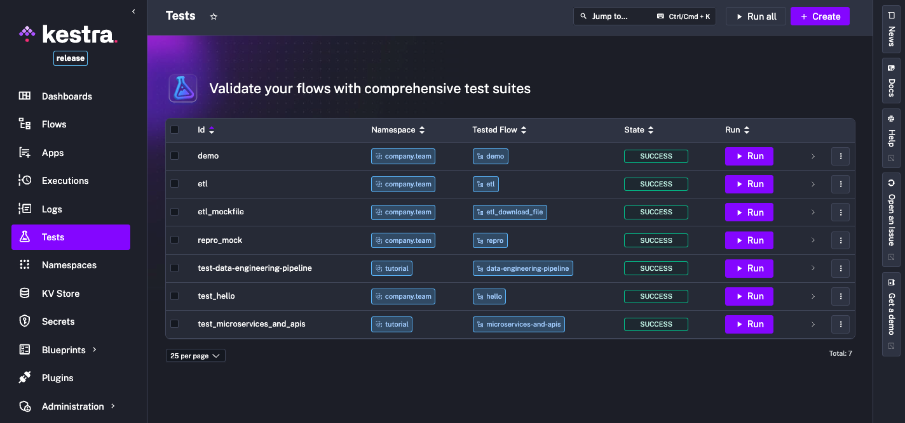
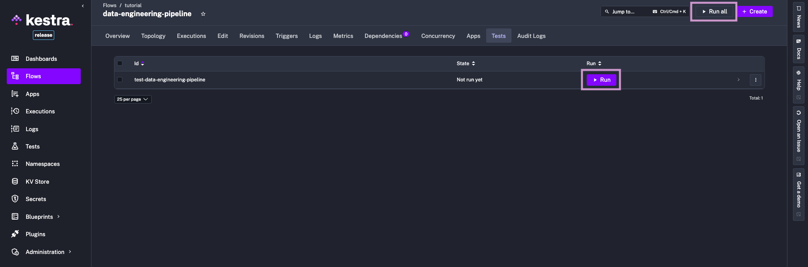

The 0.23 release introduces a major addition to the Kestra platform: **Unit Tests for Flows**. With this new feature, you can verify the logic of your flows in isolation, helping you catch regressions early and maintain reliability as your automations evolve.

## Why Unit Tests?

Automated testing is critical for any robust workflow automation. Flows often touch external systems, such as APIs, databases, or messaging tools, which can create side effects when you test changes. Running production flows for testing might unintentionally update data, send messages, or trigger alerts. Unit Tests make it possible to safely verify workflow logic without triggering side effects or cluttering your main execution history.

With Unit Tests, you can:

- **Prevent regressions**: identify unexpected changes before they reach production
- **Mock external systems**: mock API calls, database writes, and other I/O operations with fixtures
- **Run tests from the UI**: create tests declaratively in YAML, and run them directly from the UI
- **Keep your execution list clean**: test runs don't appear in the regular Executions list for a clean separation between test runs and production workflow executions; to view an execution made from a test, you can open the test case in the UI and click on the link for the `ExecutionId`
- **Test at scale**: Isolated executions created for each test case allow running hundreds of tests in parallel with no degradation to the system performance.

## What Are Unit Tests in Kestra?

Unit Tests in Kestra let you validate that your flows behave as expected, with the flexibility to mock inputs, files, and specific task outputs. This means that you can:

- Validate how a given task responds to particular flow inputs or outputs of previous tasks, without impacting production data
- Mock heavy or external operations (e.g., database writes, data ingestion jobs, sending notifications), skipping their execution and using predefined outputs or states instead
- Write tests declaratively in YAML, keeping them language-agnostic and human-readable even to non-technical stakeholders
- Manage and execute tests directly from the Kestra UI.

Each **Test** in Kestra contains one or more **test cases**. Each test case runs in its own transient execution, allowing you to run them in parallel as often as you want without cluttering production executions.

### How Tests Are Structured

Each test includes:

- An `id` for unique identification
- The `namespace` and `flowId` being tested
- A list of `testCases` — each test case can define:
    - `id`, `type` (currently only `UnitTest`), and optional `description` or `disabled` flag
    - `fixtures` to mock inputs, files, or task outputs/states
    - `assertions` to check actual values from the execution against expectations.

The image below visualizes the relationship between a flow, its tests, test cases, fixtures and assertions.


### Fixtures

Fixtures let you control mock data injected into your flow during a test. You can mock:

- **Inputs**: set specific test values for any flow input
- **Files**: add inline file content, or reference a namespace file
- **Tasks**: mock any task by specifying `outputs` (and optionally a `state`), which skips execution and immediately returns your output values; this is ideal for tasks that interact with external systems and produce side effects.

Here is an example of a task fixture with outputs:

```yaml
    fixtures:
      tasks:
        - id: extract
          description: mock extracted data file
          outputs:
            uri: "{{ fileURI('products.json') }}"
```

Simply listing task IDs under `tasks` (without specifying outputs) will cause those tasks to be skipped and immediately marked as `SUCCESS` during the test, without executing their logic:
```yaml
    fixtures:
      tasks: # those tasks won't run
        - id: extract
        - id: transform
        - id: dbt
```

### Assertions

Assertions are conditions tested against outputs or states to ensure that your tasks behave as intended. Supported operators include `equalTo`, `notEqualTo`, `contains`, `startsWith`, `isNull`, `isNotNull`, and many more (see the table below).

Each assertion can specify:
- The `value` to check (usually a Pebble expression)
- The assertion operator (e.g., `equalTo: 200`)
- The `taskId` it's associated with (optional)
- Custom error/success messages (optional)
- A description for clarity (optional).

If any assertion fails, Kestra provides clear feedback showing the actual versus expected value.

| **Operator**         | **Description of the assertion operator**                                                         |
| -------------------- | ------------------------------------------------------------------------------------------------- |
| isNotNull            | Asserts the value is not null, e.g. `isNotNull: true`                                             |
| isNull               | Asserts the value is null, e.g. `isNull: true`                                                    |
| equalTo              | Asserts the value is equal to the expected value, e.g. `equalTo: 200`                             |
| notEqualTo           | Asserts the value is not equal to the specified value, e.g. `notEqualTo: 200`                     |
| endsWith             | Asserts the value ends with the specified suffix, e.g. `endsWith: .json`                          |
| startsWith           | Asserts the value starts with the specified prefix, e.g. `startsWith: prod-`                      |
| contains             | Asserts the value contains the specified substring, e.g. `contains: success`                      |
| greaterThan          | Asserts the value is greater than the specified value, e.g. `greaterThan: 10`                     |
| greaterThanOrEqualTo | Asserts the value is greater than or equal to the specified value, e.g. `greaterThanOrEqualTo: 5` |
| lessThan             | Asserts the value is less than the specified value, e.g. `lessThan: 100`                          |
| lessThanOrEqualTo    | Asserts the value is less than or equal to the specified value, e.g. `lessThanOrEqualTo: 20`      |
| in                   | Asserts the value is in the specified list of values, e.g. `in: [200, 201, 202]`                  |
| notIn                | Asserts the value is not in the specified list of values, e.g. `notIn: [404, 500]`                |


If some operator you need is missing, let us know via [a GitHub issue](https://github.com/kestra-io/kestra/issues/new?template=feature.yml).

## Writing and Running Unit Tests

### How to Create Tests

There are two main ways to create and manage tests in Kestra:

- Use the **Tests** tab on any Flow page.
- Use the **Tests** page in the left navigation to see all defined tests.

From these UI pages, you can define tests in YAML, run them and observe their results.



### How to Run Tests

Currently, tests are executed through the UI or via the API. In future releases, you’ll be able to:

- run tests on schedule from a System flow
- run tests in response to Git events
- run tests as part of CI/CD before deploying changes.

### Minimal Example: Health Check Flow

Let’s look at a simple flow checking if a server is up and sending a Slack alert if it’s not:

```yaml
id: microservices-and-apis
namespace: tutorial
description: Microservices and APIs

inputs:
  - id: server_uri
    type: URI
    defaults: https://kestra.io

  - id: slack_webhook_uri
    type: URI
    defaults: https://kestra.io/api/mock

tasks:
  - id: http_request
    type: io.kestra.plugin.core.http.Request
    uri: "{{ inputs.server_uri }}"
    options:
      allowFailed: true

  - id: check_status
    type: io.kestra.plugin.core.flow.If
    condition: "{{ outputs.http_request.code != 200 }}"
    then:
      - id: server_unreachable_alert
        type: io.kestra.plugin.slack.SlackIncomingWebhook
        url: "{{ inputs.slack_webhook_uri }}"
        payload: |
          {
            "channel": "#alerts",
            "text": "The server {{ inputs.server_uri }} is down!"
          }
    else:
      - id: healthy
        type: io.kestra.plugin.core.log.Log
        message: Everything is fine!
```

Here’s how you might write tests for it:

```yaml
id: test_microservices_and_apis
flowId: microservices-and-apis
namespace: tutorial
testCases:
  - id: server_should_be_reachable
    type: io.kestra.core.tests.flow.UnitTest
    fixtures:
      inputs:
        server_uri: https://kestra.io
    assertions:
      - value: "{{outputs.http_request.code}}"
        equalTo: 200

  - id: server_should_be_unreachable
    type: io.kestra.core.tests.flow.UnitTest
    fixtures:
      inputs:
        server_uri: https://kestra.io/bad-url
      tasks:
        - id: server_unreachable_alert
          description: no Slack message from tests
    assertions:
      - value: "{{outputs.http_request.code}}"
        notEqualTo: 200
```

### Using Namespace Files in Fixtures

You can also use namespace files to mock file-based data in tests. For example, download the `orders.csv` file and upload it to `company.team` namespace from the built-in editor in the UI or using the `UploadFiles` task.

:::collapse{title="Example Flow Using Namespace Files"}
```yaml
id: ns_files_demo
namespace: company.team

tasks:
  - id: extract
    type: io.kestra.plugin.core.http.Download
    uri: https://huggingface.co/datasets/kestra/datasets/raw/main/csv/orders.csv

  - id: query
    type: io.kestra.plugin.jdbc.duckdb.Query
    inputFiles:
      orders.csv: "{{ outputs.extract.uri }}"
    sql: |
      SELECT round(sum(total),2) as total, round(avg(quantity), 2) as avg
      FROM read_csv_auto('orders.csv', header=True);
    fetchType: FETCH

  - id: return
    type: io.kestra.plugin.core.output.OutputValues
    values:
      avg: "{{ outputs.query.rows[0].avg }}" # 5.64
      total: "{{ outputs.query.rows[0].total }}" # 56756.37

  - id: ns_upload
    type: io.kestra.plugin.core.namespace.UploadFiles
    namespace: "{{ flow.namespace }}"
    filesMap:
      orders.csv: "{{ outputs.extract.uri }}"
```
:::

The test for this flow can use a fixture referencing that namespace file by its URI `{{fileURI('orders.csv')}}`:

```yaml
id: test_ns_files_demo
flowId: ns_files_demo
namespace: company.team
testCases:
  - id: validate_query_results
    type: io.kestra.core.tests.flow.UnitTest
    fixtures:
      tasks:
        - id: extract
          description: mock extracted data file
          outputs:
            uri: "{{ fileURI('orders.csv') }}"

    assertions:
      - taskId: query
        description: Validate AVG quantity
        value: "{{ outputs.query.rows[0].total }}"
        greaterThanOrEqualTo: 56756

      - taskId: query
        description: Verify total sum
        value: "{{ outputs.query.rows[0].avg }}"
        greaterThanOrEqualTo: 5
        lessThanOrEqualTo: 6
        errorMessage: Unexpected value range
```

### Using Inline Files Fixtures

Let's assume that you want to add a Unit Test for the [data-engineering-pipeline](/blueprints?page=1&size=24&tags=data) tutorial flow.

This flow uses multiple **file operations**:
- the first task **extracts** data and passes it as a file to the `transform` task
- the second task **transforms** that data and passes it to the `query` task
- the final task runs a DuckDB query on that transformed data.

With the `files` fixtures, you can mock file content inline and reference it in `tasks` fixtures or `assertions` using the `{{files['filename']}}` Pebble expression:
```yaml
id: test-data-engineering-pipeline
flowId: data-engineering-pipeline
namespace: tutorial
testCases:
  - id: etl
    type: io.kestra.core.tests.flow.UnitTest
    description: Mock raw data, test transformation
    fixtures:
      inputs:
        columns_to_keep:
          - brand
          - price
      files:
        raw_products.json: |
          {
            "products": [
              {
                "id": 1,
                "title": "Essence Mascara Lash Princess",
                "category": "beauty",
                "price": 9.99,
                "discountPercentage": 10.48,
                "brand": "Essence",
                "sku": "BEA-ESS-ESS-001"
              },
              {
                "id": 2,
                "title": "Eyeshadow Palette with Mirror",
                "category": "beauty",
                "price": 19.99,
                "discountPercentage": 18.19,
                "brand": "Glamour Beauty",
                "sku": "BEA-GLA-EYE-002"
              }
            ]
          }
      tasks:
        - id: extract
          description: avoid extracting data from production API
          outputs:
            uri: "{{ files['raw_products.json'] }}"

    assertions:
      - taskId: transform
        description: Keep only brand and price
        value: "{{fromJson(read(outputs.transform.outputFiles['products.json']))[0] | keys}}"
        equalTo: ["brand", "price"]
        errorMessage: "Invalid return value: {{read(outputs.transform.outputFiles['products.json'])}}"

      - taskId: query
        description: Task computes AVG price per brand, only 2 brands available in mock data
        value: "{{outputs.query.size}}"
        equalTo: 2
        errorMessage: Only two brands expected in the output
```

## Developing Tests From the UI

Finally, let's look at the process of creating and running tests from the Kestra UI.

First, open any flow and switch to the **Tests** tab. Here, you can create and manage your test suite:


Define your test cases in YAML and save the test.


Now if you navigate back to the **Tests** tab, you can see your test listed. Click on the **Run** button to execute it. If you have multiple tests, you can use the **Run All** button to execute all tests in parallel.



Now you can inspect results directly from the UI. Additionally, clicking on the `ExecutionId` link will take you to the execution details page, where you can troubleshoot any issues that may have occurred during the test run.


## Next Steps

Unit Tests are available in the Enterprise Edition and Kestra Cloud starting from version 0.23. To learn more, see our [Unit Tests documentation](../../docs/07.enterprise/index.mdx) or [request a demo](/demo). If you have questions, ideas, or feedback, join our [Slack community](/slack) and share your perspective.

If you find Kestra useful, give us a star on [GitHub](https://github.com/kestra-io/kestra).

Happy testing!
