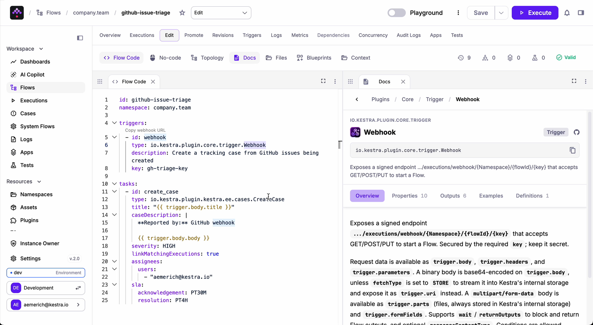
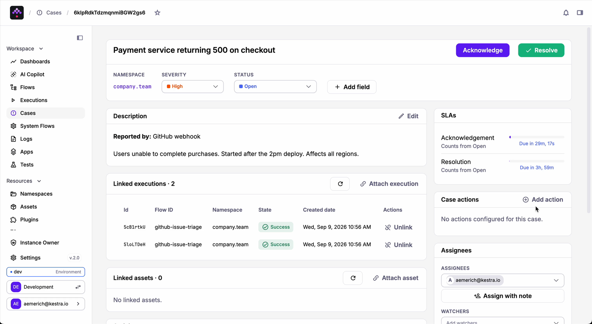
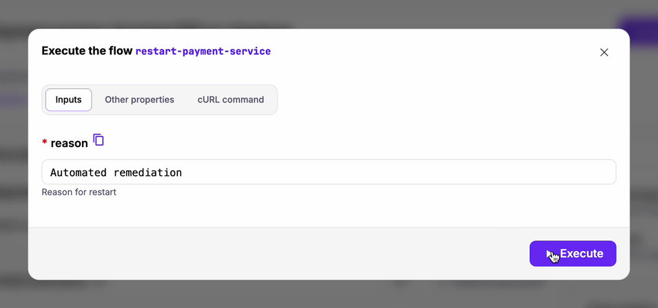
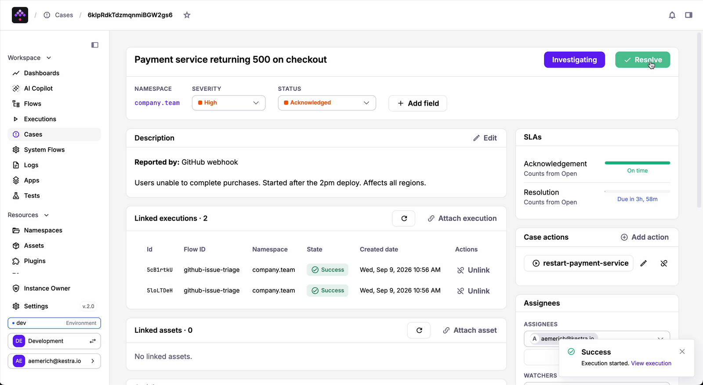
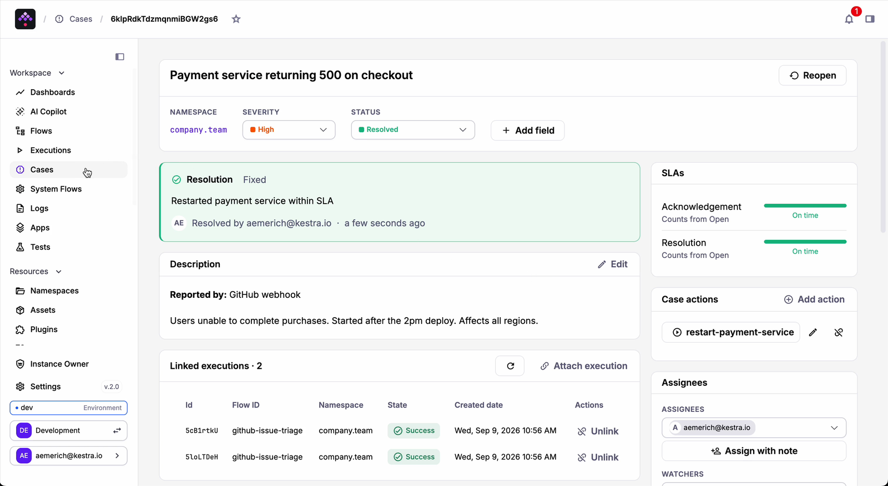
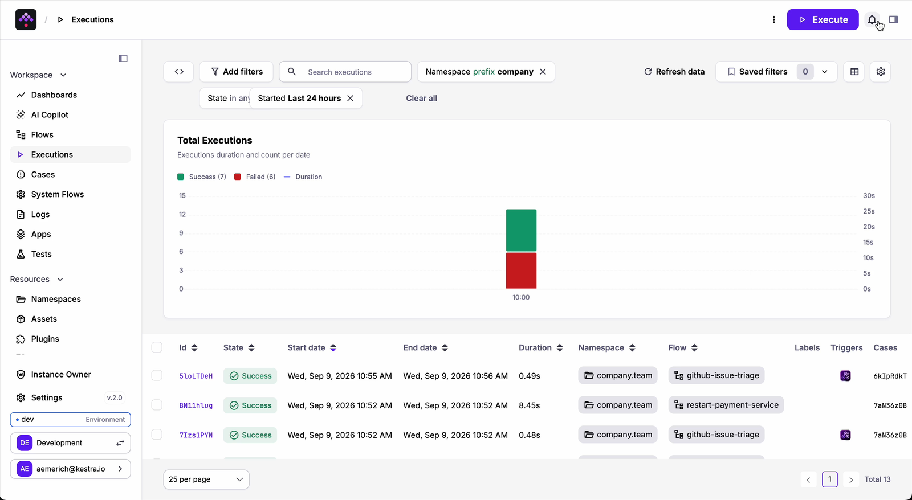

Every orchestrator tracks execution. Very few track what needs human attention.

Kestra 2.0 closes that gap. **Cases turns any execution into an incident: own it, review it, approve it, or close it with a recorded reason.** It works for infrastructure outages, data quality checks, AI agent outputs, and any decision that needs to be on the record.

## What changes when incidents live in the orchestrator

The first failure opens a case. The ninety-nine that follow attach to it. One notification goes out, and every failure is accounted for instead of drowned in a muted channel.

Each case has an owner: assignee, watchers, two SLA clocks. Time to acknowledge and time to resolve both count down on the board. A missed deadline becomes an event on the timeline and a notification to the people who need to know. Acknowledging changes notification behavior, but it never changes detection; new failures keep attaching to the open case regardless of status.

Remediation lives on the same record. Flows attach to a case as action buttons: click one, fill its inputs, and it runs as a normal Kestra execution linked back to the case, labeled with its ID, governed by the same RBAC as everything else. The step you would have looked up in a runbook is now the trail of what actually happened.

Closing a case requires a reason: Fixed, Workaround applied, Configuration change, Duplicate, No action needed, Won't fix. You can always ask how many incidents were configuration changes versus dependency outages. No need to datamine through Slack, Resolution is a queryable fact.

Approvals work the same way. A case assigned to the right person, counting down in public, with who approved and when on the same record as the execution it unblocked.

None of this needed a second tool, a sync job, or another permissions model. The failing execution, the data quality check, the AI agent output, the approval, and the audit entry are all things happening in the same engine.

## Before and after

| | Without Cases | With Cases |
|---|---|---|
| An API is down for 40 minutes | 80 failed executions, 80 alerts, a muted channel | 1 case, 1 notification, 80 executions attached |
| Who's on it? | Whoever answers in the thread | A named assignee, watchers, an acknowledgement clock |
| Where's the evidence? | Execution ids pasted into a ticket elsewhere | The executions are the case; live state, kept even after purge |
| How do we fix it? | Find the runbook, run it, remember to say you did | A button on the case; the run is linked and labelled |
| What happened, afterwards? | Read the thread | Resolution reason, timeline, SLA met or missed, queryable |
| An approval before a prod change | An @-mention and hope | A case assigned to the approver, counting down in public |


## How cases work in Kestra

As an example, a GitHub issue is opened: *Payment service returning 500 on checkout*. A webhook flow receives it and opens a case. High severity, assigned, thirty minutes to acknowledge and four hours to resolve.



A second report arrives with a different title, *Payment service 500 — second alert. 47 users affected in the last 10 minutes.* No second case, as the existing one now shows two linked executions. The person assigned got only one notification but is aware of the escalating impact.



They attach `restart-payment-service` as a case action and run it with a reason. The execution starts, linked to the case, and the case moves to Acknowledged.





Then Resolve, reason Fixed with note "Restarted payment service within SLA."



Two reports, one case, one remediation and one resolution. Every step of it is either an execution or an event on one. And back on the Executions page there is now a **Cases column**: every execution shows which incident it belongs to. This simple example is the tip of the iceberg, and Cases can quickly be scaled up to cover many types of governance cases.



<div class="video-container">
  <iframe src="https://www.youtube.com/embed/lSLV19-fBk0" title="Track and Resolve Workflow Incidents with Cases" frameborder="0" allow="accelerometer; autoplay; clipboard-write; encrypted-media; gyroscope; picture-in-picture; web-share" referrerpolicy="strict-origin-when-cross-origin" allowfullscreen></iframe>
</div>

## Five ways to use it

Cases are opened by a task, `io.kestra.plugin.kestra.ee.cases.CreateCase`, and the task goes wherever an alerting task is needed: `errors`, `finally`, `afterExecution`, or inline with `runIf`. That choice is what makes everything below possible.

Pattern 1 is where most teams start. Patterns 2 through 5 apply the same task in less obvious places; each covers a scenario the default error handler doesn't reach. You don't need all five; pick the ones that match what you're actually trying to track.

### 1. The failure that repeats

The default pattern. Put the task in `errors`, turn on deduplication, name an owner.

```yaml
errors:
  - id: open_case
    type: io.kestra.plugin.kestra.ee.cases.CreateCase
    title: "{{ flow.id }} failed"
    caseDescription: |
      Failed tasks: {{ tasksWithState('FAILED') }}
    severity: HIGH
    linkMatchingExecutions: true
    assignees:
      groups:
        - Data Platform
    sla:
      acknowledgement: PT1H
      resolution: PT8H
```

`linkMatchingExecutions: true` is the line that changes on-call. The deduplication key is the origin: flow namespace plus flow id plus task id. **The title is deliberately not part of it**, so `"{{ execution.id }} failed"` still groups. While a case is Open, Acknowledged, or Investigating, every failure from that origin attaches to it and fires no new notification. Resolve it and the next failure opens a fresh case.

We considered three designs. Disabling the rule when someone acknowledges was rejected: it blinds you to the next, unrelated incident of the same kind, and that is the "we turned off the alert and missed the real one" post-mortem. Snooze is a fine complement and a bad mechanism. Attaching to the open case is what PagerDuty, Opsgenie, and Alertmanager all converged on. **Acknowledging changes notification. It never changes detection.**

### 2. The success that shouldn't have been

Nothing failed. The reconciliation finished green with a 38% variance, and the number sat in a dashboard.

```yaml
tasks:
  - id: reconcile
    type: io.kestra.plugin.scripts.python.Script
    # ... writes outputs.reconcile.vars.variance

  - id: flag_variance
    type: io.kestra.plugin.kestra.ee.cases.CreateCase
    runIf: "{{ outputs.reconcile.vars.variance > 0.05 }}"
    title: "Reconciliation variance {{ outputs.reconcile.vars.variance | numberFormat('#.#%') }}"
    severity: HIGH
    assignees:
      groups:
        - Finance Ops
```

The execution finishes with a SUCCESS state and the case is opened. **Success and incident are not mutually exclusive**, and the orchestrator finally has a way to say so. The same shape covers a health check returning 200 with an empty body, or a scrape that returns suspiciously few rows. It also covers the AI use case directly: an agent produces a recommendation or takes an action, and before anything downstream runs, a human needs to review the output. The execution succeeds and the case is there to assess next steps.

### 3. The signal that comes from outside

A webhook trigger, a `CreateCase` task, and anything that can POST becomes a case: a GitHub issue like above, a monitoring alert, a form submission. The receiving flow can enrich first, looking up the owner, the environment and the last deploy, and put all of that into `caseDescription` so whoever picks it up starts with the full context of the original system.

```yaml
triggers:
  - id: webhook
    type: io.kestra.plugin.core.trigger.Webhook
    key: gh-triage-key

tasks:
  - id: create_case
    type: io.kestra.plugin.kestra.ee.cases.CreateCase
    title: "{{ trigger.body.title }}"
    caseDescription: |
      **Reported by:** GitHub webhook

      {{ trigger.body.body }}
    severity: HIGH
    linkMatchingExecutions: true
    assignees:
      users:
        - oncall@company.com
    sla:
      acknowledgement: PT30M
      resolution: PT4H
```

This is also how Cases sits beside an incident tool you already run. The same flow can open a case for the execution-level evidence and a ticket elsewhere for the enterprise record providing full coverage for all stakeholders.

### 4. The approval, on the record

An AI agent runs a diagnosis and recommends a remediation. A pipeline produces a schema change that needs sign-off before it reaches production, or an execution pauses ahead of a critical deploy. In each case the same problem: someone needs to approve something, and that approval needs to be on the record.

Open a case alongside a `HumanTask` and the pending approval is visible on the board, counting down, with a named approver and an audit trail when they act. `HumanTask` takes an `assignment` (users, groups, or both), so only the named people can resume the execution.

```yaml
tasks:
  - id: request_approval
    type: io.kestra.plugin.kestra.ee.cases.CreateCase
    title: "Approve: {{ inputs.change_description }}"
    caseDescription: "Execution paused. Waiting for sign-off before proceeding."
    severity: MEDIUM
    assignees:
      users:
        - "{{ inputs.approver }}"
    sla:
      acknowledgement: PT30M

  - id: wait_for_approval
    type: io.kestra.plugin.ee.flow.HumanTask
    assignment:
      users:
        - "{{ inputs.approver }}"
      groups:
        - Platform Leads
```

### 5. The maintenance window

A cluster upgrade will fail one flow for four hours. Before the window, open a case by hand, turn on **Auto-link matching executions** for that flow in FAILED, and comment "cluster upgrade, expected until 14:00." Every failure during the window groups into it. Resolve it afterwards. If the flow fails again at 14:05, it becomes a new case.

Auto-link generates a flow named `attach_executions_<caseId>` in the `system` namespace, with a Flow trigger per rule and a `CreateCase` task passing the `caseId`. It is visible on the System Flows page and deleted when the case closes. **The incident feature is built from the orchestrator's own primitives.** It has no hidden state.

## Running it in production

Decide how you want failures grouped before your first outage, not during it. The dedup key is flow plus task: one `CreateCase` in `errors` groups every failure of that flow as one incident; several inline tasks with `runIf` group per failing condition. Pick the shape that answers your on-call's question.

Every tenant ships with a built-in template, "Execution failure incident": High severity, one hour to acknowledge, eight to resolve. Templates set defaults for cases created from the UI or API. In flow YAML you declare everything explicitly, so the file stays as the whole truth. Add one template per team with its own SLAs, allowed resolution reasons, and default actions.

Set SLAs you will actually meet. Both clocks start at case creation. Acknowledgement is recorded the first time a case leaves Open, and that timestamp survives a reopen, so reopening does not reset response time. SLA states are computed at read time; breach notifications fire once per case from a background check every five minutes.

Anything you would normally run to recover can be a case action. Any flow the operator can execute becomes a button on the case. Running it needs `FLOW: EXECUTE` on its namespace; the resulting execution lands in the list labeled `system.caseId` and `system.from: case`, making every remediation run a label filter away.

`CASE` is its own RBAC resource, scopable to a namespace. Creating a case needs `CREATE`, status transitions and linking need `UPDATE`, and commenting needs only `VIEW`. That last point matters: you can get context from people who are not incident owners without giving them control of the case.

Case notifications are in-app only, on the bell icon. For Slack or email, add a notification task alongside `CreateCase`, or, even make the notification itself a case action so it is an audited execution.

Cases is an incident record with remediation attached, living where the failures live. It is not a paging product: no on-call rotations, no escalation policies, no external ticket sync yet. The deduplication check is also not atomic, so two executions of the same task failing at the same instant can each open a case. In practice failures arrive milliseconds apart and group correctly.

## Get started

1. Get on Enterprise or Cloud. `CreateCase` ships in `plugin-kestra`, included in the default image; with self-managed plugins, install it through Versioned Plugins.
2. Pick one flow that fails noisily. Add the pattern-1 block to its `errors`. Set the group that already gets paged.
3. Break it on purpose. Point it at a dead URL, run it three times. You should see one case with three linked executions and one notification.
4. Attach the fix. Whatever you would normally run to recover, add it as a case action. Run it from the case.
5. Resolve with a reason. Then open the Cases board and look at what you just made: an incident record that wrote itself.

:::alert{type="info"}
**Availability.** Cases is available today in Kestra 2.0 Enterprise Edition and Kestra Cloud. Requires `plugin-kestra` 2.0.3 or later.
:::

## Why here

Cases keeps your attention all in one place, avoiding the dreaded context switching. The failing execution, the incident, the remediation, the approval, and the audit trail are all in the same engine. The label on the remediation execution is the link. The system flow that groups failures is a flow. Every human decision made during an incident is a structured record next to the execution that caused it, and not a thread in another tool that goes stale or gets archived.

Cases, [Policies](https://kestra.io/docs/enterprise/governance/policies/index.md), and [Promote](https://kestra.io/docs/enterprise/governance/promote) are three answers to the same question: how do you govern what runs in production? That is what it means to move from a workflow tool to a platform you run production on.

---

[Click through the demo](https://app.arcade.software/share/n8XyY0b5qhqG92Q4zFCI) · [Cases docs](https://kestra.io/docs/enterprise/governance/cases) · [CreateCase task reference](https://kestra.io/plugins/plugin-kestra/kestra-cases/io.kestra.plugin.kestra.ee.cases.createcase) · [Release post](https://kestra.io/blogs/release-2-0) · [What changed in the engine](https://kestra.io/blogs/2026-09-01-kestra20-rebuild-engine)
