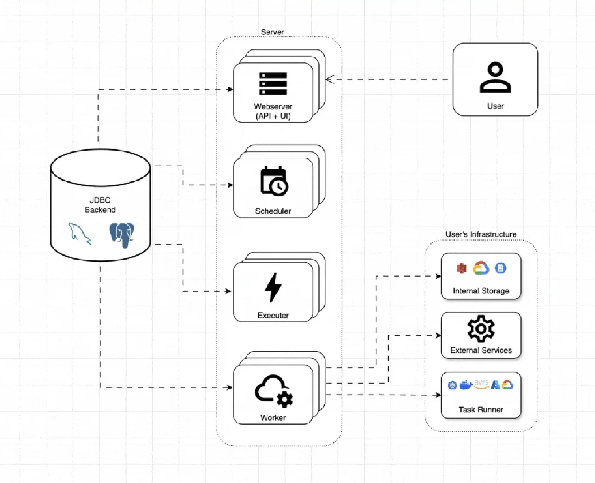
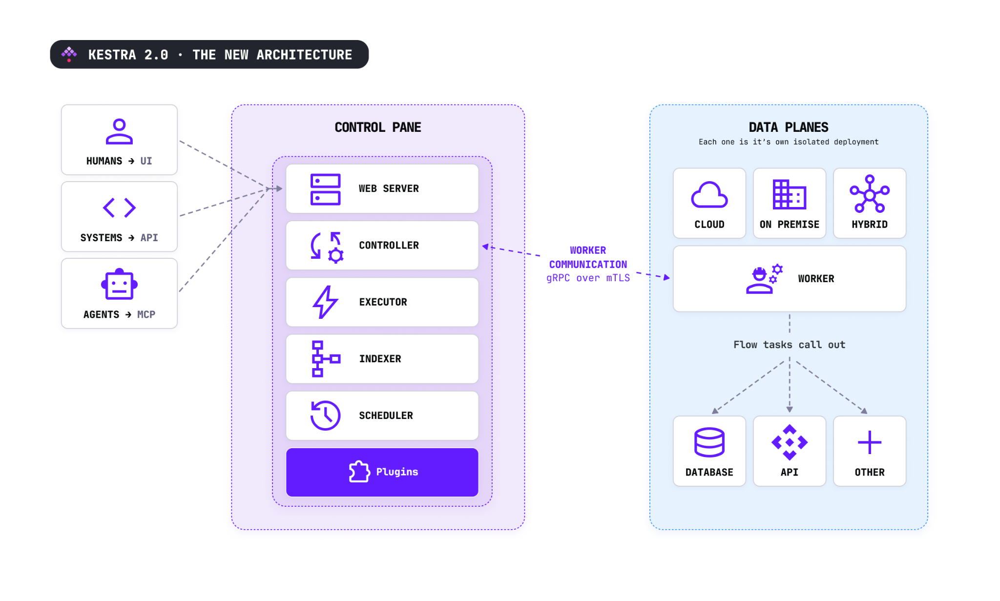

Kestra 2.0 is the most significant release in the product's history. Beyond the UI updates and the AI capabilities, we looked hard at the engine itself and rewrote it. Not a coat of paint on the existing 1.x internals, but an actual replacement for how work is scheduled, dispatched, and run.

This post is for people who operate Kestra, or who are curious about what changed underneath and why it matters. It focuses on the key architectural changes and what each one buys you.

## Workers in a 1.x world

The 1.x architecture worked and scaled for many organizations. But it had a shape that created recurring pain. Workers are a core server component: they execute runnable tasks and poll triggers, and in 1.x they connected directly to the database.

*Figure 1: Kestra 1.x architecture*

As shown in Figure 1, the worker lives in the same control plane as the other Kestra components. The worker also needed database credentials, and every worker had to sit on a network that could reach the database. If you wanted workers in another region, or inside a customer's restricted network, or air-gapped, you were fighting the architecture the whole way.

The database, shown as the JDBC Backend above, is a critical piece of the platform, and in 1.x it did two jobs. It is the repository, storing metadata, flow definitions, and execution records. It is also the queue that carries every internal message between Kestra services. Under heavy execution volume, the database became the coordination bottleneck, with executions sitting in a queued state waiting to be picked up while everything contended for the same resource.

To mitigate that, two engine implementations lived side by side: a JDBC one and a Kafka Streams one. Two repository and queue options meant two codebases doing the same job. That doubled the surface area and doubled the work for every fix.

## Introducing the Controller

In Kestra 2.0 we rewrote the engine to address this. The first move was making workers independent of the database, and that required a new component: the Controller. It sits between the worker and the Kestra backend components such as the queue and the repository. From the worker's point of view, all communication with Kestra now goes through the Controller.

*Figure 2: Kestra 2.0 high-level architecture showing the new Controller service*

Since workers no longer talk directly to the backend, they hold no sensitive database credentials. The connection between a worker and the Controller is a single gRPC connection that can be protected with mutual TLS.

## You can put workers almost anywhere

This is the direct payoff of a worker that holds no database connection. Because the only thing a worker needs to reach is the Controller, over an outbound gRPC connection, you can place workers in deployments that were awkward or impossible before:

- A separate VPC, or a different cloud, from where the control plane runs.
- Another region, for latency or data locality.
- On premises, next to systems that never leave the building.
- Restricted or air-gapped networks, where the worker connects outward and nothing connects in. No inbound ports, no database port exposed.

For teams with data-residency requirements, this is the key point. You keep the workers and the components that handle your data inside your perimeter, while the control plane runs as a managed service elsewhere. The data plane stays where your rules say it should be. If your network topology calls for a multi-region setup, Worker Groups let you steer specific workloads to specific worker pools with capacity guarantees.

## Backends are pluggable, and no longer welded together

In 1.x the queue and the repository were tightly coupled as a fixed pair, so you picked a bundle. 2.0 separates them, and you choose the queue and the repository independently. You can start with everything on a single database, then move the queue to a faster system later, or scale the repository, without rewriting any workflows.

This change also removes the Kafka Streams engine. There is now a single implementation of the executor, the scheduler, and the worker, whichever queue backend you run underneath. For you that means behavior is consistent across backends rather than subtly different between the JDBC and Kafka paths, and fixes land once instead of twice.

The edition split here matters, so it is worth stating plainly. Open source runs on JDBC, with your Postgres or MySQL serving as both queue and repository. The additional queue backends, Redis, AMQP, and Kafka, are the Enterprise differentiator. Use Redis or AMQP when you want low latency, Kafka when you want high availability, or JDBC when you want a balanced middle that is the simplest to run.

## Less data moves through the engine

A less obvious benefit of the rewrite, and one operators notice daily, is that the engine no longer carries data it does not need.

Task outputs load only when needed. The executor retrieves an output at the point it requires it, instead of passing every output through the queue in case something downstream wants it. Across millions of executions that removes a lot of pointless data transfer, and only minimal information now flows over the queue. The visible effect is UI responsiveness and throughput under load, because the queue does less work per execution.

Logs can also live in their own backend. The new Log Data Store lets you point logs at a different store from the rest of your data, either JDBC or Elasticsearch at general availability. Logs are the bulkiest, highest-churn data Kestra writes, so moving them off your primary database takes real pressure off it. They still display in the Kestra UI exactly as before, just sourced from wherever you put them.

## Where to learn more

Already running Kestra? Start with the migration guide, and point the public [flow migration CLI](https://github.com/kestra-io/kestra2-flow-migration) at your flow YAML to get a per-flow diff of what 2.0 changes before you touch anything.

New to Kestra? Pull the image, create a flow, and test the new engine at scale.
