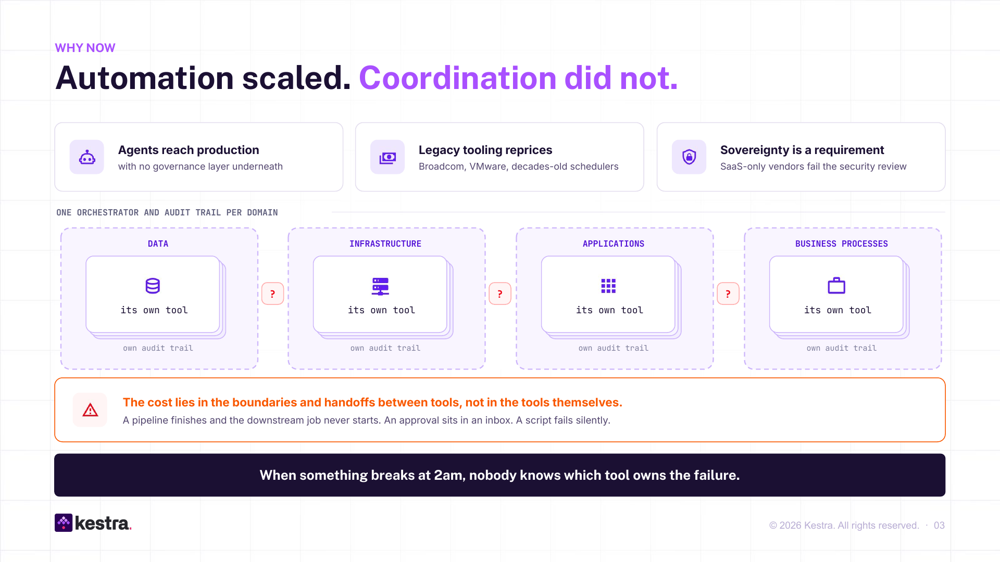
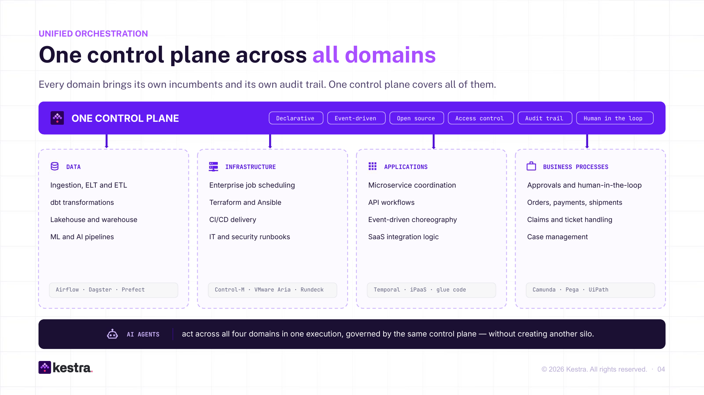
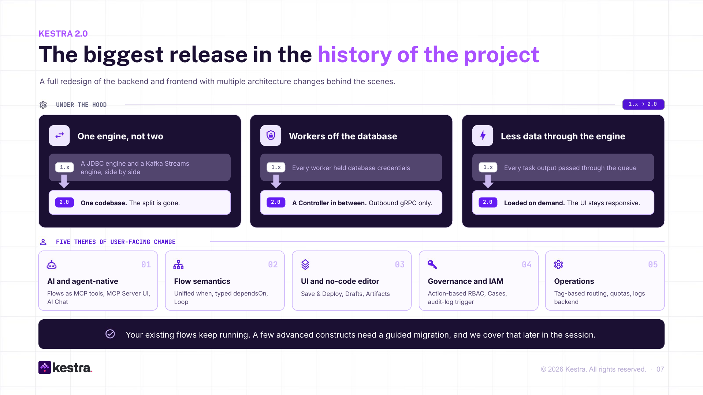
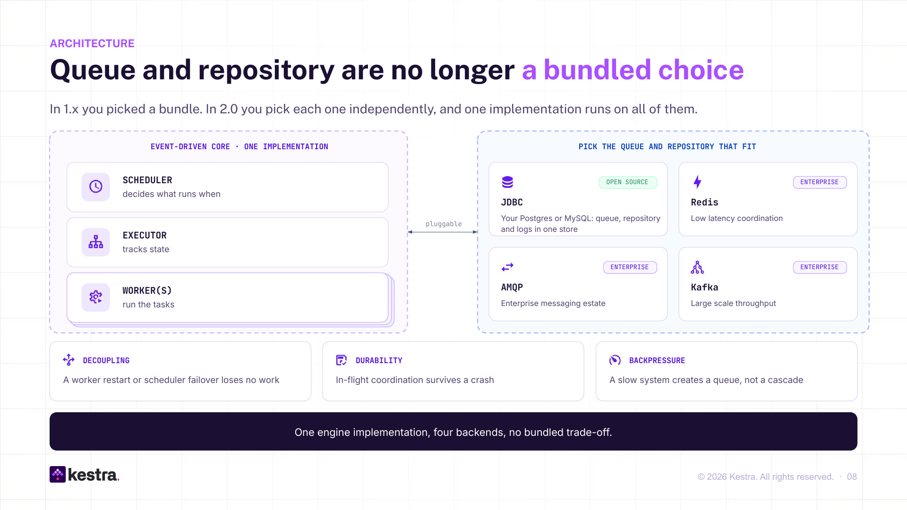
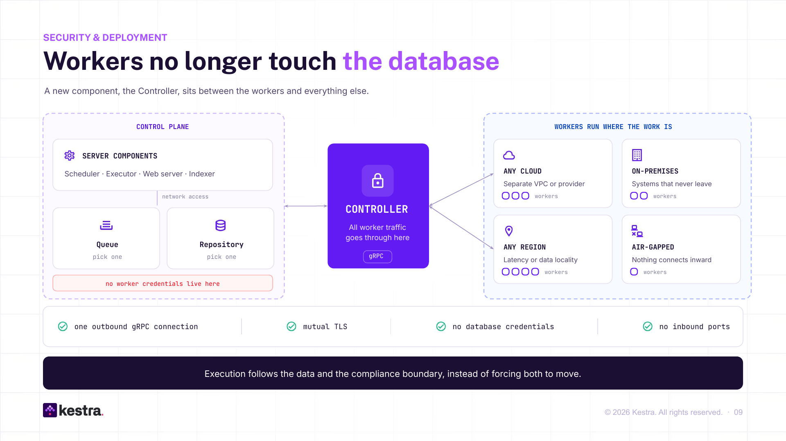
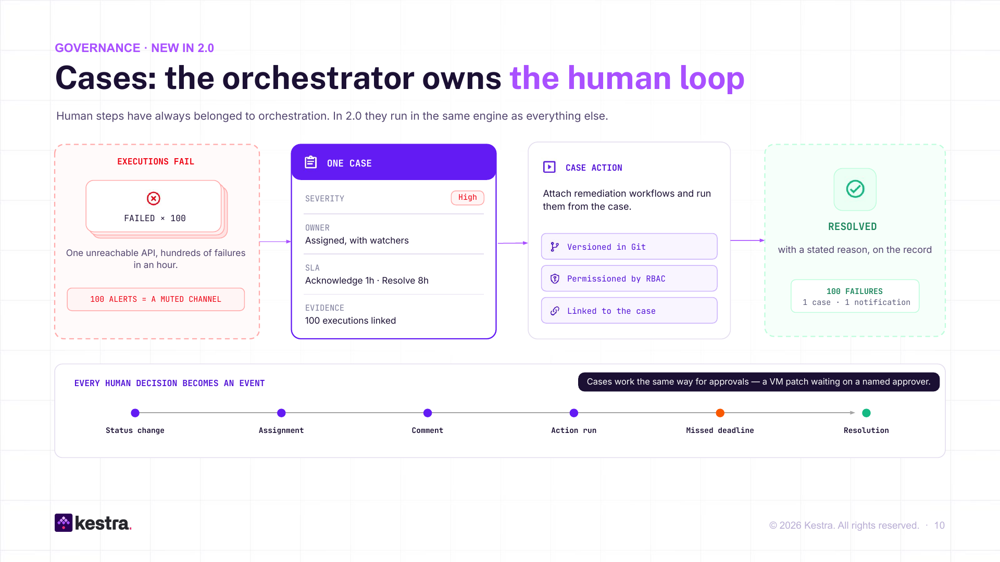
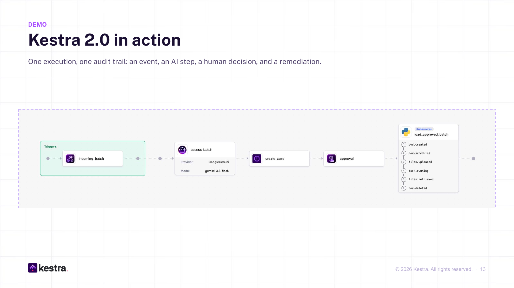
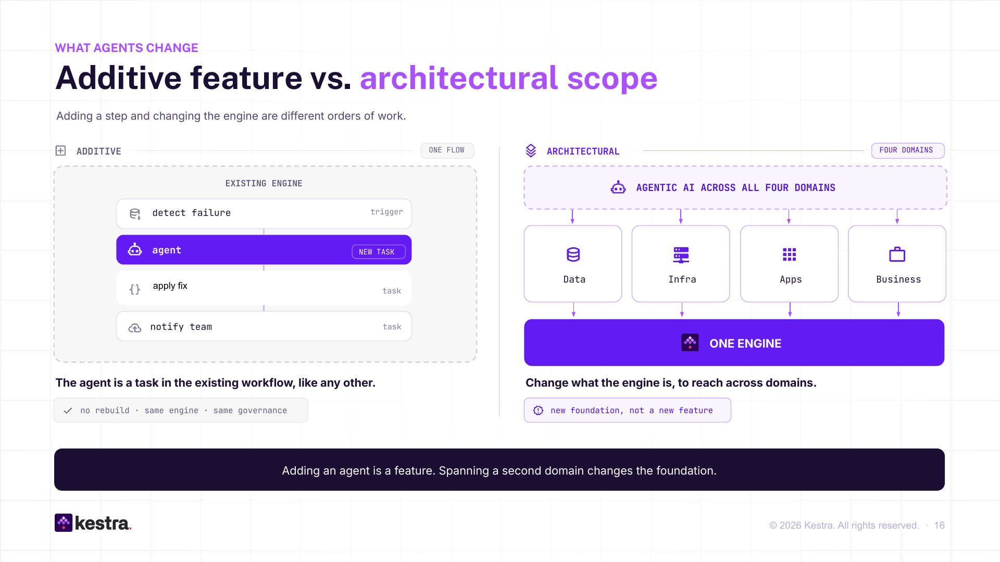
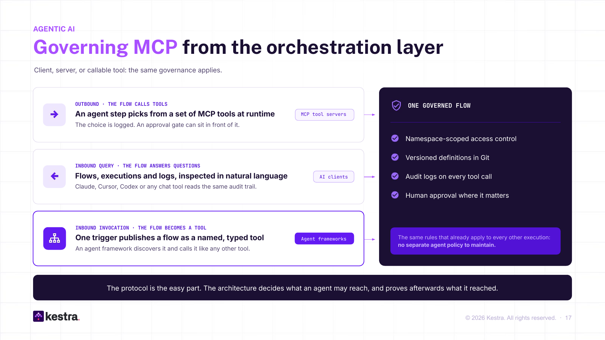
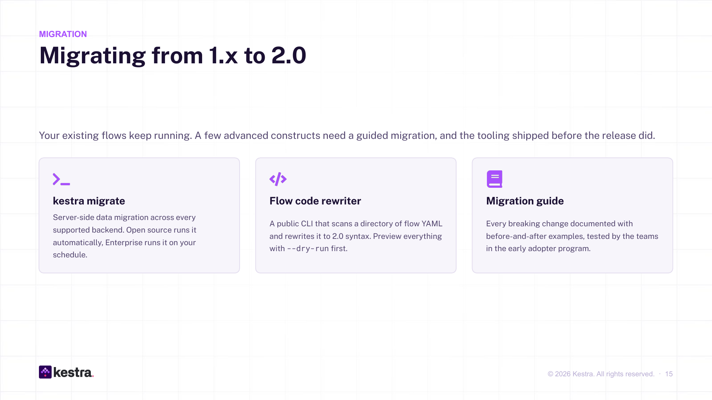

*Kestra 2.0 launched on September 8, presented by our Global Field CTO [Kai Waehner](https://www.linkedin.com/in/kaiwaehner/). Here is everything that happened during our launch event, from the problem it solves to what changes on the day you upgrade.*

Prefer to watch? The full replay is below. The article continues underneath.

  <iframe src="https://www.youtube.com/embed/kh82zScPTN0" title="YouTube video player" frameborder="0" allow="accelerometer; autoplay; clipboard-write; encrypted-media; gyroscope; picture-in-picture; web-share" referrerpolicy="strict-origin-when-cross-origin" allowfullscreen></iframe>

---

## The problem was never the tools

Most companies automated almost everything years ago. Data pipelines, infrastructure jobs, application workflows, approvals. What nobody solved is how those things talk to each other.

When something breaks at 2am, nobody knows which tool owns the failure. The cost sits in the handoffs. A pipeline finishes and the downstream job never starts. An approval sits in an inbox. A script fails silently, and three teams find out on Monday.

Each domain got its own orchestrator and its own audit trail. Airflow or Dagster for data. Control-M or VMware Aria for infrastructure. Temporal or iPaaS glue for applications. Camunda or Pega for business processes. Four tools, four permission models, four places to look when something goes wrong.

Three things are forcing this to change now. Agents are reaching production with no governance layer underneath them. Decades-old schedulers are being repriced after a wave of consolidation, which is why so much orchestration adoption in infrastructure is simply cost. And sovereignty stopped being a slide. A few years ago everybody talked about cloud only. Today it is hybrid, on-premise, sometimes air-gapped, and a SaaS-only vendor fails the security review before the conversation starts.

Kestra's answer is one control plane across all four domains. Not because you need all four on day one, and most teams start in one, but because agents will drag you across them whether you planned for it or not. Apple runs it for 200 ML engineers. JPMorgan runs it for cyber threat intelligence across billions of records. A government IT provider runs it for SOC alerting across Europe. A Fortune 500 industrial runs it per OT asset where VMware Aria used to be. **Same platform, completely different problems.** That is the point.

## Why 2.0 needed a new engine

Kestra 1.x worked. It also had a problem that could not be fixed without a rewrite.

It shipped two engines. A JDBC engine for teams running on Postgres, and a Kafka Streams engine for teams who needed scale. Every feature had to be built twice. And every worker held database credentials, which meant a worker could only live where the database was reachable. Not in a customer's restricted network, not in another cloud, not behind an egress-only firewall.

2.0 fixes both. One engine. And a Controller between the workers and everything else, so workers make a single outbound gRPC connection and never see a database.

### You choose your backend, and you can change your mind

In 1.x you picked a bundle: a database for everything, or Kafka plus Elasticsearch. In 2.0 the queue and the repository are separate decisions. Keep your Postgres. When you need more, switch the queue to Kafka, Redis or RabbitMQ without changing your architecture and without touching a flow.

Start on one Postgres. It is still event-driven underneath, and it handles more than most teams need. When latency or scale demands it, move the queue. Whichever you pick, a worker restart loses no work, in-flight coordination survives a crash, and a slow downstream system creates a queue rather than a cascade.

### Workers run where the work is

This is the change that unblocks deployments that were impossible before. The control plane holds the queue, the repository and the credentials. Workers hold nothing. They connect out over mutual TLS, with no inbound ports and no database access.

So you run the control plane in your data center and workers in three clouds. Heavy data jobs next to Snowflake, sensitive jobs on-premise. Or in an air-gapped environment that only reaches the outside world through a unidirectional hardware gateway. Execution follows the data and the compliance boundary instead of forcing both to move. And because far less data crosses that connection, it is faster too.

## The orchestrator now owns the human loop

An API goes down. A flow fails a hundred times in an hour. In every orchestrator until now, that was a hundred alerts and a muted channel, followed by a ticket in a separate incident tool.

In 2.0 it is **one case**. High severity, an owner, watchers, an SLA to acknowledge in an hour and resolve in eight, all hundred executions linked as evidence. Remediation flows attach to the case as buttons, and running one is an ordinary execution with an ordinary audit trail. Every human action on the case is an event: assignment, comment, status change, missed deadline, resolution with a stated reason.

[Cases](/docs/enterprise/governance/cases) work the same way for approvals. A VM patch waits on a named approver. The approval, and who gave it, is on the record. Handle it in the UI, over the API, or through an agent over MCP.

Put that next to [Promote](/docs/enterprise/governance/promote), which moves a flow between environments with a diff and a sign-off, and a pattern emerges. Running Kestra in production used to mean a Git pipeline for deployments and an incident platform for failures. Both now live in the platform. **Kestra stopped being a workflow tool and became the platform you run workflows on.**

## The agent assesses, a human decides

One execution, one audit trail: an event, an AI step, a human decision, and a remediation. [Watch this part of the demo in the replay](https://youtube.com/live/kh82zScPTN0?t=1180).

A webhook delivers a batch of data. An [AI agent](/docs/ai-tools/ai-agents), running as a task inside the flow, assesses it: right format, plausible row count, safe to load? Agents do not always get this right. Sometimes they hallucinate. So the flow does not act on the answer. It opens a case and pauses.

A human opens the case. The agent has written the description itself: more rows than expected, a missing column, an extra column, recommendation to skip. The human agrees, resolves the case with *No action needed*, and resumes the execution. A Python script runs on a [Kubernetes task runner](/docs/task-runners/overview) in a fresh pod and, because the human agreed with the agent, loads nothing. In a second run where the data was clean, the results are viewable directly in Kestra.

One detail carries the governance argument. The approval was restricted to a group called `approvers`. Someone can trigger the workflow, but someone more senior has to approve it before it continues. **You get the benefit of the agent without the risk of the agent**, and the whole thing is one execution with one audit trail.

## Agents, without building a fifth silo

AI was deliberately not the opening of the launch, and the reason is the most useful idea in it.

Putting an agent inside a flow, as the demo did, is additive. It is a task. Build the agent with LangChain, CrewAI or your cloud provider's tooling and it plugs in like any script or API. Same engine, same governance, no rebuild.

The hard part is the other direction. Agents that create real value reach across data, infrastructure, applications and business processes. The question is no longer how to implement an agent. It is how to keep one compliant, secure and governed when it touches four domains in a single run. If each domain has its own governance, the end-to-end view your security officer needs does not exist. One control plane is that view.

[MCP](/docs/ai-tools/mcp-server) shows up three ways in 2.0, all under the same rules.

A flow can call external MCP tools, with the choice logged and an approval gate in front if you want one.

Claude, Cursor or Codex can inspect your flows, executions and logs in natural language, and with Kestra's [Agent Skills](/docs/ai-tools/agent-skills) installed they write flows that work first time, because they know how Kestra works rather than guessing from training data.

And the one that is least obvious and matters most: **any flow becomes a tool.** [One trigger](/docs/workflow-components/triggers/mcp-tool-trigger) publishes it as a named, typed tool. An agent discovers it and calls it. The entire process you deployed as YAML is now callable from outside, with namespace-scoped access control, versioned definitions, an audit log on every call, and human approval where it matters. The protocol is the easy part. The architecture decides what an agent may reach, and proves afterwards what it reached.

## If you run 1.x today

Your flows keep running. A few advanced constructs need a guided migration, and the tooling shipped before the release did.

`kestra migrate` handles the server-side data migration on every backend and runs automatically on open source. A flow rewriter CLI scans your YAML and rewrites what it can, with `--dry-run` to preview. The [migration guide](/docs/migration-guide/v2.0.0) has every breaking change with before-and-after examples, tested by the early adopter program. For the flows the CLI flags rather than rewrites, there is an Agent Skill for the 2.0 migration that runs in Claude Code or Codex.

Nothing changes between editions. You do not need Enterprise to move to 2.0. The engine, the UI, the editor and the [plugins](/plugins) stay Apache 2.0. [Enterprise](/enterprise) adds the governance layer, the extra backends and multi-tenancy, as it did before.

---

Watch the [recording](https://youtube.com/live/kh82zScPTN0). Read the [release post](https://kestra.io/blogs/release-2-0). For the engine in depth, [what changed and why](https://kestra.io/blogs/2026-09-01-kestra20-rebuild-engine); for the numbers, the [performance report](https://kestra.io/blogs/performance-improvements-2-0). Migrating: the [2.0 migration guide](https://kestra.io/docs/migration-guide/v2.0.0). Questions: [Slack](https://kestra.io/slack).
