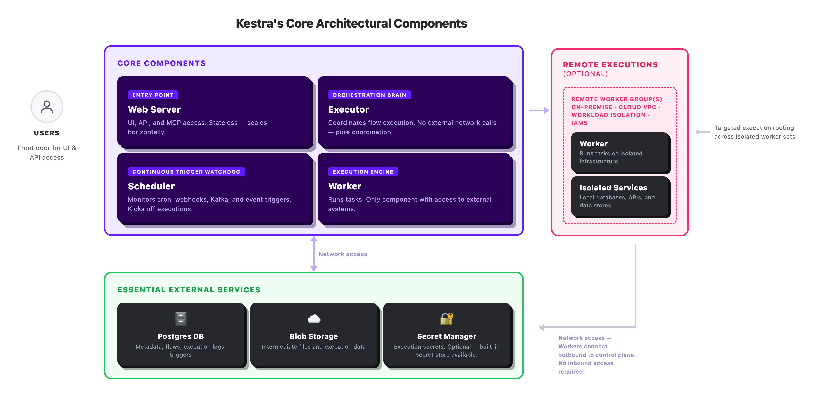

When I deploy Kestra with enterprise customers, the first thing I walk them through is the component model. Understanding what each piece does, and what it doesn't do, is what makes every subsequent decision clear: how many replicas you need, when to upgrade your backend, how to design worker groups for a multi-region or hybrid deployment. As deployments grow to span regulated zones, multiple clouds, and GPU hardware for AI workloads, those decisions get harder to undo.

## Why the executor and worker are separate

Kestra has four components, and the most important design decision is the split between the executor and the worker.

**The webserver** is the entry point for the cluster. It handles all UI traffic and all API requests. It's stateless, you can run multiple replicas behind a load balancer and they don't coordinate with each other. Scale it when API traffic is high; most deployments run one or two.

**The scheduler** watches triggers. Cron schedules, webhooks, Kafka messages, file arrivals, the scheduler monitors all of them and fires an execution event when a trigger condition is met. It uses distributed locking to prevent double-firing, so multiple scheduler replicas give you failover without conflicting. One or two replicas is standard.

**The executor** coordinates workflow execution. It receives an execution event, walks the workflow DAG, decides which tasks are ready to run, and dispatches them to the queue. When a task completes, the executor processes the result and determines what runs next. It handles retries, error paths, and parallel branches. The executor never makes external network calls, it only reads and writes to the internal queue and repository.

**Workers** run tasks. A worker picks a task off the queue, executes it, querying a database, calling an API, running a Python script, and puts the result back. Workers are the only components with access to external systems.

Because the executor has no external dependencies, its failures are always infrastructure failures, never application failures. Because workers are isolated to execution, you can scale them, replace them, and move them to different infrastructure without touching anything else. More throughput means more workers.

All four components are active-active. Multiple replicas of any component run simultaneously without conflict. Kubernetes handles pod lifecycle; the queue backend handles coordination.

The diagram below shows how the four components relate, what sits between them, and where remote worker groups fit in.



## Deploying on Kubernetes

Most production Kestra deployments run on [Kubernetes](../../docs/02.installation/03.kubernetes/index.md). Kestra provides Helm charts for the full installation, including a `values.yaml` where you configure the deployment mode and replica counts.

A distributed deployment looks like this in `values.yaml`:

```yaml
deploymentMode: distributed

webserver:
  replicaCount: 1

scheduler:
  replicaCount: 1

executor:
  replicaCount: 2

worker:
  replicaCount: 2
```

Each component deploys as a separate pod. The executor and worker counts are what you tune as load grows. The `distributed` deployment mode is distinct from standalone mode, which runs all components in a single process. Standalone works for development and evaluation. Production uses distributed so components can be scaled and replaced independently.

## What to scale and when

Crédit Agricole's CAGIP team runs Kestra as a shared orchestration backbone across 100+ managed clusters and 7 data teams, self-hosted on their private cloud. Getting the component sizing right is what made that possible at that scale.

The executor and worker are the components you scale under load. If workflows are slow to complete even though individual tasks finish quickly, you need more executors. If tasks themselves are slow to start or finish, you need more workers.

Very large deployments run tens or hundreds of workers. The executor handles coordination logic, which is CPU and memory intensive at high parallelism but doesn't scale the same way. A few executor replicas handle a large worker fleet.

For higher sustained throughput, the PostgreSQL backend can be upgraded to Kafka plus Elasticsearch. Kafka takes over as the queue; Elasticsearch replaces PostgreSQL as the repository for execution history. The component model stays identical, nothing in how you configure workers, executors, or schedulers changes. Only the backend plumbing changes.

## Extending execution beyond the cluster

A [worker group](../../docs/07.enterprise/04.scalability/worker-group/index.md) is a named logical grouping of workers. You install Kestra workers on whatever infrastructure you need, another cloud region, an on-premises data center, a cluster with specific hardware, assign them to a named group, and Kestra routes tasks to that group. Tasks in your workflow definition specify which group they should run on. Workers in that group pick them up; workers in other groups don't see them.

Within a worker group, scaling and failover work the same way they do in the main cluster. If a worker goes down while running a task, the executor detects the failure and retries the task on another available worker in the same group. Running multiple workers per group is standard practice, one worker gives you routing but no redundancy.

Three patterns come up most often in production:

**Multi-region execution.** Tasks that need to run in an EU region route to workers installed there. Tasks that run in US route to US workers. A single workflow definition spans both. Data residency requirements are enforced at the routing level, not the workflow level.

**Hybrid and on-premises.** The main Kestra cluster runs in the cloud. Workers run on-premises, connecting out to the cluster. Customers get a unified control plane and a unified workflow definition; execution happens on infrastructure they control. No inbound network access to the on-premises environment is required.

**Heterogeneous hardware.** Tasks that require GPU are routed to workers installed on GPU-enabled machines. Standard tasks go to standard workers. You provision specialized hardware only where workflows need it.

Worker groups can be pinned to [tenants](../../docs/07.enterprise/02.governance/tenants/index.md) or [namespaces](../../docs/07.enterprise/02.governance/07.namespace-management/index.md). A tenant can have a dedicated worker group so its workflows only run on its own workers. A namespace within a tenant can have its own dedicated group if it needs different hardware or network placement. The typical pattern for regulated industries: one worker group per tenant at minimum, additional groups as individual namespaces require them.

Licensing is per worker group, not per worker. Adding workers within an existing group to handle more load doesn't affect licensing. Adding a new group, a new region, a new on-premises site, a new isolated environment, does.

## Where to start

Most teams start with a single worker group, PostgreSQL backend, and two or three workers. That handles a wide range of production workloads. Add workers when task throughput is the bottleneck. Add executor replicas when coordination is. Upgrade to Kafka plus Elasticsearch when sustained volume makes PostgreSQL the constraint.

Worker groups come in when the deployment needs to span locations: a second cloud region, an on-premises cluster, hardware with specific requirements.

The component model stays the same at any scale. What changes is how many of each component you run, where you run the workers, and which backend you've wired in underneath.

Kestra is open source. You can [get started in minutes](../../docs/02.installation/index.md) with Docker, one command, first workflow running in under five minutes. If you're scoping a deployment across regions, business units, or regulated infrastructure, [Book a Demo](/demo) and we can work through the architecture together.
