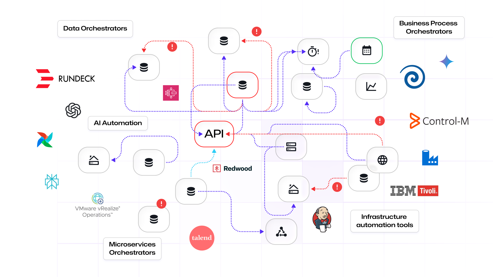
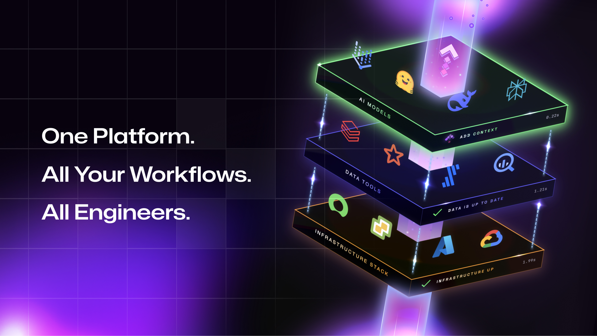
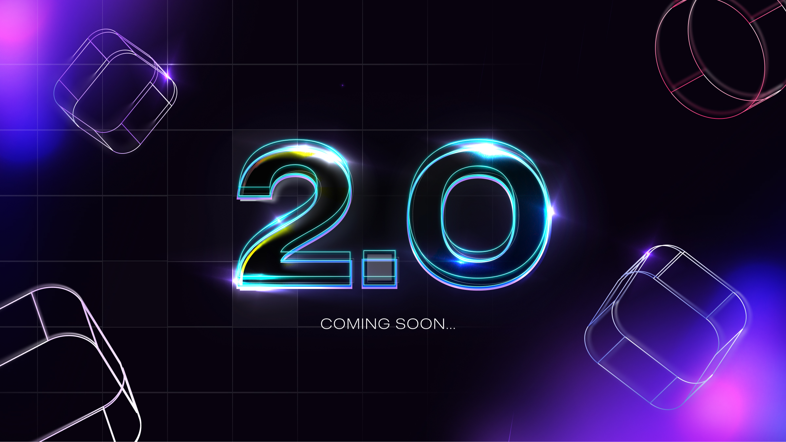

Every complex system eventually hits the same wall. Not a lack of capability. Not a lack of tools. 
 **A breakdown in coordination between them.**

With growing urgency, every enterprise now racing to put AI into production faces the same reality. The bottleneck is never the model. It's coordinating and controlling everything around it.

Orchestration has just reached its tipping point. And over the past year, Kestra has demonstrated, across more than 30,000 organizations worldwide — from fast-growing tech companies to Fortune 500 giants — that **a single, unified orchestration layer spanning infrastructure, data, and AI is not just a cleaner architectural choice. It's the only approach that holds at enterprise scale.**

Today, we're announcing a **$25 million Series A** led by [RTP Global](https://rtp.vc/), with continued support from [Alven](https://www.alven.co/), [ISAI](https://isai.vc/), and [Axeleo](https://www.axc.vc/).

But the round is not the story. It's the signal that **orchestration just became its own infrastructure category**, and the window to define it is now.

## Automation scaled. Coordination didn't.

For years, enterprise automation was manageable enough to live in fragments. A scheduler here. A few scripts there. A cron job, a CI pipeline, a homegrown workflow buried in an internal service. Messy, but tolerable.

That's no longer true. Today, the same enterprise runs workflows across cloud and on-prem infrastructure, data pipelines across multiple platforms, internal APIs, SaaS systems, security operations, and AI systems entering production. Every team adds tools. Every system adds dependencies. Every new environment adds more surface area for failure.

When automation becomes part of how a company moves money, operates factories, responds to incidents, or runs AI in production, **fragmentation stops being messy and starts being dangerous.** It creates blind spots, hides failure behind layers of scripts, and spreads business-critical logic across systems never designed to provide a shared view of execution, ownership, or lineage.

At JPMorgan Chase, Kestra orchestrates critical cybersecurity pipelines across a complex data stack. By giving teams a central, accessible way to coordinate workflows, it reduces dependency on heavily code-driven approaches and standardizes automation across engineering and analyst teams alike — so analysts can define and run workflows themselves, without waiting on engineering for every change.

At BHP, one of the world's largest mining companies, the move away from VMware vRA became an opportunity to modernize infrastructure automation across both IT and OT. With Kestra, the team rebuilt key workflows in a more modular, reusable, and intuitive way, gaining speed and flexibility while cutting dependency on an increasingly expensive legacy stack.

Enterprises don't lack automation. **They've accumulated too much of it, in too many places, without a unifying layer above it.**

Every decade, one coordination problem gets big enough that it graduates from "everyone builds their own" to "there's a platform for that." We believe orchestration just crossed that line. Not because the analysts said so — because procurement teams at Fortune 500 companies are ripping out tools they've run for a decade and replacing them with Kestra. That's not adoption. That's a category forming in real time.

## AI made the problem impossible to ignore.

A production AI workflow is rarely just a model call. It includes data retrieval, model versioning, fallback logic, approval gates, retries, policy checks, observability, and actions written back into live systems — and often with humans in the loop. Multiply that across teams, models, environments, and business processes.

At Apple, hundreds of AI engineers use Kestra to orchestrate large-scale pipelines across the App Store, Apple Music, and device diagnostics. What used to consume an entire team's worth of engineering hours now runs on Kestra — and those engineers build models instead of managing glue.

At Toyota, data and AI pipelines ran across multiple platforms with no shared view of what was running, what had failed, or who owned what. Kestra replaced that fragmentation with a single orchestration layer, giving teams across the organization unified monitoring and governance over pipelines that were previously invisible to each other.

The enterprises that will win in the AI era won't be the ones with the most models. They'll be the ones with the strongest coordination layer beneath it all.

## Why Kestra

Kestra was built around a simple conviction: **enterprises should not need a different orchestration product for every critical domain.**

We held that conviction early, when open-source infrastructure automation wasn't a sexy market. B2B, deeply technical, largely invisible to the hype cycles chasing the next consumer app or AI wrapper. We were building in a space most people ignored. Today, Kestra runs as a unified platform across data, infrastructure, business processes, and AI — declarative by design, extensible by architecture, with [more than 1,200 plugins](/plugins) across cloud, SaaS, and enterprise systems.

In 2025, organizations executed **more than 2 billion workflows** on Kestra, up from 100 million in 2024. The open-source project has close to [30,000 GitHub stars](https://github.com/kestra-io/kestra), hundreds of contributors, and a fast-growing global community.

That growth didn't come from a top-down mandate. Engineers choose Kestra because it works where complexity is real. Enterprises expand it once its value becomes mission-critical. The great infrastructure platforms don't win from the boardroom down. **They win from the terminal up.** And once they've won there, the business case follows: faster delivery, fewer tools to manage, standardized operations, and real cost savings that decision-makers can measure.

>**Ready to take control of your orchestration?** Whether you want to discuss your orchestration strategy, see a tailored demo, or launch an Enterprise POC with our experts, we're here to help you move fast and build right.
>   [**Book a demo with our team**](https://kestra.io/demo)

## What's next

This Series A gives us the ability to move faster on what we've already been building.

One principle drives everything in **Kestra 2.0**: **your orchestration layer should adapt to your infrastructure, not the other way around.** Deploy across regions, inside segregated networks, deep in customer environments — keeping execution inside your perimeter while we manage the rest. No architectural compromises. No forced trade-offs between control and simplicity. And because teams running data pipelines, AI systems, and infrastructure have fundamentally different needs, we're introducing dedicated experiences for each, built around how those teams actually work, not a one-size-fits-all console.

Alongside **Kestra 2.0**, we're architecting [**Kestra Cloud**](/cloud), a fully managed, usage-based platform. We're building it for teams that want Kestra's power without the self-hosting overhead.

The category is forming now. We're building to lead it.

## The moment ahead.

There's a narrow window to define a new infrastructure category. It closes once the defaults are set.

The companies that understand this first — that **coordination is infrastructure, not a feature you bolt on** — will build faster, govern better, and scale AI on a foundation that actually holds. The ones that don't will keep managing the debt of a thousand fragmented scripts, one incident at a time.

Building Kestra has been an exercise in persistence. Great technology companies are built through conviction held across market cycles, through technological shifts that force constant adaptation, through years of rigorous execution when no one was watching. Orchestration wasn't the talk of the industry when we started. Now it's central to every serious conversation about AI in production. 

**We were early. We stayed the course. And the results prove it was the right bet.**

The future is coordinated.

We're deploying across the US, Europe, and APAC — and we're hiring the engineers and go-to-market talent who want to define this category in real time. [Join the Kestra journey](https://kestra.io/careers).
