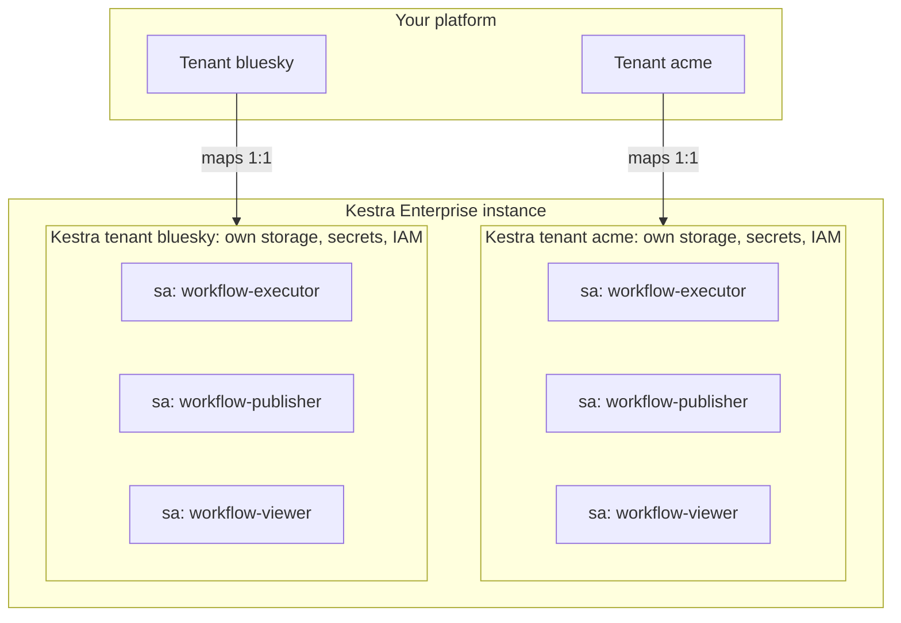
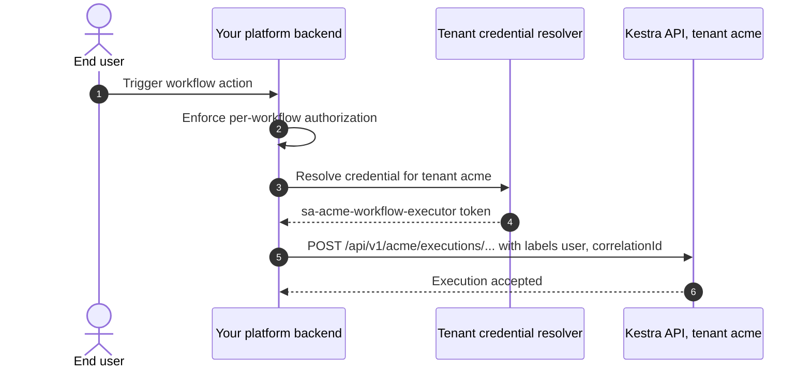

Kestra's documentation covers how each authentication mechanism works: API tokens, service accounts, RBAC, SSO. What it does not decide for you is which strategy to adopt when Kestra is the engine running behind your product rather than the product your users log into. That covers internal developer platforms, ISV products, and multi-tenant SaaS where end users never see Kestra at all.

That scenario raises questions the reference docs do not answer. Should every end user get a Kestra identity? Can backend components share credentials? How should your platform's tenants map onto Kestra's? And where should per-workflow authorization actually live?

This is the decision framework we walk through with platform teams embedding [Kestra Enterprise](../../docs/07.enterprise/index.mdx): the constraints that matter, three candidate patterns with the way each one fails at scale, and the one we recommend.

## The building blocks that constrain the design

The design constraints fall directly out of how the auth model is put together, so it is worth being precise about the pieces.

Interactive and programmatic access run on separate rails. Kestra ships Basic Auth by default and supports enterprise [SSO via OpenID Connect](../../docs/07.enterprise/03.auth/sso/index.md) (Google, Microsoft Entra ID, Okta, Keycloak, authentik) for humans logging into the UI. Programmatic access to the REST API takes a different path: [API tokens](../../docs/07.enterprise/03.auth/api-tokens/index.md) passed as a bearer token in the `Authorization` header, issued to either a User or a Service Account.

A [Service Account](../../docs/07.enterprise/03.auth/service-accounts/index.md) represents an application. It has no password, no UI access, and no personal information attached, just a name, optional group membership, and a list of roles. Service accounts are bots authenticating with an API token, and they are the intended identity type for CI/CD pipelines, Terraform, and custom applications calling the API. A User represents a person and can authenticate with either a password or a token.

[RBAC](../../docs/07.enterprise/03.auth/rbac/index.md) grants permissions to Users, Groups, and Service Accounts through Roles, which are named sets of Permission and Action pairs such as `FLOW:CREATE` or `EXECUTION:READ`. Assigning a role creates a Binding, which can be scoped to a Tenant and optionally to one or more Namespaces. Namespace scoping cascades downward, so a binding on `prod` also covers `prod.engineering`.

The structural fact that shapes everything below: the namespace is the finest scope a Binding can target. You can restrict a role to a tenant or a namespace, never to an individual flow or execution. If your platform grants permissions per workflow, Kestra RBAC alone cannot express that.

[Multi-tenancy](../../docs/07.enterprise/02.governance/tenants/index.md) is a first-class construct rather than a convention. Most API endpoints carry the tenant identifier in the path (`/api/v1/{tenant}/flows/products`, for instance), and each tenant gets its own IAM, its own internal storage, and its own resources. Flows with identical identifiers can coexist in different tenants without colliding. This is the strongest isolation primitive available, and the recommended pattern leans on it directly.

Identity provider integration works at the group level. With SSO enabled, Kestra can manage group membership from OIDC claims, and [SCIM](../../docs/07.enterprise/03.auth/scim/index.mdx) directory sync provisions users and groups from Okta, Entra ID, Keycloak, or authentik. What you cannot do is map roles from an external authorization system onto Kestra roles. Groups are the integration point, and you bind Kestra roles to them.

## Two identity spaces that will never merge

If you are embedding Kestra behind your own product, you already run an identity and authorization system. Your IdP authenticates users and your own layer decides who may do what. Kestra has a separate IAM of its own, and it knows nothing about your users or your tenants unless you model that mapping explicitly.

So the design question splits into three:

- Identity: who or what holds Kestra credentials, end users or backend components?
- Isolation: how do your tenants map onto Kestra tenants, and what guarantees that no credential crosses the boundary?
- Authorization: where does per-workflow permission logic live, in Kestra RBAC or in your application?

Before comparing options, it helps to fix what you are optimizing for. The drivers we weigh most heavily on embedded deployments:

| Priority | Driver | Why it matters |
|:---|:---|:---|
| High | Least privilege | Every credential carries only the permissions its holder actually needs. |
| High | Tenant isolation | A defect or a leaked credential affecting one tenant must not expose another tenant's workflows, executions, or data. |
| High | No cross-tenant credentials | A token bound to several tenants lets whoever holds it act against all of them, whatever the role scoping says. |
| High | Per-workflow authorization | If your product grants permissions per workflow, some layer has to enforce it, and Bindings stop at the namespace. |
| High | Rotation at realistic scale | If policy mandates periodic rotation, the design has to make that tractable at the credential count it produces, not merely possible. |
| Medium | Architectural simplicity | Reuse existing components before introducing new ones such as a credential-brokering gateway. |
| Medium | Audit traceability | The end user who triggered an action stays identifiable even though Kestra never authenticated that person. |

## Option 1: a Kestra user per end user

The most literal mapping. Provision every end user a real Kestra User and issue each one a personal API token for programmatic calls. Your platform IAM stays the source of truth, so provisioning has to be automatic: SCIM handles the account side, and a [default role](../../docs/configuration/05.security-and-secrets/index.md) can auto-assign a baseline permission set to new users.

Critical failure mode: token lifecycle, at user scale. SCIM automates accounts, not tokens. A personal API token is a separate explicit action per user, displayed once and never retrievable again, so issuance, distribution, and rotation all fall to you. Rotating one token per end user on a mandated cadence is a different order of operational commitment than rotating a small bounded set of component tokens.

There are two secondary problems. Users are global identities, and tenant access is granted through Bindings, which means your sync has to keep every user's per-tenant bindings correct. Drift there is not a stale-permission annoyance, it is a cross-tenant exposure. And because Bindings scope to namespaces, you pay the full cost of operating a second IAM without closing the per-workflow gap you started with.

## Option 2: a service account per end user, per tenant

A variation that avoids SCIM entirely. Instead of real Users, give each end user a dedicated service account in each tenant they can reach, provisioned through the API. Roles, service accounts, tokens, and bindings are all scriptable, either directly against the API, through [Terraform](../../docs/13.terraform/index.mdx), or with the [IAM tasks](../../docs/15.how-to-guides/iam-automation/index.md) in the `io.kestra.plugin.kestra.ee.iam` family, so the lifecycle can be fully automated. Kestra's native audit trail then names the real actor.

Critical failure mode: the credential matrix. Count scales as end users multiplied by tenants, and every one of those tokens has to be stored, distributed to whichever backend component acts on that user's behalf, and rotated on schedule. At a few thousand users across a handful of tenants, that is tens of thousands of secrets under a rotation policy.

A per-user service account with its own token is a personal Kestra identity in every way that matters, with a different object type on the tin. Bindings still bottom out at the namespace, so the per-workflow requirement is no closer to being met, and automating the full account, token, and binding lifecycle for every user in every tenant is standing up a second IAM system with extra steps.

## Option 3: per-component service accounts on a 1:1 tenant map

The pattern we recommend. No end user ever holds a Kestra identity.

Map your platform tenants one to one onto Kestra tenants. Each of your tenants gets a dedicated Kestra tenant with its own storage, secrets, and IAM. Isolation then rests on Kestra's top-level primitive rather than on a namespace naming convention that only holds as long as your application keeps enforcing it.

Give each backend component its own service account per tenant, bound to the minimum role it needs (`workflow-executor`, `workflow-publisher`, `workflow-viewer`, or whatever matches your components). A component serving N tenants holds N distinct tokens. None of them works against a tenant other than its own, which puts a hard ceiling on the blast radius of a leak.

Keep per-workflow authorization in your application layer. Per-workflow and per-execution grants are enforced by your own model, before the Kestra call is made. Kestra RBAC is deliberately confined to expressing coarse component-level capability per tenant, which is the scope it was designed for. This is a separation of concerns you choose, not a limitation you work around.

Carry end-user identity in [execution labels](../../docs/05.workflow-components/08.labels/index.md). Labels are key-value pairs you define per execution, so a component can attach the real end-user identifier when it launches a run, and reuse [`system.correlationId`](../../docs/06.concepts/system-labels/index.md) to tie together everything that run triggers downstream. Labels are observability and audit metadata, never evaluated for authorization, and they give auditors a way to answer "who triggered this run" even though Kestra never authenticated that person. They also make executions filterable per user in the UI and cross-referenced against [audit logs](../../docs/07.enterprise/02.governance/06.audit-logs/index.md).

No Kestra tenant is shared by two of your tenants, and no service account spans more than one tenant:

A steady-state call has one extra hop compared to a naive design, the credential resolution step:

The security boundary ends up as two independent layers: your business-level authorization, which is the first line of defense and stays exactly as it was, and Kestra's tenant isolation plus role scoping, which holds even when your application does not. Because every Kestra call is machine to machine, it also composes with the controls you already have around it. Network policy and workload isolation can restrict which components are able to reach the Kestra API for which tenant at all.

The trade-offs are real, and worth naming before you commit:

- Credential count scales as components multiplied by tenants. That is orders of magnitude below any per-user model, and it is still a secret-management surface you own.
- Tenant onboarding becomes a cross-system provisioning event. A new platform tenant needs a Kestra-side bootstrap (tenant, roles, service accounts, tokens, bindings) before it works end to end.
- Every calling component needs tenant-to-credential resolution logic. Standardize the configuration shape early so each team does not invent its own.

## Four decisions to make before the first rollout

Teams that get this wrong usually get it wrong operationally rather than architecturally. Settle these four before the first multi-tenant production deployment, not after.

Pick one secret storage mechanism for the components-by-tenants token matrix (Kubernetes Secrets, External Secrets Operator, Vault) and use it everywhere, including customer-hosted deployments if you have them. A second mechanism that appears later for one edge case is how inconsistent rotation starts.

Automate the tenant bootstrap. Tenant, roles, service accounts, tokens, and bindings should all be created by pipeline as part of onboarding. Everything is scriptable through the [Enterprise API](../../docs/api-reference/01.enterprise/index.mdx), the CLI, Terraform, or IAM tasks inside a Kestra flow, so a manual runbook step here is a choice rather than a constraint.

Define the rotation cadence and automate re-issuance and distribution. Tokens support a max age and an Extended mode that prolongs expiry while the token is actively used, which reduces surprises but does not remove them. Alert on tokens approaching expiry, because a silently expired token is a silent per-tenant outage that will surface as a support ticket rather than a monitoring page.

Fail loudly on unresolved credentials. If a component gets a request for a tenant it holds no credential for, typically because onboarding is incomplete, it has to fail with a distinguishable and alerted error. A silent fallback to a default token or to another tenant's token is the isolation breach the whole design exists to prevent.

## Edge cases worth naming

Namespace-per-flow is an anti-pattern here. Because Bindings can target namespaces, creating one namespace per flow to approximate per-flow RBAC is tempting. It is a naming convention enforced only by discipline, nothing stops a flow from being deployed to the wrong namespace, and it degrades operationally as flow count grows. Per-flow grants belong in your application layer.

Interactive surfaces have their own access model. If you expose executions to humans through [Kestra Apps](../../docs/07.enterprise/04.scalability/apps/index.md) or human-in-the-loop pause tasks, review those configurations separately. An App declares its own `access` block, either `PUBLIC` or `PRIVATE` with optional group restrictions, and group membership is checked at request time. Restrictions you enforce elsewhere do not automatically carry over.

IdP integration helps your operators, not your machines. OIDC group-claim mapping and SCIM sync are worth having if your admins log into the Kestra UI. They change nothing about the API story: programmatic callers authenticate with Kestra-issued tokens, and there is no supported bridge from an external authorization system to Kestra roles. Design the API strategy on that assumption.

## Frequently asked questions

### Can Kestra RBAC grant permissions on a single flow or execution?

No. A Binding can be scoped to a Tenant and optionally to one or more Namespaces, and the namespace is the finest unit available. Namespace scoping also cascades to child namespaces. Per-flow or per-execution authorization has to be enforced in your own application layer, ahead of the Kestra API call.

### Should a backend component share one Kestra service account across tenants?

No. A credential bound to several tenants lets whoever holds it act against all of them, regardless of how the role is scoped. Issue one service account per component per tenant so a leaked token has a blast radius of exactly one tenant.

### How do I keep end users auditable if they never authenticate to Kestra?

Attach the end-user identifier and a correlation ID as execution labels when your backend triggers the execution. Labels are key-value metadata used for filtering and observability, never evaluated for authorization, so they answer the auditor's question about who triggered a run without becoming a security control.

### Do end users of my platform need Kestra accounts?

Not in the recommended pattern. Only your backend components hold Kestra identities, in the form of service accounts with API tokens. End users exist solely in your platform's own IAM and never reach the Kestra API directly.

### How does Kestra API token rotation work?

An API token can be configured with a max age or set to never expire, and an Extended toggle prolongs the expiry by the max age while the token is actively used. Re-issuing and redistributing tokens is automation you build yourself, which is why a bounded set of component-level credentials is far easier to rotate than one token per end user.

### Can Kestra map roles from my own authorization system?

The supported integration point is groups, not roles. With SSO, Kestra can manage group membership from OIDC claims, and SCIM can provision users and groups from Okta, Microsoft Entra ID, Keycloak, or authentik. You then bind Kestra roles to those groups. There is no bridge that lets external authorization decisions drive Kestra API permissions.

## Going further

The reference material for each building block: [authentication and users](../../docs/07.enterprise/03.auth/index.mdx), [API tokens](../../docs/07.enterprise/03.auth/api-tokens/index.md), [service accounts](../../docs/07.enterprise/03.auth/service-accounts/index.md), [RBAC](../../docs/07.enterprise/03.auth/rbac/index.md), [SSO](../../docs/07.enterprise/03.auth/sso/index.md), and [multi-tenancy](../../docs/07.enterprise/02.governance/tenants/index.md). For how tenants sit alongside namespaces and worker groups in a larger deployment, see [the three-layer model](../enterprise-three-layer-architecture/index.md).

Embedding Kestra as the engine behind your own product? [Book a demo](/demo) and we can work through the tenant mapping and the credential matrix for your architecture.
