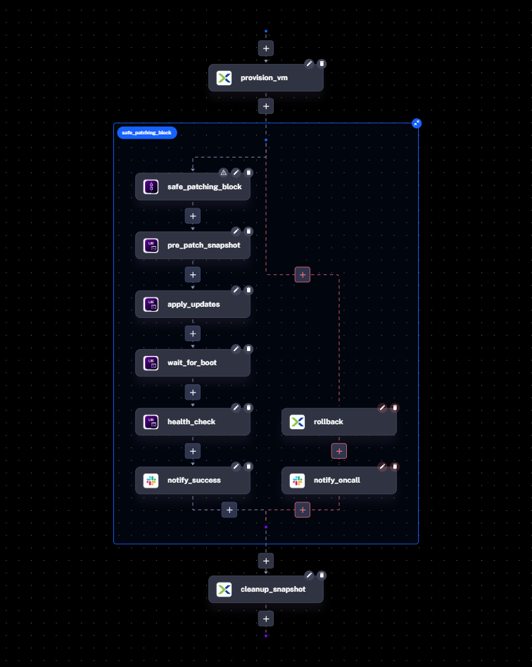
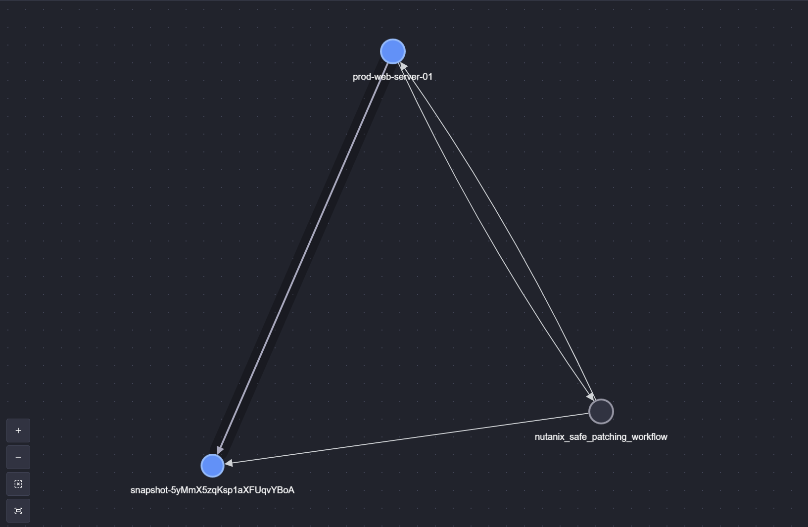
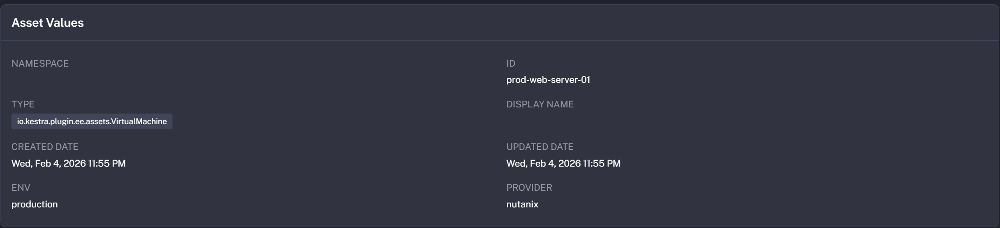

Kestra’s **Assets** (Enterprise Edition) let you automate Nutanix VM lifecycle tasks while keeping a governed inventory of every resource and its lineage. This walkthrough shows how to provision a VM, patch it safely, validate health, and roll back automatically if anything fails—while registering the VM and snapshots as first-class assets.

## The challenge

Operating at scale means you need to:

1. **Provision** new production VMs on Nutanix.
2. **Patch** the OS safely.
3. **Validate** the app after patching.
4. **Rollback automatically** on failure.

Doing that manually across fleets is brittle. We’ll turn it into a repeatable, observable flow.

## The “safe-update” flow at a glance

The flow uses the Nutanix AHV plugin plus Kestra’s asset graph (see the [Nutanix plugin docs](/plugins/plugin-ee-nutanix) for task details). citeturn0search0

- Provision VM and register it as an Asset.
- Take a pre-patch snapshot (linked to the VM asset).
- Apply updates over SSH.
- Wait for reboot, run a health check with retries.
- On success: clean up the snapshot and notify.
- On failure: restore snapshot and alert on-call.



Want the diagram source? Here’s the PlantUML:

:::collapse{title="PlantUML diagram code"}
```yaml
@startuml
skinparam theme plain
skinparam backgroundColor #FFFFFF
skinparam shadowing false

start

partition "Infrastructure Provisioning" {
    :provision_vm;
    note right
        **Asset:** prod-web-server-01
        **Task:** CreateVm
    end note
}

partition "Safe Patching Block (Sequential)" {
    :pre_patch_snapshot;
    note right
        **Asset:** snapshot-{{execution.id}}
        **Task:** CreateVmSnapshot
    end note

    :apply_updates;
    note right: SSH: apt upgrade && reboot

    :wait_for_boot;
    
    :health_check;
    note right: HTTP GET /health
}

if (Health Check Passed?) then (yes)
    :cleanup_snapshot_success;
    note right: DeleteVmSnapshot
    :notify_success;
    stop
else (no)
    partition "Error Handler: Rollback" #Pink {
        :revert_vm;
        note right: RestoreVmSnapshot
        :notify_oncall;
    }
    detach
endif

@enduml
```
:::

Use this snippet to regenerate or tweak the visual without redrawing it by hand.

## Asset lineage you can see

Assets create traceability between the VM, snapshots, and the workflow that produced them.





## Flow breakdown

### 1) Provision and register the VM

```yaml
- id: provision_vm
  type: io.kestra.plugin.ee.nutanix.ahv.CreateVm
  wait: true
  vm:
    name: "{{ inputs.vm_name }}"
    description: "VM created by Kestra"
    cluster:
      extId: "{{ secret('NUTANIX_CLUSTER_EXT_ID') }}"
    resources:
      numSockets: 1
      numCoresPerSocket: 2
      memorySizeBytes: 2147483648
      disks: []
  assets:
    outputs:
      - id: "{{ inputs.vm_name }}"
        type: io.kestra.plugin.ee.assets.VirtualMachine
        metadata:
          provider: nutanix
          env: production
```

**Why it matters:** The VM is now a tracked asset with metadata, so every downstream task can reference it and you keep lineage for audits. For task options, see the [CreateVm documentation](/plugins/plugin-ee-nutanix/ahv/io.kestra.plugin.ee.nutanix.ahv.createvm). citeturn0search1

**Key features:**
- Nutanix `CreateVm` task talks directly to Prism Central to provision the VM you describe.
- The `assets.outputs` block registers the VM as an `io.kestra.plugin.ee.assets.VirtualMachine` with metadata (provider, env) for cataloging and lineage.
- Metadata makes it easy to filter and search assets in the UI and see which flows touch them.

### 2) Safe patching block (with snapshot)

```yaml
- id: safe_patching_block
  type: io.kestra.plugin.core.flow.Sequential
  tasks:
    - id: pre_patch_snapshot
      type: io.kestra.plugin.ee.nutanix.snapshot.CreateVmSnapshot
      vmExtId: "{{ outputs.provision_vm.vmExtId }}"
      snapshotName: "pre_patch_{{ execution.id }}"
      assets:
        inputs:
          - id: "{{ inputs.vm_name }}"
        outputs:
          - id: "snapshot-{{ execution.id }}"
            type: io.kestra.plugin.ee.assets.Snapshot
            metadata:
              vm_name: "{{ inputs.vm_name }}"

    - id: apply_updates
      type: io.kestra.plugin.scripts.shell.Commands
      commands:
        - ssh -o StrictHostKeyChecking=no admin@{{ outputs.provision_vm.vmIpAddresses[0] }} "sudo apt update && sudo apt upgrade -y && sudo reboot"
      # Swap in Ansible, PowerShell, or Salt if that’s your patching toolchain.

    - id: wait_for_reboot
      type: io.kestra.plugin.core.flow.Pause
      delay: PT2M

    - id: health_check
      type: io.kestra.plugin.core.http.Request
      uri: "http://{{ outputs.provision_vm.vm.ip }}/health"
      method: "GET"
      allowFailed: false
      retry:
        type: constant
        interval: PT30S
        maxAttempt: 5

    - id: notify_success
      type: io.kestra.plugin.notifications.slack.SlackIncomingWebhook
      url: "{{ secret('SLACK_WEBHOOK') }}"
      payload: |
        {
          "text": ":white_check_mark: *Patching Succeeded!* VM `{{ inputs.vm_name }}` has been successfully patched."
        }

  errors:
    - id: rollback_and_notify
      type: io.kestra.plugin.core.flow.Sequential
      tasks:
        - id: revert_vm
          type: io.kestra.plugin.ee.nutanix.snapshot.RestoreVmSnapshot
          snapshotExtId: "{{ outputs.pre_patch_snapshot.snapshotExtId }}"
        - id: notify_oncall_failure
          type: io.kestra.plugin.notifications.slack.SlackIncomingWebhook
          url: "{{ secret('SLACK_WEBHOOK') }}"
          payload: |
            {
              "text": ":alert: *Patching Failed!* VM `{{ inputs.vm_name }}` was rolled back automatically."
            }
```

**Why it matters:** Snapshots plus retries give you a safe guardrail; the error handler makes rollback automatic and visible.

**Key features:**
- `CreateVmSnapshot` captures a pre-patch snapshot and links it back to the VM asset via `assets.inputs`, giving clear lineage.
- Patching is pluggable: swap the SSH command for Ansible, PowerShell, Salt, etc., while still using the same flow shape.
- `Pause` plus HTTP `Request` with retries lets you wait for reboot and verify health before marking success.
- An `errors` block restores from the snapshot and notifies on-call automatically, limiting blast radius.

### 3) Clean up after success

```yaml
- id: cleanup_snapshot
  type: io.kestra.plugin.ee.nutanix.snapshot.DeleteVmSnapshot
  snapshotExtId: "{{ outputs.pre_patch_snapshot.snapshotExtId }}"
```

**Why it matters:** Removing the temporary snapshot saves storage once the patch is validated.

**Key features:**
- Deletes the temporary snapshot only after successful validation, keeping storage tidy.
- Continues to reference the same asset IDs, so lineage stays intact even as temporary artifacts are removed.

## Full Code

:::collapse{title="Full code"}
```yaml
id: nutanix_safe_patching_workflow
namespace: company.team
inputs:
  - id: vm_name
    type: STRING
    defaults: "prod-web-server-01"

tasks:
  - id: provision_vm
    type: io.kestra.plugin.ee.nutanix.ahv.CreateVm
    wait: true
    vm:
      name: "{{ inputs.vm_name }}"
      description: "VM created by Kestra"
      cluster:
        extId: "{{ secret('NUTANIX_CLUSTER_EXT_ID') }}"
      resources:
        numSockets: 1
        numCoresPerSocket: 2
        memorySizeBytes: 2147483648
        disks: []
    assets:
      outputs:
        - id: "{{ inputs.vm_name }}"
          type: io.kestra.plugin.ee.assets.VirtualMachine
          metadata:
            provider: nutanix
            env: production

  - id: safe_patching_block
    type: io.kestra.plugin.core.flow.Sequential
    tasks:
      - id: pre_patch_snapshot
        type: io.kestra.plugin.ee.nutanix.snapshot.CreateVmSnapshot
        vmExtId: "{{ outputs.provision_vm.vmExtId }}"
        snapshotName: "pre_patch_{{ execution.id }}"
        assets:
          inputs:
            - id: "{{ inputs.vm_name }}"
          outputs:
            - id: "snapshot-{{ execution.id }}"
              type: io.kestra.plugin.ee.assets.Snapshot

      - id: apply_updates
        type: io.kestra.plugin.scripts.shell.Commands
        commands:
          - ssh -o StrictHostKeyChecking=no admin@{{ outputs.provision_vm.vmIpAddresses[0] }} "sudo apt update && sudo apt upgrade -y && sudo reboot"

      - id: wait_for_boot
        type: io.kestra.plugin.core.flow.Pause
        delay: PT1M

      - id: health_check
        type: io.kestra.plugin.core.http.Request
        uri: "http://{{ outputs.provision_vm.vm.ip }}/health"
        method: "GET"

      - id: notify_success
        type: io.kestra.plugin.notifications.slack.SlackIncomingWebhook
        url: "{{ secret('SLACK_WEBHOOK') }}"
        payload: |
          {
            "text": ":white_check_mark: *Patching Succeeded!* VM `{{ inputs.vm_name }}` has been successfully patched."
          }
    
    errors:
      - id: rollback
        type: io.kestra.plugin.ee.nutanix.snapshot.RestoreVmSnapshot
        snapshotExtId: "{{ outputs.pre_patch_snapshot.snapshotExtId }}"
      - id: notify_oncall
        type: io.kestra.plugin.notifications.slack.SlackIncomingWebhook
        url: "{{ secret('SLACK_WEBHOOK') }}"
        payload: |
          {
            "text": ":alert: *Patching Failed!* VM {{ inputs.vm_id }} has been rolled back to its pre-patch state."
          }

  - id: cleanup_snapshot
    type: io.kestra.plugin.ee.nutanix.snapshot.DeleteVmSnapshot
    snapshotExtId: "{{ outputs.pre_patch_snapshot.snapshotExtId }}"

pluginDefaults:
  - type: io.kestra.plugin.ee.nutanix
    values:
      host: "{{ secret('NUTANIX_HOST') }}"
      token: "{{ secret('NUTANIX_TOKEN') }}"
```
:::

That’s the entire workflow in one place if you want to copy, fork, or templatize it.

## Why this matters

- **Governed inventory:** Assets give you a live catalog of VMs and snapshots with lineage.
- **Safer ops:** Snapshots, retries, and automatic rollback reduce blast radius.
- **Operational clarity:** Notifications and asset graphs make it easy to see what happened and why.

Ready to adapt it? Swap in your cluster IDs, secrets, and health-check endpoint, then ship it to your Nutanix fleet.
