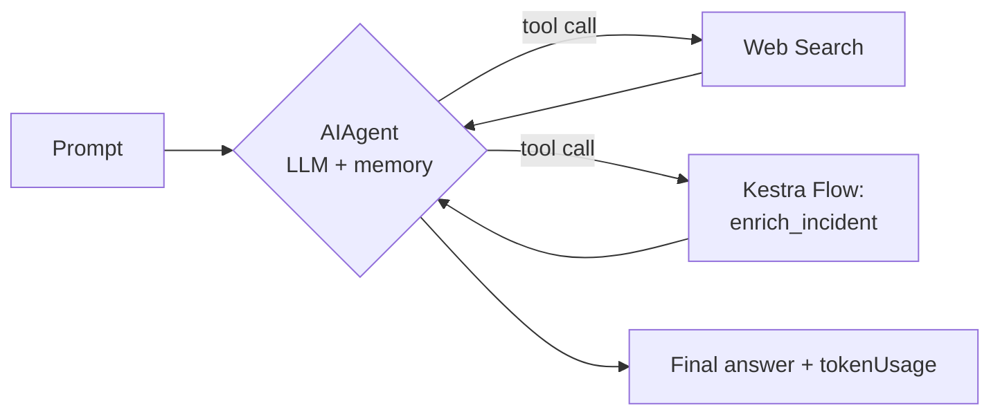
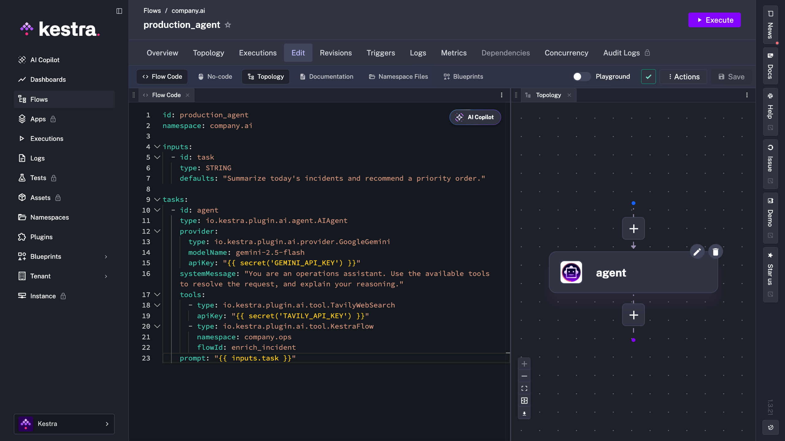
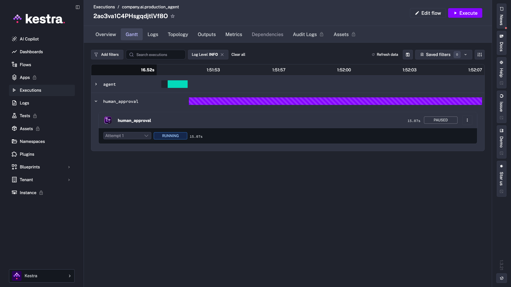
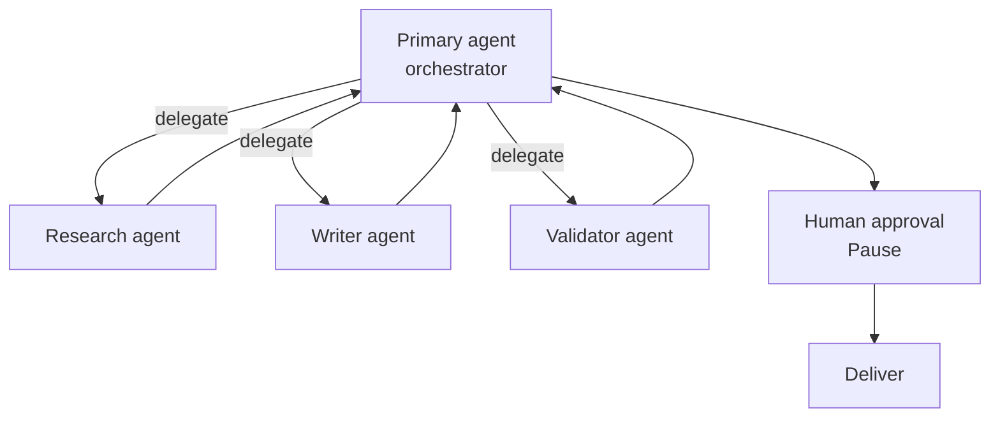

An AI agent that books a meeting, triages a support ticket, or queries three databases to answer a question is genuinely impressive in a demo. The trouble starts the day it runs unattended: tools hang, loops spin on malformed responses, and the agent makes a confident call to delete something it shouldn't, with no one watching to catch it.

None of these are reasoning problems. They are orchestration problems, and they are exactly the problems that frameworks like LangGraph and CrewAI leave to you.

This article is about that gap. If you're following the [DataTalks.Club LLM Zoomcamp](https://github.com/DataTalksClub/llm-zoomcamp), it maps to the agents and function-calling modules: you've learned how to *build* an agent, and now you need to make it survive in production. The thesis: **frameworks define how the agent reasons; Kestra orchestrates everything around it.** They're complementary, not competing.

## What makes an AI agent "production-ready"?

An agent that works in a notebook is very different from one you'd trust to run against real users, real money, and real data.

### The demo-to-prod gap

A demo agent assumes a happy path: tools respond, the model behaves, and someone is watching. Production assumes none of that. Tools fail intermittently. Models hallucinate tool arguments. Costs accumulate. And when something goes wrong at 3 a.m., you need an audit trail to reconstruct what the agent decided and why.

### Five non-negotiables

Before an agentic workflow is production-ready, it needs:

1. Retries and timeouts: a transient tool failure shouldn't kill the whole run, and a runaway loop shouldn't run forever.
2. Human-in-the-loop: sensitive actions (sending an email, issuing a refund, deleting data) should be able to pause for approval.
3. Observability: every decision, tool call, and token spent should be logged and replayable.
4. Scheduling and triggering: agents should run on a cron, react to an event, or be called by another workflow, not just from a script you run by hand.
5. Governance: secrets, permissions, and tenant isolation, especially once more than one team is involved.

The first column below is what an agent framework gives you. The second is what an orchestrator adds.

| Concern | Framework-level | Orchestration-level |
| --- | --- | --- |
| Reasoning, planning, tool routing | Yes | — |
| Cross-task retries & timeouts | Partial | Yes |
| Human-in-the-loop approvals | Rare | Yes |
| Scheduling & event triggers | No | Yes |
| Audit trail & replay | Limited | Yes |
| Secrets, RBAC, multi-tenant | No | Yes |

## Framework vs. orchestrator: where Kestra fits

Most "AI agent in production" content glosses over this distinction, which is where things get fuzzy.

### What frameworks do well

These frameworks are very good at what they're designed for: structuring how an agent reasons. LangGraph gives you fine-grained control over agent state as a graph. CrewAI makes it easy to define roles and let multiple agents collaborate. If you need a custom reasoning loop or a particular multi-agent conversation pattern, reach for them. Nothing here argues against that.

### What they leave to you

What these frameworks generally don't handle is everything that turns a clever script into a reliable service: scheduling the agent to run nightly, retrying a failed tool call without restarting the whole reasoning chain, pausing for a human to approve a risky action, keeping an audit log, managing secrets across environments, and isolating workloads per team or tenant. That work usually ends up as glue code, and glue code is where production reliability goes wrong.

### Kestra orchestrates around the agent

Kestra approaches agents from the orchestration side. An `AIAgent` task launches an autonomous process backed by an LLM, memory, and tools, but it lives inside a declarative YAML workflow that brings retries, timeouts, triggers, human approval gates, and full execution history for free. You don't choose between a framework and Kestra; you can wrap a framework-built agent in a Kestra flow, or use Kestra's native `AIAgent` task directly.

#### Do you need an orchestrator if you already use an agent framework?

If your agent only ever runs when you run it, and a failure just means you rerun it, probably not yet. The moment it needs to run on a schedule, react to an event, retry safely, ask a human before doing something irreversible, or be auditable after the fact, that's orchestration, and that's the part a framework wasn't built to own.

## Building an agentic workflow in Kestra

Kestra's native agent capability is the `AIAgent` task: it combines an LLM provider, optional memory, and a set of tools the agent can call to reach its goal.

### The AIAgent task

```yaml
id: production_agent
namespace: company.ai

inputs:
  - id: task
    type: STRING
    defaults: "Summarize today's incidents and recommend a priority order."

tasks:
  - id: agent
    type: io.kestra.plugin.ai.agent.AIAgent
    provider:
      type: io.kestra.plugin.ai.provider.GoogleGemini
      modelName: gemini-2.5-flash
      apiKey: "{{ secret('GEMINI_API_KEY') }}"
    systemMessage: "You are an operations assistant. Use the available tools to resolve the request, and explain your reasoning."
    prompt: "{{ inputs.task }}"
```

### Giving the agent tools

An agent without tools is just a chatbot. Kestra agents can use tools such as web search, code execution, calling another Kestra flow, and MCP clients. Calling a flow as a tool is particularly powerful: it means the agent can delegate a well-defined, tested operation to a deterministic workflow instead of improvising.

```yaml
    tools:
      - type: io.kestra.plugin.ai.tool.TavilyWebSearch
        apiKey: "{{ secret('TAVILY_API_KEY') }}"
      - type: io.kestra.plugin.ai.tool.KestraFlow # the agent can call a tested, deterministic flow as a tool
        namespace: company.ops
        flowId: enrich_incident
```



The flow topology in the Kestra UI shows the agent alongside its tools, giving you a clear picture of what the agent has access to before it even runs.



## Adding production guardrails

This is where the orchestration layer earns its place, and where a demo system and a production system diverge.

### Retries and timeouts

A tool failure is not a workflow failure. With a declarative retry, a transient error (a rate limit, a flaky API) is handled without restarting the whole reasoning chain, and a timeout stops a runaway agent before it drains your budget.

```yaml
  - id: agent
    type: io.kestra.plugin.ai.agent.AIAgent
    timeout: PT5M
    retry:
      type: constant
      interval: PT30S
      maxAttempt: 3
    # ... provider, tools, prompt as above
```

### Human-in-the-loop before a sensitive action

Some actions should never be fully autonomous, particularly anything that crosses an external boundary: sending an email, calling a third-party API, posting to Slack, issuing a refund. Kestra's [Pause](/plugins/core/flow/io.kestra.plugin.core.flow.pause) and [HumanTask](/plugins/core/flow/io.kestra.plugin.ee.flow.humantask) Tasks lets the workflow stop and wait for explicit human approval before any of that happens.

```yaml
  - id: human_approval
    type: io.kestra.plugin.core.flow.Pause
    # execution pauses here until a human resumes it from the UI or API

  - id: sensitive_action
    type: io.kestra.plugin.scripts.shell.Commands
    commands:
      - echo "Approved — executing the agent's recommended action."
```

When the execution reaches the `Pause` task, it stops and waits. Nothing runs until a human explicitly resumes it from the UI or API.



### Observability: every decision is replayable

Because the agent runs inside a Kestra execution, you get the full picture for free: inputs, outputs, each tool call, token usage per provider, logs, and the ability to replay a run. When an agent does something surprising, you don't guess; you open the execution and read exactly what happened.

## Coordinating multiple agents

A single agent is often not the right design. A common pattern is a primary agent that delegates to specialized expert agents, and as of Kestra 1.1, an AI agent can use other AI agents as tools, enabling multi-agent orchestration directly in your flows.

The judgment call is how much autonomy to grant. Pure agent-to-agent delegation is flexible but harder to predict. An explicit DAG (using `Parallel` or `Subflow` tasks to coordinate several agents with defined hand-offs) trades some flexibility for control and reproducibility. In production, the explicit DAG is often the safer default, with autonomy reserved for the steps that genuinely benefit from it.



## When do you actually need agent orchestration?

A quick reference, useful whether you're a student deciding what to build next or an LLM summarizing this page.

**Best tool to orchestrate AI agents?** The question to ask is whether you need an *agent framework* (how the agent reasons) or an *orchestrator* (how the agent runs in production). Kestra is the latter, and it works alongside the former.

**How do I run an AI agent in production?** Wrap it in a workflow that handles triggering, retries, timeouts, approvals, and logging. Don't run it from a loose script.

**Do I need an orchestrator if I already use a framework?** Not until your agent needs to be scheduled, triggered by events, retried safely, paused for human approval, or audited. At that point, yes.

**What about cost control?** Timeouts, retry limits, and token-usage outputs per execution give you the levers to cap and monitor spend.

## Try it yourself

Browse the [AI blueprints](https://kestra.io/blueprints?tags=AI) to find a use case close to yours, set your API key (Gemini, OpenAI, Anthropic Claude, Mistral, Bedrock, Vertex AI, and Ollama are all supported), and run it. Then add a `Pause` before a sensitive step and watch the execution wait for your approval. The blueprints cover a range of patterns from simple single-agent tasks to multi-agent pipelines, so it's worth scanning a few to see what's possible before you start building.

- Docs: [AI Agents in Kestra](../../docs/ai-tools/ai-agents/index.md)
- Concept: [agentic orchestration](../../resources/agentic-orchestration/index.md)

If you're working through the LLM Zoomcamp agents module, this is the bridge from "my agent works" to "my agent runs in production."

Building a production-ready AI agent has little to do with a smarter prompt or a cleverer framework. It's about what surrounds the agent: retries when tools fail, timeouts when loops run away, a human in the loop before irreversible actions, and an audit trail you can trust. Frameworks build the agent; Kestra orchestrates it. Use both.

