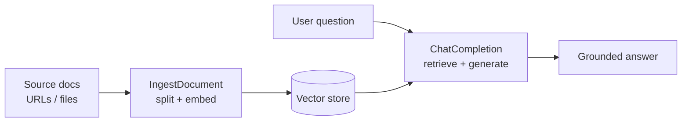
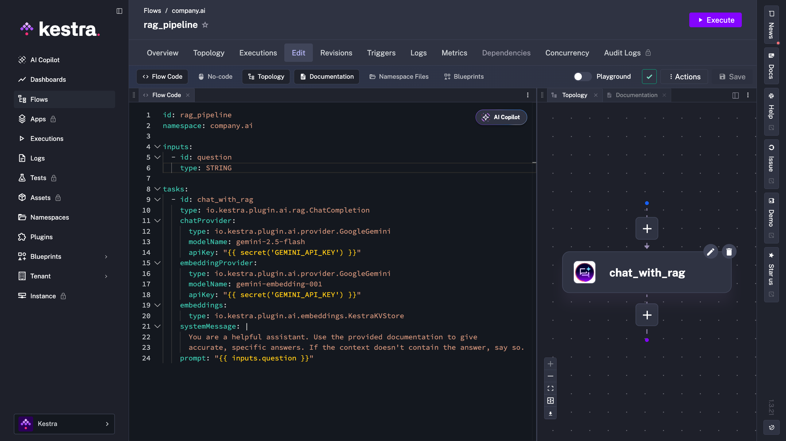
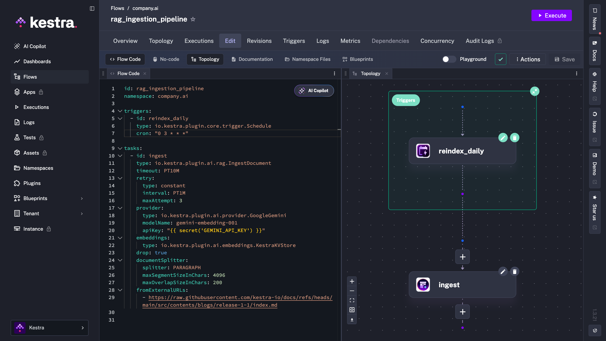

Most RAG pipelines start life in a notebook and that's where they stay. You get it working, the answers look good, and then at some point the source documents change and nobody re-indexes them. A step silently fails. There's no schedule, no retry, no log of what ran when.

This tutorial covers how to fix that. We'll build a complete RAG pipeline as a declarative Kestra workflow: ingestion, chunking, embeddings, vector storage, and grounded query, all in YAML you can version, schedule, and re-run reliably.

If you're following the [DataTalks.Club LLM Zoomcamp](https://github.com/DataTalksClub/llm-zoomcamp/tree/main/03-orchestration), this maps directly to the RAG and vector-search material. The flows here are the same shape as the ones in the course, so you can follow along live. One distinction to set up front: Kestra orchestrates the pipeline; the AI plugin (built on LangChain4J) handles the actual LLM calls. Kestra handles the scheduling, retries, and orchestration around the model.

## What is RAG pipeline orchestration?

RAG grounds an LLM's answers in your own data instead of letting it guess from training memory. For a full conceptual treatment, see Kestra's guide to [RAG pipeline orchestration](../../resources/rag-pipeline/index.md); here we'll stay focused on building one.

### The two pipelines: indexing vs. retrieval

Every RAG system is really two pipelines. The indexing pipeline collects documents, splits them into chunks, turns each chunk into an embedding, and stores those vectors. The retrieval pipeline takes a user question, finds the most relevant chunks by similarity, and feeds them to the LLM as context for a grounded answer. Orchestration is what connects and schedules both.

### Why notebooks don't survive production

A notebook runs once, when you run it. Production needs the indexing pipeline to run on a schedule (or when source data changes), to retry transient failures, to log what happened, and to re-index without manual babysitting. Those are orchestration concerns (scheduling, retries, observability, re-indexing), and they're the whole reason to put RAG inside a workflow engine.

## The RAG pipeline we'll build

Here's the shape of the pipeline. We start with the simplest possible vector store so there's nothing to install, then swap in a production-grade store later without changing the rest of the flow.



## Step 1: Ingestion, chunking, and embeddings

The indexing pipeline is a single task: `IngestDocument`. It fetches your documents, splits them into chunks, generates embeddings with the provider you choose, and writes them to a vector store.

```yaml
id: rag_ingestion_pipeline
namespace: company.ai

tasks:
  - id: ingest
    type: io.kestra.plugin.ai.rag.IngestDocument
    provider:
      type: io.kestra.plugin.ai.provider.GoogleGemini
      modelName: gemini-embedding-001
      apiKey: "{{ secret('GEMINI_API_KEY') }}"
    embeddings:
      type: io.kestra.plugin.ai.embeddings.KestraKVStore
    drop: true
    documentSplitter:
      splitter: PARAGRAPH
      maxSegmentSizeInChars: 4096
      maxOverlapSizeInChars: 200
    fromExternalURLs:
      - https://raw.githubusercontent.com/kestra-io/docs/refs/heads/main/src/contents/blogs/release-1-1/index.md
```

Two choices matter here. Chunking, controlled by `documentSplitter` and `maxSegmentSizeInChars`: chunks that are too large dilute relevance, too small lose context. Paragraphs at a few thousand characters is a sensible default. The embedding model, set by `modelName`, must be an embedding model (here `gemini-embedding-001`), and the same model has to be used for retrieval, or your query vectors won't match your stored ones.

The `drop: true` flag clears the store before ingesting, which keeps re-runs clean while you're learning. In production you'd manage updates more deliberately.

## Step 2: Choosing your vector store

This is the one line you'll change as you move from learning to production.

### Start with zero dependencies: KestraKVStore

`io.kestra.plugin.ai.embeddings.KestraKVStore` uses Kestra's built-in key-value store as the vector store. There's nothing to install and nothing to connect. It's exactly what the LLM Zoomcamp uses, and it's the fastest way to get a working RAG pipeline end to end. That said, it's not designed for production workloads. Similarity search runs in memory against the full key-value store, so performance degrades as your corpus grows. For anything beyond prototyping, you'll want a dedicated vector database.

### Scale up: Qdrant or PGVector

When you outgrow the KV store (larger corpora, faster similarity search, persistence you control), you swap the `embeddings` block for a dedicated vector database. The rest of the flow stays identical.

```yaml
    # Qdrant
    embeddings:
      type: io.kestra.plugin.ai.embeddings.Qdrant
      # host, port, collection ...

    # or PGVector (Postgres extension)
    embeddings:
      type: io.kestra.plugin.ai.embeddings.PGVector
      # url, table ...
```

| Store | Setup | Best for |
| --- | --- | --- |
| KestraKVStore | None (built in) | Learning, prototyping, the Zoomcamp |
| Qdrant | External service | Larger corpora, fast vector search |
| PGVector | Postgres extension | Teams already running Postgres |

## Step 3: Retrieval and grounded generation

Retrieval and generation are also one task: `ChatCompletion` with an embeddings store attached. It embeds the question with the *same* embedding model, retrieves the closest chunks, and asks the chat model to answer using them as context.

```yaml
id: rag_pipeline
namespace: company.ai

inputs:
  - id: question
    type: STRING

tasks:
  - id: chat_with_rag
    type: io.kestra.plugin.ai.rag.ChatCompletion
    chatProvider:
      type: io.kestra.plugin.ai.provider.GoogleGemini
      modelName: gemini-2.5-flash
      apiKey: "{{ secret('GEMINI_API_KEY') }}"
    embeddingProvider:
      type: io.kestra.plugin.ai.provider.GoogleGemini
      modelName: gemini-embedding-001
      apiKey: "{{ secret('GEMINI_API_KEY') }}"
    embeddings:
      type: io.kestra.plugin.ai.embeddings.KestraKVStore
    systemMessage: |
      You are a helpful assistant. Use the provided documentation to give
      accurate, specific answers. If the context doesn't contain the answer, say so.
    prompt: "{{ inputs.question }}"
```

A useful test: run the same question twice, once with the embeddings store attached and once without. The ungrounded version will often hallucinate specifics confidently. The grounded version will either answer from your documents or say it doesn't know. That gap is worth demonstrating to whoever owns the product.

Here's what the flow looks like in the Kestra editor, with the `ChatCompletion` task visible in the topology view.



## Step 4: Scheduling and production hardening

So far this runs when you trigger it. To make it a real pipeline, add a schedule and some resilience.

```yaml
triggers:
  - id: reindex_daily
    type: io.kestra.plugin.core.trigger.Schedule
    cron: "0 3 * * *"

tasks:
  - id: ingest
    type: io.kestra.plugin.ai.rag.IngestDocument
    timeout: PT10M
    retry:
      type: constant
      interval: PT1M
      maxAttempt: 3
    # ... provider, embeddings, documentSplitter, sources as above
```

A `Schedule` trigger re-indexes your sources automatically (nightly here) so answers stay fresh as documents change. `retry` absorbs transient failures like a rate limit or a flaky download without manual reruns, and `timeout` stops a stuck ingestion from hanging. Every run is a Kestra execution, so you get logs and full history in the UI without any extra setup.

In the editor you can see the schedule trigger alongside the flow definition, and the topology view updates to reflect the scheduled entry point.



## Run it yourself

[Copy the blueprint](https://kestra.io/blueprints/ai-rag-daily-ingestion-gemini), set your `GEMINI_API_KEY` secret, and run it. Start on `KestraKVStore` so there's nothing to install; switch the `embeddings` block to Qdrant or PGVector when you're ready to scale.


If you're working through the LLM Zoomcamp orchestration module, this is the same pipeline shape you'll build in the RAG lessons. Clone it, then make it yours.

Once the pipeline is running reliably, the natural next step is giving it more autonomy.

- Docs: [RAG workflows in Kestra](../../docs/ai-tools/ai-rag-workflows/index.md)
- Reference: [the RAG plugin](/plugins/plugin-ai/rag) and [vector databases explained](../../resources/vector-database/index.md)