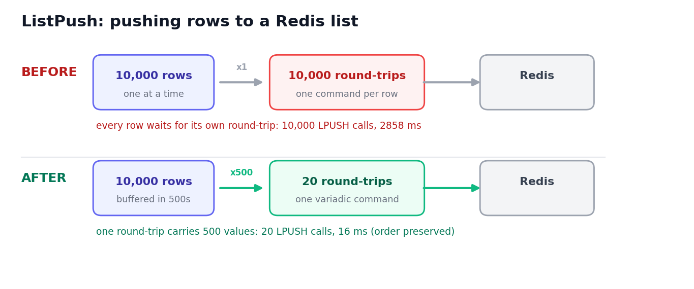
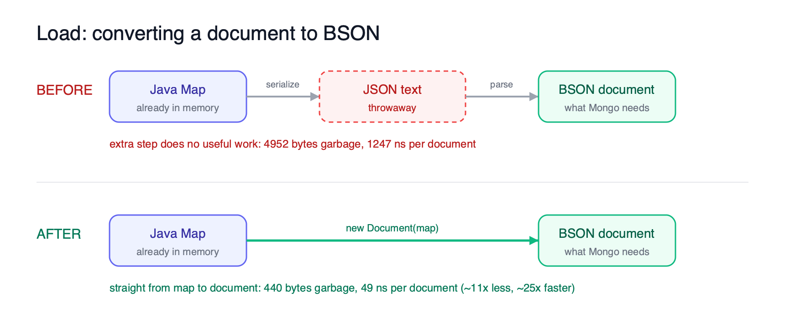

Plugins are how Kestra talks to the outside world: databases, message queues, object stores, and APIs. They sit on the hot path of almost every execution, so a small inefficiency in a plugin quietly becomes a big one once you are moving millions of rows or thousands of messages.

We recently went through several plugins looking for exactly that. Two patterns kept coming up. Work that was repeated on every row or every call when it only needed to happen once, and a handful of places that dropped data or errors without ever telling you. This post walks through the fixes, spread across seven plugins.

Here is what we cover:

- **plugin-jdbc**: pool connections and read result-set metadata once
- **plugin-serdes**: cache the date formatter and reuse the JSON mapper
- **plugin-redis**: batch `ListPush` into a single command
- **plugin-mongodb**: drop a double JSON round-trip
- **plugin-gcp, plugin-aws, plugin-kafka**: correctness and reliability fixes

Where a change sits on a hot path, we measured it so the numbers are real, not hand-waving. Where it was a correctness fix, the point is the bug we removed, not the benchmark.

## How we measured

Most of the numbers below come from JMH microbenchmarks. The Redis case is the exception, where we count the actual number of round-trips and measure wall-clock time, including over a simulated 1 ms network link.

One thing worth keeping in mind. These services run on localhost with no TLS and no real network latency, so several of the numbers below are a conservative floor. A remote database or broker pays far more per round-trip than localhost does, so in production the gain is usually larger than what we show here.

:::collapse{title="Benchmark setup"}
- JMH 1.37, on an Apple M4 (10 cores), macOS 15.5, with a recent OpenJDK (Temurin).
- Real drivers and real services rather than mocks: H2 and PostgreSQL 16 for JDBC, a local MongoDB, a local Redis, and so on, mostly through Testcontainers.
- Allocation figures come from the JMH `gc` profiler (`gc.alloc.rate.norm`), so they are bytes allocated per operation and are deterministic across runs.
- The Redis timings use `INFO commandstats` for round-trip counts and toxiproxy for the 1 ms network link.
:::

## plugin-jdbc: pool connections, read metadata once

The JDBC plugin backs a large family of databases, so it was the first place we looked. We found two independent problems ([#909](https://github.com/kestra-io/plugin-jdbc/issues/909), [PR #924](https://github.com/kestra-io/plugin-jdbc/pull/924)).

### Connection pooling

Every task opened a fresh connection and tore it down at the end of the run. On a remote database that means a full TCP and TLS handshake and a re-authentication for every single task, before a single row is read.

```java
// before: new connection (plus TLS handshake on remote) every task run
return DriverManager.getConnection(jdbcUrl, props);

// after: reuse a pooled connection keyed by URL + credentials
return JdbcConnectionPool.connection(jdbcUrl, props, size);
```

We turned pooling on by default for remote drivers and left it off for embedded drivers (DuckDB, SQLite, MS Access) where it makes no sense. You can turn it off per task with `connectionPooling: false`, and size it with `connectionPoolSize`, which defaults to 10.

We measured this against PostgreSQL 16 in Testcontainers, where one operation is acquire a connection, run `SELECT 1`, and close it. Lower is better.

| Scenario | Metric | Before (DriverManager) | After (HikariCP) | Change |
|---|---|---:|---:|---:|
| 1 thread | Time per op | 2270 ± 167 µs | 116 ± 13 µs | 95% lower, ~20x faster |
| 1 thread | Memory per op | 280,703 B | 1,291 B | ~217x less garbage |
| 16 threads | Time per op | 16,216 ± 4224 µs | 660 ± 143 µs | 96% lower, ~25x faster |
| 16 threads | Memory per op | 281,628 B | 1,472 B | ~191x less garbage |

Around **20x to 25x faster** and roughly **200x less garbage** per operation. And remember, this is the friendly case. The Postgres container runs on localhost with no TLS, so this only captures the local TCP and auth cost. A remote database with TLS pays far more per connection, so on a real instance the saving is larger.

### Read the ResultSet metadata once

The second fix is smaller but shows up on every result set you read. `mapResultSetToMap` read the result-set metadata on every row, once for the column count and again for every column label.

```java
// before (runs per row)
int n = rs.getMetaData().getColumnCount();
for (int i = 1; i <= n; i++) {
    map.put(rs.getMetaData().getColumnLabel(i), convertCell(i, rs, ...));
}

// after: read metadata once per ResultSet, reuse the labels for every row
String[] labels = columnLabels(rs);            // getMetaData() called once
for (int i = 1; i <= labels.length; i++) {
    map.put(labels[i - 1], convertCell(i, rs, ...));
}
```

Column labels do not change between rows, so we compute them once per result set instead of once per row. The old cost scaled as O(rows x columns), the new one as O(columns). Throughput mode, real H2 driver, 1000 rows. Higher is better.

| Columns | Before (ops/ms) | After (ops/ms) | Change |
|---|---:|---:|---:|
| 10 | 5.35 ± 0.20 | 9.34 ± 0.37 | +75% |
| 50 | 0.96 ± 0.07 | 1.30 ± 0.13 | +35% |
| 100 | 0.47 ± 0.00 | 0.59 ± 0.05 | +27% |

Allocation per row is identical before and after, so this one is a pure CPU win. The gain grows with how expensive a driver's `getMetaData()` is, and H2 is one of the cheapest, so on a heavier driver you get more.

## plugin-serdes: cache the formatter, reuse the mapper

Serdes converts between formats like CSV, JSON, and Avro, so its code runs once per cell and once per row on some very large files. That makes it a place where a tiny per-call allocation turns into a lot of garbage. We found two ([#308](https://github.com/kestra-io/plugin-serdes/issues/308), [PR #320](https://github.com/kestra-io/plugin-serdes/pull/320)).

### DateTimeFormatter cached per instance

Every date, time, and datetime parse built a fresh `DateTimeFormatter` from the format string, even though the formatter is immutable and the format string never changes for the life of the converter.

```java
// before: a fresh formatter built on every parse
return LocalDate.parse((String) data, DateTimeFormatter.ofPattern(this.getDateFormat()));

// after: build once, reuse
return LocalDate.parse((String) data, dateFormatter());
```

This sits on the row-parsing hot path, so it runs constantly. Parsing one date, one time, and one datetime per call:

| Metric | Before | After | Change |
|---|---:|---:|---:|
| Time | 4,851 ± 164 ns | 3,953 ± 107 ns | ~18% lower |
| Allocation | 12,248 B | 9,488 B | ~23% lower |

### One static ObjectMapper instead of a copy per error

The second one lives on the error path. `trimExceptionMessage` is called from every exception `toString`, and it built a brand new `ObjectMapper` copy on every call. Building an `ObjectMapper` is not cheap.

```java
// before: a new ObjectMapper copy on every call
ObjectMapper mapper = JacksonMapper.ofJson().copy()
    .configure(SerializationFeature.WRITE_DATES_AS_TIMESTAMPS, false)
    .setSerializationInclusion(JsonInclude.Include.ALWAYS)
    .setTimeZone(TimeZone.getDefault());

// after: one static mapper, reused
private static final ObjectMapper TRIM_MAPPER = JacksonMapper.ofJson().copy()
    .configure(SerializationFeature.WRITE_DATES_AS_TIMESTAMPS, false)
    .setSerializationInclusion(JsonInclude.Include.ALWAYS)
    .setTimeZone(TimeZone.getDefault());
```

Because it is on the error path, it never touches the happy case. But when things do go wrong, and error handling itself is slow, that is the worst possible time to be slow. The difference is large:

| Metric | Before | After | Change |
|---|---:|---:|---:|
| Time | 16,303 ± 648 ns | 248 ± 8 ns | ~66x faster |
| Allocation | 67,172 B | 728 B | ~92x less |

## plugin-redis: one variadic LPUSH instead of one per row

This is the fix with the most dramatic numbers, and it is the simplest to explain. `ListPush` sent a single `LPUSH` per row and re-rendered the key and the serde on every row ([#171](https://github.com/kestra-io/plugin-redis/issues/171), [PR #177](https://github.com/kestra-io/plugin-redis/pull/177)). Pushing 10,000 rows meant 10,000 separate round-trips to Redis.

```java
// before: one command per row
factory.getSyncCommands().lpush(renderedKeyPerRow, new String[]{ serializePerRow(row) });

// after: render once, one variadic LPUSH per batch (default 500)
flowable.map(renderedSerde::serialize)
        .buffer(renderedBatchSize)
        .map(values -> factory.getSyncCommands().lpush(renderedKey, values.toArray(new String[0])));
```

`LPUSH` is variadic, so one command can push a whole batch at once and the order is still preserved. We added a `batchSize` property for this, which defaults to 500.



The whole win here is the number of round-trips, so the time you save scales with your network latency. On localhost it is already large. Over a link with 1 ms round-trip time, which is a very ordinary cloud network, it is dramatic. Both runs push 10,000 rows.

| Metric | Before | After | Change |
|---|---:|---:|---:|
| LPUSH round-trips | 10,000 | 20 | 500x fewer |
| Time, localhost | 2,858 ms | 16 ms | 99.4% faster |
| Time, 1 ms network RTT | 24,624 ms | 69 ms | ~357x faster |

We measured the 1 ms case through toxiproxy. The round-trip count is deterministic: 10,000 / 500 = 20.

## plugin-mongodb: drop the double JSON round-trip

This one is our favorite kind of fix, where you delete code and it gets faster. `Load` turned each document into BSON by writing the Map to a JSON string and then parsing that string straight back ([#91](https://github.com/kestra-io/plugin-mongodb/issues/91), [PR #97](https://github.com/kestra-io/plugin-mongodb/pull/97)).

```java
// before: Map -> JSON string -> BsonDocument
new InsertOneModel<>(BsonDocument.parse(JacksonMapper.ofJson().writeValueAsString(values)));

// after: the driver takes the Map directly
new InsertOneModel<>(new Document(values));
```

The Map was already sitting in memory. The JSON string was built and immediately thrown away on every single document. It turns out `org.bson.Document` is both a Map and a Bson, so the driver takes it directly and the whole string step just disappears.



AverageTime mode, allocation from the gc profiler.

| Metric | Before | After | Change |
|---|---:|---:|---:|
| Time per document | 1,247 ± 10 ns | 49 ± 1 ns | ~25x faster |
| Memory per document | 4,952 B | 440 B | ~11x less garbage |

## Reliability and correctness

Not every fix shows up in a benchmark, and honestly these next three worried us more than the slow ones did. A slow task is annoying. A task that reports success while quietly losing your data is much worse, because you do not find out until it is too late. The audit surfaced three of those.

### plugin-gcp

[#612](https://github.com/kestra-io/plugin-gcp/issues/612), [PR #630](https://github.com/kestra-io/plugin-gcp/pull/630).

- **Pub/Sub publish lost in-flight messages on shutdown.** `publisher.shutdown()` was called without `awaitTermination`. The GCP publisher batches asynchronously, so a shutdown that raced with an in-flight flush silently dropped messages. Fixed by waiting for termination before returning.
- **BigQuery StorageWrite blocked per append.** `future.get()` ran immediately after each `append`, which serialized an API that supports many in-flight appends. It now keeps a bounded number of appends in flight with a semaphore, an estimated 40% to 70% throughput gain when append latency is non-trivial.
- Removed a double read of the source data during the ordering-key check, and fixed a busy-wait in the consume loop.

### plugin-aws

[#725](https://github.com/kestra-io/plugin-aws/issues/725), [PR #743](https://github.com/kestra-io/plugin-aws/pull/743).

- **Athena Query dropped rows past ~1,000.** Query a table that returns 5,000 rows and you silently got back only the first ~1,000. A single `getQueryResults` call with no pagination loop meant the rest were discarded with no error. Fixed with a pagination loop on `nextToken`.
- **S3 listing dropped objects past 1,000.** List a bucket with 5,000 objects and you got 1,000 back, silently. The deprecated V1 `ListObjectsRequest` was used with a single call that never checked `isTruncated`. Switched to `ListObjectsV2Request` with a continuation loop.
- **SQS published one message per call.** `sendMessageBatch` takes up to 10 messages per request, so batching cuts the API call count by up to 90% on bulk publishes.

### plugin-kafka

[#174](https://github.com/kestra-io/plugin-kafka/issues/174), [PR #187](https://github.com/kestra-io/plugin-kafka/pull/187).

`Produce` called `producer.send(...)` and never looked at the returned `Future`. The task went green while your messages never reached the broker. Any send error, a broker being unavailable, a serialization failure, a quota being exceeded, was swallowed. It now collects the futures, checks each one after the flux completes, and propagates the first error.

## Conclusion

None of these changes touch how you write a flow. You get them for free by upgrading. They came out of a fairly simple habit: read the hot paths and ask what work is being repeated, then check whether a task can fail without saying so. Pool the connection, cache the formatter, batch the round-trip, check the future.

Individually each one is small. Together they add up, and they matter most exactly when you are running at scale, which is where you least want a plugin getting in the way. Plugins are a big surface, we have only been through a handful so far, and we are not done. Performance and correctness across the plugin ecosystem stay a focus for us.

:::alert{type="info"}
If you have any questions, reach out via [Slack](/slack) or open a [GitHub issue](https://github.com/kestra-io/kestra).

If you like the project, give us a [GitHub star](https://github.com/kestra-io/kestra) and join [the community](/slack).
:::
