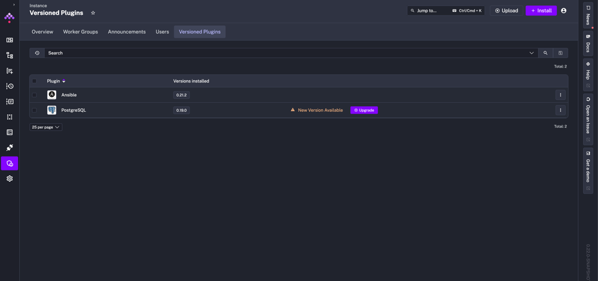

Kestra relies on plugins to integrate with various systems and services. As workflows evolve, keeping these plugins up-to-date without breaking existing flows can become a challenge.

**Plugin Versioning** is a feature in Kestra (available in v0.22+ for Enterprise Edition) that tackles this. It allows you to run multiple versions of the same plugin simultaneously, giving teams the flexibility to upgrade at their own pace.

In this post, we’ll explore why plugin versioning matters, how Kestra’s implementation works, and what benefits it brings everyone, from new users to enterprise teams.

## Why We Added Plugin Versioning

In complex data platforms, managing different plugin versions is critical. Upgrading a plugin to get new features or bug fixes can sometimes break legacy workflows that expect the old behavior. Traditionally, orchestrators force you to either **freeze** on older plugin versions (missing out on improvements) or **upgrade everything at once** (risking compatibility issues). Neither scenario is ideal for a production environment that demands stability.

It is important to be able to upgrade the orchestration platform while keeping existing workflows running on older plugin versions. For example, you might have a mission-critical flow that relies on a specific version of a database connector plugin. Upgrading that plugin could change its behavior or API. With plugin versioning, you don’t have to choose between stagnation and risky “big bang” upgrades – you can have both versions available side by side. You can maintain **backward compatibility** while still moving forward.

## Versioned Plugins

Kestra’s **Plugin Versioning** feature provides a safe, flexible way to manage plugin upgrades. In a nutshell, it lets you **install multiple versions** of any Kestra plugin on the same instance and control which workflow uses which version. This approach enables granular version management across your Kestra environment.

**How does it work?** Instead of replacing an old plugin when a new version arrives, Kestra can keep the old one and add the new one in tandem. You can **pin specific plugin versions** for certain flows (e.g., keep using v1.0.0 in an older workflow) while directing other flows to use the latest release.

<div class="video-container">
    <iframe src="https://www.youtube.com/embed/h-vmMGlTGM8?si=BC_157leuRzfC0yt" title="YouTube video player" allow="accelerometer; autoplay; clipboard-write; encrypted-media; gyroscope; picture-in-picture; web-share" referrerpolicy="strict-origin-when-cross-origin" allowfullscreen></iframe>
</div>


Under the hood, Kestra’s plugin system loads and isolates these versions so they don’t conflict. Each versioned plugin gets its own installation directory and classloader, ensuring compatibility is preserved.

This feature required some enhancements to how Kestra stores and references plugins. In Kestra 0.22, a global internal plugin repository was introduced to support version isolation (the feature is toggled via configuration in the Enterprise Edition). Once enabled, the Kestra UI and backend offer new controls to manage plugins by version, as we’ll see next.

## Key Benefits of Plugin Versioning

Plugin versioning directly addresses practical concerns in orchestrating workflows at scale. Here are the major benefits of this feature:

- **Easier, Safer Upgrades:** You no longer need to upgrade every workflow the moment a plugin update is available. Install the new plugin version and gradually switch over when ready. This **simplifies the upgrade process** by letting you test the new version in isolation before migrating all flows. If an issue is found, your production workflows can continue running on the stable older version without interruption.
- **Multiple Versions Side-by-Side:** Kestra allows multiple versions of the same plugin to run in parallel within one instance. This means different workflows (or even different tasks in the same workflow) can explicitly use different plugin versions as needed. Such side-by-side operation was previously impossible in most platforms, enabling true **granular control** over plugin dependencies. For example, a new data pipeline can use the latest AWS connector plugin, while a legacy pipeline continues with the older connector it was built on.
- **Backward Compatibility for Legacy Flows:** With versioning, “if it isn’t broken, you don’t have to fix it.” You can keep legacy flows running on the exact plugin version they were written for. Kestra will **pin older plugin versions to your production and legacy flows** on demand. This backward compatibility gives teams confidence that upgrading Kestra or adding new plugins won’t inadvertently break existing business-critical processes.
- **Smoother Migrations & Testing:** Teams can use plugin versioning to **stage migrations**. Need to move from Plugin X v1 to v2? Install v2 alongside v1, then update a few test workflows to use v2 and validate behavior. Because both versions co-exist, you can A/B test and incrementally migrate flows. In multi-team or multi-environment setups, one team can validate the new version while others are unaffected. This greatly de-risks the upgrade path for large organizations. In short, it brings agility to what used to be a delicate operation.

**New Kestra users** get a safety net when adopting plugins (they can adopt new features without fear of breaking examples they’re trying out), **advanced users** get fine-grained control to optimize and experiment, and **enterprise teams** gain the governance needed to operate in mission-critical, multi-environment contexts.

## Hot Reload: Instant Plugin Sync Across Your Infrastructure

Plugin Versioning becomes even more powerful with Kestra’s **Hot Reload** feature. Traditionally, updating plugins across multiple orchestrator instances required manual file synchronization, often causing downtime or inconsistencies.

Hot Reload removes this headache entirely: whenever you install or update a plugin (or a new version of a plugin), Kestra **automatically synchronizes it across all workers, schedulers, and executors**—instantly.

That means plugin JAR files are not manually copied across Kubernetes pods or worker nodes. The synchronization happens automatically and transparently, ensuring all components have immediate access to the latest plugins and versions.

With Hot Reload, your workflows remain uninterrupted, updates propagate instantly, and your team saves time previously spent managing manual deployments.

## Installing and Managing Plugin Versions in the UI

One of the most convenient aspects of Kestra’s plugin versioning is its integration into the web UI. A dedicated interface manages both official Kestra and custom-developed plugins. This makes it easy for anyone, not just backend admins, to view and modify plugin versions.


The **Versioned Plugins** page in Kestra’s UI allows you to install new or additional versions of existing plugins via a point-and-click interface.

<div style="position: relative; padding-bottom: calc(48.95833333333333% + 41px); height: 0; width: 100%;"><iframe src="https://demo.arcade.software/xPS6BoFZhJkDgU9hQoCA?embed&embed_mobile=inline&embed_desktop=inline&show_copy_link=true" title="Versioned Plugins | Kestra EE" loading="lazy" webkitallowfullscreen mozallowfullscreen allowfullscreen allow="clipboard-write" style="position: absolute; top: 0; left: 0; width: 100%; height: 100%; color-scheme: light;" ></iframe></div>


To access this feature, navigate in the Kestra UI to **Administration > Instance > Versioned Plugins**. On this page, you’ll see a list of plugins and their installed versions. Clicking the **+ Install** button opens a dialog with the full library of available plugins (as shown above). You can search for the integration you need – an **AWS** or **Snowflake** plugin – then select which version to install. Kestra’s plugin repository contains all release versions, so you might see a dropdown of versions (e.g., 0.16.1, 0.17.0, 0.18.0, ... up to the latest) for the chosen plugin.

Once you confirm, Kestra will download and install that plugin version into its internal repository. If the plugin was not installed before, it now appears in your list with the specified version. If an older version is already present, the new one will be added **alongside** the old one, not replacing it. The Versioned Plugins table will show the plugin with multiple versions. Kestra even flags when an update is available: you might see a notice like “New Version Available” next to an older version, with an option to **Upgrade**.



:::alert{type="info"}
After installing multiple versions, the **Versioned Plugins** page lists each plugin and the versions installed. In this example, Ansible plugin v0.21.2 is installed, and the PostgreSQL plugin v0.19.0 is installed with a newer version available (hence the Upgrade prompt). Kestra preserves the old version when upgrading, adding the new version as a separate entry.
:::

When you upgrade a plugin via the UI, Kestra doesn’t simply overwrite the old JAR. It keeps the existing version in place and adds the new version as a separate installation. This means any flows currently using the older version will continue to run unaffected. You could upgrade, for instance, the **PostgreSQL** plugin from 0.19.0 to 0.20.0 – and you’d see both versions listed. Then, you might update only certain flows to use 0.20.0 while others remain on 0.19.0 (until you decide to switch them). This side-by-side installation approach is key to safe transitions.

The UI also supports managing **custom plugins** (plugins developed in-house or by third parties). In the Install dialog, there’s a tab to switch from “Official plugin” to “Custom plugin.” There, you can input a Maven coordinate (Group ID and Artifact ID) and a version or upload a JAR file directly. Kestra will treat these just like official plugins, storing the versioned artifact in its repository. This is useful for enterprises that build their own plugin extensions – you can also maintain multiple versions of your internal plugins.

While the UI covers most needs, Kestra also provides programmatic ways to manage plugins. Advanced users can use the **Kestra API or CLI** to install/uninstall plugins by version (only allowed for admin users). For example, a simple HTTP POST to the `/api/v1/cluster/versioned-plugins/install` endpoint with the plugin coordinate will trigger an installation. This enables scripting and automation – imagine promoting a set of plugin upgrades through dev, staging, and production with a CI/CD pipeline calling the API. In short, whether through a friendly UI or via automation scripts, managing plugin versions in Kestra is straightforward.

## Specifying Plugin Versions in Workflows (YAML Examples)

Installing multiple versions of a plugin is only half the story – we also need a way to tell a workflow which version to use. Kestra achieves this with a simple addition to your flow definitions: a `version` property on tasks and triggers. This property lets you **pin a task to a specific plugin version** right in your YAML (or JSON) workflow specification.

For example, suppose you have two versions of the Shell Script plugin installed (v0.21.0 and v0.22.0). If an existing flow should continue using the older 0.21.0 version, you can specify that in the flow file:

```yaml
id: legacy_shell_script
namespace: company.team
tasks:
  - id: script
    type: io.kestra.plugin.scripts.shell.Script
    version: "0.21.0"
```

In the above YAML, the task of type `io.kestra.plugin.scripts.shell.Script` will explicitly use version **0.21.0** of the Shell Script plugin. Even though a newer 0.22.0 version might be available on the Kestra instance, this particular flow is locked to 0.21.0, ensuring it behaves as initially designed. This level of control can be applied per task or trigger in any workflow.

The `version` field accepts exact version numbers (as shown), but it also understands special keywords for convenience. You can write `version: LATEST` to always use the latest available version of that plugin or `version: OLDEST` to use the oldest installed version. These keywords are not case-sensitive (`latest`, `LATEST` both work). Using `LATEST` might be handy for non-critical or development flows where you always want to test the newest plugin features without manually updating the YAML each time a plugin is upgraded. Conversely, `OLDEST` could be used to intentionally stick with an older version until an explicit change is made.

If you do **not** specify a `version` in the task, Kestra will determine which plugin version to use based on a defined resolution order. The resolution goes from the most specific to the most general:

1. **Task-Level:** If the task/trigger has a `version` property set, use that specific version.
2. **Flow-Level:** Otherwise, if the flow has a defined default for that plugin (for instance, a flow-level plugin default setting), use that. *(Kestra allows defining certain defaults at flow level, though this is less commonly used than task-level.)*
3. **Namespace-Level:** If not set in the flow, Kestra checks if there's a default plugin version configured for the current namespace (or tenant) – useful in multi-tenant setups where each team/namespace might pin to a certain version.
4. **Instance-Level:** Finally, if none of the above specify a version, Kestra falls back to the instance’s default plugin version setting (a global config option).

By default, the instance-level default is **`LATEST`**, meaning Kestra will use the latest installed version of a plugin if no other preference is stated. However, administrators can change this default. For example, you might set the global default to `OLDEST` to be conservative or even to `NONE` to force every flow to always explicitly pick a version. In fact, setting `kestra.plugins.management.defaultVersion = NONE` in the configuration will enforce that a version must be defined somewhere (task, flow, or namespace), or the flow will be considered invalid. This strict mode is great for avoiding any ambiguity – it ensures developers don’t accidentally rely on “whatever version happens to be latest” when deploying new flows.

Kestra’s validation will catch such issues early. When you submit or update a flow, Kestra attempts to resolve all plugin versions immediately (and again at execution time). If a task references a plugin version that isn’t installed, or if you’ve enforced explicit versioning and a task lacks a version, Kestra will flag the flow as invalid and prevent it from running. This protects you from runtime surprises – you’ll never have a job fail halfway through the night because a required plugin version wasn’t available. It’s either resolved to a concrete version, or the flow won’t activate by design.

## Common Use Cases and Scenarios

Why does all this matter in practice? Let’s consider a few scenarios that many Kestra users (from solo developers to large enterprises) face:

- **Upgrading a Critical Integration:** Imagine using a plugin for an external service (say, a Salesforce connector) across dozens of workflows. A new plugin version has been released with valuable features but also some breaking changes. With plugin versioning, you can first install and test the new version on a couple of non-critical workflows. Those workflows can specify `version: latest` (or the specific new version number) to try it out. Meanwhile, the mission-critical workflows stay on the stable old version (pinned via `version: x.y.z`). Once you verify the new version works as expected, you can gradually update each important flow to the new version – all within the same Kestra instance, without juggling separate test environments or risking the whole system. This phased upgrade approach is **much safer** than a complete switch-over.
- **Maintaining Legacy Workflows:** In some cases, you might have old workflows that no one has time to refactor, and they depend on the legacy behavior of a plugin. For example, a parsing plugin might have changed its default delimiter in newer versions. Rather than forcing all teams to rewrite those old flows immediately, you can keep the old plugin version running for those workflows. New projects can use the improved plugin version, while old ones remain unchanged. This **coexistence** extends the life of legacy workflows and gives teams breathing room to update flows on their own schedule.
- **Multiple Teams and Environments:** Different groups may have different requirements in an enterprise with multiple teams or departments using Kestra. Team A might be ready to adopt a new plugin version that offers performance improvements, while Team B prefers to stick with the known version until a later time. With plugin versioning, both teams can be satisfied on the same platform – each namespace can default to a different plugin version if needed, or individual flows can choose versions. Similarly, consider **multiple environments** like development, staging, and production. Plugin versioning means your dev environment can trial new plugins without impacting production. When ready, you promote the plugin (already installed) and update flows in prod to point to the new version. This reduces friction in promoting changes across environments.

These use cases all boil down to a single theme: **flexibility with stability**. Kestra’s plugin versioning lets you adapt and evolve your workflow platform without compromising existing operations. It’s an insurance policy against plugin regressions and a toolkit for controlled modernization.

## Conclusion

By giving developers control over plugin versions at the workflow level, Kestra empowers you to use new tools and new integrations without fear. At the same time, providing safety nets like side-by-side versions and explicit version pinning ensures that production workflows remain stable and predictable.

For new users discovering Kestra, plugin versioning means you can confidently adopt Kestra’s plugin ecosystem. For seasoned users running thousands of production workflows, it means easier maintenance and upgrade paths – you can keep your system up-to-date with far less risk. For enterprise teams managing multiple environments and strict uptime requirements, it provides a governance tool to roll out changes in a controlled, reversible manner.

In summary, **Kestra’s Plugin Versioning** feature makes plugin management a first-class citizen of the orchestration process. It acknowledges that change is constant – new plugin versions will come – but with the proper tooling, change doesn’t have to be scary.

:::alert{type="info"}
If you have any questions, reach out via [Slack](/slack) or open [a GitHub issue](https://github.com/kestra-io/kestra).

If you like the project, give us [a GitHub star](https://github.com/kestra-io/kestra) and join [the community](/slack).
:::
