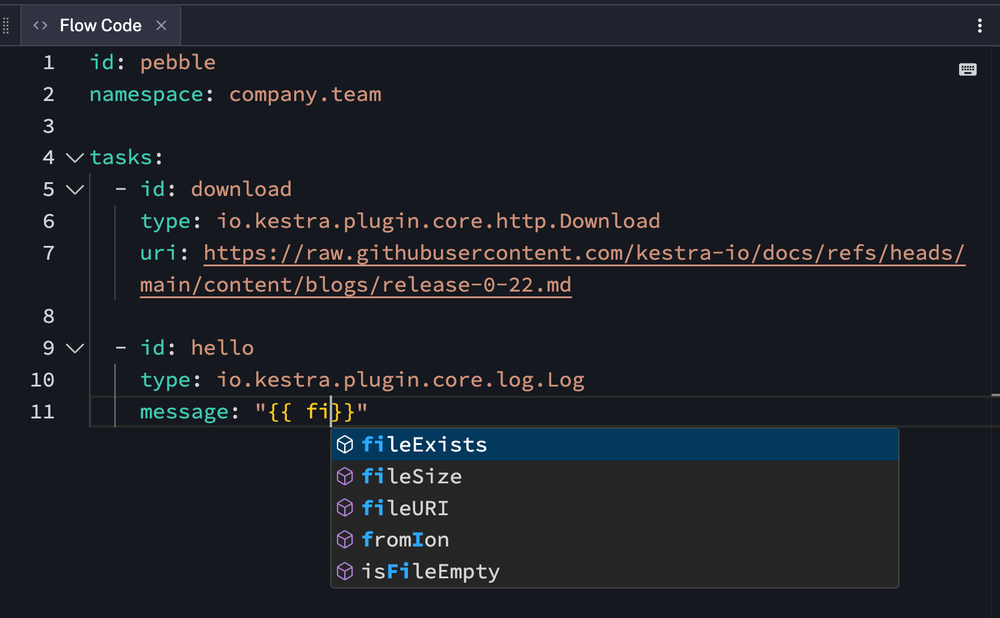

The table below highlights the key features of this release.

| Feature                                   | Description                                                                | Edition |
|-------------------------------------------|----------------------------------------------------------------------------| --- |
| Multi-Panel Editor       | New split-screen Flow Editor that lets you open, reorder, and close multiple panels, including Code, No-Code, Files, Docs, and more side by side | All Edition |
| No-Code Forms | Create Kestra flows from the new form-based UI tabs without writing code — included as a dedicated view in the new Multi-Panel Editor | All Edition |
| Unit Tests for Flows       | With Unit Tests, we're introducing a language-agnostic, declarative syntax to test your flows with fixtures and assertions, allowing you to run tests directly from the UI and catch regressions before they reach production. | Enterprise Edition |
| New UI Filters         | UI filters now have a faster autocompletion and are editable as plain text | All Edition |
| Tenant-based Storage Isolation      | Persist workflow outputs and inputs in isolated internal storage for complete data separation across tenants — a highly requested feature for Enterprise environments with strict isolation requirements. | Enterprise Edition |
| Customizable dashboards         | Configure your own default dashboard with new customizable KPI charts and adjustable chart widths | All Edition |
| Python Dependency Caching    | Speed up your workflows with automatic caching of script dependencies across executions - just define your dependencies and Kestra handles the rest | All Edition |
| Manage Apps & Dashboard with Git | Version control your dashboards and apps with Git tasks | All Edition |

Check the video below for a quick overview of all enhancements.

<div class="video-container">
    <iframe src="https://www.youtube.com/embed/MukH164HRu8" title="YouTube video player" allow="accelerometer; autoplay; clipboard-write; encrypted-media; gyroscope; picture-in-picture; web-share" referrerpolicy="strict-origin-when-cross-origin" allowfullscreen></iframe>
</div>

---

Let's dive into these highlights and other enhancements in more detail.


## Multi-Panel Editor

We're excited to introduce the new split-screen Flow Editor that lets you open, reorder, and close multiple panels, including Code, No-Code, Files, Docs, Topology, and Blueprints side by side.

Since everything is a view that you can open in a tab, this feature enables using Code and No-Code at the same time. The familiar topology view, and built-in documentation and blueprints are integrated in the same way — you simply open them as tabs and reorder or close them however you like.

With this flexible Editor interface, you can:
- Edit the flow using No-Code forms and see your changes reflected in real-time in both Code and the Topology views
- Seamlessly switch between Code and No-Code views based on your preference or task complexity and track dependencies in the topology view live while making edits
- Reference documentation or blueprints without leaving the Editor.

You can customize your experience by opening only the panels you need, creating a fully personalized workspace that matches your workflow development style.

<div class="video-container">
    <iframe src="https://www.youtube.com/embed/SGlzRmJqFBI" title="Multi Panel Editor" allow="accelerometer; autoplay; clipboard-write; encrypted-media; gyroscope; picture-in-picture; web-share" referrerpolicy="strict-origin-when-cross-origin" allowfullscreen></iframe>
</div>


## No-Code Forms

The new Multi-Panel editor ships with a significant update to the No-Code Forms. When you open the No-Code view, you can add new tasks, triggers, or flow properties from form-based tabs without writing any YAML code.

Adding any new task or trigger opens a new No-Code tab, allowing you to edit multiple workflow components at the same time.

Key improvements include:
- **New design**: the new layout simplifies navigation and editing, e.g. adding a task runner configuration to your script task will open a new No-Code tab allowing you to edit the main script and its runtime configuration side-by-side.
- **Improved editing of complex objects**: we've taken great care to ensure that complex objects, such as nested properties and arrays are easy to edit from No-Code forms.
- **Sensible defaults**: the new No-Code forms make it easy to edit properties that have default values. If you want to revert to a default behavior, the "Clear selection" feature will help you remove your custom overrides.

<div style="position: relative; padding-bottom: calc(48.95833333333333% + 41px); height: 0; width: 100%;"><iframe src="https://demo.arcade.software/99kb4bVvCDnir4V4SxjT?embed&embed_mobile=inline&embed_desktop=inline&show_copy_link=true" title="no_code | Kestra EE" loading="lazy" webkitallowfullscreen mozallowfullscreen allowfullscreen allow="clipboard-write" style="position: absolute; top: 0; left: 0; width: 100%; height: 100%; color-scheme: light;" ></iframe></div>

## Unit Tests for Flows (Beta)

As workflows grow in complexity, so does the need to test them reliably. Kestra introduces native support for Unit Tests in YAML, allowing you to validate your flows and detect regressions early.
Until now, users could write unit tests in Java, but with the new YAML-based Unit Test support, you can now define expected outcomes, isolate tasks, and detect regressions early—directly inside Kestra using the same YAML format as your flows.

Key components of a Unit Test:

- **Test Cases**: Each test can consist of one or more test cases, allowing you to verify specific functionality multiple times using different flow inputs, tasks, or file fixtures.
- **Fixtures**: Add fixtures for specific inputs, tasks or files and avoid running tasks that might be computationally expensive or not required to run as part of a given test case.
- **Assertions**: Each test case can contain multiple assertions that check if the given task outputs match the expected outputs. There are many assertion operations such as `equalTo`, `notEqualTo`, `greaterThan`, `startsWith`, and more. This helps ensure your flow behaves correctly under different conditions.
- **API Access**: You can call the Unit Test programmatically via Kestra API, enabling automation in CI/CD pipelines, custom tooling, or integration with development workflows.


:::collapse{title="Unit Test example"}
Let’s look at a simple flow checking if a server is up and sending a Slack alert if it’s not:

```yaml
id: microservices-and-apis
namespace: tutorial
description: Microservices and APIs
inputs:
  - id: server_uri
    type: URI
    defaults: https://kestra.io
  - id: slack_webhook_uri
    type: URI
    defaults: https://kestra.io/api/mock
tasks:
  - id: http_request
    type: io.kestra.plugin.core.http.Request
    uri: "{{ inputs.server_uri }}"
    options:
      allowFailed: true
  - id: check_status
    type: io.kestra.plugin.core.flow.If
    condition: "{{ outputs.http_request.code != 200 }}"
    then:
      - id: server_unreachable_alert
        type: io.kestra.plugin.slack.SlackIncomingWebhook
        url: "{{ inputs.slack_webhook_uri }}"
        payload: |
          {
            "channel": "#alerts",
            "text": "The server {{ inputs.server_uri }} is down!"
          }
    else:
      - id: healthy
        type: io.kestra.plugin.core.log.Log
        message: Everything is fine!
```

Here’s how you might write tests for it:

```yaml
id: test_microservices_and_apis
flowId: microservices-and-apis
namespace: tutorial
testCases:
  - id: server_should_be_reachable
    type: io.kestra.core.tests.flow.UnitTest
    fixtures:
      inputs:
        server_uri: https://kestra.io
    assertions:
      - value: "{{outputs.http_request.code}}"
        equalTo: 200
  - id: server_should_be_unreachable
    type: io.kestra.core.tests.flow.UnitTest
    fixtures:
      inputs:
        server_uri: https://kestra.io/bad-url
      tasks:
        - id: server_unreachable_alert
          description: no Slack message from tests
    assertions:
      - value: "{{outputs.http_request.code}}"
        notEqualTo: 200
```
:::


<div class="video-container">
  <iframe src="https://www.youtube.com/embed/jMZ9Cs3xxpo" title="Unit Test Flows" allow="accelerometer; autoplay; clipboard-write; encrypted-media; gyroscope; picture-in-picture; web-share" referrerpolicy="strict-origin-when-cross-origin" allowfullscreen></iframe>
</div>


## New UI Filters

UI filters now have faster autocompletion and are editable as plain text!

We've heard your feedback that the prior filtering experience has sometimes been a bit slow and tedious to configure. The new filters have been rebuilt from the ground up and are now built on top of our workflow editor. You can now configure even complex filters as simple text with super-fast autocompletion and immediate feedback on syntax errors.

Since the filter configuration is just text, you can easily copy-paste a filter configuration from one flow or namespace to another, and it will just work!

<div style="position: relative; padding-bottom: calc(48.95833333333333% + 41px); height: 0; width: 100%;"><iframe src="https://demo.arcade.software/OFBpLz9IX1O2UtxuXeKi?embed&embed_mobile=inline&embed_desktop=inline&show_copy_link=true" title="Flows | Kestra EE" loading="lazy" webkitallowfullscreen mozallowfullscreen allowfullscreen allow="clipboard-write" style="position: absolute; top: 0; left: 0; width: 100%; height: 100%; color-scheme: light;" ></iframe></div>

## Internal Storage Persistence for Inputs and Outputs

Kestra 0.23 introduces the ability to store flow outputs in the Internal Storage instead of the default database. This feature is especially valuable for organizations with multiple teams or business units, as it ensures that outputs are only accessible to the relevant segment, providing stronger data separation and privacy.

By default, all flow outputs are stored in the shared metadata database. With this new configuration, you can isolate outputs for each tenant or namespace, making sure that sensitive data is not accessible outside its intended scope.

To enable output storage in Internal Storage for a specific tenant or namespace, add the following to your [Kestra configuration](../../docs/configuration/index.md) file:

```yaml
kestra:
  ee:
    outputs:
      store:
        enabled: true # the default is false
```

If you want to enforce this setting globally for all tenants and namespaces, use the following configuration instead:

```yaml
kestra:
  ee:
    outputs:
      store:
        force-globally: true # the default is false
```

With these configuration options, you can control where flow outputs and inputs are stored, improving data governance and compliance for organizations with strict separation requirements.

Note that this comes with some tradeoffs — storing that data in the internal storage backend such as S3 rather than in the backend database (like Postgres or Elasticsearch) introduces some additional latency,  especially visible with inputs stored and fetched from internal storage.

:::alert{type="info"}
Currently, the UI is limited and outputs will not be directly visible if using internal storage. You need to preview them or download them as they are not automatically fetched from the internal storage.
:::


## Customizable Dashboards

This release allows you to personalize your default dashboard with new customizable KPI charts and adjustable chart widths. You can now control what charts and metrics you see when you first log in.

With improved custom dashboards, you can:
- Set any custom-built dashboard as your default view
- Display only metrics and charts that matter most to you
- Access your most important information immediately upon login
- Switch between different dashboards based on your current needs

### Python Dependency Caching

Kestra 0.23 introduces Python dependency caching, bringing significant improvements to the execution of Python tasks. With this feature, execution times for Python tasks are reduced, as dependencies are cached and reused across runs. You can now use official Python Docker images, and multiple executions of the same task will consistently use the same library versions. There is no need to use virtual environments (venv) for installing requirements, simplifying setup and maintenance.

Under the hood, Kestra uses [uv](https://docs.astral.sh/uv/) for fast dependency resolution and caching. This ensures both speed and compatibility with the Python ecosystem.

Before this release, the only way to dynamically install Python dependencies at runtime was to use the `beforeCommands` property or a custom Docker image. For example:

```yaml
id: python
namespace: company.team

tasks:
  - id: python
    type: io.kestra.plugin.scripts.python.Script
    containerImage: ghcr.io/kestra-io/pydata:latest
    taskRunner:
      type: io.kestra.plugin.scripts.runner.docker.Docker
    beforeCommands:
      - pip install pandas
    script: |
      from kestra import Kestra
      import pandas as pd
      data = {
        'Name': ['Alice', 'Bob', 'Charlie'],
        'Age': [25, 30, 35]
      }
      df = pd.DataFrame(data)
      print(df)
      print("Average age:", df['Age'].mean())
      Kestra.outputs({"average_age": df['Age'].mean()})
```

With the new release, you can still use `beforeCommands` as above, but on top of that, you have one more tool at your disposal — the new `dependencies` property, allowing you to declaratively define your required Python packages and let Kestra handle installation and caching automatically:

```yaml
id: python
namespace: company.team

tasks:
  - id: python
    type: io.kestra.plugin.scripts.python.Script
    containerImage: python:3.13-slim
    taskRunner:
      type: io.kestra.plugin.scripts.runner.docker.Docker
    dependencies:
      - pandas
      - kestra
    script: |
      from kestra import Kestra
      import pandas as pd
      data = {
        'Name': ['Alice', 'Bob', 'Charlie'],
        'Age': [25, 30, 35]
      }
      df = pd.DataFrame(data)
      print(df)
      print("Average age:", df['Age'].mean())
      Kestra.outputs({"average_age": df['Age'].mean()})
```

A new `dependencyCacheEnabled` flag (boolean) allows you to enable or disable caching in the worker directory, so dependencies can be quickly retrieved the next time the task runs.

Again, the `beforeCommands` property is still supported for advanced use cases or custom installation steps.

<div class="video-container">
    <iframe src="https://www.youtube.com/embed/g9Jt5zt9wI4" title="Python Dependency Caching" allow="accelerometer; autoplay; clipboard-write; encrypted-media; gyroscope; picture-in-picture; web-share" referrerpolicy="strict-origin-when-cross-origin" allowfullscreen></iframe>
</div>


### Git Sync for Apps & Dashboards

Kestra 0.23.0 introduces Git integration for Dashboards and Apps, enabling version control and collaborative management of these resources through familiar Git workflows. You can now:

- **Version control your dashboards and apps** using `git.SyncDashboard`, `git.PushDashboard`, `git.SyncApps`, and `git.PushApps` tasks
- **Track configuration changes** over time, managing all your resources as code.
- **Collaborate** with team members using familiar Git workflows
- **Roll back** to previous versions when needed.

:::collapse{title="Example of Pulling Apps from Git to Kestra"}

The following flow allows pulling the configuration of Apps from a GitHub repository and deploying it to the Kestra instance:

```yaml
id: sync_apps_from_git
namespace: system
tasks:
  - id: git
    type: io.kestra.plugin.ee.git.SyncApps
    delete: true # optional; by default, it's set to false to avoid destructive behavior
    url: https://github.com/kestra-io/apps # required
    branch: main
    username: "{{ secret('GITHUB_USERNAME') }}"
    password: "{{ secret('GITHUB_ACCESS_TOKEN') }}"
triggers:
  - id: every_full_hour
    type: io.kestra.plugin.core.trigger.Schedule
    cron: "0 * * * *"
```
:::


## Notable Enhancements

**Ion data format support** with new `IonToParquet` and `IonToAvro` tasks for data conversion, plus `InferAvroSchemaFromIon` for schema generation.

**Pause Task**: The Pause task now uses a `pauseDuration` property, replacing `delay` and removing `timeout` because `timeout` is a core property available to all tasks incl. `Pause`. When the `pauseDuration` ends, the task proceeds based on the `behavior` property: `RESUME` (default), `WARN`, `FAIL`, or `CANCEL`. Manually resumed tasks always succeed. Finally, the new `onPause` property allows you to easily define a task that should run whenever the task enters a `PAUSED` state, which is especially useful for sending alerts on paused workflows waiting for approval (i.e. waiting to be manually resumed).

**Plugin Usage Metrics**: Kestra now provides plugin usage metrics based on an execution count. These metrics are compatible with [internal metrics](../../docs/10.administrator-guide/03.monitoring/index.md) and Prometheus, helping you track how plugins are used in your organization.

**Data Backup**: We now support full Backup & Restore, including backup of executions and logs data, ensuring you can recover all execution-related information for disaster recovery.

**Account Navigation**: Settings and User Profile are now located under the Account settings in the bottom left corner, just below the Tenant switcher.

**Pebble Function Autocompletion**: When editing Pebble expressions (`{{ ... }}`), function names autocomplete as you type.



**Worker Information in Task Execution**: Task execution details now show the worker ID, hostname, version, and state. Example: `bbbe25da-06fe-42c2-b50f-4deeba2bb3ba: Hostname=postgres-ee-preview-67c9bbcd56-4fnvr, Version=0.23.0-SNAPSHOT, State=RUNNING`.

**Secret Filtering**: For Google Cloud Secret Manager, Azure Key Vault, and AWS Secrets Manager, the new `filter-on-tags` property lets you filter secrets by tags and sync only those that match.

## Plugin Enhancements

### Salesforce

We've introduced a new enterprise Salesforce plugin: the plugin includes tasks for creating, updating, deleting, and querying Salesforce objects, allowing you to seamlessly integrate Salesforce operations into your Kestra workflows.

:::collapse{title="Example to import contacts from Postgres to Salesforce"}
```yaml
id: salesforce-postgres-sync
namespace: company.team
tasks:
  - id: each
    type: io.kestra.plugin.core.flow.ForEach
    values: "{{ trigger.rows }}"
    tasks:
      - id: create_contacts_in_salesforce
        type: io.kestra.plugin.ee.salesforce.Create
        connection:
          username: "{{ secret('SALESFORCE_USERNAME') }}"
          password: "{{ secret('SALESFORCE_PASSWORD') }}"
          authEndpoint: "{{ secret('SALESFORCE_AUTH_ENDPOINT') }}"
        objectName: "Contact"
        records:
          - FirstName: "{{ json(taskrun.value).FirstName }}"
            LastName: "{{ json(taskrun.value).LastName }}"
            Email: "{{ json(taskrun.value).Email }}"

triggers:
  - id: postgres_trigger
    type: io.kestra.plugin.jdbc.postgresql.Trigger
    url: "{{ secret('POSTGRES_URL') }}"
    username: "{{ secret('POSTGRES_USERNAME') }}"
    password: "{{ secret('POSTGRES_PASSWORD') }}"
    sql: |
      SELECT
        first_name as "FirstName",
        last_name as "LastName",
        email as "Email"
      FROM customers
      WHERE updated_at > CURRENT_DATE - INTERVAL '1 day'
      AND (processed_at IS NULL OR processed_at < updated_at)
    interval: PT5M
    fetchType: FETCH
```
:::

### HubSpot

We've introduced a comprehensive HubSpot plugin with tasks for managing companies, contacts, and deals. The plugin provides a complete set of operations (Create, Get, Update, Delete, Search) for each entity type, allowing you to seamlessly integrate HubSpot CRM operations into your Kestra workflows with proper authentication and consistent property handling.

:::collapse{title="Example of HubSpot integration to query companies"}
```yaml
id: hubspot-query-company
namespace: company.team
tasks:
  - id: search_companies
    type: io.kestra.plugin.hubspot.companies.Search
    apiKey: "{{ secret('HUBSPOT_API_KEY') }}"
    properties:
      - name
      - domain
      - industry
    limit: 10
    sorts:
      - propertyName: "createdate"
        direction: "DESCENDING"
```
:::

### Ollama

We're excited to introduce the new Ollama plugin, which allows you to run Ollama CLI commands directly from your Kestra workflows. This integration can help you pull open-source LLMs into your local environment, interact with them via prompts in your AI pipelines, and shut them down when no longer needed.

With the Ollama CLI task, you can:
- Pull and manage models using the Ollama CLI
- Run local LLMs and capture their responses
- Chain Ollama commands with other tasks in your workflow
- Output results to files for downstream processing

:::collapse{title="Example using Ollama CLI"}
```yaml
id: ollama_flow
namespace: company.team
tasks:
  - id: ollama_cli
    type: io.kestra.plugin.ollama.cli.OllamaCLI
    commands:
      - ollama pull llama2
      - ollama run llama2 "Tell me a joke about AI" > completion.txt
    outputFiles:
      - completion.txt
```
:::

### OpenAI Response

We've added a new `Responses` task integrating OpenAI's latest Responses API, allowing you to use tools such as e.g. web search, function calling and structured outputs directly within your AI workflows.

The task supports all of OpenAI's built-in tools, including:

- Web search for retrieving real-time information
- File search for analyzing documents
- Persistence for stateful chat interactions

You can also format outputs as structured JSON, making it easy to parse and use the generated content in downstream tasks. This is particularly valuable for transforming unstructured requests into structured data that can be directly utilized in your data pipelines.

:::collapse{title="Example of OpenAI Responses integration"}
```yaml
id: web_search
namespace: company.team

inputs:
  - id: prompt
    type: STRING
    defaults: List recent trends in workflow orchestration

tasks:
  - id: trends
    type: io.kestra.plugin.openai.Responses
    apiKey: "{{ secret('OPENAI_API_KEY') }}"
    model: gpt-4.1-mini
    input: "{{ inputs.prompt }}"
    toolChoice: REQUIRED
    tools:
      - type: web_search_preview

  - id: log
    type: io.kestra.plugin.core.log.Log
    message: "{{ outputs.trends.outputText }}"
```
:::

### LangChain4j (Beta)

We are excited to announce the Beta release of several LangChain4j plugins. We encourage you to try them and share your feedback via GitHub issues or our Slack community.

These plugins introduce a wide range of AI-powered tasks, including:
- **Chat Completion**: Generate conversational responses using large language models.
- **Classification**: Automatically classify text into categories.
- **Image Generation**: Create images from text prompts using supported providers.
- **RAG (Retrieval-Augmented Generation) Chat**: Combine LLMs with document retrieval for more accurate and context-aware answers.
- **RAG IngestDocument**: Ingest and index documents for use in RAG workflows (see example below).

For embeddings, you can choose from several backends, including Elasticsearch, KVStore, and pgvector, allowing you to tailor your RAG workflows to your infrastructure. More embedding backends will be added in future releases.

The plugins support multiple providers, such as OpenAI, Google Gemini, and others, giving you flexibility to select the best model for your use case.

:::collapse{title="Example using Langchain RAG capabilities"}
```yaml
id: rag_demo
namespace: company.team

tasks:
  - id: ingest
    type: io.kestra.plugin.langchain4j.rag.IngestDocument
    provider:
      type: io.kestra.plugin.langchain4j.provider.GoogleGemini
      modelName: gemini-embedding-exp-03-07
      apiKey: xxx
    embeddings:
      type: io.kestra.plugin.langchain4j.embeddings.KestraKVStore
    drop: true
    fromExternalURLs:
      - https://raw.githubusercontent.com/kestra-io/docs/refs/heads/main/content/blogs/release-0-22.md

  - id: hallucinated_answer
    type: io.kestra.plugin.langchain4j.TextCompletion
    provider:
      type: io.kestra.plugin.langchain4j.provider.GoogleGemini
      modelName: gemini-1.5-flash
      apiKey: xxx
    prompt: Which features were released in Kestra 0.22?

  - id: correct_response_with_rag
    type: io.kestra.plugin.langchain4j.rag.ChatCompletion
    chatProvider:
      type: io.kestra.plugin.langchain4j.provider.GoogleGemini
      modelName: gemini-1.5-flash
      apiKey: xxx
    embeddingProvider:
      type: io.kestra.plugin.langchain4j.provider.GoogleGemini
      modelName: gemini-embedding-exp-03-07
      apiKey: xxx
    embeddings:
      type: io.kestra.plugin.langchain4j.embeddings.KestraKVStore
    prompt: Which features were released in Kestra 0.22?
```
:::

### GitHub Actions Workflow

We're introducing a new GitHub Actions Workflow plugin that allows you to trigger GitHub Actions workflows directly from your Kestra flows.

With the GitHub Actions Workflow plugin, you can:
- Dispatch a GitHub Actions workflow using the `io.kestra.plugin.github.actions.RunWorkflow` task
- Pass custom inputs and parameters to your workflow
- Integrate GitHub automation seamlessly with other tasks in your Kestra pipelines

:::collapse{title="Example triggering a GitHub Workflow"}
```yaml
id: github_runworkflow_flow
namespace: company.team
tasks:
  - id: run_workflow
    type: io.kestra.plugin.github.actions.RunWorkflow
    oauthToken: "{{ secret('OAUTH_TOKEN ')}}"
    repository: owner/repository
    workflowId: your_workflow_id
    ref: your_branch_or_tag_name
    inputs:
      foo:bar
```
:::

### Jenkins

We're introducing a new Jenkins plugin that enables seamless integration with Jenkins CI/CD pipelines directly from your Kestra workflows. This integration is ideal for teams looking to unify their CI/CD automation and workflow orchestration, enabling end-to-end automation from code to deployment.

With the Jenkins plugin, you can:
- Trigger a Jenkins job build using the `io.kestra.plugin.jenkins.JobBuild` task
- Retrieve detailed information about a Jenkins job with the `io.kestra.plugin.jenkins.JobInfo` task

:::collapse{title="Example using Jenkins JobBuild"}
```yaml
id: jenkins_job_trigger
namespace: company.team
tasks:
  - id: build
    type: io.kestra.plugin.jenkins.JobBuild
    jobName: deploy-app
    serverUri: http://localhost:8080
    username: admin
    api_token: "{{ secret('API_TOKEN') }}"
    parameters:
      branch: main
      environment:
        - staging
```
:::

### Go Scripts

Kestra 0.23 introduces powerful new capabilities for running Go code with the addition of two dedicated Go script tasks:

- `Script` task (io.kestra.plugin.scripts.go.Script) - for inline code
- `Commands` task (io.kestra.plugin.scripts.go.Commands) - for code stored in Namespace Files or passed from a local directory (e.g. cloned from a Git repository) which can be executed using the `go run` command.

:::collapse{title="Example using Go Script task"}
```yaml
id: go_script
namespace: company.team
tasks:
  - id: script
    type: io.kestra.plugin.scripts.go.Script
    allowWarning: true # cause golang redirect ALL to stderr even false positives
    script: |
        package main
        import (
            "os"
            "github.com/go-gota/gota/dataframe"
            "github.com/go-gota/gota/series"
        )
        func main() {
            names := series.New([]string{"Alice", "Bob", "Charlie"}, series.String, "Name")
            ages := series.New([]int{25, 30, 35}, series.Int, "Age")
            df := dataframe.New(names, ages)
            file, _ := os.Create("output.csv")
            df.WriteCSV(file)
            defer file.Close()
        }
    outputFiles:
      - output.csv
    beforeCommands:
      - go mod init go_script
      - go get github.com/go-gota/gota/dataframe
      - go mod tidy
```
:::

<div class="video-container">
    <iframe src="https://www.youtube.com/embed/flGQZeP1MmA?si=BU3kZr2Z6-cBojox" title="YouTube video player" allow="accelerometer; autoplay; clipboard-write; encrypted-media; gyroscope; picture-in-picture; web-share" referrerpolicy="strict-origin-when-cross-origin" allowfullscreen></iframe>
</div>


### InfluxDB

We're excited to introduce our new InfluxDB plugin, which provides comprehensive integration with InfluxDB time series database. This plugin enables you to write data to InfluxDB and query it using both Flux and InfluxQL languages, making it perfect for time series data processing and monitoring workflows.

The plugin includes several powerful tasks:

- **Write** task (`io.kestra.plugin.influxdb.Write`) - Write data to InfluxDB using InfluxDB line protocol format.
- **Load** task (`io.kestra.plugin.influxdb.Load`) - Load data points to InfluxDB from an ION file where each record becomes a data point.
- **FluxQuery** task (`io.kestra.plugin.influxdb.FluxQuery`) - Queries InfluxDB using the Flux language, with options to output results as ION internal storage or directly in the execution.
- **InfluxQLQuery** task (`io.kestra.plugin.influxdb.InfluxQLQuery`) - Queries InfluxDB using the InfluxQL language, with the same output options as FluxQuery
- **FluxTrigger** (`io.kestra.plugin.influxdb.FluxTrigger`) - Automatically triggers workflow executions when a Flux query returns results

This integration is particularly useful for IoT data processing, monitoring metrics, and any workflow that involves time series data analysis.

### GraphQL

We've introduced a new GraphQL plugin that enables integration with GraphQL APIs in your data workflows. The plugin features a `Request` task that allows you to execute GraphQL queries and mutations against any GraphQL endpoint, with full support for authentication headers, variables, and complex queries.

This plugin is particularly valuable for integrating with modern API-driven services that use GraphQL, allowing you to fetch exactly the data you need without over-fetching or under-fetching. Whether you're connecting to GitHub, Shopify, or any custom GraphQL API, this plugin provides a streamlined way to incorporate that data into your orchestration workflows.

:::collapse{title="Example using GraphQL to query GitHub API"}
```yaml
id: graphql-query-github
namespace: blueprints
tasks:
  - id: get_github_issues
    type: io.kestra.plugin.graphql.Request
    uri: https://api.github.com/graphql
    headers:
      Authorization: "Bearer {{ secret('GITHUB_TOKEN') }}"
    query: |
      query {
        repository(owner: "kestra-io", name: "kestra") {
          issues(last: 20, states: CLOSED) {
            edges {
              node {
                title
                url
                labels(first: 5) {
                  edges {
                    node {
                      name
                    }
                  }
                }
              }
            }
          }
        }
      }
```
:::

### Databricks CLI

We've added a new Databricks SQL CLI task that allows you to execute SQL commands directly against Databricks SQL warehouses. This task leverages the official Databricks SQL CLI tool to provide seamless integration with your Databricks environment, enabling you to run queries, manage data, and automate SQL operations within your Kestra workflows.

### Improvements: Redis & ServiceNow

We've enhanced our Redis plugin with a new `Increment` task that allows you to atomically increment the value of a key in a Redis database and return the new value. This is particularly useful for implementing counters, rate limiters, or any scenario where you need atomic incrementation of numeric values stored in Redis.

We've expanded the ServiceNow plugin with two new tasks:

- **Update** task to update a record in a ServiceNow table.
- **Delete** task to delete a record from a ServiceNow table.


### Migration and Breaking Changes

With this release, we've taken the opportunity to introduce several important breaking changes designed to improve reliability, maintainability, and long-term robustness of Kestra. These changes pave the way for a more secure and future-proof platform. For full migration scripts and details, please refer to our [dedicated migration guide](../../docs/11.migration-guide/v0.23.0/index.mdx).

:::alert{type="warning"}
Tenant is now required; `defaultTenant` (null tenant) is no longer supported. Kestra now always requires a tenant context in both OSS and Enterprise editions. A migration is required to upgrade to 0.23:
- [Open Source](../../docs/11.migration-guide/v0.23.0/tenant-migration-oss/index.md)
- [Enteprise](../../docs/11.migration-guide/v0.23.0/tenant-migration-ee/index.md)
:::

**Key changes include:**

- **All editions:**
  - Tenant is now required; `defaultTenant` (null tenant) is no longer supported. Kestra now always requires a tenant context in both OSS and Enterprise editions.
  - `LoopUntil` task: Changed default values for `checkFrequency` for more predictable behavior.
  - Internal storage path: Fixed double slash issue for S3/GCS backends.
  - The `BOOLEAN`-type input is deprecated in favor of `BOOL`.
  - Default environment variable prefix changed from `KESTRA_` to `ENV_` for improved security.
  - Default `pullPolicy` for Docker-based tasks has changed.
  - Flow triggers now also react to the `PAUSED` state by default.
  - Python script tasks now use the official `python:3-13-slim` image.
  - Script tasks will no longer enter a `WARNING` state when `ERROR` logs are present—these are now treated as errors.
  - The `autocommit` property has been removed from JDBC `Query` and `Queries` tasks.

- **Enterprise Edition:**
  - SQL Server backend is no longer supported.
  - Manual user refresh is required to migrate the `Superadmin` property.

For a complete list of changes and migration instructions, check the [migration guide](../../docs/11.migration-guide/v0.23.0/index.mdx) and the Breaking Changes section in [Release Notes on GitHub](https://github.com/kestra-io/kestra/releases/tag/v0.23.0).

## Thanks to Our Contributors

Thank you to everyone who contributed to this release through feedback, bug reports, and pull requests. If you want to become a Kestra contributor, check out our [Contributing Guide](../../docs/04.contribute-to-kestra/index.mdx) and the [list of good first issues](https://github.com/search?q=org%3Akestra-io+label%3A%22good+first+issue%22+is%3Aopen&type=issues&utm_source=GitHub&utm_medium=github&utm_content=Good+First+Issues). With the [DevContainer support](../../docs/04.contribute-to-kestra/index.mdx), it's easier than ever to start contributing to Kestra.

## Next Steps

This post covered new features and enhancements added in Kestra 0.23.0. Which of them are your favorites? What should we add next? Your feedback is always appreciated.

If you have any questions, reach out via [Slack](/slack) or open [a GitHub issue](https://github.com/kestra-io/kestra).

If you like the project, give us a [GitHub star](https://github.com/kestra-io/kestra) ⭐️ and join [the community](/slack).