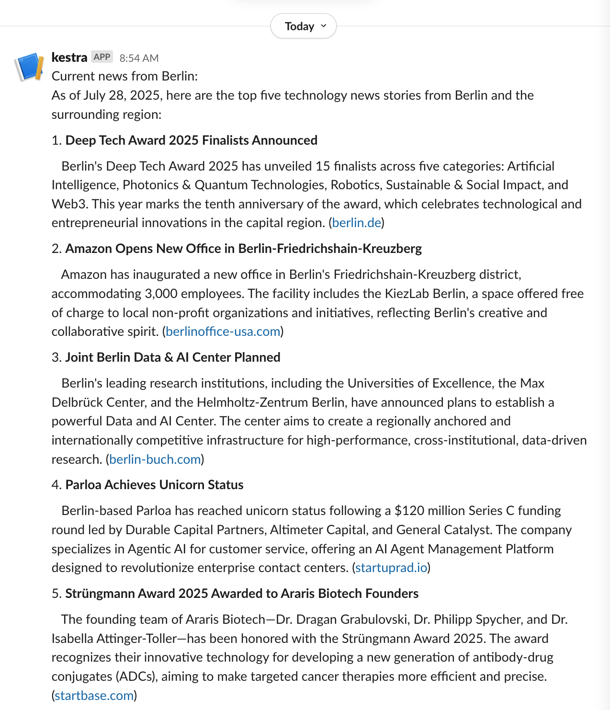
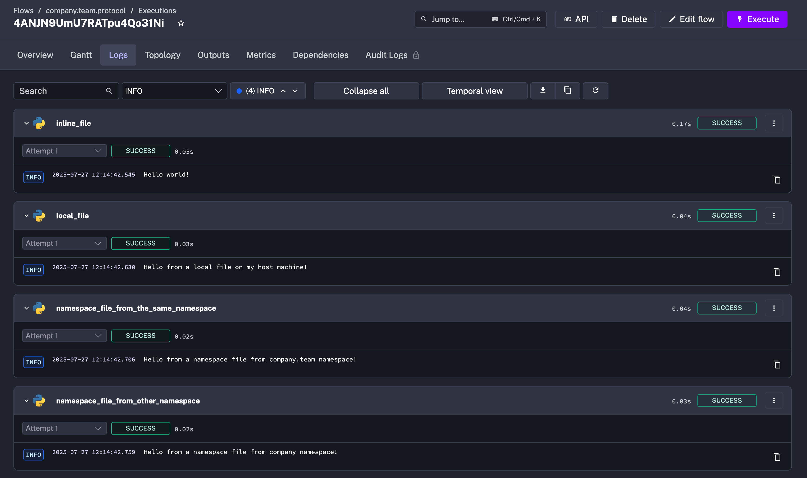
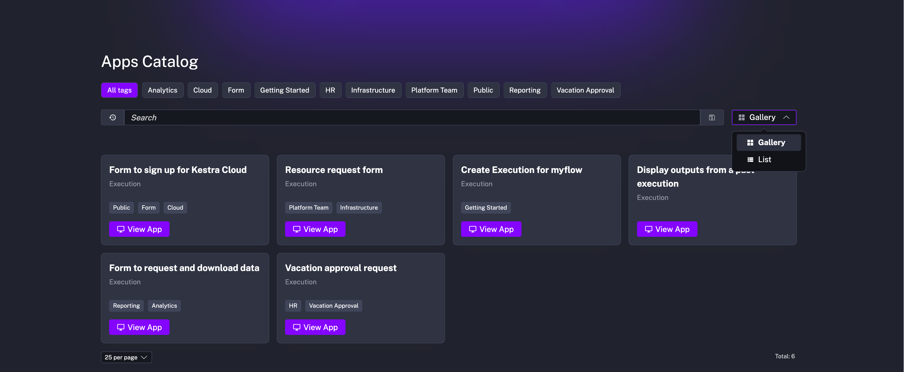

The table below highlights the key features of this release.

| Feature                               | Description                                                                     | Edition             |
|---------------------------------------|---------------------------------------------------------------------------------|---------------------|
| Playground (Beta)                     | Create workflows iteratively, one task at a time.                               | All Editions        |
| Task Caching                          | Cache the status and outputs of computationally expensive operations.           | All Editions        |
| Dynamic dropdowns                     | Make your dropdowns more dynamic with the new HTTP function.                    | All Editions        |
| Java, Python, JavaScript, and Go SDKs | Build on top of Kestra's API using the official language SDKs.                  | All Editions        |
| Kestra Plugin                         | Interact with Kestra's API directly from your tasks.                            | All Editions        |
| Improved Slack integration            | Send beautifully-formatted Slack updates with results from your tasks.          | All Editions        |
| New Execution dependency view         | Follow execution dependencies from the first parent to the last child flow      | All Editions        |
| CSV Export                            | Export tabular data from any dashboard into a CSV file for reporting            | All Editions        |
| New universal file protocol           | Leverage the new protocol for consistent access to local and namespace files    | All Editions        |
| Lots of new plugins!                  | New plugins for managing VMs, Notion, Mistral, Anthropic, Perplexity, and more. | All Editions        |
| Apps catalog                          | Showcase your Apps to the entire company in a new Catalog view.                 | Enterprise Edition  |
| Custom UI Links                       | Add custom UI links to the Kestra UI sidebar                                    | Enterprise Edition  |
| Unit Test Improvements                | Assert on execution outputs and view past test runs                             | Enterprise Edition  |
| Mandatory Authentication in OSS       | Secure your open-source instance with basich auth and a new login screen        | Open Source Edition |


Check the video below for a quick overview of all enhancements.

<div class="video-container">
  <iframe src="https://www.youtube.com/embed/0ziQFQYh1ow?si=__9sbqpB2gAuki0v" title="YouTube video player" allow="accelerometer; autoplay; clipboard-write; encrypted-media; gyroscope; picture-in-picture; web-share" referrerpolicy="strict-origin-when-cross-origin" allowfullscreen></iframe>
</div>


## Playground (Beta)

We're excited to introduce the new **Playground mode** in Kestra, which allows you to build workflows iteratively, one task at a time. This feature is especially useful when building data processing flows, where you typically start with a task extracting data, and you need to inspect the output before knowing what kind of transformation might be required. Then, you can work on that transformation task without having to rerun the extraction task again.

If you've ever worked with a Jupyter notebook, you might be familiar with this pattern: you run the first cell to extract data, then you run the second cell to transform that data, and you can rerun the second cell multiple times to test different transformations without having to rerun the first cell again. Kestra's Playground mode allows you to do the same within your flows.

**How does it work?**
1. Enable the Playground mode.
2. Add a task to your flow and hit "Play" to run it.
3. Add a second task and hit "Play" to run it, reusing the output of the first task.
4. Modify the second task and hit "Play" again to rerun only the second task.
5. Add a third task and hit "Play" to run it, reusing the outputs of the first and second tasks.
6. Keep iterating by adding more tasks and running them individually, or click on "Run all tasks" or "Run all downstream tasks" options to run multiple tasks at once.

Kestra tracks up to 10 recent playground runs, so you can go back to inspect the outputs of previously executed tasks. Older runs are purged automatically. Playground runs won't show up in the regular execution list to avoid confusion with production executions.

Note that Playground mode requires a DAG (Directed Acyclic Graph) structure. Therefore, you cannot run the second task before the first task has been played. Also, if you change the flow-level `inputs`, `variables`, `pluginDefaults`, or `outputs` properties while in Playground mode, the existing task runs will be automatically reset, and you will need to rerun them. Kestra does it to ensure that the outputs of the tasks are consistent with the flow-level properties.

To see Playground in action, check out the demo below.

<div style="position: relative; padding-bottom: calc(48.95833333333333% + 41px); height: 0; width: 100%;"><iframe src="https://demo.arcade.software/LjdQeZY6l0gVWb8zJ3PY?embed&embed_mobile=tab&embed_desktop=inline&show_copy_link=true" title="Playground Demo | Kestra" loading="lazy" webkitallowfullscreen mozallowfullscreen allowfullscreen allow="clipboard-write" style="position: absolute; top: 0; left: 0; width: 100%; height: 100%; color-scheme: light;" ></iframe></div>

:::alert{type="warning"}
Note that Playground mode is **currently in Beta**, and we welcome your feedback and suggestions for improvements. You can enable it directly from the Kestra UI from the **Settings** page simply by toggling on the `Playground` button:


:::


## Task Caching

The [new core task property](https://github.com/kestra-io/kestra/pull/10013) `taskCache` allows you to cache the status and outputs of computationally expensive operations. Tasks that benefit from caching include:
- tasks extracting large amounts of data
- tasks performing complex computations
- long-running scripts that don't need to be recomputed every time you run the flow.

When you enable task caching, Kestra will store the task's status and outputs in the database. If you run the same task again with the same inputs, Kestra will skip execution and return the cached outputs instead. This can significantly speed up your workflows and reduce resource consumption.

The syntax of the `taskCache` property is as follows:

```yaml
taskCache:
  enabled: true
  ttl: PT1H # Duration in ISO 8601 format, e.g., PT1H for 1 hour
```

Note how the `ttl` (time-to-live) property allows you to specify how long the cached outputs should be kept before they are purged. You can set it to any duration in ISO 8601 format, such as `PT1H` for 1 hour, `PT24H` for 24 hours, or `P7D` for 7 days.

Expand the block below for an example flow that caches the outputs of a computationally expensive task extracting a large dataset from a production database. The flow downloads the infrequently-changing data only once per day, caches it for 24 hours, and then uses it in subsequent tasks to join with frequently changing transaction data.

:::collapse{title="Example: Caching infrequently changing master data"}
```yaml
id: caching
namespace: company.team

tasks:
  - id: transactions
    type: io.kestra.plugin.core.http.Download
    uri: https://huggingface.co/datasets/kestra/datasets/resolve/main/csv/cache_demo/transactions.csv

  - id: products
    type: io.kestra.plugin.core.http.Download
    uri: https://huggingface.co/datasets/kestra/datasets/resolve/main/csv/cache_demo/products.csv
    description: This task pulls the full product catalog once per day. Because the catalog changes infrequently and contains over 200k rows, running it only once per day avoids unnecessary strain on a production DB, while ensuring downstream joins always use up-to-date reference data.
    taskCache:
      enabled: true
      ttl: PT24H

  - id: duckdb
    type: io.kestra.plugin.jdbc.duckdb.Query
    store: true
    inputFiles:
      products.csv: "{{ outputs.products.uri }}"
      transactions.csv: "{{ outputs.transactions.uri }}"
    sql: |-
      SELECT
        t.transaction_id,
        t.timestamp,
        t.quantity,
        t.sale_price,
        p.product_name,
        p.category,
        p.cost_price,
        p.supplier_id,
        (t.sale_price - p.cost_price) * t.quantity AS profit
      FROM
        read_csv_auto('transactions.csv') AS t
      JOIN
        read_csv_auto('products.csv') AS p
      USING (product_id);
```
:::


## Dynamic dropdowns powered by HTTP function

Kestra provides `SELECT` and `MULTISELECT` input types that turn into dropdown menus when executing the flow from the UI. To dynamically populate these dropdowns, you can use the `expression` property to fetch options from your KV Store using the `{{ kv(...) }}` function. However, this approach requires a scheduled flow that regularly updates the KV Store values to keep the dropdown menus fresh.

With the new HTTP function, you can now make these dropdowns dynamic by fetching options from an external API directly. This proves valuable when your data used in dropdowns changes very frequently, or when you already have an API serving that data for existing applications.

The example below demonstrates how to create a flow with two dynamic dropdowns: one for selecting a product category and another for selecting a product from that category. The first dropdown fetches product categories from an external HTTP API. The second dropdown makes another HTTP call to dynamically retrieve products that match your selected category.

<div style="position: relative; padding-bottom: calc(48.95833333333333% + 41px); height: 0; width: 100%;"><iframe src="https://demo.arcade.software/1WN2IkuzMdc3ex1YpBq0?embed&embed_mobile=tab&embed_desktop=inline&show_copy_link=true" title="Dynamic Inputs 2 | Kestra" loading="lazy" webkitallowfullscreen mozallowfullscreen allowfullscreen allow="clipboard-write" style="position: absolute; top: 0; left: 0; width: 100%; height: 100%; color-scheme: light;" ></iframe></div>

```yaml
id: dynamic_dropdowns
namespace: company.team

inputs:
  - id: category
    type: SELECT
    expression: "{{ http(uri = 'https://dummyjson.com/products/categories') | jq('.[].slug') }}"

  - id: product
    type: SELECT
    dependsOn:
      inputs:
        - category
    expression: "{{ http(uri = 'https://dummyjson.com/products/category/' + inputs.category) | jq('.products[].title') }}"

tasks:
  - id: display_selection
    type: io.kestra.plugin.core.log.Log
    message: |
      You selected Category: {{ inputs.category }}
      And Product: {{ inputs.product }}
```

Check out the video below to see how it works in action.

<div class="video-container">
  <iframe src="https://www.youtube.com/embed/4GbWKeYALQM?si=ECNteoA6M7d221sB" title="YouTube video player" allow="accelerometer; autoplay; clipboard-write; encrypted-media; gyroscope; picture-in-picture; web-share" referrerpolicy="strict-origin-when-cross-origin" allowfullscreen></iframe>
</div>

## Java, Python, JavaScript, and Go SDKs

We're excited to announce [the official Kestra SDKs](https://github.com/kestra-io/client-sdk) for Java, Python, JavaScript, and Go. These SDKs provide a convenient way to interact with Kestra's API and build custom applications on top of it.

To demonstrate how to use the SDKs, let's create a simple flow that logs a message. This example assumes you have a Kestra instance running and accessible via the `KESTRA_HOST` environment variable, along with your username and password set in a `.env` file, e.g.:

```
KESTRA_HOST=http://localhost:8080
KESTRA_USERNAME=admin@kestra.io
KESTRA_PASSWORD=Admin1234
```

First, create a virtual environment and install the Python SDK:

```bash
uv venv
source .venv/bin/activate
uv pip install kestrapy
uv pip install python-dotenv # For loading auth environment variables from the .env file
```

Now, you can use the following Python script to create or update a flow that logs a message:

```python
import kestra_api_client
from dotenv import load_dotenv
import os
import json

load_dotenv()

configuration = kestra_api_client.Configuration(
    host = os.environ.get("KESTRA_HOST"),
    username = os.environ.get("KESTRA_USERNAME"),
    password = os.environ.get("KESTRA_PASSWORD")
)

api_client = kestra_api_client.ApiClient(configuration)
api_instance = kestra_api_client.FlowsApi(api_client)

tenant = 'main'
flow_id = 'sdk'
namespace = 'demo'

body = f"""id: {flow_id}
namespace: {namespace}

tasks:
  - id: hello
    type: io.kestra.plugin.core.log.Log
    message: Hello from the SDK! 👋
"""

try:
    api_response = api_instance.create_flow(tenant, body)
    print(api_response)
except kestra_api_client.rest.ApiException as e:
    if e.status == 422 and "Flow id already exists" in json.loads(e.body).get("message", ""):
        try:
            api_response = api_instance.update_flow(flow_id, namespace, tenant, body)
            print(api_response)
        except ValueError:
            print("Flow updated successfully")
    else:
        print(e)
```

Check out the video below to see how it works in action.

<div class="video-container">
  <iframe src="https://www.youtube.com/embed/UJLGmolOagY?si=DFzlq7OO0FAINUmq" title="YouTube video player" allow="accelerometer; autoplay; clipboard-write; encrypted-media; gyroscope; picture-in-picture; web-share" referrerpolicy="strict-origin-when-cross-origin" allowfullscreen></iframe>
</div>

## Kestra plugin

Based on the newly introduced Java SDK, we created a [dedicated Kestra plugin](https://github.com/kestra-io/kestra/issues/2867) that allows you to interact with flows and namespaces via tasks. This plugin provides tasks to interact with Kestra's own metadata, such as listing all flows in a namespace or exporting flow definitions. To see it in action, you can use the following example flow that lists all namespaces and their flows, and then logs the output.

```yaml
id: kestra_plugin
namespace: company.team

tasks:
  - id: list_namespaces
    type: io.kestra.plugin.kestra.namespaces.List

  - id: loop
    type: io.kestra.plugin.core.flow.ForEach
    values: "{{ outputs.list_namespaces.namespaces }}"
    tasks:
      - id: list_flows
        type: io.kestra.plugin.kestra.flows.List
        namespace: "{{ taskrun.value }}"

  - id: log_output
    type: io.kestra.plugin.core.log.Log
    message: "{{ outputs.list_flows | jq('[.[] .flows[] | {namespace: .namespace, id: .id}]') | first }}"

pluginDefaults:
  - type: io.kestra.plugin.kestra
    values:
      kestraUrl: http://host.docker.internal:8080
      auth:
        username: admin@kestra.io # pass your Kestra username as secret or KV pair
        password: Admin1234 # pass your Kestra password as secret or KV pair
```

Check the video below to see how it works:

<div class="video-container">
  <iframe src="https://www.youtube.com/embed/RkVugo8wD80?si=6sPClrNQ1z3fehsd" title="YouTube video player" allow="accelerometer; autoplay; clipboard-write; encrypted-media; gyroscope; picture-in-picture; web-share" referrerpolicy="strict-origin-when-cross-origin" allowfullscreen></iframe>
</div>

## Improved Slack integration

The Slack plugin has been [enhanced](https://github.com/kestra-io/plugin-notifications/issues/227) to support sending well-formatted Slack updates with results from your tasks. The new `messageText` property in the `SlackIncomingWebhook` task accepts an arbitrary string, which can include markdown syntax with links, bold text or numbered lists — the plugin will render it without you having to worry about escaping special characters or manually constructing a JSON payload with Slack's blocks.

The example below demonstrates how to use the new `messageText` property to send a message with AI-generated news summaries to a Slack channel.

```yaml
id: fetch_local_news
namespace: company.team

inputs:
  - id: prompt
    type: STRING
    defaults: Summarize top 5 technology news from my region.
  - id: city
    type: STRING
    defaults: Berlin
  - id: country_code
    type: STRING
    defaults: DE

tasks:
  - id: news
    type: io.kestra.plugin.openai.Responses
    apiKey: "{{ secret('OPENAI_API_KEY') }}"
    model: gpt-4.1-mini
    input: "Today is {{ now() }}. {{ inputs.prompt }}"
    toolChoice: REQUIRED
    tools:
      - type: web_search_preview
        search_context_size: low  # low, medium, high
        user_location:
          type: approximate
          city: "{{ inputs.city }}"
          region: "{{ inputs.city }}"
          country: "{{ inputs.country_code }}"

  - id: send_via_slack
    type: io.kestra.plugin.slack.SlackIncomingWebhook
    url: "{{ secret('SLACK_WEBHOOK_URL') }}"
    messageText: "Current news from {{ inputs.city }}: {{ outputs.news.outputText }}"
```




## New Execution dependency view

The new Execution dependency view allows you to follow runtime dependencies from the first parent to the last child flow. It simplifies troubleshooting long execution chains by providing a clear overview of the relationships between each execution and those that precede or follow it.


## Listing all flow dependencies (EE only)

Speaking of flow dependencies, we've also added a [new backend endpoint](https://github.com/kestra-io/kestra-ee/pull/4308) `/api/v1/dependencies` that lists all flow dependencies across all namespaces in a tenant. This is useful for understanding how flows are interconnected on a tenant-level and can help you identify dependencies across different projects or teams.

When running Kestra locally, you can access the documentation for this endpoint at: http://localhost:8080/api#get-/api/v1/-tenant-/dependencies.

## CSV Export

The new [CSV Export](https://github.com/kestra-io/kestra/issues/9368) is a handy feature that allows you to export tabular data from any dashboard into a CSV file for reporting and daily operations. You can use it to analyze data in Excel or Google Sheets, or to share data with stakeholders who work with spreadsheets.


## New universal file protocol

Starting from 0.24, Kestra supports a new universal file protocol that simplifies how you can reference files in your flows. This new protocol allows more consistent and flexible handling of local and namespace files in your flows.

You can still reference files inline by defining the filename and its content directly in YAML, but you can now also use `nsfile:///` and `file:///` URIs to reference files stored as namespace files or on the host machine:
```yaml
id: protocol
namespace: company.team

tasks:
  - id: inline_file
    type: io.kestra.plugin.scripts.python.Commands
    inputFiles:
      hello.py: |
        x = "Hello world!"
        print(x)

  - id: local_file
    type: io.kestra.plugin.scripts.python.Commands
    inputFiles:
      hello.py: file:///scripts/hello.py

  - id: namespace_file_from_the_same_namespace
    type: io.kestra.plugin.scripts.python.Commands
    inputFiles:
      hello.py: nsfile:///scripts/hello.py

  - id: namespace_file_from_other_namespace
    type: io.kestra.plugin.scripts.python.Commands
    inputFiles:
      hello.py: nsfile://company/scripts/hello.py

pluginDefaults:
  - type: io.kestra.plugin.scripts.python.Commands
    values:
      taskRunner:
        type: io.kestra.plugin.core.runner.Process
      commands:
        - python hello.py
```



### Allowed paths

Note that to use the `file:///` scheme, you will need to bind-mount the host directory containing the files into the Docker container running Kestra, as well as set the `kestra.local-files.allowed-paths` configuration property to allow access to that directory. For example, if you want to read files from the `scripts` folder on your host machine, add the following to your `kestra.yml` configuration:

```yaml
  kestra:
    image: kestra/kestra:latest
    volumes:
      - /Users/yourdir/scripts:/scripts # Bind-mount the host directory
    ...
    environment: # Allow access to the /scripts directory in Kestra container
      KESTRA_CONFIGURATION: |
        kestra:
          local-files:
            allowed-paths:
              - /scripts
```

Keep in mind that if you see the following error:

```
java.lang.SecurityException: The path /scripts/hello.py is not authorized. Only files inside the working directory are allowed by default, other paths must be allowed either globally inside the Kestra configuration using the `kestra.local-files.allowed-paths` property, or by plugin using the `allowed-paths` plugin configuration.`.
```

It means that you have not configured the allowed paths correctly. Make sure that the host directory is bind-mounted into the container and that the `kestra.local-files.allowed-paths` configuration property includes the path to that directory.

### Protocol reference

Here is a reference of the new file protocol:
1. Use `file:///path/to/file.txt` to reference local files on the host machine from explicitly allowed paths.
2. Use `nsfile:///path/to/file.txt` to reference files stored in the current namespace. Note that this protocol uses three slashes after `nsfile://` to indicate that you are referencing a file in the current namespace. The namespace inheritance doesn't apply here, i.e. if you specify `nsfile:///path/to/file.txt` in a flow from `company.team` namespace and Kestra can't find it there, Kestra won't look for that file in the parent namespace, i.e. the `company` namespace, unless you explicitly specify the parent namespace in the path, e.g. `nsfile://company/path/to/file.txt`.
3. Use `nsfile://your.infinitely.nested.namespace/path/to/file.txt` to reference files stored in another namespace, provided that the current namespace has permission to access it. Note how this protocol uses two slashes after `nsfile://`, followed by the namespace name, to indicate that you are referencing a file in a different namespace. Under the hood, Kestra EE uses the Allowed Namespaces concept to check permissions to read that file.
4. Kestra also uses the `kestra:///` scheme for internal storage files. If you need to reference files stored in the internal storage, you can use `kestra:///path/to/file.txt` protocol.

### Usage with `read()` function

Note that you can also use the `read()` function to read namespace files or local files in tasks that expects a content rather than a path to a script or a SQL query. For example, if you want to read a SQL query from a namespace file, you can use the `read()` function as follows:

```yaml
id: query
namespace: company.team

tasks:
  - id: duckdb
    type: io.kestra.plugin.jdbc.duckdb.Query
    sql: "{{ read('nsfile:///query.sql') }}"
```

For local files on the host, you can use the `file:///` scheme:

```yaml
id: query
namespace: company.team

tasks:
  - id: duckdb
    type: io.kestra.plugin.jdbc.duckdb.Query
    sql: "{{ read('file:///query.sql') }}"
```

### Namespace Files as default FILE-type inputs

One of the benefits of this protocol is that you can now reference Namespace Files as default FILE-type inputs in your flows. See the example below that reads a local file `hello.txt` from the `company.team` namespace and logs its content.

```yaml
id: file_input
namespace: company.team

inputs:
  - id: myfile
    type: FILE
    defaults: nsfile:///hello.txt

tasks:
  - id: print_file_content
    type: io.kestra.plugin.core.log.Log
    message: "{{ read(inputs.myfile) }}"
```


## Apps catalog (EE only)

We've introduced a new Apps Catalog to the Enterprise Edition, which allows you to showcase your Apps to the entire company in a new list or gallery view. This feature is designed to help teams discover and share Apps, making it easier to build workflows and automate processes across the organization.



The Apps catalog is offered as a dedicated page without showing any typical Kestra UI elements, such as the sidebar or header. This makes it easy to share the catalog with non-technical users who may not be familiar with Kestra. The catalog is accessible via a dedicated URL in the format `http://your_host/ui/your_tenant/apps/catalog`, which can be shared with anyone in your organization who has at least `APP`-Read and `APPEXECUTION`-Read permissions in that Kestra tenant (adding all `APPEXECUTION` permissions is recommended).


## Custom UI Links (EE only)

In the Enterprise Edition, admins can add custom links that will be displayed in Kestra's UI sidebar. These links can point to internal documentation, support portals, or other relevant resources. You can set this up in your [Kestra configuration](../../docs/configuration/index.md) file as follows:

```yaml
kestra:
  ee:
    right-sidebar:
      custom-links:
        internal-docs:
          title: "Internal Docs"
          url: "https://kestra.io/docs/"
        support-portal:
          title: "Support portal"
          url: "https://kestra.io/support/"
```

The `kestra.ee.right-sidebar.custom-links` property is an arbitrary map, so you can name the link properties as you like (as long as each includes the `title` and `url` properties):

```yaml
kestra:
  ee:
    right-sidebar:
      custom-links:
        internal-docs:
          title: "Internal Docs"
          url: "https://kestra.io/docs/"
        support-portal:
          title: "Support Portal"
          url: "https://kestra.io/support/"
```

The links will show up in the sidebar, allowing users to quickly access important resources without leaving the Kestra UI.


## Unit Test Improvements (EE only)

The Unit Tests feature has been enhanced with several improvements, including the ability to assert on execution outputs and view past test runs.

To assert on execution outputs, use the `{{ execution.outputs.your_output_id }}` syntax in your test assertions. This allows you to verify that the outputs of your tasks match the expected values.

Assume you have a flow that outputs a value:
```yaml
id: flow_outputs_demo
namespace: company.team

tasks:
  - id: mytask
    type: io.kestra.plugin.core.output.OutputValues
    values:
      myvalue: kestra

outputs:
  - id: myvalue
    type: STRING
    value: "{{ outputs.mytask.values.myvalue }}"
```

You can then create a unit test for this flow that asserts the output value as follows:

```yaml
id: test_flow_outputs_demo
flowId: flow_outputs_demo
namespace: company.team

testCases:
  - id: flow_output
    type: io.kestra.core.tests.flow.UnitTest
    assertions:
      - value: "{{ execution.outputs.myvalue }}"
        equalTo: kestra
```

When you run this test, Kestra will execute the flow and verify that the output value matches the expected value. If the assertion fails, the test will be marked as failed, and you can inspect the execution logs to see what went wrong.


## Mandatory Authentication in OSS

In this release, we introduced a [mandatory login screen](../../docs/10.administrator-guide/basic-auth-troubleshooting/index.md) for the open-source version of Kestra to improve security. This means that all users must log in to access the Kestra UI and API, even if they are running Kestra locally or in a development environment.

This change is designed to prevent unauthorized access to your Kestra instance and ensure that only authenticated users can view and manage flows. The login screen requires a username and password.

If you haven't set up authentication yet, you will be prompted to do so when you first access the Kestra UI after upgrading to this version. For more details, check out the [migration guide](../../docs/11.migration-guide/v0.24.0/index.mdx).


## Plugin Enhancements

The 0.24 release includes many plugin enhancements, incl. new plugins and improvements to existing ones. Here are some highlights:

- (EE) [VMware](https://github.com/kestra-io/plugin-ee-vmware/) with the [following](https://github.com/kestra-io/kestra-ee/issues/3736) plugins for managing VMs:
    - `CreateVm`, `DeleteVm`, `ListVms`, `RebootVm`, `ResetVm`, `StartVm`, `StopVm`, `SuspendVm`, `UpdateVm` tasks for both ESXi and vCenter
    - `Trigger` for both ESXi and vCenter
    - `CreateVmSnapshot`, `DeleteVmSnapshot`, `ListVmSnapshots`, `RestoreVmFromSnapshot` for both ESXi and vCenter
    - `CloneTemplate`, `ConvertTemplateToVm`, `CloneVm`, `ConvertVmToTemplate` for vCenter only
- (EE) [Cyberark](https://github.com/kestra-io/kestra-ee/issues/3231) Secret Manager plugin
- (EE) [Salesforce](https://github.com/kestra-io/plugin-ee-salesforce/) plugin now has a new Trigger
- New [Notion](https://github.com/kestra-io/plugin-notion/) plugin with the tasks to `Create`, `Read`, `Update`, and `Archive` pages
- New [Sifflet](https://github.com/kestra-io/plugin-sifflet) plugin with a task to run specific Sifflet Rule
- New [Mistral](https://github.com/kestra-io/plugin-mistral) plugin with the `ChatCompletion` task
- New [Anthropic](https://github.com/kestra-io/plugin-anthropic) plugin with the `ChatCompletion` task
- New [Perplexity](https://github.com/kestra-io/plugin-perplexity) plugin with the `ChatCompletion` task
- New [Deepseek](https://github.com/kestra-io/plugin-deepseek) plugin with the `ChatCompletion` task
- New [Gemini](https://github.com/kestra-io/plugin-gemini) plugin with the `ChatCompletion` task
- New [Scripts](https://github.com/kestra-io/plugin-scripts) tasks (incl. both `Commands` and `Script`) for PHP, Perl, Lua, Deno, Groovy, and Bun
- New [Databricks](https://github.com/kestra-io/plugin-databricks/issues/116) task `DatabricksCLI` for running Databricks CLI commands

Check the video below to see the new language tasks in action.

<div class="video-container">
  <iframe src="https://www.youtube.com/embed/F9jLQbS4GS0?si=bv6kLjhh_d6GF4fV" title="YouTube video player" allow="accelerometer; autoplay; clipboard-write; encrypted-media; gyroscope; picture-in-picture; web-share" referrerpolicy="strict-origin-when-cross-origin" allowfullscreen></iframe>
</div>

Additionally, we have made numerous improvements to existing plugins, including better error handling, fixed bugs, and enhanced documentation. Expand the block below to see the full list of plugin improvements.

:::collapse{title="🧩 Improved Plugins"}
- (EE) [GCP](https://github.com/kestra-io/plugin-ee-gcp/): better output handling for the Google Batch task runner
- (EE) [Azure](https://github.com/kestra-io/plugin-ee-azure/): improved Azure Batch logs
- (EE) [Kubernetes](https://github.com/kestra-io/plugin-ee-kubernetes/): suppress noisy 400 errors on the Kubernetes task runner
- [Storage S3](https://github.com/kestra-io/storage-s3): allows listing and moving more than 1000 objects
- [Storage GCS](https://github.com/kestra-io/storage-gcs/): allows listing and moving more than 1000 objects
- [Scripts](https://github.com/kestra-io/plugin-scripts) with fixed documentation `python.Commands` (uv instead of Conda), and better support for Podman
- [JDBC](https://github.com/kestra-io/plugin-jdbc) with fixed or improved tasks: DuckDB Query, Snowflake Query, Oracle Query, MariaDB Query, improved PostgreSQL tests with SSL
- [Mongodb](https://github.com/kestra-io/plugin-mongodb) with fixed or improved tasks: `Find`
- [Elasticsearch](https://github.com/kestra-io/plugin-elasticsearch) with fixed or improved tasks: `Get`
- [AMQP](https://github.com/kestra-io/plugin-amqp/) with `Trigger` and `RealtimeTrigger`
- [Weaviate](https://github.com/kestra-io/plugin-weaviate/) with following fixed or improved tasks: `Query` and `Delete`
- [SurrealDB](https://github.com/kestra-io/plugin-surrealdb/) with following fixed or improved task: `Query`
- [Notifications](https://github.com/kestra-io/plugin-notifications) with fixed or improved tasks: `SlackIncomingWebhook`, `TelegramExecution`, `TelegramSend`, `MailSend`, `SlackExecution`, `TwilioExecution`, `TeamsExecution`, `DiscordExecution`
- [AI](https://github.com/kestra-io/plugin-ai/) (previously known as Langchain4J plugin ⚠️) with improved examples and indentation + Chat `Memory` support for RAG,`ChatCompletion`, `Classification` and `JSONStructuredExtraction` tasks
- [Ollama](https://github.com/kestra-io/plugin-ollama/) with model cache support for `OllamaCLI`
- [OpenAI](https://github.com/kestra-io/plugin-openai/) now uses the official OpenAI SDK (all tasks)
- [Serdes](https://github.com/kestra-io/plugin-serdes) with fixed or improved tasks: `IonToJson`, `ExcelToIon`
- [GCP](https://github.com/kestra-io/plugin-gcp) with fixed or improved tasks: `pubsub.Publish`,
`pubsub.Consume`, `bigquery.Query`
- [File System](https://github.com/kestra-io/plugin-fs) with fixed or improved tasks: `VfsService`, all `vfs` tasks
- [Kubernetes](https://github.com/kestra-io/plugin-kubernetes) with fixed or improved tasks: `PodCreate` and default `apiGroup` for `Apply`, `Delete` and `Get`
- [Compress](https://github.com/kestra-io/plugin-compress) with fixed or improved tasks: `ArchiveDecompress`
- [dbt](https://github.com/kestra-io/plugin-dbt) with fixed or improved tasks: `DbtCLI`, tasks using YAML DSL have been deprecated
- [Spark](https://github.com/kestra-io/plugin-spark) with fixed or improved tasks: `AbstractSubmit`
- [CloudQuery](https://github.com/kestra-io/plugin-cloudquery/) with fixed or improved tasks: `Sync`
- [Nats](https://github.com/kestra-io/plugin-nats/) with secure TLS support
- [Git](http://github.com/kestra-io/plugin-git/) with following fixed or improved tasks: `PushNamespaceFiles`, `AbstractSyncTask` + allow self hosted repo for most tasks
- [Template](https://github.com/kestra-io/plugin-template) with a bug fixed on doc/guides generation
:::


## Next Steps

This post highlighted the new features and enhancements introduced in Kestra 0.24.0. Which updates are most interesting to you? Are there additional capabilities you'd like to see in future releases? We welcome your feedback.

If you have any questions, reach out via [Slack](/slack) or open [a GitHub issue](https://github.com/kestra-io/kestra).

If you like the project, give us a [GitHub star](https://github.com/kestra-io/kestra) ⭐️ and join [the community](/slack).

Lastly, if you'd like to listen to a podcast episode discussing the new features, check out this episode of the Kestra Podcast:

<div class="video-container">
  <iframe width="560" height="315" src="https://www.youtube.com/embed/ZxrLNCgygBE?si=9oltgsOuMaFMRnLp" title="YouTube video player" allow="accelerometer; autoplay; clipboard-write; encrypted-media; gyroscope; picture-in-picture; web-share" referrerpolicy="strict-origin-when-cross-origin" allowfullscreen></iframe>
</div>
