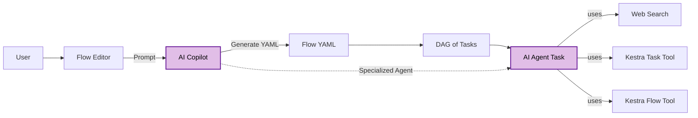
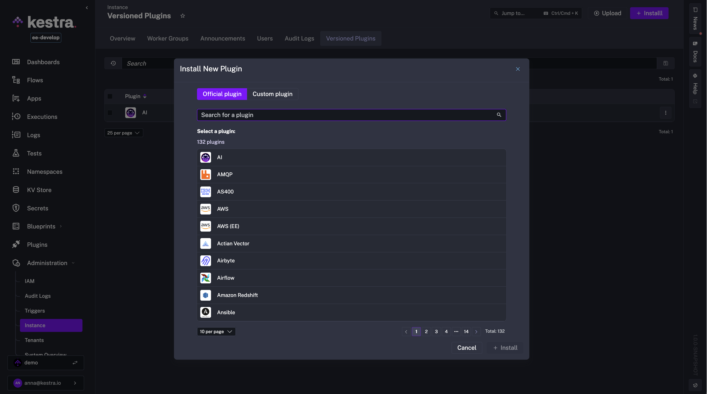
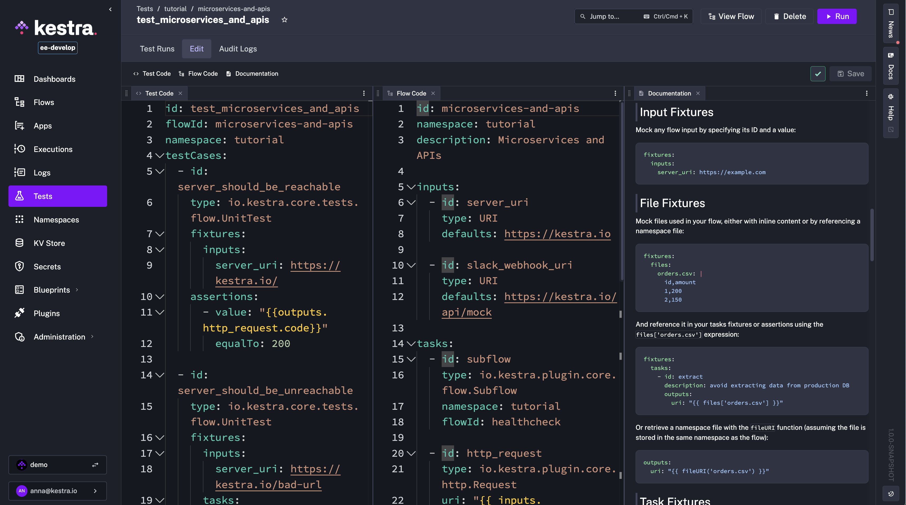

The table below highlights the key features of this release.

| Feature                             | Description                                                                                                              | Edition            |
|-------------------------------------|--------------------------------------------------------------------------------------------------------------------------|--------------------|
| AI Copilot                          | Generate and iteratively edit declarative flow code with AI-assisted suggestions.                                        | All Editions       |
| AI Agents                           | Add autonomous AI-driven tasks to flows that can think, remember, and dynamically orchestrate tools and tasks.           | All Editions       |
| AI-Powered Search on the website    | Search Kestra's documentation via natural language, powered by RAG and LLMs.                                             | All Editions       |
| Official Kestra MCP Server          | Connect Kestra to AI IDEs and agent frameworks via the Model Context Protocol.                                           | All Editions       |
| Dynamic Defaults for Flow Inputs    | Set default input values dynamically using Pebble expressions, based on other inputs or conditions.                      | All Editions       |
| New Dependency view                 | Redesigned Flow and Namespace Dependency view that scales to hundreds of nodes with improved navigation.                 | All Editions       |
| Playground (GA)                     | Iteratively build workflows by running tasks one at a time without re-executing the entire flow.                         | All Editions       |
| Flow-level SLA (GA)                 | Define SLA rules per workflow to enforce max duration or execution assertions, with automatic actions on breaches.       | All Editions       |
| New Helm Charts                     | Deploy Kestra with a production-ready Helm Chart with improved values, and cleaned-up dependencies.                      | All Editions       |
| New Git Sync integration            | Sync all Flows, Namespace Files, Apps, Unit Tests and Custom Dashboards with your Git repository using a single task.    | All Editions       |
| Plugin Versioning (GA)              | Run multiple versions of the same plugin in parallel, pin versions per workflow, and upgrade safely.                     | Enterprise Edition |
| Unit Tests (GA)                     | Add tests for your flows with improved UI, built-in documentation and dedicated tasks to run Unit Tests from your flows. | Enterprise Edition |
| Multi-Panel Editor for Apps & Tests | Multi-Panel editor for Unit Tests and Apps (now available also in the No-Code mode!).                                    | Enterprise Edition |
| Multiple SemVer tags                | Use v0.24 or v1.0 to always pull the latest patch (e.g., 0.24.4 or 1.0.0) without pinning the exact patch version.       | Enterprise Edition |

Check the video below for a quick overview of all enhancements:

<div class="video-container">
  <iframe src="https://www.youtube.com/embed/FpKuP3Y8uuM?si=T2RUT5fsfdYZ1wQD" title="YouTube video player" allow="accelerometer; autoplay; clipboard-write; encrypted-media; gyroscope; picture-in-picture; web-share" referrerpolicy="strict-origin-when-cross-origin" allowfullscreen></iframe>
</div>


---

## AI Copilot

We're excited to announce the **AI Copilot** in Kestra 1.0, designed to help you build and modify flows directly from natural language prompts. Simply describe what you want to accomplish and Copilot will generate the YAML flow code for you. Once your initial flow is created, you can iteratively refine it with Copilot's help, adding new tasks or adjusting triggers without touching unrelated parts of the flow. The AI Copilot gives you the speed and convenience of AI while keeping everything as code in Kestra's declarative syntax.

How to get started? Click on the **AI Copilot** button in the top right corner of the Flow Editor, and you can start typing your prompt, e.g. `"Make a REST API call to https://kestra.io/api/mock and allow failure"`. The AI Copilot will generate the YAML code for you, which you can then accept, reject, or modify as needed.

<div style="position: relative; padding-bottom: calc(48.95833333333333% + 41px); height: 0; width: 100%;"><iframe src="https://demo.arcade.software/kvO69FrLnnXVsMkrLi7T?embed&embed_mobile=tab&embed_desktop=inline&show_copy_link=true" title="Flows | Kestra EE" loading="lazy" webkitallowfullscreen mozallowfullscreen allowfullscreen allow="clipboard-write" style="position: absolute; top: 0; left: 0; width: 100%; height: 100%; color-scheme: light;" ></iframe></div>


Check the video below for a demo of how to use AI Copilot:

<div class="video-container">
  <iframe src="https://www.youtube.com/embed/nNEb5DZB-xo?si=XUmI_BG4MulVamd2" title="YouTube video player" allow="accelerometer; autoplay; clipboard-write; encrypted-media; gyroscope; picture-in-picture; web-share" referrerpolicy="strict-origin-when-cross-origin" allowfullscreen></iframe>
</div>


---

## AI Agents

To simplify orchestration, Kestra 1.0 introduces **AI Agents**, a new way to bring autonomy and adaptability to your workflows. With AI Agents, workflows are no longer limited to a predefined sequence of tasks. An AI Agent task launches an autonomous process with the help of an LLM, memory, and tools such as web search, task execution, and flow calling, and can dynamically decide which actions to take and in what order. Unlike traditional flows, an AI Agent can loop tasks until a condition is met, adapt to new information, and orchestrate complex multi-step objectives on its own. This enables agentic orchestration patterns in Kestra, where agents can operate independently or collaborate in multi-agent systems, all while remaining fully observable and manageable in code.

To start using this feature, you can add an **AI Agent** task to your flow. The AI Agent will then use the tools you provide to achieve its goal, leveraging capabilities such as web search, task execution, and flow calling. Thanks to memory, your AI Agent can remember information across executions to provide context for subsequent prompts.

<div style="position: relative; padding-bottom: calc(48.95833333333333% + 41px); height: 0; width: 100%;"><iframe src="https://demo.arcade.software/KL8TVCdgVc4nS5OTS6VS?embed&embed_mobile=tab&embed_desktop=inline&show_copy_link=true" title="AI Agent 3 | Kestra" loading="lazy" webkitallowfullscreen mozallowfullscreen allowfullscreen allow="clipboard-write" style="position: absolute; top: 0; left: 0; width: 100%; height: 100%; color-scheme: light;" ></iframe></div>


The video below shows how to use AI Agents in Kestra:

<div class="video-container">
  <iframe src="https://www.youtube.com/embed/osrS9mi5-eg?si=POI9pQyGefA0RhjQ" title="YouTube video player" allow="accelerometer; autoplay; clipboard-write; encrypted-media; gyroscope; picture-in-picture; web-share" referrerpolicy="strict-origin-when-cross-origin" allowfullscreen></iframe>
</div>


---

### Why AI Copilot and AI Agents?

At Kestra, we see **AI Copilot** and **AI Agents** as a natural evolution of automation and orchestration:

- **From YAML to natural language** – instead of manually defining every workflow step in YAML, you can now describe your intent in plain English (or any natural language). The AI Copilot, powered by an AI Agent under the hood, translates that into declarative code you can run, review, and edit.
- **From static workflows to autonomous agents** – with AI Agents, you don't need to predefine the exact sequence of steps. Simply connect the tools you use, set a goal, and let the agent decide how to achieve it by orchestrating tasks until the objective is met.

The new AI features preserve the benefits of **declarative, code-based orchestration** in Kestra, while eliminating the need to write code for each individual action.



---

## AI-Powered Search

With Kestra 1.0, we've also added AI-powered search on the Kestra website, bringing more relevant and contextual answers right where you need them. Built on top of the same AI plugin used by AI Agents, this feature leverages Retrieval-Augmented Generation (RAG) to ground responses in the official Kestra documentation. You can ask questions in natural language, such as "How do I configure a flow schedule?", and the search will return a summary based on the most relevant docs so you don't have to manually scan through multiple pages.


---

## Official Kestra MCP Server

As part of the same release, we're excited to introduce the [Kestra MCP Server](https://github.com/kestra-io/mcp-server-python), making it possible to connect Kestra directly to AI-powered IDEs and agent frameworks that support the [Model Context Protocol (MCP)](https://modelcontextprotocol.io/). This allows various AI agents to interact with your Kestra environment through a rich set of tools, such as listing flows, running executions, or managing namespace files.

The MCP Server can be run locally or in Docker, and works with both OSS and Enterprise editions. This integration opens the door for tighter collaboration between AI assistants and Kestra, enabling natural language control of your workflows and orchestration platform.


:::collapse{title="Expand to see an example of how to use our MCP server as a tool in Kestra's AI Agents."}
```yaml
id: kestra_mcp_server
namespace: company.ai

inputs:
  - id: prompt
    type: STRING
    defaults: List namespaces

tasks:
  - id: agent
    type: io.kestra.plugin.ai.agent.AIAgent
    systemMessage: You are an autonomous operator. Complete the task end-to-end without asking the user any questions.
    prompt: "{{ inputs.prompt }}"
    provider:
      type: io.kestra.plugin.ai.provider.OpenAI
      modelName: gpt-5-mini
      apiKey: "{{ secret('OPENAI_API_KEY') }}"
    tools:
      - type: io.kestra.plugin.ai.tool.DockerMcpClient
        image: ghcr.io/kestra-io/mcp-server-python:latest
        env:
          KESTRA_BASE_URL: http://host.docker.internal:8080/api/v1
          KESTRA_TENANT_ID: main
          KESTRA_MCP_DISABLED_TOOLS: ee
          KESTRA_USERNAME: admin@kestra.io
          KESTRA_PASSWORD: "{{ secret('KESTRA_PASSWORD') }}"
```
:::

---

## Dynamic Defaults for Flow Inputs

Starting with Kestra 1.0, you can now dynamically define default values for flow inputs using Pebble expressions. Instead of a static assignment, your input `defaults` can be dynamically computed based on other input values or conditional logic. For example, you could set a default value for `backup_enabled` to `true` only when `release_env` is `PROD`, and `false` otherwise:

```yaml
id: infrastructure_workflow
namespace: company.team

inputs:
  - id: release_env
    displayName: Release Environment
    type: SELECT
    autoSelectFirst: true
    values:
      - DEV
      - TEST
      - QA
      - PROD

  - id: backup_enabled
    type: BOOL
    defaults: "{{ inputs.release_env == 'PROD' ? true : false }}"
    dependsOn:
      inputs:
        - release_env

tasks:
  - id: log
    type: io.kestra.plugin.core.log.Log
    message: dynamic default {{ inputs.backup_enabled }}
```

Note also the new `autoSelectFirst` property, which automatically pre-selects the first option for `SELECT` and `MULTISELECT` inputs.

---

## New Dependency View

Kestra 1.0 ships with a **new and improved Flow and Namespace Dependency view**, which is built to scale, allowing you to explore even the most complex flows with hundreds of upstream and downstream nodes without performance issues. The redesigned interface combines a clear directional graph with an integrated table view, making it easier to understand data flow, trace dependencies, and navigate directly to related nodes. This view provides complete visibility into all relationships across your flows, from a small number of interdependent workflows to complex dependency chains.

---

## Playground (GA)

We're excited to announce that **Playground** is now **generally available** and enabled by default starting in Kestra 1.0. Playground lets you build workflows iteratively, one task at a time, without having to rerun the entire flow. While the setting to disable Playground still exists, we recommend keeping it enabled to take full advantage of this interactive workflow creation experience.

With Playground, you can execute individual tasks in sequence, reusing outputs from earlier steps without re-executing them. This is especially helpful when working with data processing flows: start with an extraction task, inspect its output, then add transformation tasks and run them independently, just like working in a Jupyter notebook. Kestra tracks up to 10 recent Playground runs for quick review, and these runs remain separate from production executions to keep your execution history clean.

In summary, Playground gives you a safe, iterative space to prototype new workflows before running them in production.


The video below shows how to use Playground to build a flow step by step:

<div class="video-container">
  <iframe src="https://www.youtube.com/embed/p7UXd66GI1M?si=uoOlWJXedBnsrj1N" title="YouTube video player" allow="accelerometer; autoplay; clipboard-write; encrypted-media; gyroscope; picture-in-picture; web-share" referrerpolicy="strict-origin-when-cross-origin" allowfullscreen></iframe>
</div>

---

## Plugin Versioning (GA)

After months of development, Kestra 1.0 delivers **Plugin Versioning** in General Availability to all Enterprise Edition customers, with significant enhancements since the initial release. This feature lets you run multiple versions of the same plugin side by side, pin tasks to specific plugin versions, and adopt new plugin versions at your own pace while keeping production flows stable.

Since its Beta release, we've extended Plugin Versioning to work with **plugin defaults**, **internal storage**, and **secret managers**. The flow editor now includes **auto-completion for the `version` property**, making it easier to specify versions directly in YAML. We've also improved the Plugins API so you can fetch only plugins compatible with your current Kestra version thanks to a new `X-Kestra-Minimal-Core-Version` attribute in plugin manifests. Finally, all actions on versioned plugins, such as installing or uninstalling, are now recorded in **Audit Logs** for full traceability.

Any new or updated plugin version is instantly synchronized across your environment without downtime, ensuring you can upgrade safely and keep full control over your plugin ecosystem.




---

## Unit Tests (GA)

To further improve the reliability of your flows, Kestra 1.0 brings Unit Tests out of Beta for Enterprise Edition and Kestra Cloud customers, with significant UI enhancements. Unit Tests let you validate your flows in isolation, using fixtures to mock inputs, files, and task outputs, and assertions to check expected behavior without impacting production data or cluttering your main execution history.

Since the initial release, we've redesigned the Unit Tests UI to show the test definition, flow code, and documentation side by side, making it easier to write and maintain tests. New UI tabs allow you to track all Test Runs and related Audit Logs.



You can now also run tests programmatically from a flow using the new `RunTest` and `RunTests` tasks. This allows you to trigger tests on demand for:
- all tests in a given **tenant**,
- all tests from a specific **namespace** or **flow**,
- a specific test suite by ID, or even selected test cases.

Using those new tasks, you can run tests automatically on schedule or after deploying a new release.

```yaml
id: run_tests
namespace: system

tasks:
  - id: run_all_tests
    type: io.kestra.plugin.kestra.ee.tests.RunTests
    auth:
      apiToken: "{{ secret('KESTRA_API_TOKEN') }}"

triggers:
  - id: schedule
    type: io.kestra.plugin.core.trigger.Schedule
    cron: "0 9 * * 1-5" # every weekday at 9am
```

These enhancements make it easier to ensure your flows stay reliable as they evolve from checking a single change to running large-scale regression suites on a schedule.

---

## Flow-Level SLA (GA)

The **Flow-level SLAs**, introduced in 0.20, are now also **generally available** in Kestra 1.0. This feature lets you define **Service Level Agreements** directly in your flows, specifying what should happen when an execution runs longer than expected or fails to meet certain conditions. SLAs can be set to automatically cancel, fail, or simply label an execution when breached, allowing you to enforce reliability standards at the workflow level.

Since the Beta launch, we've battle-tested SLAs for production use to enforce execution guarantees for your mission-critical workflows.

Here is an example of how to define a Flow-level SLA that cancels the execution if it runs longer than 8 hours and labels it for easy tracking and alerting:

```yaml
id: sla_example
namespace: company.team

sla:
  - id: maxDuration
    type: MAX_DURATION
    duration: PT8H
    behavior: CANCEL
    labels:
      sla: miss
      reason: durationExceeded

tasks:
  - id: start
    type: io.kestra.plugin.core.log.Log
    message: "Workflow started, monitoring SLA compliance."

  - id: long_task
    type: io.kestra.plugin.core.flow.Sleep
    duration: PT9H
```

---

## No-Code Multi-Panel Editor for Apps

Kestra 1.0 introduces a **No-Code Multi-Panel Editor for Apps**, bringing the same powerful no-code and split-screen editing experience we introduced for flows in 0.23 to **App development**. This feature allows you to build and customize Apps directly from the UI, even if you're not proficient in writing the declarative YAML that defines them.

Traditionally, Apps in Kestra are defined as code, specifying layout blocks and UI interactions in YAML. With the new editor, you can create these elements visually from form-based tabs, while still having the option to open the corresponding code panel to see the generated YAML code in real time. You can switch between **App Code** and **No-Code** panels, see live App preview, and reference documentation or examples without leaving the editor.

Just like with the multi-panel Flow Editor, you can open, reorder, and close any combination of panels (incl. No-Code, App Code, Documentation, Preview and Blueprints) to build a personalized workspace. The No-Code form editor simplifies the creation of complex App layouts, making it easier to design interactive Apps for internal tools, dashboards, or data request forms without needing to start from raw YAML.


---

## New Helm Charts for Flexible and Production-Ready Deployments

To help you deploy Kestra more easily, we're introducing new Helm Charts in Kestra 1.0 with expanded capabilities, important fixes, and a more production-friendly architecture.

Key improvements include:
 - **Dedicated Charts** — three charts are now available:
   - `kestra` — production-ready, without embedded dependencies (connect to managed services such as RDS, S3, or Kafka).
   - `kestra-starter` — includes PostgreSQL and MinIO for quick proof-of-concept or development use.
   - `kestra-operator` — provides operator-level functionality for advanced setups.
- **Expanded Configuration** — new `common` and `deployments` entries in `values.yaml` give consistent and granular control over scheduling, tolerations, volumes, and environment variables.
- **Simplified Custom Configurations** — configuration and secrets are now managed under a unified `configurations` entry, removing the need for `configurationPath`.
- **Native Basic Auth Support** — no more workarounds; configure directly via Helm values.
- **Custom Probes** — support for TCP and other readiness/liveness checks beyond fixed HTTP probes.
- **Improved Storage Options** — support for ephemeral PVCs on Workers to avoid node disk limits.
- **Fixes & Enhancements** — addressed `nameOverride`, `securityContext`, secret handling, and `appVersion` auto-updates.
- **Priority Class Support** — configure `priorityClassName` for Workers to reduce interruptions on long-running workflows.

These changes make it easier to:
- Start quickly with `kestra-starter` chart for development or PoCs.
- Scale to production with `kestra` chart connected to a managed database and object storage.
- Customize your deployments.

The new Helm Charts remove friction for both quick evaluations and production-ready deployments. Check the [migration guide](../../docs/11.migration-guide/v1.0.0/helm-charts/index.md) for details on moving from the old chart to the new ones.

---

## UI & Usability Improvements

We've made a series of smaller but impactful user experience improvements in Kestra 1.0 to streamline day-to-day operations:

- **Inherited KV Pairs** – the KV Store now includes a new **"Inherited KV pairs"** button, showing keys inherited from parent namespaces. This is powered by a new `GET /api/v1/{tenant}/namespaces/{namespace}/kv/inheritance` endpoint, making it easier to trace KV pairs stored in multiple namespaces.

- **Namespace Context in the Flow Editor** – The Flow Editor now has a **Namespace Context** panel showing all **Variables, KV pairs, and Secrets** available to the flow you're editing. A **Render expression** button lets you preview and debug Pebble expressions (e.g., KV or namespace variable lookups) directly in the editor before execution starts.

- **Replay with Edited Inputs** – You can now change the value of a flow's inputs before starting a Replay, which is especially useful for workflows with long-running or computationally expensive tasks.

- **Animated Topology View** – The Flow Topology view now clearly displays the direction of data flow between tasks with animated arrows and at runtime, each task node shows more clearly its current status (running, succeeded, failed) with color-coded borders.

---

## Core Tasks

Kestra 1.0 introduces several new core tasks to simplify your workflows.

### Task to Kill Executions

[New task](https://github.com/kestra-io/plugin-kestra/pull/31) that will kill an execution and optionally also child executions if `propagateKill` is set to `true`:

```yaml
id: conditional_kill
namespace: company.team

inputs:
  - id: shouldKill
    type: boolean
    defaults: false

tasks:
  - id: subflow
    type: io.kestra.plugin.core.flow.Subflow
    flowId: child
    namespace: demo
    wait: false

  - id: kill
    type: io.kestra.plugin.kestra.executions.Kill
    runIf: "{{ inputs.shouldKill == true }}"
    propagateKill: true
```


### Task to Purge Expired KV Objects

The new `PurgeKV` core task addresses the issue of expired KV entries not being removed from object storage, such as S3 or GCS. Over time, expired keys can accumulate and occupy significant storage space, even though they are no longer accessible from Kestra.

With the `PurgeKV` task, you can set up a system flow that runs periodically to clean up expired objects from both:
- Object storage (e.g., S3, GCS)
- Kestra's metadata database.

You can configure it to target specific namespaces or keys using glob patterns and optionally include child namespaces. Example:

```yaml
id: purge_kv_store
namespace: system

tasks:
  - id: purge_kv
    type: io.kestra.plugin.core.kv.PurgeKV
    expiredOnly: true

triggers:
  - id: daily
    type: io.kestra.plugin.core.trigger.Schedule
    cron: "0 9 * * *" # every day at 9am
```

By default, the task purges only expired keys from all namespaces, but you can narrow it down to specific patterns. This task can guarantee that your Kestra KV Store remains clean and doesn't incur unnecessary storage costs.

---


## Plugin Enhancements

The 1.0 release includes many plugin enhancements, including new plugins and improvements to existing ones.

### Git Sync Plugins: TenantSync and NamespaceSync

We've introduced two new Git Sync plugins to give you full control over synchronizing Kestra objects with your Git repository:

- **`TenantSync`** – synchronizes **all namespaces** in a tenant, including flows, files, apps, tests, and dashboards.
  - Requires `kestraUrl` and `auth` properties for validation of tenant-wide RBAC.
  - Useful to easily sync all objects in a tenant, allowing to backup the complete tenant state to Git and move between environments via a pull request to a different branch.

- **`NamespaceSync`** – synchronizes objects within a **single namespace** with your Git repository.
  - Requires the `namespace` property but does not require `kestraUrl` and `auth` - it relies on namespace-level RBAC and can be run by any user with sufficient permissions.
  - Ideal for teams that sync one namespace per Git repository, allowing delegation of sync responsibilities to namespace owners.

Both plugins support:
- `sourceOfTruth` (either `GIT` or `KESTRA`) to define the update strategy.
- `whenMissingInSource` with options `DELETE`, `KEEP`, or `FAIL` to control how missing objects should be handled.
- An **opinionated folder structure** for flows, apps, dashboards, tests, and files with one folder per namespace.
- `protectedNamespaces` to ensure your Kestra objects from critical namespaces (such as `system`) are not accidentally deleted when `sourceOfTruth` is `GIT`.
- Validation rules requiring explicit Git `branch` and optional `gitDirectory`.
- Options like `dryRun` and `onInvalidSyntax` for safe rollouts and error handling.

Example usage of the `TenantSync` task:

```yaml
id: tenant_git_sync
namespace: system

tasks:
  - id: tenant
    type: io.kestra.plugin.git.TenantSync
    sourceOfTruth: KESTRA
    whenMissingInSource: DELETE
    url: https://github.com/org/repo
    branch: main
    protectedNamespaces:
      - system
    kestraUrl: http://localhost:8080
    auth:
      username: admin@kestra.io
      password: "{{ secret('KESTRA_PASSWORD') }}"
```

Example usage of the `NamespaceSync` task:

```yaml
id: namespace_git_sync
namespace: system

tasks:
  - id: namespace
    type: io.kestra.plugin.git.NamespaceSync
    namespace: company.team
    sourceOfTruth: GIT
    whenMissingInSource: KEEP
    url: https://github.com/org/repo
    branch: main
    protectedNamespaces:
      - system
```


### GitLab Plugin

The new GitLab plugin lets your flows interact with GitLab using its REST API. Use it to search issues, open new issues, and create merge requests as part of your pipelines.

The available tasks include:
- `Create` (issues) to open a new issue with title, description, and labels
- `Search` (issues) to find issues by state and labels
- `MergeRequest` to open a merge request between branches.

The example below creates an issue:

```yaml
id: gitlab_create_issue_example
namespace: company.team

tasks:
  - id: create_issue
    type: io.kestra.plugin.gitlab.issues.Create
    url: https://gitlab.example.com
    token: "{{ secret('GITLAB_TOKEN') }}"
    projectId: "123"
    title: "Bug report"
    issueDescription: "Found a critical bug"
    labels:
      - bug
      - critical
```

### Supabase Plugin

We've also added a new Supabase plugin to interact with Supabase Postgres using the REST API and RPC.

The available tasks include:
- `Select` to read rows with filters, sorting, and pagination
- `Insert`, `Update`, `Delete` to modify data
- `Query` (RPC) to call stored procedures.

The example below selects active users from a table:

```yaml
id: supabase_select_example
namespace: company.team

tasks:
  - id: select_active_users
    type: io.kestra.plugin.supabase.Select
    url: https://your-project.supabase.com
    apiKey: "{{ secret('SUPABASE_API_KEY') }}"
    table: users
    select: "id,name,email,created_at"
    filter: "status=eq.active"
    order: "created_at.desc"
    limit: 50
```

### Trivy CLI Plugin

The new [Trivy CLI](https://trivy.dev/latest/) plugin can scan a Docker image for vulnerabilities:

```yaml
id: trivy_cli_image
namespace: company.team

tasks:
  - id: trivy_image
    type: io.kestra.plugin.trivy.cli.TrivyCLI
    commands:
      - trivy image --format json nginx:latest
```

---

## Next Steps

This post highlighted the new features and enhancements introduced in Kestra 1.0. Which updates are most interesting to you? Are there additional capabilities you'd like to see in future releases? We welcome your feedback. You can also learn more about this release in our latest podcast episode:

<div class="video-container">
  <iframe src="https://www.youtube.com/embed/KXmvXAmNx5c?si=u-Jxo70O9lT-4Rte" title="YouTube video player" allow="accelerometer; autoplay; clipboard-write; encrypted-media; gyroscope; picture-in-picture; web-share" referrerpolicy="strict-origin-when-cross-origin" allowfullscreen></iframe>
</div>

---

If you like the project, give us a [GitHub star](https://github.com/kestra-io/kestra) ⭐️.

For questions or feedback, join [our Slack community](/slack) or open an issue on GitHub.
