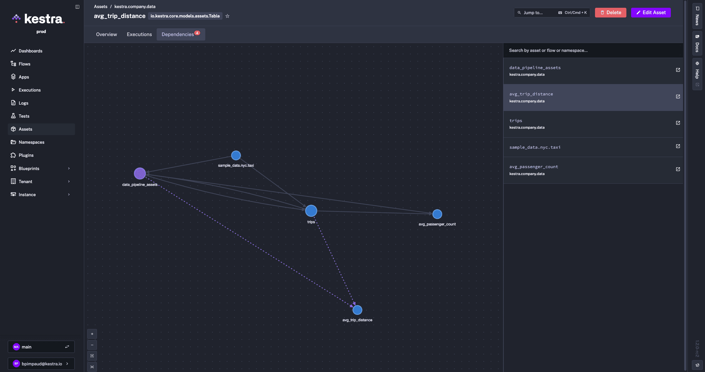
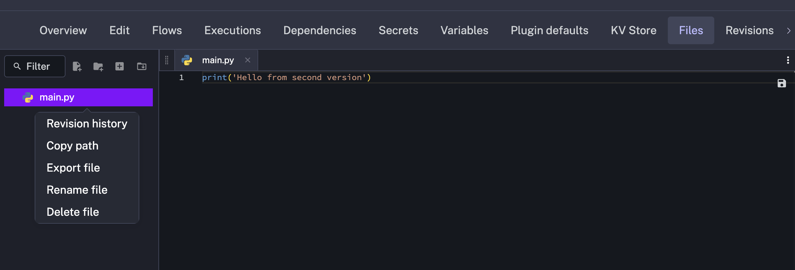

Following user feedback, we've introduced enterprise-grade Asset management, Templated Custom Blueprints, comprehensive Revision History for Namespace Files, and the ability to run Concurrent Executions from any trigger.

The table below highlights the key features of this release.

| Feature | Description | Edition |
|---|---|---|
| Assets | Maintain a stateful inventory of external resources (table, VMs, etc.) with identity and metadata for unified resource management and workflow reactivity | Enterprise Edition |
| Templated Custom Blueprints | Create new flows from templates by filling in templated values, allowing business users to generate complete workflows without boilerplate | Enterprise Edition |
| Revision History for Namespace Files | Track and restore previous versions of namespace files with comprehensive revision history | All Editions |
| Checks Feature | Add validation checks to prevent execution creation when specified conditions aren't met | All Editions |
| Concurrent Execution for Trigger | Enable multiple concurrent executions to be triggered simultaneously from any trigger type | All Editions |
| New Design for the Execution Overview Page | Redesigned execution overview page with improved layout, better spacing, and organized sections | All Editions |


Check the video below for a quick overview of all enhancements.

<div class="video-container">
  <iframe src="https://www.youtube.com/embed/k_iOLFYyiuM?si=9XLh0_eCQtxoxCc6" title="Kestra 1.2 Overview" allow="accelerometer; autoplay; clipboard-write; encrypted-media; gyroscope; picture-in-picture; web-share" referrerpolicy="strict-origin-when-cross-origin" allowfullscreen></iframe>
</div>

## Assets

Kestra 1.2 introduces Assets, a powerful new Enterprise Edition feature that maintains a stateful inventory of external resources (tables, VMs, databases, inventory, etc.) that workflows interact with.

Assets are declared directly in your workflow tasks, establishing clear relationships between resources and the workflows that manage them. Each asset has a unique identity (`id`), a type, and optional metadata for categorization and filtering.

In your workflows, you declare assets as inputs and outputs at the task level:

- **Input Assets** - Resources that a task consumes or reads from
- **Output Assets** - Resources that a task creates, modifies, or writes to

This declaration automatically creates the asset in Kestra's inventory and establishes dependency relationships. The system tracks which workflows and executions interact with each asset, providing complete lineage and traceability.


Here's a more complete example showing how assets enable data pipeline orchestration with automatic dependency tracking:


```yaml
id: data_pipeline_assets
namespace: kestra.company.data

tasks:
  - id: create_staging_layer_asset
    type: io.kestra.plugin.jdbc.duckdb.Query
    sql: |
      CREATE TABLE IF NOT EXISTS trips AS
      select VendorID, passenger_count, trip_distance from sample_data.nyc.taxi limit 10;
    assets:
      inputs:
        - id: sample_data.nyc.taxi
      outputs:
        - id: trips
          namespace: "{{flow.namespace}}"
          type: io.kestra.plugin.ee.assets.Table
          metadata:
            model_layer: staging

  - id: for_each
    type: io.kestra.plugin.core.flow.ForEach
    values:
      - passenger_count
      - trip_distance
    tasks:
      - id: create_mart_layer_asset
        type: io.kestra.plugin.jdbc.duckdb.Query
        sql: SELECT AVG({{taskrun.value}}) AS avg_{{taskrun.value}} FROM trips;
        assets:
          inputs:
            - id: trips
          outputs:
            - id: avg_{{taskrun.value}}
              type: io.kestra.plugin.ee.assets.Table
              namespace: "{{flow.namespace}}"
              metadata:
                model_layer: mart
pluginDefaults:
  - type: io.kestra.plugin.jdbc.duckdb
    values:
      url: "jdbc:duckdb:md:my_db?motherduck_token={{ secret('MOTHERDUCK_TOKEN') }}"
      fetchType: STORE
```

This workflow demonstrates:
- **External Asset Reference** - `sample_data.nyc.taxi` is referenced as an input, representing an external data source
- **Staging Layer Creation** - The `trips` table is created and registered as an Table type asset with `model_layer: staging` metadata
- **Mart Layer Generation** - Multiple mart tables (`avg_passenger_count`, `avg_trip_distance`) are created from the staging layer
- **Automatic Dependency Graph** - Kestra automatically tracks that mart tables depend on the staging table, which depends on the external source


The Assets UI provides an interactive dependency graph visualizing upstream and downstream relationships, complete execution history tracking for each asset, and a unified inventory searchable by namespace, type, or metadata.




You can also automatically populate dropdowns in flow inputs by referencing assets directly in expressions using Pebble templates:

```yaml
id: select_assets
namespace: company.team

inputs:
  - id: assets
    type: MULTISELECT
    expression: '{{ assets(type="io.kestra.core.models.assets.Table") | jq(".[].id") }}'

tasks:
  - id: for_each
    type: io.kestra.plugin.core.flow.ForEach
    values: "{{inputs.assets}}"
    tasks:
      - id: log
        type: io.kestra.plugin.core.log.Log
        message: "{{taskrun.value}}"
```


Common use cases include data pipeline orchestration with automatic lineage tracking, infrastructure as code management, multi-environment resource management via metadata tagging, and data governance initiatives that require complete audit trails.

This first release establishes a foundation for resource management, with future updates planned to bring new capabilities such as trigger on asset freshness or auto-emit assets for plugins, along with additional integrations. For more documentation and examples, see the [Assets documentation](../../docs/07.enterprise/02.governance/01.assets/index.md).


<div class="video-container">
  <iframe src="https://www.youtube.com/embed/XhICXP_GXic?si=jUBFcCv7vqSqqvKn" title="YouTube video player" allow="accelerometer; autoplay; clipboard-write; encrypted-media; gyroscope; picture-in-picture; web-share" referrerpolicy="strict-origin-when-cross-origin" allowfullscreen></iframe>
</div>

## Templated Custom Blueprints

Enterprise Edition users can now create reusable, configurable workflows that users can instantiate without editing YAML. Instead of copying and modifying blueprints, users fill in guided inputs and Kestra generates the complete flow automatically.

**How It Works:** Templated Blueprints use [Pebble templating](https://pebbletemplates.io/), with custom delimiters to avoid conflicts with Kestra expressions.

### Define Template Arguments

Template arguments define the inputs users must provide:

```yaml
extend:
  templateArguments:
    - id: values
      displayName: An array of values
      type: MULTISELECT
      values:
        - value1
        - value2
        - value3
```

All Kestra [input types](../../docs/05.workflow-components/05.inputs/index.md) are supported. These arguments automatically generate a guided UI form.

### Use Template Arguments

Use `<< >>` delimiters to inject arguments into your flow:

```yaml
message: Hello << arg.values >>
```

### Loops & Conditions

For more advanced use cases, you can add logic using Pebble control blocks with `<% %>` syntax for:
- Conditions (`if` / `else`)
- Loops (`for`)
- Advanced templating logic

For example:

```yaml
tasks:
  <% for value in arg.values %>
  - id: log_<< value >>
    type: io.kestra.plugin.core.log.Log
    message: Hello << value >>
  <% endfor %>
```

This lets you dynamically generate tasks, conditionally include steps, and build complex workflows from simple inputs.

Solutions such as templatized Terraform configurations or using the Python SDK to make DAG factories are still valid ways to address similar templating needs. Templated Custom Blueprints offer a more direct, simpler and integrated approach within the Kestra platform, streamlining the process and enhancing the user experience.


Here's an example showing a templated blueprint that generates data ingestion workflows based on user selections:

:::collapse{title="Template Definition"}

```yaml
id: data-ingest
namespace: kestra.data

extend:
  templateArguments:
    - id: domains
      displayName: Domains
      type: MULTISELECT
      values:
        - Online Shop
        - Manufacture
        - HR
        - Finance

    - id: target
      type: SELECT
      values:
        - Postgres
        - Oracle

    - id: env
      type: SELECT
      values:
        - dev
        - staging
        - prod

tasks:
  - id: parallel_<< arg.env >>
    type: io.kestra.plugin.core.flow.Parallel
    tasks:
<% for domain in arg.domains %>
      - id: sequential_<< domain | slugify >>
        type: io.kestra.plugin.core.flow.Sequential
        tasks:
        - id: << domain | slugify >>-download
          type: io.kestra.plugin.jdbc.postgresql.CopyOut
          sql: SELECT * FROM public.<< domain | slugify >>
        - id: << domain | slugify >>-ingest
          <% if arg.target == 'Oracle' %>
          type: io.kestra.plugin.jdbc.oracle.Batch
          from: "{{ << domain | slugify >>-download.uri }}"
          table: public.<< domain | slugify >>
          <% elseif arg.target == 'Postgres' %>
          type: io.kestra.plugin.jdbc.postgresql.CopyIn
          from: "{{ outputs.<< domain | slugify >>-download.uri }}"
          url: jdbc:postgres://sample_<< arg.target | lower>>:5432/<<arg.env>>
          table: public.<< domain | slugify >>
          <% endif %>
<% endfor %>

pluginDefaults:
  - type: io.kestra.plugin.jdbc.postgresql
    values:
      url: jdbc:postgresql://sample_postgres:5432/<<arg.env>>
      username: '{{ secret("POSTGRES_USERNAME") }}'
      password: '{{ secret("POSTGRES_PASSWORD") }}'
      format: CSV

  - type: io.kestra.plugin.jdbc.oracle.Batch
    values:
      url: jdbc:oracle:thin:@<< arg.env >>:49161:XE
      username: '{{ secret("ORACLE_USERNAME") }}'
      password: '{{ secret("ORACLE_USERNAME") }}'
```

:::

:::collapse{title="Generated Flow (after template rendering)"}

After selecting `env: dev`, `domains: [HR, Manufacture]`, and `target: Oracle`, the template generates this complete workflow:

```yaml
id: data-ingest
namespace: kestra.data

tasks:
  - id: parallel_dev
    type: io.kestra.plugin.core.flow.Parallel
    tasks:
      - id: sequential_hr
        type: io.kestra.plugin.core.flow.Sequential
        tasks:
        - id: hr-download
          type: io.kestra.plugin.jdbc.postgresql.CopyOut
          sql: SELECT * FROM public.hr
        - id: hr-ingest
          type: io.kestra.plugin.jdbc.oracle.Batch
          from: "{{ hr-download.uri }}"
          table: public.<< domain | slugify >>

      - id: sequential_manufacture
        type: io.kestra.plugin.core.flow.Sequential
        tasks:
        - id: manufacture-download
          type: io.kestra.plugin.jdbc.postgresql.CopyOut
          sql: SELECT * FROM public.manufacture
        - id: manufacture-ingest
          type: io.kestra.plugin.jdbc.oracle.Batch
          from: "{{ manufacture-download.uri }}"
          table: public.<< domain | slugify >>

pluginDefaults:
  - type: io.kestra.plugin.jdbc.postgresql
    values:
      url: jdbc:postgresql://sample_postgres:5432/dev
      username: '{{ secret("POSTGRES_USERNAME") }}'
      password: '{{ secret("POSTGRES_PASSWORD") }}'
      format: CSV

  - type: io.kestra.plugin.jdbc.oracle.Batch
    values:
      url: jdbc:oracle:thin:@dev:49161:XE
      username: '{{ secret("ORACLE_USERNAME") }}'
      password: '{{ secret("ORACLE_USERNAME") }}'
```

:::


This approach democratizes workflow creation by letting platform teams build reusable templates once while enabling business users to generate production-ready workflows through a simple form interface. The templating system supports all standard input types including text fields, dropdowns, multi-select options, and more. This eliminates the repetitive boilerplate work of creating similar workflows while maintaining consistency and best practices across your organization.

<div class="video-container">
  <iframe src="https://www.youtube.com/embed/tAcw0IDy9AA?si=yz7vyP0OUYaw8GTa" title="YouTube video player" allow="accelerometer; autoplay; clipboard-write; encrypted-media; gyroscope; picture-in-picture; web-share" referrerpolicy="strict-origin-when-cross-origin" allowfullscreen></iframe>
</div>

## Revision History for Namespace Files

Namespace Files in Kestra 1.2 now support comprehensive version control with revision history. You can track changes, restore previous versions, and maintain audit trails for all namespace files. The example below shows how to reference specific versions of namespace files in your workflows:




:::collapse{title="Namespace File Versioning Example"}

```yaml
id: namespace_file_versioning
namespace: company.team

tasks:
  - id: use_specific_version
    type: io.kestra.plugin.core.log.Log
    message: "{{ read('config.txt', version=3) }}"
```
:::


## Checks Feature

Kestra 1.2 introduces flow-level checks that validate conditions each time inputs are validated. This validation layer ensures workflows only run when prerequisites are satisfied, preventing invalid or inappropriate executions from starting.

Checks support multiple styles (`SUCCESS`, `WARNING`, `INFO`, `ERROR`; default `INFO`) and behaviors:
- `BLOCK_EXECUTION` – Prevents execution creation when the condition is met
- `FAIL_EXECUTION` – Allows execution to start but marks it as failed if the condition is met
- `CREATE_EXECUTION` – Creates the execution regardless (default behavior)

Here is an example checking on the KV Store before running the flow execution:

```yaml
id: vm_provisioning
namespace: company.team

checks:
  - condition: "{{ kv('VMs') | length < 2 }}"
    message: "You have provisioned too many VMs"
    style: ERROR
    behavior: BLOCK_EXECUTION

tasks:
  - id: VM_numbers
    type: io.kestra.plugin.core.log.Log
    message: "Here are the provisioned VMs: {{ kv('VMs') }}"
```


## Concurrent Execution for Any Trigger

Any trigger in Kestra 1.2 can now support concurrent executions, allowing multiple instances of the same workflow to run simultaneously. This removes previous limitations where certain trigger types could only run one execution at a time, enabling more flexible and scalable workflow patterns.

For example, consider a workflow that takes 60 seconds to complete but is triggered every second. By default, with `allowConcurrent: false`, only one execution can run at a time. If a trigger fires while a previous execution is still running, the new execution will be skipped:

```yaml
id: sleep_concurrent
namespace: company.team

tasks:
  - id: sleep
    type: io.kestra.plugin.core.flow.Sleep
    duration: PT60S

triggers:
  - id: schedule
    type: io.kestra.plugin.core.trigger.Schedule
    cron: "* * * * * *"
    withSeconds: true
    allowConcurrent: false
```

In this example, even though the Schedule trigger fires every second, only one execution will run at a time. Setting `allowConcurrent: true` would allow multiple executions to run simultaneously.


## Execution Overview Page New Design

The Execution Overview page has been completely redesigned with improved visual hierarchy and better information density. Key improvements include:

- **Organized Section Divisions** - Clear boxes group related functionality (State, Actions, etc.) for better navigation
- **Optimized Spacing** - Reduced spacing between keys and values for improved readability on wider screens
- **Better Visual Flow** - Information is now easier to scan and understand at a glance


## AWS & Azure Marketplace

Kestra Open Source is now available on both [AWS Marketplace](https://aws.amazon.com/marketplace/pp/prodview-uilmngucs45cg) and [Azure Marketplace](https://marketplace.microsoft.com/en-us/product/AzureApplication/kestra_technologies.kestra-open-source-official), making it easier than ever to deploy Kestra in your cloud environment.

### AWS Marketplace

Deploy Kestra on AWS with a single CloudFormation template that automatically provisions:
- **EC2 instance** running Ubuntu with Docker preconfigured
- **PostgreSQL RDS database** for metadata and queue storage
- **S3 bucket** for file storage and artifacts
- **Security groups and networking** configured for secure communication

The deployment completes in approximately 10 minutes, with Kestra automatically launched and ready to use. Access the web UI via the EC2 instance's public IP address and start building workflows immediately—no manual setup required.

### Azure Marketplace

Kestra is also available on Azure Marketplace, providing the same streamlined deployment experience for Azure users. Deploy Kestra with integrated Azure services for a production-ready orchestration platform.

Both marketplace offerings are free (no software charges), with only standard cloud infrastructure costs applying.


## Additional Improvements

- **Secret Managers** – Enterprise Edition users now benefit from new secret management integrations including 1Password and Doppler. These enhancements expand upon Kestra’s existing secret managers, allowing organizations greater flexibility and security in storing and accessing sensitive credentials and configuration across all environments.
- **CSV Export on Executions Page** – You can now export execution data to CSV directly from the Executions page, making analysis and reporting easier and more efficient.
- **Improved Liveness & Grace Period** – The liveness mechanism has been upgraded with timeout-based detection and enhanced documentation. There is now explicit, configurable support for termination grace periods. Refer to the [configuration documentation](../../docs/configuration/index.md) for more information.
- **Pre-load Flows on Startup** – Introduced the `--flow-path` flag to the Kestra startup command, allowing flows to be pre-loaded from a directory at server initialization (e.g., `--flow-path /app/myflows/`). This means workflows are available immediately upon startup.
- **Improved Left Menu Navigation** – The left-hand menu has been redesigned, grouping related features more logically and making it easier to find and access key functionality.
- **Redesigned Plugin Page** – The Plugin page now features a modernized look, better search and filtering, improved categorization, and integrated documentation—making plugin exploration and discovery more intuitive.
- **No Code for Unit Tests** – Kestra 1.2 extends No-Code capabilities to include creation and configuration of unit tests directly from the visual editor, helping teams ensure workflow reliability without having to write test code.

## Plugins

- **Segment CDP Plugin** – Reverse ETL tasks for syncing customer data from warehouses back to Segment, enabling activation of enriched data across marketing and analytics platforms.
- **Ansible** – Improved task logging and output generation for clearer execution insights and easier troubleshooting.
- **AWS EMR Serverless** – Serverless big data processing on Amazon EMR without managing clusters. Run Spark and Hive jobs with automatic scaling and pay-per-second billing.
- **NFS** – Network File System tasks including `CheckMount`, `List`, `Copy`, `Move`, and `Delete` operations for managing files across network-attached storage.
- **Pipedrive** – CRM integration supporting deal and person management. Create or update deals, and create or retrieve person records programmatically.
- **n8n** – Configure n8n webhook URLs and optional authentication headers in your Kestra tasks to initiate n8n workflows directly from Kestra executions. Pass payloads between platforms to enable seamless cross-orchestration and automate processes across both Kestra and n8n.
- **Dagster** – Trigger a Dagster job run and optionally wait for completion. Launch a Dagster job execution via the GraphQL API, poll for status updates, and retrieve the final state.
- **OneShare** – Microsoft 365 plugin for managing OneDrive/SharePoint files with a unified interface. Provides tasks for creating, deleting, downloading, exporting, listing, and uploading files, plus polling triggers to react to file create/update events using Graph credentials.
- **Serialization Enhancements** – New data format conversions including JSON to JSONL, JSON to Ion, Protobuf to Ion, and improved CSV to Ion handling with better error management for malformed lines.
- **TCP/UDP** – Send messages over TCP and UDP protocols with real-time trigger capabilities for network-based workflows.
- **Grafana Loki** – Log aggregation and querying integration for centralized logging and observability.
- **Google Calendar** – `EventCreatedTrigger` to automatically trigger workflows when new calendar events are created.
- **Google Sheets** – `SheetModifiedTrigger` to monitor and react to changes in Google Sheets documents.
- **Redis CLI** – Run any redis-cli command in a Docker container. Supports authentication, TLS, database selection, and JSON output format (Redis 7+). Commands are executed sequentially and the task fails if any command fails.


## Migration Note for Upgrading to 1.2

Version 1.2 changes how Namespace Files metadata are handled: the backend now indexes this metadata to optimize search and scalability, replacing the previous approach of fetching all stored files directly from storage. Additionally, Namespace Files can now be versioned and restored.

To index existing Namespace Files metadata run the following migration command:

```shell
/app/kestra migrate metadata nsfiles
```

For **Docker Compose** setups, replace the command with the following:

```yaml
kestra:
  image: registry.kestra.io/docker/kestra:latest
  command: migrate metadata nsfiles
```

After the migration completes, revert to the standard startup command to run the server, e.g., `server standalone --worker-thread=128`.

For **Kubernetes** deployments, create a one-time pod to run the same migration commands before restarting your regular Kestra server pods.

:::alert{type="info"}
Check the [migration guide](../../docs/11.migration-guide/v1.2.0/index.mdx) for complete upgrade instructions.
:::


## Next Steps

This post highlighted the new features and enhancements introduced in Kestra 1.2. Which updates are most exciting to you? Are there additional capabilities you'd like to see in future releases? We welcome your feedback.

If you have any questions, reach out via [Slack](/slack) or open [a GitHub issue](https://github.com/kestra-io/kestra).

If you like the project, give us a [GitHub star](https://github.com/kestra-io/kestra) ⭐️ and join [the community](/slack).
