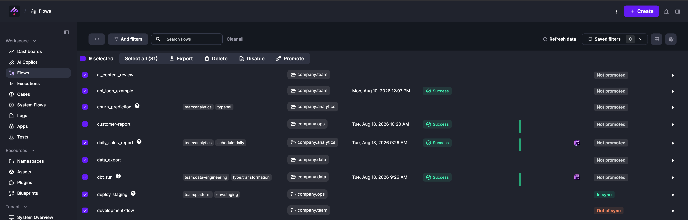
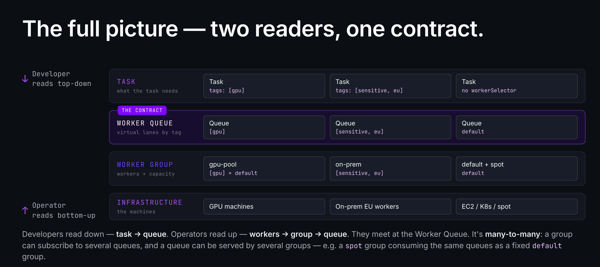

Kestra 2.0 is the most significant release in the product's history. Every feature in 1.x required two implementations (one for JDBC, one for Kafka) because the queue was tied to the database. That constraint is gone. Workers now communicate with the platform over gRPC instead of connecting to the database directly, which separates the control plane from the data plane and makes workers independently deployable: across regions, inside restricted networks, or within infrastructure you control.

That foundation is what makes the rest of this release possible. AI agents can now invoke flows directly as MCP tools — Kestra orchestrates your AI stack, not the other way around. Enterprise governance ships for the first time in Policies, Cases, and Promote. Worker Groups are rebuilt with tag-based routing, capacity reservation, and JWT authentication. The permission model moves from CRUD to a resource-plus-action model. The editor gains a No Code canvas and a persistent Copilot sidebar with multi-turn memory. Loop replaces ForEach with isolated sub-executions, and the trigger `when` expression replaces Java class conditions across all trigger types. The feature table covers edition availability for everything.

| Feature | What | Edition |
|---|---|---|
| MCP Tool Trigger + MCP Server | Expose flows as tools callable by AI agents | EE, Cloud |
| AI Copilot agentic loop | Three-mode chat sidebar (Edit, Plan, Ask) with multi-turn memory and confirmation gate | EE, Cloud |
| No Code canvas editor | Visual canvas-based flow editor with guided forms, synced with YAML and Copilot | OSS, EE, Cloud |
| RBAC action-based permissions | Resource + action model replaces CRUD | EE |
| Policies | Namespace-scoped governance rules replace `pluginDefaults` | EE |
| Cases | Incident management for executions: create, deduplicate, and track to resolution without leaving Kestra | EE, Cloud |
| Promote | Move flows across environments from the UI, with drift detection and a review gate | EE |
| Blueprint version control | PushBlueprints and SyncBlueprints tasks for Git-based governance | EE |
| kestractl IAM commands | Full IAM management (users, groups, roles, service accounts) from CLI | EE |
| Worker Groups 2.0 | Tag-based routing, capacity reservation, JWT auth | EE |
| New task runners | AWS EC2, Azure VM, Google Compute Engine, Huawei CCI | EE, Cloud |
| Loop task | Replaces ForEach and ForEachItem with isolated sub-executions | OSS, EE, Cloud |
| Trigger `when` expression | Pebble replaces Java-class conditions on all trigger types | OSS, EE, Cloud |
| PurgeStorage | Storage-driven cleanup for orphaned execution files | OSS, EE, Cloud |
| External Log Data Store | Route execution logs to a separate JDBC database or Elasticsearch | OSS (JDBC), EE (Elasticsearch) |
| Reusable Inputs | Shared input groups defined once at namespace level | EE, Cloud |
| Slim image + plugin auto-install | `kestra/kestra:*-slim` ships without bundled plugins; set `KESTRA_PLUGINS_AUTO_INSTALL_ENABLED=true` to install what's needed on first use | OSS |
| Plugin artifacts | Plugins can ship Vue.js UI components that load into the Kestra execution topology at runtime | OSS, EE, Cloud |

:::alert{type="info"}
**Upgrading from 1.x?** You must be on Kestra 1.3.x before upgrading. Several constructs are removed in 2.0 (ForEach, trigger conditions, `workerGroup.key`, `pluginDefaults`), but `kestra-migrate` handles most flow rewrites automatically. The [Upgrade and Migration](#upgrade-and-migration) section at the bottom covers the full checklist, and every breaking change has a dedicated guide in the [v2.0.0 migration hub](/docs/migration-guide/v2.0.0).
:::

## MCP Tool Trigger and MCP Server

Any Kestra flow can now register as a named tool on an MCP server. An AI agent sends a tool call; Kestra creates an execution with the matched inputs, runs the flow, and returns the outputs. No custom API wrapper or polling loop required.

The `McpToolTrigger` handles registration. Add it to any flow alongside your task list:

```yaml
id: run_dbt_model
namespace: company.data

tasks:
  - id: dbt
    type: io.kestra.plugin.dbt.cli.DbtCLI
    commands:
      - dbt run --select {{ inputs.model_name }}

triggers:
  - id: mcp
    type: io.kestra.plugin.core.trigger.McpToolTrigger
    toolName: run-dbt-model
    title: Run a dbt model
    toolDescription: >
      Runs a specific dbt model in the production warehouse. Use when a user asks
      to refresh a specific model or rebuild a table. Input: the model name as it
      appears in the dbt project (e.g. "stg_orders", "fct_revenue").
```

The `toolDescription` field is the most important property to get right. Agents use it to decide when and how to invoke the tool, so a vague description produces poor routing. Write it from the agent's perspective: what situation should trigger this call, and what does the input represent.

Flow inputs map automatically to the tool's JSON schema parameter spec. Outputs become the tool's response payload. If a flow has a `JSON` input with a `jsonSchema` property, the schema propagates to the tool spec.

A `default` MCP server is provisioned for every tenant on startup. Additional servers (separate servers per team, or one per environment) can be created from the UI. Each server generates ready-to-paste connection configuration for Claude Desktop, Claude Code, Cursor, and Codex on its Connect tab.

The MCP server also works in the other direction. Connect Claude, Cursor, or any MCP-compatible client to the Kestra MCP server and you can interact with flows as tools directly from your editor or AI assistant, no UI required.

All executions created via MCP are tagged with `system.from: mcp`, `system.mcpServerId`, and `system.mcpSessionId`, so you can filter by agent origin in the execution list.

See the [MCP server docs](/docs/ai-tools/mcp-server) and [McpToolTrigger reference](/docs/workflow-components/triggers/mcp-tool-trigger) for full setup.

<div style="position: relative; padding-bottom: calc(49.0084% + 41px); height: 0px; width: 100%;"><iframe src="https://demo.arcade.software/T50B5gunEbBXP5caS8yl?embed&embed_mobile=tab&embed_desktop=inline&show_copy_link=true" title="Flow as an MCP Tool in Kestra" frameborder="0" loading="lazy" webkitallowfullscreen mozallowfullscreen allowfullscreen allow="clipboard-write; autoplay" style="position: absolute; top: 0; left: 0; width: 100%; height: 100%; color-scheme: light;" ></iframe></div>

## AI Copilot

The AI Copilot is rebuilt in 2.0. The old one-shot generation modal is replaced by a persistent right-sidebar chat panel, opened via the **AI** button in the top toolbar. Conversations are multi-turn and held in memory for the browser session. Click **New chat +** to start fresh; use **Recents** to return to a prior conversation.

A mode selector at the bottom of the panel switches between three behaviors:

| Mode | What it does |
|---|---|
| Edit | Generates and iteratively refines declarative flow YAML. The Copilot proposes the change for approval before applying it; rejecting keeps the conversation going so you can redirect rather than start over. |
| Plan | Proposes a numbered sequence of steps for a complex task and executes each one after you confirm. Rejecting any step cancels the rest. |
| Ask | Answers questions about Kestra grounded in the official documentation via an internal Kestra MCP client. Can also read execution logs directly to help diagnose a failed run. |


When you open the sidebar while viewing a resource, that resource attaches automatically as a context tag above the input. Context tags are independently dismissible. Every addition and removal is recorded in the transcript so you can always see what the agent is looking at. Attachable resources include flows, namespaces, executions, dashboards, apps, test suites, blueprints, and plugins. The Copilot also reads namespace metadata (Policies, Variables, Secrets, Key-Value pairs) to ground authoring suggestions against your actual configuration, so prompts like "create a task that reads from our MongoDB" can reuse configured credentials without extra hints.

Actions that modify resources require explicit confirmation before the Copilot executes them. A prompt appears in the chat with an optional field to steer the next attempt. Approving applies the change; rejecting resumes the conversation in Edit mode, or cancels the current plan in Plan mode.

The `COPILOT` resource in the RBAC model controls who can use the feature. Assign `USE` at tenant or namespace scope via the Roles UI.

See the [AI Copilot reference](/docs/ai-tools/ai-copilot).

## No Code Editor

The flow editor gains a No Code canvas view alongside the existing YAML editor. The canvas displays each flow section (Triggers, Tasks, Errors, Finally, After Execution) as a group of visual blocks. Clicking a block opens its configuration form in a side panel with two tabs: **Form** (guided fields with inline documentation) and **Source** (raw YAML for that block).

The form's left panel lists every upstream task output and execution context variable available at that point in the flow, so you can reference them in Pebble expressions without leaving the form or switching to the YAML editor to look them up.

Add blocks with **+ Add task** or **+ Add trigger**, or press `/` on the canvas to search and insert a plugin at the cursor position. All three views (YAML editor, No Code canvas, and AI Copilot) stay in sync. Start in any mode and switch freely; every change reflects instantly across all three.

A new `FORM` input type groups related inputs as a multi-step wizard in the Execute modal. Each step is a labeled section in the inputs list, making complex trigger forms easier to fill out without presenting every field at once.

See the [flow editor reference](/docs/ui/flows).

## RBAC: Action-Based Permissions

The CRUD permission model (READ, CREATE, UPDATE, DELETE on generic resources) is replaced by a resource-plus-action model. Each resource now exposes only the actions that make sense for it.

A few examples of what this makes possible:

| Goal | Old model (minimum viable) | New model |
|---|---|---|
| CI/CD service account deploys and runs flows | FLOW: CREATE + EXECUTION: CREATE | `FLOW: CREATE, UPDATE, EXECUTE` |
| Support engineer reads logs | EXECUTION: READ | `EXECUTION: ACCESS_LOGS` |
| Scheduler triggers backfills | EXECUTION: CREATE | `TRIGGER: BACKFILL` |
| Analyst follows a live execution | EXECUTION: READ | `EXECUTION: FOLLOW` |

New resources in 2.0 include `TRIGGER` (previously part of `FLOW`), `SYSTEM_SETTINGS`, `TENANT_SETTINGS`, `COPILOT`, and `MCP_SERVER`.

Five managed roles ship with 2.0: Viewer, Launcher, Editor, Developer, and Admin. Existing custom roles and bindings are migrated automatically on upgrade.

See the [RBAC reference](/docs/enterprise/auth/rbac) and the [migration guide for the RBAC action model](/docs/migration-guide/v2.0.0/rbac-action-model).

## Policies

Without enforcement tooling, keeping flows compliant across many namespaces is a manual coordination problem: authors must set values correctly on every task, and administrators have no way to verify or block non-compliant flows. Policies address this at the platform layer, replacing `pluginDefaults` in EE with governance rules that inject configuration, validate compliance, and block non-conforming flows, including flow-level properties that `pluginDefaults` could never reach, like `retry`, `concurrency`, and `labels`.

A Policy is a named set of rules scoped to a namespace or a tenant. Rules from a parent namespace cascade to all child namespaces automatically, so a company-wide constraint placed at the root namespace reaches every team without per-namespace configuration.

Five rule types ship in 2.0: `Add` and `Delete` mutate configuration before execution without altering stored flow YAML; `Deny`, `Restrict`, and `Require` validate it and can block or warn when a flow violates a constraint. Rules target either the flow (`on: FLOW`) or any plugin instance in it (tasks, triggers, task runners) (`on: PLUGIN`), narrowed by a `where` clause that matches on the plugin type.

A practical example: require that every flow carries a team label, and restrict all script tasks to an approved container registry.

```yaml
id: prod-standards
description: "Label requirements and registry policy for production flows."
enforcement: ACTIVE

rules:
  - type: io.kestra.plugin.ee.rules.Require
    on: FLOW
    properties:
      - labels.team
    errorMessage: "Every flow must declare labels.team."

  - type: io.kestra.plugin.ee.rules.Restrict
    on: PLUGIN
    where:
      - field: type
        operator: STARTS_WITH
        value: io.kestra.plugin.scripts
    property: containerImage
    regex: "^registry.internal/.*"
    action: block
    errorMessage: "Container images must be pulled from registry.internal."
```

`Add` rules inject values at resolution time. With `override: false` (the default), the author's explicit value wins and the policy fills in only what's absent. With `override: true`, the policy value always wins. Either way, every injection is annotated in the flow editor's merged preview, so forced values are never invisible to authors.

Before enabling enforcement, set `enforcement: EVALUATE`. The policy checks every flow in scope and surfaces violations in the Governance UI, but violations are only reported: nothing is blocked, and `Add`/`Delete` mutate rules are skipped. When the violation report looks right, flip to `ACTIVE`.

`pluginDefaults` is removed in 2.0 for both OSS and EE. The [migration guide](/docs/migration-guide/v2.0.0/plugin-defaults-removed) covers all three scopes (flow-level, namespace-level, and global server config) with before-and-after examples. See the [Policies reference](/docs/enterprise/governance/policies) for the full rule DSL.

## Cases

Failed executions are incidents, and they usually get tracked outside Kestra. Cases bring incident management in so you can create, assign, and resolve incidents next to the executions that caused them.

The `CreateCase` task opens a case from any block in a flow: `errors`, `finally`, `afterExecution`, or a regular task combined with `runIf`. It calls the Kestra API, so it needs an endpoint and credentials: `kestraUrl` defaults to the current instance, and `auth` accepts an API token or username/password. Namespace or tenant-level default credentials work as a fallback so you don't have to repeat auth config on every task.

```yaml
errors:
  - id: open_case
    type: io.kestra.plugin.kestra.ee.cases.CreateCase
    title: "Orders sync failed: {{ flow.id }}"
    severity: HIGH
    linkMatchingExecutions: true
    sla:
      acknowledgement: PT1H
      resolution: PT8H
```

The `linkMatchingExecutions` property is the most useful option for high-frequency flows. A single external API going down can generate dozens of failed executions per hour. With `linkMatchingExecutions: true`, each subsequent failure attaches to the already-open case rather than creating a new one. The same behavior is available from the UI on any existing case via auto-attach, which generates a Flow trigger behind the scenes and removes it when the case resolves.

Each case tracks status, severity, assignees, SLA timers, and linked executions, with a full activity timeline. Cases can also carry case actions: flows attached as one-click remediation buttons on the case detail page.

The Cases board view and list view sit in the left menu. The board groups cards by status, severity, or assignee with a live SLA countdown per card. Dragging a card to Resolved opens the resolve modal, where a resolution reason is required.

See the [Cases reference](/docs/enterprise/governance/cases).

## Promote

Moving a flow from dev to prod has never been a first-class action in Kestra. The usual workarounds are fragile (copy-paste YAML between instances, which silently drifts) or require building a Git pipeline yourself, which blocks anyone who isn't fluent in CI/CD setup. Promote adds a dedicated path for moving flows across environments directly from the UI, with a review step before anything lands in production.

Each flow gains a Deploy tab alongside the editor. From there, select a target environment, review a diff of exactly what changes in that revision, and confirm. Gated targets (typically production) require explicit confirmation before the promotion runs. Every promotion is recorded in full: what moved, which revision, where it went, who confirmed it, and when.

The flows table gains a Deploy column showing drift at a glance. If production is running an older revision, the column shows out of sync. If a flow has never been promoted to that environment, it shows not promoted, so you never need to open each instance separately to check.




See the [Promote reference](/docs/enterprise/governance/promote).

<div style="position: relative; padding-bottom: calc(49.0084% + 41px); height: 0px; width: 100%;"><iframe src="https://demo.arcade.software/5bsRGVNXSLuSoWETF8vM?embed&embed_mobile=tab&embed_desktop=inline&show_copy_link=true" title="Promote a Flow to a Different Environment - Kestra" frameborder="0" loading="lazy" webkitallowfullscreen mozallowfullscreen allowfullscreen allow="clipboard-write; autoplay" style="position: absolute; top: 0; left: 0; width: 100%; height: 100%; color-scheme: light;" ></iframe></div>

## Blueprint Version Control

Custom Blueprints can now be version-controlled with Git using two new EE tasks: `PushBlueprints` commits and pushes blueprints from Kestra to a Git repository, and `SyncBlueprints` pulls blueprints from Git into Kestra, treating Git as the single source of truth.

The pattern mirrors the [`PushFlows`/`SyncFlows` GitOps model](/docs/version-control-cicd/git). Platform teams can manage the approved blueprint library centrally, review changes via pull requests, and deploy consistently across multiple Kestra instances or environments.

This complements Templated Blueprints (also new in 2.0), which let platform teams author blueprints with Pebble-based form templates. Users fill a form; Kestra generates the flow YAML. Combined with version control, the governance loop closes: templates are authored in code, reviewed in Git, and distributed as a self-service library.

See the [Custom Blueprints reference](/docs/enterprise/governance/custom-blueprints).

## kestractl IAM Commands

kestractl, introduced in Kestra 1.3, gains full EE IAM management in 2.0. The new command groups cover every entity in the action-based permission model:

- `kestractl users`: create, list, get, update, delete users; set passwords
- `kestractl groups`: manage groups and memberships (tenant-scoped)
- `kestractl roles`: create and bind roles; assign permissions via `--permission TYPE:ACTION[,ACTION]` or `--permissions-file`
- `kestractl service-accounts`: create and manage service accounts (instance-level)

The `--output json` flag applies across all commands, so kestractl output can pipe directly into `jq` or other tooling in CI scripts.

See the [kestractl reference](/docs/kestra-cli/kestractl) for all commands and authentication configuration.

## Worker Groups 2.0

Worker Groups in 2.0 separate three concerns the old model conflated. The old model assigned tasks to a group by name with `workerGroup.key`. The new model distinguishes: Workers (compute units that authenticate via tokens), Worker Groups (pools of workers), and Worker Queues (routing lanes identified by tags).

Tasks declare routing requirements with `workerSelector.tags`:

```yaml
tasks:
  - id: gpu_inference
    type: io.kestra.plugin.scripts.python.Commands
    workerSelector:
      tags:
        - gpu
        - a100
      match: ALL
      fallback: FAIL
```



A Worker Group subscribes to one or more queues. The platform routes a task to the first available group that covers all required tags (or any, with `match: ANY`). `fallback` controls what happens when a matching Worker Queue exists but has no live workers: `FAIL` (the default in 2.0, changed from the 1.x default of `WAIT`), `WAIT`, `CANCEL`, or `IGNORE` (drop the requirement and route to the default queue). If no Worker Queue with those tags exists at all, the task fails immediately regardless of the `fallback` setting.

The fallback default flip is the sharpest gotcha for upgraders. Tasks that previously waited silently for a matching worker will now fail immediately. Set `fallback: WAIT` explicitly on tasks where the old behavior was intentional.

### Capacity reservation

Each Worker Group subscription now supports per-subscription capacity reservation. A `reservedPercent` value on a subscription sets a floor: the worker keeps that percentage of its thread pool available for tasks from that queue, regardless of competing demand. Two modes control idle slot lending: `STRICT` keeps reserved capacity exclusive; `ELASTIC` lends idle reserved slots to other queues and reclaims them on demand. Reserved percentages are configurable live without restarting workers.

### Worker authentication

Workers now authenticate with the platform using JWT. The setup flow: a registration token is created in the UI or via kestractl; the worker presents it on first connect; Kestra issues a short-lived JWT access token and a rotating refresh token. Revoking a registration token fails the next refresh, cutting off that worker immediately.

This replaces the previous trust model where workers connected without credential verification.

### Declarative topology bootstrap

A `kestra.ee.setup` configuration block lets you declare the full worker topology (queues, groups, subscriptions, and registration tokens) in `application.yml`. Kestra provisions everything at startup, so there is no need for a second deployment pass or an init Job against a running webserver. Workers retry registration until their token is known to the controller, so all services can start concurrently. The semantics are create-if-not-exists: an existing entity is skipped on restart, so the database stays the source of truth once an entity exists.

See the [Worker Groups reference](/docs/enterprise/scalability/worker-group) for migration steps, the `workerGroup.key` to `workerSelector.tags` mapping, and full [declarative configuration](/docs/enterprise/scalability/worker-group#declarative-configuration) details.

## New Task Runners

Four new EE task runners ship in 2.0, each targeting workloads that cannot or should not run in a container: GPU training tied to a custom AMI, licensed software bound to a specific machine image, or workloads where direct VM control matters.

- [AWS EC2 Task Runner](/docs/task-runners/types/aws-ec2-task-runner): runs commands directly on an EC2 instance via AWS Systems Manager Run Command, with no SSH required. Supports Spot instances and reattaches mid-run if the Kestra Worker restarts.
- [Azure Virtual Machine Task Runner](/docs/task-runners/types/azure-virtualmachine-task-runner): runs commands on Azure VMs via the Azure Run Command API, with no SSH and no public IP required.
- [Google Compute Engine Task Runner](/docs/task-runners/types/google-computeengine-task-runner): runs commands directly on a Compute Engine VM as a startup script, with no SSH or IAP tunnel.
- [Huawei Cloud CCI Task Runner](/docs/task-runners/types/huawei-cci-task-runner): runs tasks as bare Pods on Huawei Cloud CCI for serverless container execution.

## Loop Task

ForEach and ForEachItem are removed in 2.0. The `Loop` task replaces both.

The removal was driven by a real stability problem. A `ForEach` task with a large input list could generate thousands of child task runs within a single flow execution, exhausting executor memory and affecting every other flow running on the instance at the same time. `Loop` runs each iteration as an isolated sub-execution. A runaway loop cannot destabilize the instance.

The expression syntax is also cleaner. Where ForEach and ForEachItem both used `{{ taskrun.value }}` (with `{{ parent.taskrun.value }}` for nested access), Loop uses:

| Old expression | New expression |
|---|---|
| `{{ taskrun.value }}` | `{{ item.value }}` |
| `{{ taskrun.iteration }}` | `{{ item.index }}` |
| `{{ parent.taskrun.value }}` | `{{ item.value }}` (accessible at any nesting depth) |
| `{{ parents[0].taskrun.value }}` | `{{ item.parent.value }}` (inner loop of two nested loops) |

Outputs work differently too. ForEach had implicit output collection; Loop requires an explicit `outputs:` block on each task inside the loop, and the `loopOutputs()` function extracts a flat list of one field across all iterations:

:::collapse{title="Example: Collect outputs across loop iterations"}

```yaml
id: process_files
namespace: company.data

tasks:
  - id: loop
    type: io.kestra.plugin.core.flow.Loop
    values: "{{ inputs.file_list }}"
    tasks:
      - id: transform
        type: io.kestra.plugin.scripts.python.Commands
        commands:
          - python transform.py --input "{{ item.value }}"
        outputs:
          - id: result_path
            type: STRING

  - id: collect_results
    type: io.kestra.plugin.core.log.Log
    message: "{{ loopOutputs(outputs.loop.outputs, 'result_path') | join(', ') }}"
```

:::

The [ForEach to Loop migration guide](/docs/migration-guide/v2.0.0/foreach-loop) maps every ForEach and ForEachItem pattern to its Loop equivalent, including nested loops, subflow iteration, and output collection.

## Trigger `when` Expression

The `conditions` list on all trigger types is removed. All triggers gain a top-level `when` property that takes a Pebble expression. This applies to Schedule, Webhook, Flow, and Polling triggers.

The old model required fully-qualified Java class names:

```yaml
triggers:
  - id: weekly
    type: io.kestra.plugin.core.trigger.Schedule
    cron: "0 9 * * 1"
    conditions:
      - type: io.kestra.plugin.core.condition.DayWeek
        dayOfWeek: MONDAY
      - type: io.kestra.plugin.core.condition.NotCondition
        conditions:
          - type: io.kestra.plugin.core.condition.PublicHolidayCondition
            country: FR
```

The same logic in 2.0:

```yaml
triggers:
  - id: weekly
    type: io.kestra.plugin.core.trigger.Schedule
    cron: "0 9 * * 1"
    when: "{{ isWeekend(trigger.date, 'Europe/Paris') == false and isPublicHoliday(trigger.date, 'FR') == false }}"
```

New date and calendar helper functions ship alongside the redesign: `isWeekend()`, `isPublicHoliday()` (with country and subdivision), `isDayWeekInMonth()`, `isLastWorkingDay()`, `dayOfWeek()`, `dayOfMonth()`, `monthOfYear()`, and `hourOfDay()`.

Flow triggers also change: `preconditions` is replaced by a `dependsOn` list with a `window` property for accumulation. The [trigger conditions migration guide](/docs/migration-guide/v2.0.0/trigger-conditions-redesign) maps every condition class to its `when` equivalent.

## PurgeStorage

The existing `PurgeExecutions` task deletes execution records and their associated files, but it is database-driven: it cannot clean files whose execution records are already gone. This becomes a problem in deployments where worker groups use isolated internal storage and files accumulate without any corresponding execution record to trigger a cleanup.

`PurgeStorage` takes the storage-driven approach instead. It walks the storage tree directly and deletes files based on last-modified date, regardless of whether a matching execution record exists. The task defaults to `dryRun: true`, so the first run only reports what would be deleted.

Running PurgeStorage on a specific worker group via `workerSelector.tags` targets that worker's isolated storage directly.

See the [purge guide](/docs/administrator-guide/purge) for setup and the two-step orphan-file remediation pattern.

## External Log Data Store

Execution logs are the highest-volume data Kestra writes. In most production installations they dwarf flows and executions combined, yet they share the same database. Schema migrations pay a per-row cost across every table including logs. Backup and retention schedules apply uniformly when the operational reality is that logs and executions have different lifecycles.

In 2.0, logs can be routed to a separate store using `kestra.logs.type`. JDBC backends (H2, PostgreSQL, MySQL) are available in OSS; Elasticsearch is EE-only. When configured, the main database handles only flows, executions, and state. Existing installations see no change on upgrade; historical logs written before the switch remain in the main database.

See the [External Log Data Store guide](/docs/administrator-guide/log-data-store) for the Elasticsearch config, the capability reference (aggregation, pagination type, purge), and the plugin developer guide for custom log backends.

## Slim Image and Plugin Auto-Install

Getting started with Kestra OSS used to mean pulling a large image that bundled every plugin, most of which you'd never use. The `kestra/kestra:*-slim` image flips that: pull a minimal image and let Kestra figure out what to install as you build.

Set `KESTRA_PLUGINS_AUTO_INSTALL_ENABLED=true`. When a flow references a plugin that isn't installed, Kestra fetches it from Maven Central before the execution starts and caches it for subsequent runs. Plugin autocomplete in the editor stays current as plugins are added, so you don't lose discoverability while keeping the initial pull fast. The quickstart uses this configuration by default.

Auto-install requires outbound access to Maven Central and pulls the current version of each plugin at install time. If your environment restricts outbound access or needs a fixed plugin set, install plugins explicitly with `kestra plugins install`.

The suffix was renamed from `-no-plugins` to `-slim` in 2.0. Update any Dockerfiles or compose files that reference the old tag.

See the [Docker installation guide](/docs/installation/docker) for tag conventions and the [selected plugin installation guide](/docs/how-to-guides/selected-plugin-installation) for build patterns.

## Plugin Artifacts

Plugins can now ship Vue.js frontend components that load into the Kestra UI at runtime, without any changes to the core application. Three named slots let components render in the execution topology view, the task side drawer, or the task detail modal; when a plugin's task types appear in an execution, the matching component renders in place.

Each component is compiled as a Module Federation micro-frontend using `@kestra-io/artifact-sdk` and bundled into the plugin JAR. At startup, Kestra discovers these bundles and makes them available to the host UI without static linking.

Components call the Kestra API through `@kestra-io/kestra-sdk`, which provides typed methods for executions, flows, metrics, logs, and live progress events.

A concrete example: a task runner that breaks execution into distinct infrastructure phases (scheduling, image pull, file transfer, task code) can render a `topology-details` component showing per-phase timing directly in the execution view, so slow executions have an identifiable owner. Without a plugin artifact, that timing data lives in raw log output.

Plugin artifacts are available to all plugin authors starting in 2.0. See the [plugin artifact developer guide](/docs/plugin-developer-guide/develop-plugin-artifacts) for setup.

## Additional Improvements

- [Quotas](/docs/workflow-components/quotas): limit how many executions a flow can create in a time window. Set `CANCEL` or `FAIL` behavior, a `limit`, and an ISO-8601 `duration`. Quotas stack at flow, namespace, and tenant scope, evaluated most-specific-first. Where [`concurrency`](/docs/workflow-components/concurrency) limits simultaneous runs, quotas limit creation rate.
- [Asset locking](/docs/enterprise/governance/assets#locking-assets) (EE): flows can now acquire a TTL-bounded write lock on an asset using `io.kestra.plugin.kestra.ee.locks.Acquire` and release it with `Release`. While a lock is held, concurrent writes from other flows are rejected with a 423; reads stay open. User-initiated locks (via the asset detail page) block all flow writes and can be released from the UI by anyone with the `UNLOCK` permission.
- [Reusable Inputs](/docs/workflow-components/reusable-inputs) (EE/Cloud): define a named input group once at the namespace level (`type: REUSABLE_INPUTS`) and reference it across flows with a single line. Child inputs are accessible as `{{ inputs.<refId>.<childId> }}`. Namespace hierarchy inheritance and revision pinning are supported.
- ION binary format: ION output files are now stored in binary format, reducing storage consumption by roughly 20 to 40 percent. Expressions that call `read()` on ION outputs and then do string operations need `fromIon()` wrapping. The [migration guide](/docs/migration-guide/v2.0.0/ion-binary-format) covers affected tasks and patterns.
- [Input improvements](/docs/workflow-components/inputs): SELECT and MULTISELECT inputs now support `{label, value}` objects, so the UI can show a human-readable label while flows receive the underlying technical value. A `subflow()` Pebble function in `expression:` populates dropdown values from a subflow execution at form render time, for cases where `kv()` or `http()` aren't enough. JSON inputs gain a `jsonSchema` property (JSON Schema Draft 2020-12) that validates at execution creation time, rejecting invalid payloads before any task runs.
- [Unit test](/docs/enterprise/governance/unit-tests) `expectedState`: flow unit tests can now assert that a test case ends in `FAILED`, `WARNING`, or `KILLED`. Testing intentional failure paths (validation guards using `io.kestra.plugin.core.execution.Fail`, SLA breaches, and so on) is now first-class.
- TRACEPARENT propagation: pass `{{ trace.parent }}` as the `TRACEPARENT` environment variable in script tasks to parent their OpenTelemetry spans under the Kestra task span. This closes a distributed tracing gap for teams running scripts inside Docker containers.
- Syslog (CEF) log exporter: the EE [Log Shipper](/docs/enterprise/governance/logshipper) and Audit Log Shipper gain a Syslog CEF destination over TCP, UDP, or TLS. CEF-formatted Kestra log events route directly into SIEM infrastructure (Graylog, Splunk, QRadar) without a custom adapter.
- [LDAP](/docs/enterprise/auth/sso/ldap) group-sync-only mode (EE): `mode: GROUP_SYNC_ONLY` lets teams keep their existing SSO provider for login while using LDAP exclusively to resolve group memberships.
- [AI Agent](/docs/ai-tools/ai-agents): `guardrails` attach input/output expressions that fail the task when violated, giving you deterministic filtering around a non-deterministic component. Prometheus metrics now cover tool calls, provider calls, and embedding store calls. New MCP client tasks let Agent tasks call external MCP servers as tools.
- [VS Code extension](/docs/version-control-cicd/vscode): the extension now downloads the flow schema from your connected instance rather than bundling a generic one, so completion reflects the plugins actually installed. Live validation, Pebble autocompletion, topology preview with live task states during a run, and run-from-editor are all in.
- mTLS on the worker channel: Worker-to-Executor communication can be secured with mutual TLS. Configure a certificate authority, a server certificate for the Kestra server, and a client certificate for each worker. Workers that cannot present a valid client certificate are rejected at the TLS handshake before reaching the application layer. See the [gRPC TLS/mTLS configuration reference](/docs/configuration/enterprise-and-advanced#grpc-tlsmtls-ee-only).
- Draft revisions: save any flow change as a draft from the flow editor without affecting live executions. A draft revision is never executed; any trigger or manual run falls back to the last published revision. A warning banner in the run panel shows a Publish button when the latest revision is a draft. See [Revisions](/docs/concepts/revision).
- Execution API performance: task run outputs now live in dedicated storage rather than inline in the execution record. `GET /executions/search` responses are significantly lighter, which directly improves execution list load time on large instances. Integrations that read `taskRunList[*].outputs` from the execution endpoint should switch to `GET /outputs/{executionId}/{taskRunId}`. See the [execution API response migration guide](/docs/migration-guide/v2.0.0/execution-api-response).
- Infrastructure plugins (EE): NetApp ONTAP, Veeam Backup, Pure Storage, Dell EMC PowerStore, Ceph, Huawei Cloud, F5, and SolarWinds IPAM plugins join the existing VMware, Nutanix, Proxmox, Infoblox, and Netbox family, covering day-two operations: snapshot before patching, clone volumes for dev/test, provision and register infrastructure in a single flow.

## Security

A systematic audit in the 2.0 cycle closed a range of issues covering secret encryption, password hashing, management endpoint exposure, and injection vectors. Several defaults moved from open to closed; review the migration guide before upgrading.

## Upgrade and Migration

2.0 requires being on Kestra 1.3.x before upgrading. If you are on an earlier version, follow the [1.1](/docs/migration-guide/v1.1.0) and [1.2](/docs/migration-guide/v1.2.0) migration guides first.

For most flows, `kestra-migrate` handles the mechanical rewrites automatically:

```bash
kestra-migrate --check ./flows/       # scope the work, no changes written
kestra-migrate -o v2-flows/ ./flows/  # rewrite into a new directory
```

`ForEach` and `pluginDefaults` are flagged for manual review rather than automatically rewritten, as both require judgment about intended behavior. Everything else in the table has a dedicated migration guide in the [v2.0.0 migration hub](/docs/migration-guide/v2.0.0).

The breaking changes that require action:

| Change | What to update |
|---|---|
| `ForEach` and `ForEachItem` removed | Migrate to `Loop`. Use `item.value` / `item.index` / `loopOutputs()`. |
| Trigger `conditions` removed | Replace with `when` Pebble expression. Flow trigger uses `dependsOn` + `window`. |
| `workerGroup.key` removed | Migrate to `workerSelector.tags`. Check the `fallback` default change (WAIT to FAIL). |
| RBAC CRUD model replaced | Existing roles migrate automatically. Review custom roles against the new action model. |
| `json()` Pebble function removed | Replace with `fromJson()` (same signature). |
| Namespace and global `pluginDefaults` removed | Replace with Policies (EE) or remove them (OSS). |
| `forced: true` on flow-level `pluginDefaults` removed | Remove the `forced` flag or migrate the default to Policies. |
| `kestra.ee.execution-data.internal-storage` removed (EE) | Remove these keys from your configuration. Task run outputs are always in-memory in 2.0. |
| ION binary format | `read()` on ION outputs followed by string ops needs `fromIon()` wrapping. |
| Four core tasks removed | `io.kestra.plugin.core.execution.Count`, `Resume`, `trigger.Toggle`, and `log.Fetch` are removed. Replace with their equivalents in the `plugin-kestra` SDK. |
| `CANCELED` enum alias removed | Replace the single-L spelling with `CANCELLED` in flow expressions, API consumers, and any tooling that checks execution state. |
| SDK auth required for internal tasks | Tasks that call the Kestra API internally (git sync tasks and others) now require explicit credentials. See the [migration guide](/docs/migration-guide/v2.0.0/sdk-authentication). |
| Super Admin renamed to Instance Owner | The Super Admin role is renamed to Instance Owner across the UI, CLI, config, and API. HTTP API responses emit `instanceOwner` instead of `superAdmin`; update any consumers that read this field. See the [migration guide](/docs/migration-guide/v2.0.0/superadmin-renamed-instance-owner). |

## Get Started

2.0 is the foundation the next phase of Kestra is built on — and it's the first LTS release, with bug and security fixes backported for one year. Teams upgrading now won't face another major migration in that window.

The [Kestra 2.0 migration guide](/docs/migration-guide/v2.0.0) covers every breaking change with before/after examples. The [quickstart](/docs/quickstart) and [Docker Compose setup](/docs/installation/docker-compose) are updated for 2.0. For questions or anything unexpected during the upgrade, find us on [GitHub](https://github.com/kestra-io/kestra/issues) or [Slack](https://kestra.io/slack).
