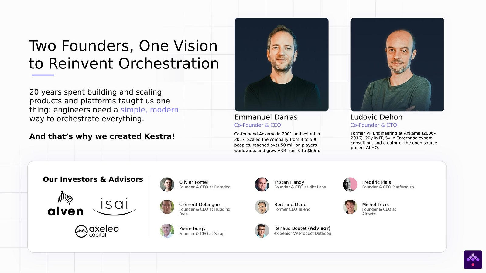
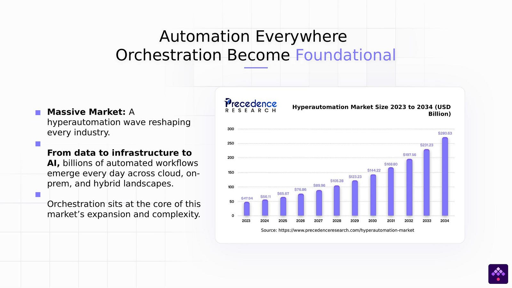
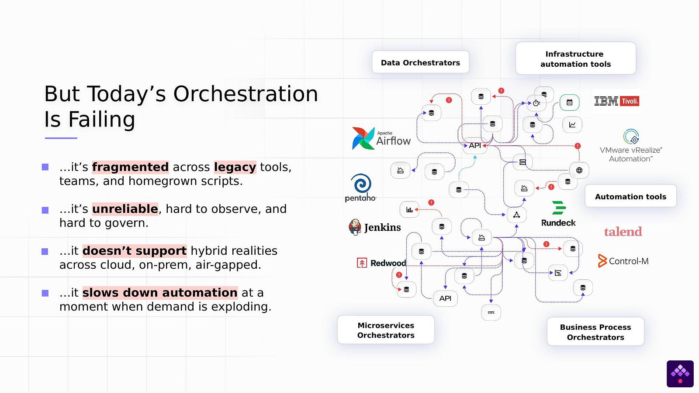
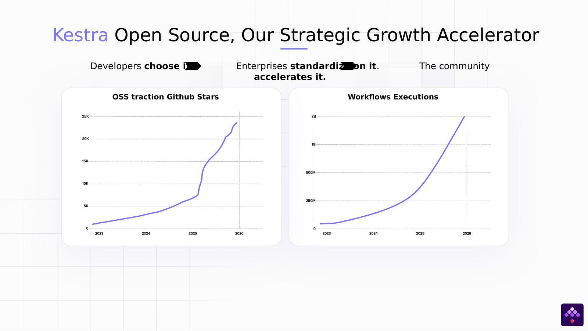
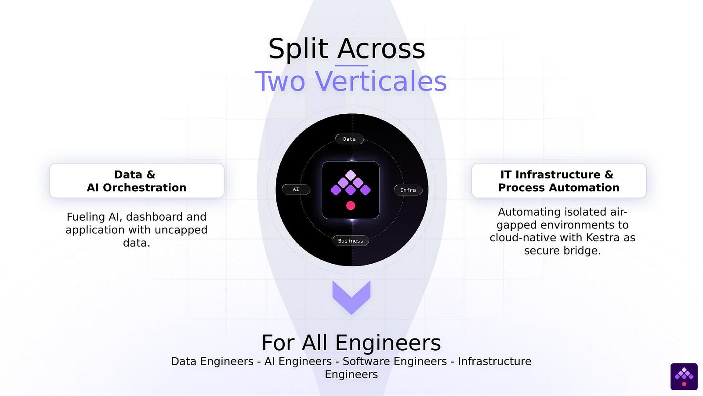
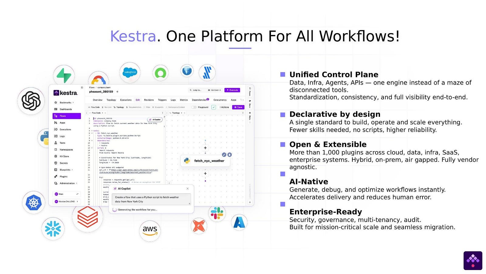
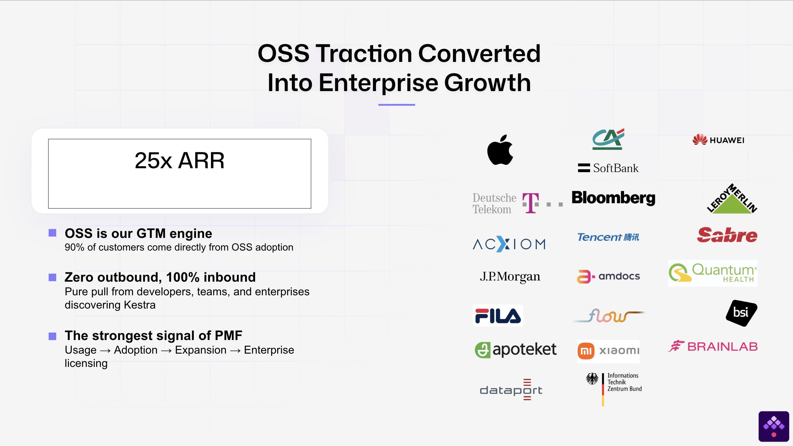
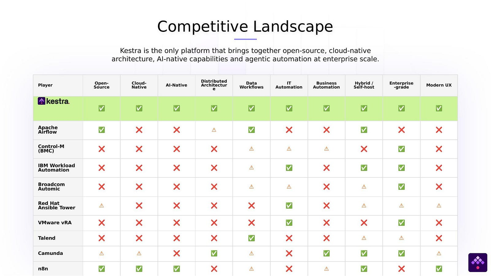
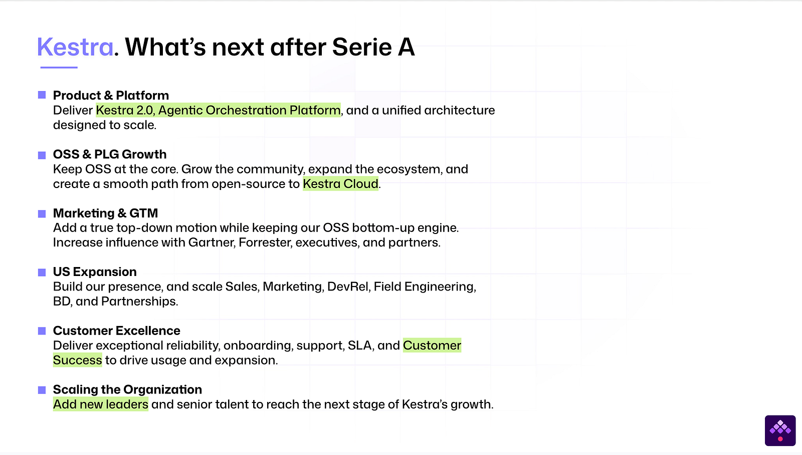

When we shared our [seed deck publicly](https://kestra.io/blogs/2024-09-25-the-story-behind-our-seed) after raising $8M, the idea was simple: other founders helped us by being transparent, and we wanted to do the same.

The response surprised us. Not just founders, developers, community members, engineers at companies we'd never spoken to reached out. Some said it helped them understand what we were building. Others said it gave them language for a problem they'd been fighting internally for years.

So here we are again. We just raised a **$25M Series A led by [RTP Global](https://rtp.vc/)**, with continued backing from Alven, ISAI, and Axeleo. Total funding: $36M. And we're sharing the full deck along with the thinking behind it.

<iframe src="https://docs.google.com/presentation/d/1yCJJTylKJQhq8nYSBfVk9N5CKwyQcioZ6FcZlWHVjRI/embed?start=false&loop=false&delayms=3000" width="1440" height="839" allowfullscreen="true" mozallowfullscreen="true" webkitallowfullscreen="true"></iframe>

### A Note on How This Raise Happened

Before getting into the deck, a word on the process.

This Series A came together fast — not because we rushed, but because the conditions were right. RTP Global had been watching Kestra closely for months before we ever sat down to talk about a round: tracking our GitHub, our community, our enterprise traction, the way we were framing the market. By the time we opened the conversation, most of the conviction was already built on their side. One meeting and one partner meeting was enough to move forward.

That's not luck. It's the output of things we've learned to take seriously: conviction compounds — investors feel when a founder knows why the company has to exist, just as they feel when someone is raising because it's the next box to tick. Relationships come before pitches — the best investor conversations we've had weren't first meetings but ongoing dialogues, with people who asked hard questions early, pushed back, and came back months later already familiar with the arc of the company. And knowing exactly what you need — the amount, the structure, the kind of partner — turns every conversation into a shorter, sharper one.

When you have the right investor, real conviction, and clarity on what you're looking for, you don't need a long process. You need a short, decisive one. That's what this round was.

---

### Why We Started: A Problem Nobody Was Solving Completely

Before Kestra existed, Ludovic spent months trying to make Airflow work inside Leroy Merlin, the largest DIY retailer in Europe. It didn't. The security model wasn't built for enterprise. The scalability hit walls. The Python-centric approach meant that most of the organization — the people who actually needed automation — couldn't use it.

That experience shaped everything we built afterward. We didn't want to create another developer tool that only a small group of experts could operate. We wanted to build something that **any engineer could use on day one** — and that an enterprise could trust in production on day one thousand.

The core design decision was declarative workflows in YAML. Not because YAML is glamorous — it isn't — but because it's the language DevOps teams already think in. It's versionable, reviewable, and deployable through Git and Terraform. It means a platform engineer, a data engineer, and a business analyst can all work in the same system without needing to learn each other's stack.

That was the philosophy behind the seed. Eighteen months later, we had to show it was working.

### The Orchestration Crisis: Bigger Than We Thought

When we pitched the seed, we told investors that enterprise orchestration was fragmented. We were right — but we underestimated how deep it went.

In the eighteen months between our seed and Series A, we talked to hundreds of engineering teams. What we found was consistent: it's not that enterprises lack automation. They have **too much of it**, spread across too many tools, owned by too many teams, with no shared visibility.

Airflow handles data pipelines. Ansible runs infrastructure playbooks. ServiceNow manages tickets. Jenkins does CI/CD. Camunda handles business processes. And underneath all of it: cron jobs, bash scripts, and internal tools that the person who wrote them left the company three years ago.

The result isn't inefficiency. It's **invisible risk**. Workflows break silently. Teams can't see what other teams are running. Compliance becomes guesswork. And every time someone needs to coordinate across two systems, they write more glue code — adding another layer to the problem.

We built this slide not to attack any of these tools. They're good at what they do. The problem is that nobody built the layer that ties them together. That's the job we took on.

### Going All the Way With Open Source

One thing we're stubborn about: **we don't gate our open source**.

A lot of companies in our space release an open-source version that's deliberately limited — enough to get you hooked, not enough to be useful. Then they charge you for the things you actually need.

We went the other direction. Kestra's open-source edition is genuinely powerful. You can build real production workflows with it. You can orchestrate data, infrastructure, AI, APIs, business processes. You can connect to hundreds of plugins across every major cloud, database, and SaaS tool. You can run it on-prem, in your cloud, in an air-gapped environment.

We do this because we believe the best way to build trust is to give people something worth trusting. Our Enterprise Edition adds governance, multi-tenancy, dedicated support, and features that large organizations need at scale — but the core platform is not a demo. It's the real thing.

That generosity turned out to be our strongest growth engine. Not because we planned it as a strategy, but because developers are smart. They can tell when a product respects them versus when it's trying to trap them. And they reward honesty by telling their teams, their friends, and eventually their leadership.

**26,000+ GitHub stars. 30,000+ organizations. 2 billion+ workflows executed in 2025.** None of that came from outbound sales. It came from engineers choosing Kestra because it solved their problem, and then bringing it to their company.

### What We Changed From the Seed Deck

The seed deck pitched the vision of a unified orchestration platform. This deck had to show that the vision is real — and that it's expanding.

The biggest change: we made explicit that Kestra now serves **two major verticals** with one platform.

**Data & AI Orchestration** — the world we started in. Fueling dashboards, AI workflows, and applications with reliable data pipelines.

**IT Infrastructure & Process Automation** — the world we grew into. Automating everything from VMware environments to cloud-native deployments, coordinating Ansible playbooks with ITSM tickets, managing self-service infrastructure requests with human approvals built in.

This wasn't a pivot. It was the natural consequence of building a platform that's truly language-agnostic and truly declarative. When your tool doesn't force a specific persona or a specific domain, people use it for things you didn't originally imagine. Infrastructure teams at Deutsche Telekom. Platform engineers at Fortune 500 mining companies and Credit Agricole. Data teams at Apple and Bloomberg. They all found Kestra and said: this is what we've been looking for.

### AI That Helps You Build, Not That Replaces You

Every pitch deck in 2026 has an AI slide. We were careful about ours.

Kestra is AI-native — but what that means is specific. Our AI copilot helps you **write workflows faster**. You describe what you want in natural language, and it generates the declarative YAML. That's a genuine productivity gain: you go from idea to working workflow in minutes instead of hours.

We also support agentic orchestration — workflows where an AI agent decides the next step. This is powerful, but it's also risky if you don't have guardrails. That's exactly where Kestra fits: we provide the **control plane, the observability, the approval gates, and the audit trail** that make agentic workflows safe for production.

We didn't pitch AI as magic. We pitched it as a capability that **needs orchestration more than anything else does**. The more autonomous systems become, the more you need a governed layer coordinating them. That resonated with investors because it's true — and because it's the opposite of hype.

### The People Who Trust Us

We could list logos. But logos don't tell you much.

What matters is what people actually did with Kestra:

A lead architect at a major company told us they **unified six separate automation stacks into one** and now ship three times faster. Orchestration stopped being a bottleneck.

A Fortune 500 team replacing VMware vRA found that what used to take **six months** could be done in **six days** with Kestra. Not because we're faster at the same thing — but because declarative workflows remove layers of complexity that legacy systems forced on you.

Bloomberg's engineering team standardized orchestration across their data pipelines — gaining the kind of clear, scalable visibility that wasn't possible when every team ran its own scheduler.

A public-sector organization in Germany evaluated 70 orchestration and automation tools. They needed something that could run in air-gapped environments, without vendor lock-in, with enterprise-grade governance, a unified control plane across data, infrastructure, and business workflows, full auditability for compliance, and an extensible plugin ecosystem to integrate their existing tooling. **Only Kestra fit.**

These stories matter because they show something we care deeply about: Kestra works in the real world. Not just in demos. Not just for small teams. In regulated, hybrid, mission-critical environments where failure isn't an option.

### What We're Not — and Why That Matters

In both the seed and the Series A deck, we spent real estate on what Kestra is **not**. We think this is underrated.

**We're not an Airflow clone.** We didn't take the same architecture and rewrite it in a different language. We changed the foundational principle — from imperative Python code to declarative YAML — because we believe orchestration should be accessible to every engineer, not just the ones who can write DAGs.

**We're not a tool for one persona.** Data engineers love Kestra. So do platform engineers, infrastructure teams, and increasingly, business operations teams. If your orchestration platform only works for one group, you haven't solved the fragmentation problem — you've added to it.

**We're not trying to replace everything.** Kestra works *with* your existing stack. Keep Ansible for what it's good at. Keep ServiceNow as your ITSM front door. Keep your cloud tools. Kestra is the orchestration layer that coordinates all of them — not a rip-and-replace bet.

**We're not gating the good stuff.** Our open-source edition is not a trial version. It's a platform that thousands of organizations run in production every day.

### Where We Go From Here

The $25M is the fuel for the story.

**Kestra 2.0** is a ground-up rearchitecture of the core platform. New queuing layer, multiple backend support, gRPC-based worker communication — an execution engine designed for the next order of magnitude. This is the hardest engineering work we've ever taken on, and we're doing it because the current architecture, as good as it's been, won't carry us to where we need to go.

**Kestra Cloud** is our managed offering for teams that want production-grade orchestration without managing infrastructure. Fully managed, usage-based, with enterprise governance built in from day one.

**Community and ecosystem** remain at the center. More plugins, more integrations, more documentation, more ways for developers to get started in five minutes and build something real.

And we're growing the team — engineering, developer relations, customer success — to support the companies that depend on us every day.

### Why We Share This

We share this deck for the same reason we shared the last one: because **building in the open is how we got here**.

Our open-source community taught us what to build. Our early users told us what was broken. Developers who chose Kestra over easier or more familiar options pushed us to be better.

If you're a founder preparing your own raise, we hope this helps. If you're an engineer dealing with the orchestration mess we described, come [try Kestra](https://kestra.io/docs/quickstart) open-source; it's the real thing. If you want to help us build what comes next, [we're hiring](https://kestra.io/careers).

Thank you to our investors, our team, and the 30,000+ organizations running Kestra. We're just getting started.

*Resources:*
- [Series A announcement](https://kestra.io/blogs/kestra-series-a)
- [Kestra 2.0 engineering preview](https://kestra.io/blogs/kestra-2-0-engineering)
- [Star us on GitHub](https://github.com/kestra-io/kestra)
- [Join the Kestra Slack community](https://kestra.io/slack)
- [How we raised $8M: our seed deck](https://kestra.io/blogs/2024-09-25-the-story-behind-our-seed)
