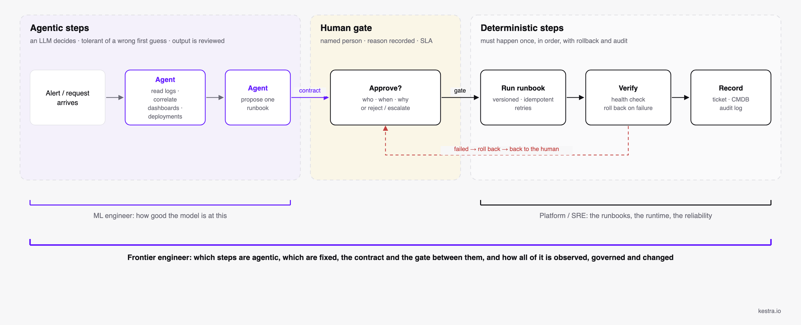
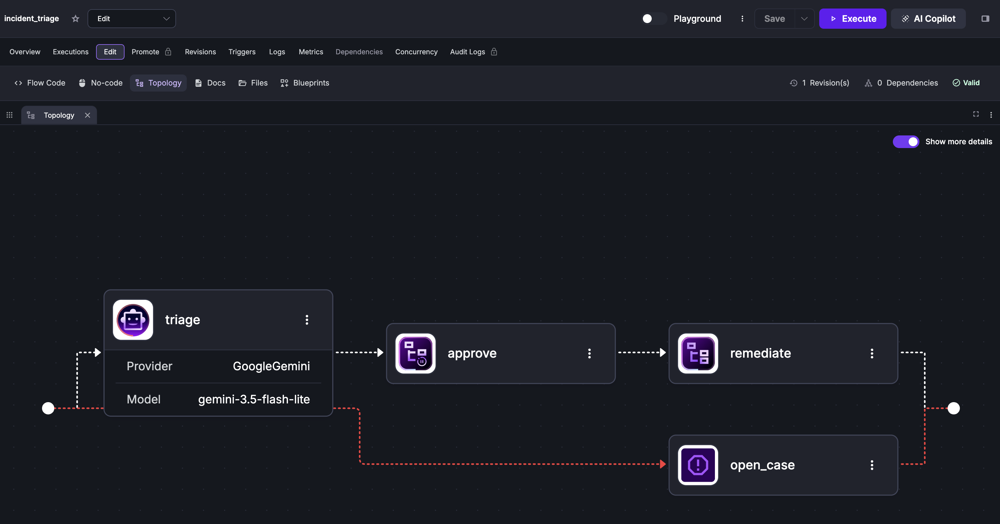
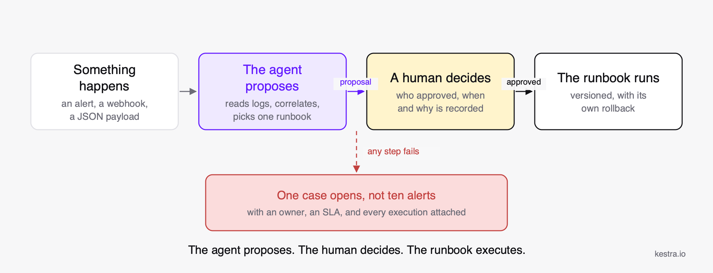

A new job title started appearing on job boards this year: frontier engineer. Consulting firms are hiring for it, Microsoft's Work Trend Index measures how many people already work this way, and OpenAI named its enterprise agent platform after the same word.

If you run automation, data, or platform teams, you are going to be asked what it means and whether you need one. I will show you also how much of this new job role is related to orchestration.

## Definition

A frontier engineer designs and runs systems in which AI agents do part of the work and humans handle the rest. They decide which steps of a process can be delegated to an agent, which must stay deterministic, how the two connect, and what happens when an agent gets it wrong.

The word "frontier" refers to the boundary between what a model can do and what an organisation is willing to let it do in production.


*One process, three kinds of steps. The ML engineer owns how good the agent is at its part; the platform team owns the runbooks and the runtime; the frontier engineer owns the lines between them and the contracts across them.*

## Frontier engineer vs. the roles you already have

| Role | Owns | Does not own |
|---|---|---|
| **ML engineer** | Models: training, evaluation, serving, RAG pipelines | The business process the model sits in |
| **Software engineer** | Application code and its correctness | Cross-system coordination, approvals, operations |
| **Platform / DevOps engineer** | Infrastructure, CI/CD, reliability of the platform | What runs on it and why |
| **Prompt engineer** | The instructions given to a model | Anything after the model answers |
| **Frontier engineer** | The end-to-end process: where agents act, where humans decide, how it is governed and observed | The model itself |

The role breaks into five responsibilities. One is about models: RAG and vector stores. The others are about the system around them: orchestrating multi-agent systems, integrating agent outputs into production, deploying and monitoring agents with guardrails, and building workflows with automation tools.

Microsoft calls the same people "Frontier Professionals" and defines them by three behaviours: using agents for multi-step work, routinely redesigning workflows, and creating shared standards for how their team works with AI.

## What a frontier engineer actually does

### Mapping a process into agentic and fixed steps

I'm going to take an incident response use case. An alert fires, someone reads the logs, correlates them with the last deployments, picks a likely root cause, chooses a runbook, runs it, checks the service is healthy, and records what happened.

The first four steps are research. If the agent picks the wrong root cause, a human reads a wrong proposal and rejects it. Nothing in production has changed. Those steps can go to an agent.

Running the runbook is different. A restart that fires twice, or on the wrong host, is a second incident. That step has to run exactly once, in order, with a rollback if the health check fails, and someone has to own the decision to run it. It stays deterministic, with a human in front of it.

The test for every step is the same: if this is wrong, who notices, how fast, and what does it cost to undo? Cheap to notice and cheap to undo, the step can be agentic. Expensive on either count, it stays fixed or gets an approval in front of it.

### Building the connection between the two

The agent's proposal has to become the input to the runbook step, and free text cannot be that input. So you need to build few steps to make the handover safe.

The agent returns a structured answer: a JSON object with a runbook id, and the id has to be one of the runbooks that exist. Anything else fails validation before it reaches the next step.

The approval is a real step, it records who said yes and why, and the remediation does not start until it has.

Every failure has a defined outcome, an agent timeout, a provider outage and an unknown runbook id are three different failures, and each one should end in a single incident record with the run attached.

Most incidents involving agents in production come down to a missing piece of that handover.

### Giving agents tools, with the right access

In the incident example the agent gets two tools: one that fetches deploy history and recent logs, and read-only access to the observability stack. It cannot restart anything. It holds no cloud credential. Whatever secrets those tools need are resolved by the platform at runtime, so the model never sees them.

The agent gets a short list of operations that someone wrote, reviewed and versioned, each with its own permissions. If the agent needs to do something new, you write the operation, review it, and add it to the list. The system prompt says never execute anything yourself, and the agent will mostly comply, but the reason it cannot restart production is that nothing in its tool list restarts production.

### Making it observable

Every run should leave a record of the model and provider, the prompt as it was sent, every tool call with its arguments and result, the token count and cost, and why the model stopped. The approval step should record who approved and the reason they gave. The remediation should link to whatever it ran.

One run, one page, so when you ask what the agent can reach and what it did you get a full record in a single view.

The same record tells you when to loosen the gate. If the approval has been waved through without changes a few hundred times in a row, the human is no longer adding anything at that step.

### Shipping it like the rest of your code

The workflow definition lives in a repository. Changing what the agent does, its prompt, its tools, the runbooks it may choose from, lives in CI/CD. Someone reviews it, it merges, and a pipeline promotes it from dev to prod with a diff and a recorded approval.

Most agent never get here. The prompt lives in a notebook, the API key in an environment variable, and one person can change either.

Microsoft's report reduces this to three questions every organisation deploying agents has to answer: who reviews agent performance, who has the authority to update the workflows agents run, and how a local win gets captured and scaled. Those three questions are the frontier engineer's job description.

## Why the work is orchestration

Sequencing steps, passing outputs to inputs, gating on human approval, retries and fallbacks, tool permissions, observability, version control, promotion to production. None of that is new. It is what a workflow orchestrator has done for data pipelines and infrastructure automation for years.

Agent frameworks handle the orchestration *inside* an agent: which tool to call next, when to loop, when to hand off to a sub-agent. They do not handle the orchestration *around* it: the deterministic steps before and after, the humans, the other systems, the audit trail. That outer layer is where the frontier engineer spends their time, and it is where a general-purpose orchestrator belongs.

We built Kestra for that outer layer, and agents fit into it the same way any other task does. Here is what the incident example looks like as a flow:

```yaml
id: incident_triage
namespace: ops.sre

inputs:
  - id: alert
    type: JSON

tasks:
  - id: triage
    type: io.kestra.plugin.ai.agent.AIAgent
    # provider injected by a namespace Policy, or add it inline: see /docs/ai-tools/ai-agents
    systemMessage: |
      You are an SRE assistant. Correlate the alert with recent deployments and logs,
      identify the most likely root cause, and propose exactly one remediation from
      the runbook list. Never execute anything yourself.
    prompt: "{{ inputs.alert }}"
    tools:
      - type: io.kestra.plugin.ai.tool.KestraFlow
        namespace: ops.runbooks
        flowId: fetch_context
      - type: io.kestra.plugin.ai.tool.StreamableHttpMcpClient
        url: "{{ secret('OBSERVABILITY_MCP_URL') }}"

  - id: approve
    type: io.kestra.plugin.core.flow.Pause
    onResume:
      - id: approved
        type: BOOL
      - id: reason
        type: STRING

  - id: remediate
    type: io.kestra.plugin.core.flow.Subflow
    runIf: "{{ outputs.approve.onResume.approved }}"
    namespace: ops.runbooks
    flowId: "{{ outputs.triage.textOutput | jq('.runbook') | first }}"
    wait: true

errors:
  - id: open_case
    type: io.kestra.plugin.kestra.ee.cases.CreateCase
    title: "Triage failed for {{ inputs.alert | jq('.service') | first }}"
    linkMatchingExecutions: true
```


*The flow in the Kestra topology view: the agent task, the approval Pause, the remediation subflow, and the error branch that opens a case.*


*The same four steps without the YAML, and the one case that opens if any of them fails.*

The agent is one task. Its tools are other Kestra flows and an MCP server, so it can only do what those flows allow, with their permissions. The decision goes to a human through [`Pause`](/docs/how-to-guides/pause-resume), with a name and a reason recorded on the execution; in the Enterprise edition the same gate can be surfaced to approvers as a form through [Apps](/docs/enterprise/scalability/apps), so they never open the Kestra UI. The remediation is a versioned subflow with its own `errors` block. If anything fails, one [Case](/docs/enterprise/governance/cases) is opened instead of ten alerts.

### Reviewing agent performance is reviewing an execution

The details panel of an [`AIAgent`](/docs/ai-tools/ai-agents) task shows the model and provider, the system prompt, the tools it had, and after the run the full tool-call timeline with arguments and results, token usage and estimated cost, the reasoning chain, and why the model stopped, including guardrail triggers. Counters (`ai.agent.tool.calls`, `ai.provider.calls`) go to Prometheus or OpenTelemetry like any other metric.

### Changing what agents run is a Git commit

Flows are code; they reach production through CI and a promotion with a diff and a recorded approval. Action-level [RBAC](/docs/enterprise/auth/rbac) decides who can edit `ops.runbooks` and who can only resume a Pause. A [Policy](/docs/enterprise/governance/policies) injects the LLM provider and its guardrails into every agent task in a namespace, so no author can point an agent at an unapproved model or strip the system message. Every change lands in the [audit log](/docs/enterprise/governance/audit-logs).

### Scaling a win is copying a flow

A flow that works for one team goes into another namespace, gets parameterised with inputs, and is published as a [blueprint](/docs/concepts/blueprints). Agents call flows as tools with [`KestraFlow`](/plugins/plugin-ai/tool/kestraflow); external agents (Claude, Cursor, your own) call Kestra flows through the [MCP server](/docs/ai-tools/mcp-server), where any flow with an [MCP tool trigger](/docs/workflow-components/triggers/mcp-tool-trigger) becomes a named, permissioned tool.

## Where to start

Here is the shortest path.

1. Run Kestra locally. The [quickstart](/docs/quickstart) is one Docker command; [Docker Compose](/docs/installation/docker-compose) with Postgres if you want something that survives a restart.
2. Wire one agent task. The [AI Agents](/docs/ai-tools/ai-agents) page has a working flow; swap the provider for yours and store the key as a [secret](/docs/concepts/secret). Give it one `KestraFlow` tool pointing at a flow you already have.
3. Put a gate after it. Add a `Pause` with `onResume` inputs ([how-to](/docs/how-to-guides/pause-resume)) and a deterministic task that only runs when `approved` is true.
4. Read the execution. Open the agent task in the topology view and look at the tool-call timeline, the token count and the finish reason. That panel is what you will show your security team.
5. Expose a flow to your coding agent. Point Claude Code or Cursor at the [MCP server](/docs/ai-tools/mcp-server) and add an [MCP tool trigger](/docs/workflow-components/triggers/mcp-tool-trigger) to one flow. You now have an agent outside Kestra calling a governed operation inside it.
6. Start from a blueprint. The [AI blueprints](/blueprints?tags=AI) cover summarisation, classification, RAG and agent-with-tools patterns; most infra and data flows in the library can be handed to an agent as a tool without changes.

## Do you need one?

If your team has more than a couple of agents in production, someone is already doing this job without the title. The useful question is whether they have the tooling for it, or whether the approvals live in Slack, the tool permissions live in an environment variable, and the audit trail is the agent's own logs.

Titles come and go. Deciding where agents act and where humans decide, and building the system that enforces it, does not. That work is orchestration.

---

Sources: [Cognizant, Frontier Certified Engineer announcement](https://news.cognizant.com/2026-06-01-Cognizant-Develops-Frontier-Certified-Engineer-and-Frontier-Business-Operator-Roles-to-Define-the-Next-Generation-of-AI-Powered-Work) and [Frontier Engineer job posting](https://careers.cognizant.com/global-en/jobs/000702458411/frontier-engineer/) · [Microsoft 2026 Work Trend Index](https://www.microsoft.com/en-us/worklab/work-trend-index/agents-human-agency-and-the-opportunity-for-every-organization) · [OpenAI Frontier](https://openai.com/index/introducing-openai-frontier/) · [Kestra AI Agents docs](/docs/ai-tools/ai-agents)

:::alert{type="info"}
If you have any questions, reach out via [Slack](/slack) or open a [GitHub issue](https://github.com/kestra-io/kestra).

If you like the project, give us a [GitHub star](https://github.com/kestra-io/kestra) and join [the community](/slack).
:::
