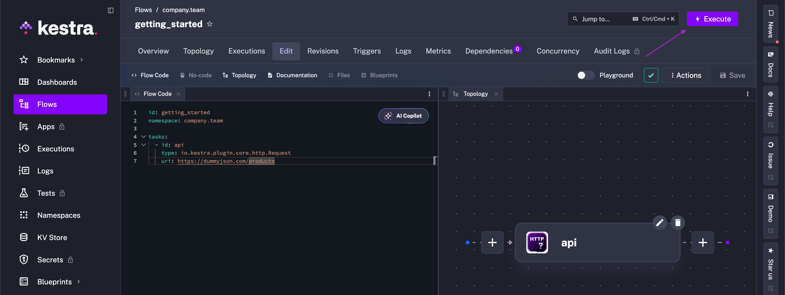
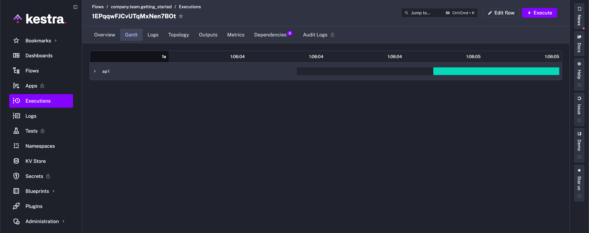

Start by building a simple Hello World flow.

:::alert{type="info"}
If you haven't already, follow the [Quickstart Guide](../../01.quickstart/index.md) or check the detailed [Installation Guide](../../02.installation/index.mdx).
:::

## Build your first Hello World Flow

<div class=video-container>
  <iframe src="https://www.youtube.com/embed/6kV6OqadU90?si=hmEcf3dZGOm8xIV3" title="YouTube video player" allow="accelerometer; autoplay; clipboard-write; encrypted-media; gyroscope; picture-in-picture; web-share" referrerpolicy="strict-origin-when-cross-origin" allowfullscreen></iframe>
</div>

## Flows

[Flows](../../05.workflow-components/01.flow/index.md) are defined in a declarative YAML syntax to keep the orchestration code portable and language-agnostic.

Each flow consists of three required components: `id`, `namespace`, and `tasks`.
1. `id` is the unique identifier of the flow.
2. `namespace` separates projects, teams, and environments.
3. `tasks` is a list of tasks executed in order.

Here are those three components in a YAML file:

```yaml
id: getting_started
namespace: company.team

tasks:
  - id: hello_world
    type: io.kestra.plugin.core.log.Log
    message: Hello World!
```

The `id` of a flow must be unique within its namespace. For example:
- ✅ You **can** have a flow named `getting_started` in `company.team1` and another flow named `getting_started` in `company.team2`.
- ❌ You **cannot** have two flows named `getting_started` in `company.team` at the same time.

The combination of `id` and `namespace` is the unique identifier for a flow.

### Namespaces

[Namespaces](../../05.workflow-components/02.namespace/index.md) are used to group flows and provide structure. Keep in mind that a flow’s allocation to a namespace is immutable. Once a flow is created, you cannot change its namespace. If you need to change the namespace of a flow, create a new flow within the desired namespace and delete the old flow.

### Labels

To add another layer of organization, use [labels](../../05.workflow-components/08.labels/index.md) to group flows with key-value pairs. In short, labels are customizable tags to simplify monitoring and filtering of flows and executions. For example, taking the flow above, we can add a label with the key `tag` to define the flow as `Getting Started`:

```yaml
id: getting_started
namespace: company.team
labels:
  tag: Getting Started

tasks:
  - id: hello_world
    type: io.kestra.plugin.core.log.Log
    message: Hello World!
```

### Descriptions

You can optionally add a [description](../../05.workflow-components/15.descriptions/index.md) property to document your flow's purpose or other useful information. The `description` is a string that supports **markdown** syntax. This markdown description is rendered and displayed in the UI.

:::alert{type="info"}
Not only flows can have a description. You can also add a `description` property to `tasks` and `triggers` to document all the components of your workflow.
:::

Here is the same flow as before, but with labels and descriptions:

```yaml
id: getting_started
namespace: company.team

description: |
  # Getting Started
  Let's `write` some **markdown** - [first flow](https://t.ly/Vemr0) 🚀

labels:
  tag: Getting Started

tasks:
  - id: hello_world
    type: io.kestra.plugin.core.log.Log
    message: Hello World!
    description: |
      ## About this task
      This task prints "Hello World!" to the logs.
```

Learn more about flows in the [Flows page](../../05.workflow-components/01.flow/index.md).

---

## Tasks

Now that you know how to document and organize your flows, it's time to get to the core of orchestration: tasks.

[Tasks](../../05.workflow-components/01.tasks/index.mdx) are atomic actions in your flows. You can design your tasks to be small and granular, such as fetching data from a REST API or running a self-contained Python script. However, tasks can also represent large and complex processes, like triggering containerized processes or long-running batch jobs (e.g., using dbt, Spark, AWS Batch, Azure Batch, etc.) and waiting for their completion.

### Task execution order

Tasks are defined as a **list**. By default, all tasks in the list will be executed **sequentially** — the second task will start as soon as the first one finishes successfully.

Kestra provides additional **customization** to run tasks **in parallel**, iterate (_sequentially or in parallel_) over a list of items, or allow **specific tasks to fail** without stopping the flow. These kinds of actions are called [**Flowable**](../05.flowable/index.md) tasks because they define the flow logic. We'll cover Flowable tasks in more detail later in the tutorial, but for now it is good to know they exist.

A task in Kestra must have an `id` and a `type`. This is similar to how a flow must have an `id` and a `namespace`. Other task properties depend on the task type. You can think of a task as a step in a flow that executes a specific action, such as running a Python or Node.js script in a Docker container or loading data from a database.

We've shown a Log task in some example flows before, and below is the same flow with an additional Python script task added. The Log task runs first and then the Python task (copy and run for yourself to see the results):

```yaml
id: getting_started
namespace: company.team

description: |
  # Getting Started
  Let's `write` some **markdown** - [first flow](https://t.ly/Vemr0) 🚀

labels:
  tag: Getting Started

tasks:
  - id: hello_world
    type: io.kestra.plugin.core.log.Log
    message: Hello World!
    description: |
      ## About this task
      This task prints "Hello World!" to the logs.

  - id: python
    type: io.kestra.plugin.scripts.python.Script
    containerImage: python:slim
    script: |
      print("Hello World!")
```

### Iterate quickly with Playground

When you want to tweak a flow step by step without rerunning everything, use the **Playground** in the editor. It lets you play tasks one at a time, keep prior outputs, and iterate like a notebook. See the short guide in [UI → Playground](../../09.ui/10.playground/index.md) and try it with the `getting_started` example above before moving on.

### Autocompletion

Kestra supports [hundreds of tasks](/plugins) integrating with various external systems. It's not necessary nor possible to memorize all potential tasks or properties (maybe one day) Use the shortcut `CTRL + SPACE` on Windows/Linux or `fn + control + SPACE` on macOS to trigger autocompletion to list available tasks or properties of a given task. Kestra also has built-in documentation accessible through the UI for Flow, Task, and Trigger properties, so you don't have to context switch between building a flow and learning the ins and outs of a component.

:::alert{type="info"}
If you want to comment or uncomment out part of your code, use `CTRL + /` on Windows/Linux or `⌘ + /` on macOS. All available keyboard shortcuts are listed in the code editor context menu.
:::

---

## Create and run a flow

To this point, we have shown some flows to run and get familiar with. Now, let's create a flow to use throughout the rest of the tutorial. Open the **Flows** view and click **+ Create**:


Paste the following code into the Flow editor:

```yaml
id: getting_started
namespace: company.team

tasks:
  - id: api
    type: io.kestra.plugin.core.http.Request
    uri: https://dummyjson.com/products
```

Then, hit the **Save** button.


This flow has a single task that fetches data from the [dummyjson](https://dummyjson.com/) API via an [HTTP Request task](/plugins/core/http/io.kestra.plugin.core.http.request). Run it to see the output.



After execution, you’ll be directed to the Gantt view to see the stages of your flow’s progress. In this simple example, we see the API request successfully execute.



While fetching data is a great first step, it is just that, a first step. In the next sections, with a basic understanding of flows and tasks under our belt, we introduce other critical components to Kestra Flows: Inputs, Outputs, Triggers, and more.
