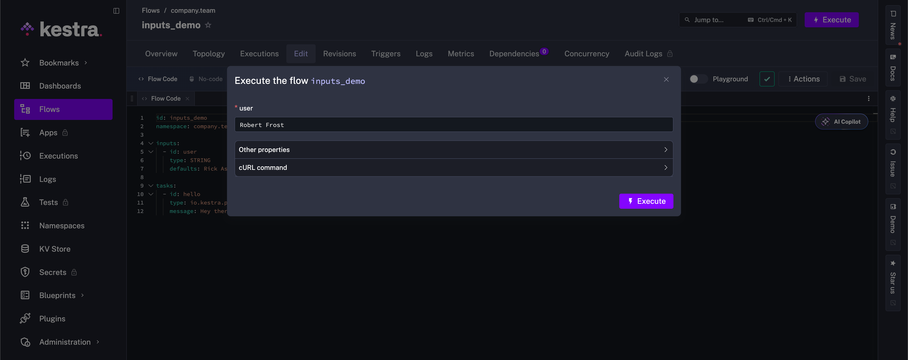

Inputs make your flows more dynamic and reusable.

Instead of hardcoding values in your flow, use inputs to make your workflows more adaptable to change.

## Make Flows dynamic with Inputs

<div class="video-container">
  <iframe src="https://www.youtube.com/embed/uml91UcDd-E?si=5WMFeIQ7gKsb2YB6" title="YouTube video player" allow="accelerometer; autoplay; clipboard-write; encrypted-media; gyroscope; picture-in-picture; web-share" referrerpolicy="strict-origin-when-cross-origin" allowfullscreen></iframe>
</div>

---

## Defining inputs

Similar to `tasks`, `inputs` is defined as a list of key-value pairs. Each input must have an `id` and a `type`. You can also set `defaults` for each input. Setting default values is recommended, especially when running on a schedule. An input might be a user you'd like to send an autogenerated message to, for example taking the following flow:

```yaml
id: inputs_demo
namespace: company.team

inputs:
  - id: user
    type: STRING
    defaults: Zoyd Wheeler

tasks:
  - id: hello
    type: io.kestra.plugin.core.log.Log
    message: Hey there, {{ inputs.user }}
```

In the Log task, you'll notice `inputs.user`. To retrieve an input value, you need to identify the input in an [expression](../../expressions/index.md). In Kestra, bracket notation `{{   }}` is used to wrap an expression. For an input, follow this general `{{ inputs.input_id }}` syntax.

In the example above, the input `id` is set to `user`, and it's referenced in the task message as `{{ inputs.user }}`. Leverage [autocompletion](../01.fundamentals/index.md#autocompletion) in the flow editor to use expressions; they can be tricky at first, let Kestra do the hard work.

:::alert{type="info"}
Hit the `Backspace` or `Delete` key while building your expression? Use the keyboard shortcut to get autocomplete back again - `CTRL + SPACE`. 
:::

Try running the above flow with different values for the `user` input. You can do this by clicking on the **Execute** button and then typing a new string value in the prompt for whatever name you'd like.



:::alert{type="info"}
The plural form `defaults` is used instead of `default` for two reasons. First, `default` is a reserved keyword in Java, so it cannot be used. Second, this property allows you to set default values for a JSON object which can be an array that simultaneously defines multiple default values.
:::

## Input types

Here are the most common input types:

| Type    | Description                                                                                           |
|---------|-------------------------------------------------------------------------------------------------------|
| STRING  | It can be any string value. Strings are not parsed, they are passed as-is to any task that uses them. |
| INT     | It can be any valid integer number (without decimals).                                                |
| BOOLEAN | It must be either `true` or `false`.                                                                  |

This is a very basic list to get started. Check the [Inputs documentation](../../05.workflow-components/05.inputs/index.md) for an extensive list of supported input types and properties.

---

## Parameterize your flow

Now with basic Inputs in our grasp, we can parameterize the flow created earlier in [Fundamentals](../01.fundamentals/index.md#create-and-run-a-flow). In our example below, we provide the URL of the API as an input rather than hardcoded into the Request task's `uri` property. This allows you to change the URL at execution time without modifying the flow itself.

```yaml
id: getting_started
namespace: company.team

inputs:
  - id: api_url
    type: STRING
    defaults: https://dummyjson.com/products

tasks:
  - id: api
    type: io.kestra.plugin.core.http.Request
    uri: "{{ inputs.api_url }}"
```

To learn more about input types, properties, and more advanced uses, check out the full [Inputs documentation](../../05.workflow-components/05.inputs/index.md). Next, we check out flow results and how they can be used.
