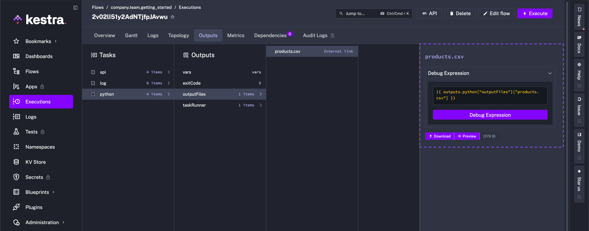
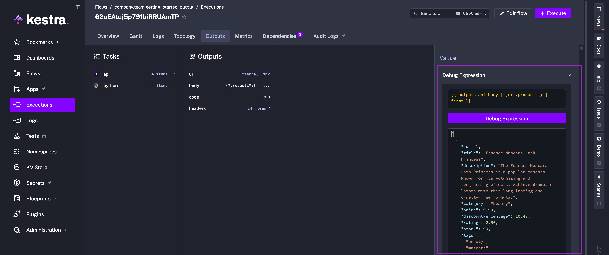

Outputs let you pass data between tasks and flows.

## Pass Outputs between Tasks

Tasks and flows can generate outputs that are passed to downstream processes. To do this, Kestra uses internal storage. Tasks from the `io.kestra.plugin.core.storage` category, along with [Outputs](../../05.workflow-components/06.outputs/index.md), interact with internal storage. You can think of internal storage like an S3 bucket, including your own private bucket.

This storage layer helps avoid connector sprawl. For example, the PostgreSQL plugin can extract data and load it into internal storage. Other tasks can then load that data into Snowflake, BigQuery, or Redshift — or process it with another plugin — without direct point-to-point connections. Let's check out Outputs in practice.

<div class="video-container">
  <iframe src="https://www.youtube.com/embed/G7rH-VpMOUc?si=sG7Ky8nZMTx98y36" title="YouTube video player" allow="accelerometer; autoplay; clipboard-write; encrypted-media; gyroscope; picture-in-picture; web-share" referrerpolicy="strict-origin-when-cross-origin" allowfullscreen></iframe>
</div>

## How to retrieve outputs

To see which outputs have been generated during a flow execution, go to the **Outputs** tab on the Execution page:


Outputs are useful for troubleshooting and auditing. Additionally, you can use outputs to:
- share **downloadable artifacts** with business stakeholders (e.g., a table generated by a SQL query or a CSV file generated by a Python script)
- **pass data** between decoupled processes (e.g., pass subflow's outputs or a file detected by S3 trigger to downstream tasks)

Similar to Inputs, use [expressions](../../expressions/index.md) to access Outputs in downstream tasks. Use the syntax `{{ outputs.task_id.output_property }}` to retrieve a specific output value of a task.

If your task `id` contains one or more hyphens (`-`), wrap the task `id` in square brackets, for example: `{{ outputs['task-id'].output_property }}`. Referring back to our flow, you'll have seen that one of the outputs is the API status code (e.g., 200). We can access this output in a downstream task with an expression in a Log task, for example:

```yaml
id: getting_started
namespace: company.team

inputs:
  - id: api_url
    type: STRING
    defaults: https://dummyjson.com/products

tasks:
  - id: api
    type: io.kestra.plugin.core.http.Request
    uri: "{{ inputs.api_url }}"

  - id: log
    type: io.kestra.plugin.core.log.Log
    message: "API Status Code: {{ outputs.api.code }}"
```

---

## Use outputs in your flow

While returning status code is good for unit testing a flow, typically when fetching data from a REST API we want to use that data. Kestra stores that fetched data in the internal storage and makes it available to downstream tasks using the `body` output argument.

Use the `{{ outputs.task_id.body }}` syntax to process that fetched data in a downstream task. To demonstrate, we can add a [Python script](plugins/plugin-script-python/io.kestra.plugin.scripts.python.script) task to our flow below.

:::alert{type="info"}
Kestra is language-agnostic — run custom scripts in any flow. You can run Python, Node.js, R, Julia, and an ever-growing number of languages; or execute commands in shell or PowerShell. Check out the [Scripts documentation](../../16.scripts/index.mdx) for more!
:::

```yaml
id: getting_started_output
namespace: company.team

inputs:
  - id: api_url
    type: STRING
    defaults: https://dummyjson.com/products

tasks:
  - id: api
    type: io.kestra.plugin.core.http.Request
    uri: "{{ inputs.api_url }}"

  - id: log
    type: io.kestra.plugin.core.log.Log
    message: "API Status Code: {{ outputs.api.code }}"

  - id: python
    type: io.kestra.plugin.scripts.python.Script
    containerImage: python:slim
    beforeCommands:
      - pip install polars
    outputFiles:
      - "products.csv"
    script: |
      import polars as pl
      data = {{outputs.api.body | jq('.products') | first}}
      df = pl.from_dicts(data)
      df.glimpse()
      df.select(["brand", "price"]).write_csv("products.csv")
```

This flow processes data using Polars and stores the result as a CSV file.



:::alert{type="info"}
To avoid package dependency conflicts, the Python task runs in an **independent Docker container**. You can optionally provide a **custom Docker image** from a private container registry or use a public Python image from DockerHub and install any custom package dependencies using the `beforeCommands` argument. The `beforeCommands` argument allows you to install any custom package dependencies — here, we install [Polars](https://www.pola.rs/). Use as many commands as needed to prepare the containerized environment for script execution.
:::

## Debug expressions

When referencing the output from the previous task, this flow uses `jq` [language](https://en.wikipedia.org/wiki/Jq_(programming_language)) to extract the `products` array from the API response — `jq` is available in all Kestra tasks without having to install it.

You can test `{{ outputs.task_id.body | jq('.products') | first }}` and any other output parsing expression using the built-in expressions evaluator on the **Outputs** page:



---

## Passing data between tasks

So now our flow is able to handle different API endpoints through an input, extract that API's data as an output, and pass that output to a custom Python script to package the data into a usable CSV file.

Let's add another task to process the CSV file generated by the Python script task. We can pass the file from internal storage to the `io.kestra.plugin.jdbc.duckdb.Query` ([DuckDB Plugin](/plugins/plugin-jdbc-duckdb)) task to run a SQL query on the CSV file and store the result as a downloadable artifact in internal storage.

```yaml
id: getting_started
namespace: company.team

inputs:
  - id: api_url
    type: STRING
    defaults: https://dummyjson.com/products

tasks:
  - id: api
    type: io.kestra.plugin.core.http.Request
    uri: "{{ inputs.api_url }}"

  - id: python
    type: io.kestra.plugin.scripts.python.Script
    containerImage: python:slim
    beforeCommands:
      - pip install polars
    outputFiles:
      - "products.csv"
    script: |
      import polars as pl
      data = {{ outputs.api.body | jq('.products') | first }}
      df = pl.from_dicts(data)
      df.glimpse()
      df.select(["brand", "price"]).write_csv("products.csv")

  - id: sqlQuery
    type: io.kestra.plugin.jdbc.duckdb.Query
    inputFiles:
      in.csv: "{{ outputs.python.outputFiles['products.csv'] }}"
    sql: |
      SELECT brand, round(avg(price), 2) as avg_price
      FROM read_csv_auto('{{ workingDir }}/in.csv', header=True)
      GROUP BY brand
      ORDER BY avg_price DESC;
    store: true
```

This example flow passes data between tasks using Outputs. The `inputFiles` argument of the `io.kestra.plugin.jdbc.duckdb.Query` task allows you to pass files from internal storage to the task. The `store: true` property ensures that the result of the SQL query is stored in the internal storage and can be previewed and downloaded from the Outputs tab.


To sum up, our flow extracts data from an API, uses that data in a Python script, executes a SQL query, and generates a downloadable artifact.

:::alert{type="info"}
If you encounter any issues while executing the above flow, this might be a Docker-related issue (i.e., Docker-in-Docker setup, which can be difficult to configure on Windows). Set the runner property to `PROCESS` to run the Python script task in the same process as the flow rather than in a Docker container, as shown in the example below. This will avoid any Docker related issues.
:::

```yaml
id: getting_started
namespace: company.team

inputs:
  - id: api_url
    type: STRING
    defaults: https://dummyjson.com/products

tasks:
  - id: api
    type: io.kestra.plugin.core.http.Request
    uri: "{{ inputs.api_url }}"

  - id: python
    type: io.kestra.plugin.scripts.python.Script
    taskRunner:
      type: io.kestra.plugin.core.runner.Process # Runs the Python script in the same process as the flow rather than a Docker container
    beforeCommands:
      - pip install polars
    outputFiles:
      - "products.csv"
    script: |
      import polars as pl
      data = {{ outputs.api.body | jq('.products') | first }}
      df = pl.from_dicts(data)
      df.glimpse()
      df.select(["brand", "price"]).write_csv("products.csv")

  - id: sqlQuery
    type: io.kestra.plugin.jdbc.duckdb.Query
    inputFiles:
      in.csv: "{{ outputs.python.outputFiles['products.csv'] }}"
    sql: |
      SELECT brand, round(avg(price), 2) as avg_price
      FROM read_csv_auto('{{ workingDir }}/in.csv', header=True)
      GROUP BY brand
      ORDER BY avg_price DESC;
    store: true
```

Outputs can be used in many ways to connect tasks and flows. To learn more about Outputs, check out the full [Outputs documentation](../../05.workflow-components/06.outputs/index.md). Next, instead of relying on a manual click, we'll set up the flow to run automatically with a Trigger.
