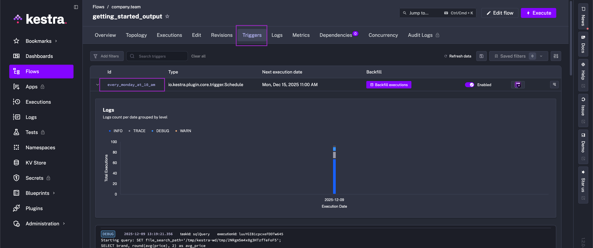

Triggers automatically start your flow based on events or a schedule.

## Automate Flows with Triggers

A trigger can be a scheduled date, the arrival of a new file, a new message in a queue, the completion of another flow's execution and much more.

<div class="video-container">
  <iframe src="https://www.youtube.com/embed/iDOE9GmPUQ0?si=A0FgtqPa0g2W5oFQ" title="YouTube video player" allow="accelerometer; autoplay; clipboard-write; encrypted-media; gyroscope; picture-in-picture; web-share" referrerpolicy="strict-origin-when-cross-origin" allowfullscreen></iframe>
</div>

## Defining triggers

Like `inputs` and `tasks`, use the `triggers` keyword in the flow to define a list of triggers. You can have several triggers attached to a flow. The `trigger` definition is similar to a task definition — it contains an `id`, a `type`, and additional properties specific to the trigger type.

To get introduced, take a look at the flow below. The `schedule_trigger` define a `cron` expression to run every day at 10 AM. The [Schedule trigger](../../05.workflow-components/07.triggers/01.schedule-trigger/index.md) is great for nightly jobs and other static schedule-oriented workflows. However, Kestra does not limit you to this schedule-based orchestration.

You'll also see that the workflow below also has the `flow_trigger` which automatically triggers this `getting_started` flow whenever the `first_flow` defined in the conditions finishes its execution. So a flow can not only be triggered based on time, but also it can be triggered on an event, even events, – all independent of each other. Some possibilities are – but are not limited to – a change in a [Google Sheet](/plugins/plugin-googleworkspace/sheets/io.kestra.plugin.googleworkspace.sheets.sheetmodifiedtrigger), a new file in an [S3 bucket](/plugins/plugin-aws/s3/io.kestra.plugin.aws.s3.trigger), a [PostgreSQL database](/plugins/plugin-jdbc-postgres/io.kestra.plugin.jdbc.postgresql.trigger) query result, or even when an [e-mail is received](/plugins/plugin-email/io.kestra.plugin.email.realtimetrigger) in real time, and the list goes on.

```yaml
id: getting_started
namespace: company.team

tasks:
  - id: hello_world
    type: io.kestra.plugin.core.log.Log
    message: Hello World!

triggers:
  - id: schedule_trigger
    type: io.kestra.plugin.core.trigger.Schedule
    cron: 0 10 * * *

  - id: flow_trigger
    type: io.kestra.plugin.core.trigger.Flow
    conditions:
      - type: io.kestra.plugin.core.condition.ExecutionFlow
        namespace: company.team
        flowId: first_flow
```

:::alert{type="info"}
Schedules default to UTC. To use a different time zone, set the `timezone` property on the `Schedule` trigger (for example, `America/New_York`).
:::

---

## Add a trigger to your flow

Building on the example flow from the previous pages, we can add one of the above triggers to the flow. For example, take the following and ensure our flow runs every Monday at 10 AM to get the latest product data.

```yaml
triggers:
  - id: every_monday_at_10_am
    type: io.kestra.plugin.core.trigger.Schedule
    cron: 0 10 * * 1
```
The `getting_started` flow now runs every Monday at 10 AM, starting the week with the latest product data.

```yaml
id: getting_started
namespace: company.team

inputs:
  - id: api_url
    type: STRING
    defaults: https://dummyjson.com/products

tasks:
  - id: api
    type: io.kestra.plugin.core.http.Request
    uri: "{{ inputs.api_url }}"

  - id: python
    type: io.kestra.plugin.scripts.python.Script
    containerImage: python:slim
    beforeCommands:
      - pip install polars
    outputFiles:
      - "products.csv"
    script: |
      import polars as pl
      data = {{ outputs.api.body | jq('.products') | first }}
      df = pl.from_dicts(data)
      df.glimpse()
      df.select(["brand", "price"]).write_csv("products.csv")

  - id: sqlQuery
    type: io.kestra.plugin.jdbc.duckdb.Query
    inputFiles:
      in.csv: "{{ outputs.python.outputFiles['products.csv'] }}"
    sql: |
      SELECT brand, round(avg(price), 2) as avg_price
      FROM read_csv_auto('{{ workingDir }}/in.csv', header=True)
      GROUP BY brand
      ORDER BY avg_price DESC;
    store: true


triggers:
  - id: every_monday_at_10_am
    type: io.kestra.plugin.core.trigger.Schedule
    cron: 0 10 * * 1
```

With a trigger added to a flow, you can now see the trigger's details in the flow's **Triggers** tab.



To learn more about Triggers, check out the full [Triggers documentation](../../05.workflow-components/07.triggers/index.mdx). Next up, we'll check out Flowable tasks – ways to loop, condition, and parallelize tasks.
