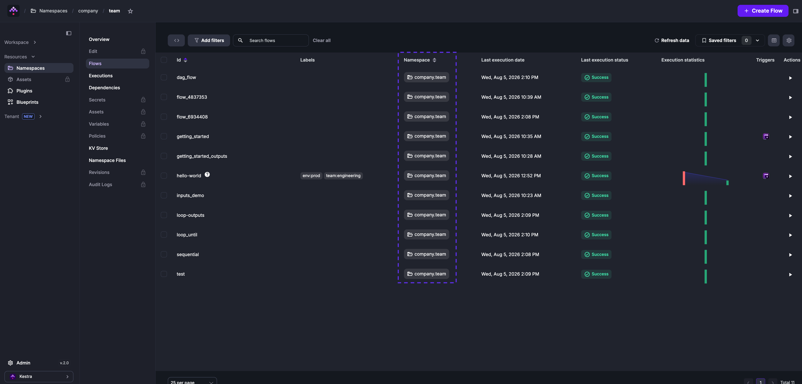
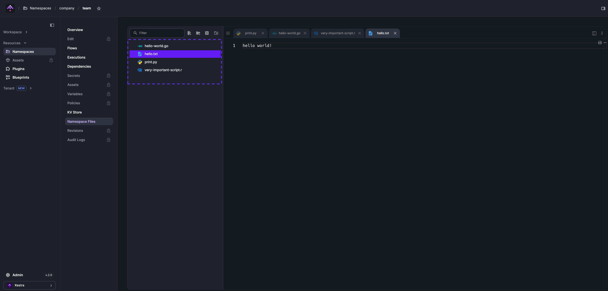
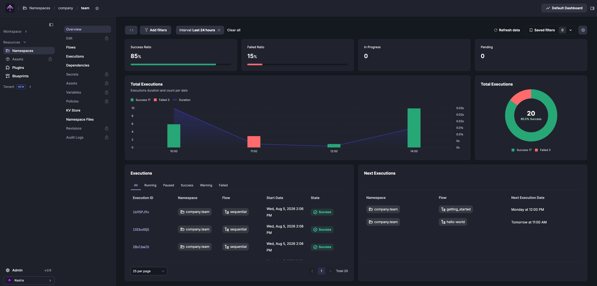

Namespaces are logical groupings of flows that control access to secrets, key-value pairs, plugin defaults, and variables.

Namespaces form a dot-separated hierarchy with no enforced depth limit, separating environments, teams, and projects within a single instance. Namespace names consist of lowercase alphanumeric characters, dots, underscores, and hyphens. They must start with a letter or digit and have a maximum length of 150 characters:

- `project_one`
- `company.project_two`
- `company.team.project_three`

To fully isolate environments with their own resources, see [Tenants](../../07.enterprise/02.governance/tenants/index.md) (Enterprise Edition).

<div class="video-container">
  <iframe src="https://www.youtube.com/embed/_HGz2qePYqY?si=QiIRTXasyJyyjWX4" title="YouTube video player" allow="accelerometer; autoplay; clipboard-write; encrypted-media; gyroscope; picture-in-picture; web-share" referrerpolicy="strict-origin-when-cross-origin" allowfullscreen></iframe>
</div>

## The `namespace` property

The `namespace` property is required on every flow and declares which namespace the flow belongs to:

```yaml
id: hello_world
namespace: company.team
tasks:
  - id: log_task
    type: io.kestra.plugin.core.log.Log
    message: hi from {{ flow.namespace }}
```

:::alert{type="warning"}
Once you save a flow, its namespace cannot be changed. Create a new flow to move it to a different namespace.
:::



## Namespace Files

Each namespace has an embedded code editor for managing scripts, configuration, and other files shared across flows in that namespace. Namespace Files are managed through the [Namespace Files](../../06.concepts/02.namespace-files/index.md) tab or synced from [Git](../../version-control-cicd/04.git/index.md).



## Namespace overview

Open any namespace to see its execution dashboards, flows, dependencies, and [KV Store](../../06.concepts/05.kv-store/index.md). Namespaces are also accessible via [`kestractl namespaces list`](../../kestra-cli/kestractl/index.md).

Tabs marked with a lock icon (Edit, Secrets, Credentials, Assets, Variables, Policies, Reusable Inputs, Revisions, and Audit Logs) are available in Kestra EE. See the [Enterprise Edition documentation](../../07.enterprise/index.mdx) for details.


