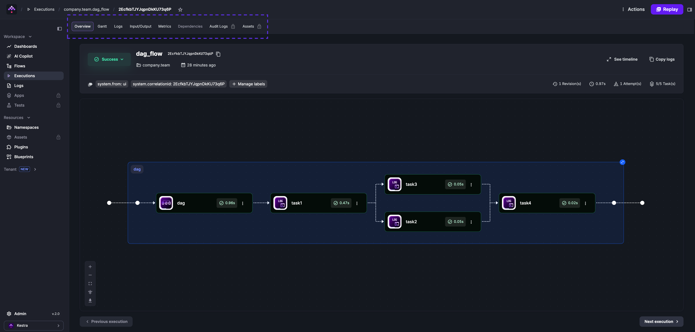

An execution is a single run of a flow with a specific state.

<div class="video-container">
  <iframe src="https://www.youtube.com/embed/6TqWWz9difM?si=cUKVVbohgNjlpd19" title="YouTube video player" allow="accelerometer; autoplay; clipboard-write; encrypted-media; gyroscope; picture-in-picture; web-share" referrerpolicy="strict-origin-when-cross-origin" allowfullscreen></iframe>
</div>

Each execution contains one or more [task runs](../01.tasks/02.taskruns/index.md) — one per task in the flow. Task runs support [retries](../12.retries/index.md): if retries are configured, a failure generates new attempts until the `maxAttempts` or `maxDuration` threshold is reached.



## Outputs

Each task can produce output data — variables or files stored in Kestra's internal storage — that downstream tasks in the same execution can reference. View outputs in the **Outputs** tab of the execution page. See the [Outputs page](../../05.workflow-components/06.outputs/index.md) for details.

## Metrics

Tasks can expose metrics such as file size, row count, or query duration. View them in the **Metrics** tab of the execution page, or on the task's plugin documentation page.

```yaml
id: load_data_to_bigquery
namespace: company.team

tasks:
  - id: http_download
    type: io.kestra.plugin.core.http.Download
    uri: https://huggingface.co/datasets/kestra/datasets/raw/main/csv/orders.csv

  - id: load_bigquery
    type: io.kestra.plugin.gcp.bigquery.Load
    autodetect: true
    csvOptions:
      fieldDelimiter: ","
    destinationTable: kestra-dev.demo.orders
    format: CSV
    from: "{{ outputs.http_download.uri }}"
```

## States

Executions and task runs move through the following states:

| State | Description |
| - | - |
| `CREATED` | Waiting to be processed — queued but not yet started. |
| `RUNNING` | Currently being processed. |
| `PAUSED` | Paused for manual validation or a configured delay. |
| `SUCCESS` | Completed successfully. |
| `WARNING` | Completed with warnings — execution continued but was flagged. |
| `FAILED` | Encountered errors that caused the execution to fail. |
| `KILLING` | Kill command issued; system is terminating associated tasks. |
| `KILLED` | Killed on request — no further tasks will run. |
| `RESTARTED` | Transitional state equivalent to `CREATED` for a restarted failed execution. |
| `CANCELLED` | Aborted due to a [concurrency limit](../14.concurrency/index.md) or [SLA](../18.sla/index.md) with `CANCEL` behavior. |
| `QUEUED` | On hold due to a concurrency limit with `QUEUE` behavior. |
| `RETRYING` | Currently being [retried](../12.retries/index.md). |
| `RETRIED` | Stopped and created a new execution as defined by a [flow-level retry policy](../12.retries/index.md#flow-level-retries) with `CREATE_NEW_EXECUTION` behavior. |

For a detailed overview of state transitions, see the [States](../17.states/index.md) page.

## Execution expressions

| Parameter | Description |
| - | - |
| `{{ execution.id }}` | Unique identifier generated for each execution. |
| `{{ execution.startDate }}` | Start date of the current execution; can be formatted with `{{ execution.startDate \| date("yyyy-MM-dd HH:mm:ss.SSSSSS") }}`. |
| `{{ execution.originalId }}` | The original execution ID — never changes across replays. |

## Execute from the UI

Click **Execute** on the flow page to trigger a run manually.

## Use automatic triggers

Add a [Schedule trigger](../07.triggers/01.schedule-trigger/index.md) to launch executions on a time interval, or a [Flow trigger](../07.triggers/index.mdx) to launch an execution when another flow completes — useful for namespace-level error handling or event-driven patterns where flows are decoupled rather than explicitly calling each other as subflows.

Use a [Webhook trigger](../07.triggers/03.webhook-trigger/index.md) to launch an execution from an external HTTP request. Access the request body with `{{ trigger.body }}` and headers with `{{ trigger.headers }}`. See the [Webhooks how-to guide](../../15.how-to-guides/webhooks/index.md) for setup and real-world examples.

```bash
http://<kestra-host>:<kestra-port>/api/v1/main/executions/webhook/<namespace>/<flow-id>/<webhook-key>
```

## Execute via API

Trigger an execution by calling the [API](../../api-reference/index.mdx) directly. Given this flow:

```yaml
id: hello_world
namespace: company.team

inputs:
  - id: greeting
    type: STRING
    defaults: hey

tasks:
  - id: hello
    type: io.kestra.plugin.core.log.Log
    message: "{{ inputs.greeting }}"
```

Trigger it with `curl`:

```bash
curl -X POST http://localhost:8080/api/v1/main/executions/company.team/hello_world
```

### Execute a specific revision

```bash
curl -X POST http://localhost:8080/api/v1/main/executions/company.team/hello_world?revision=2
```

### Execute with inputs

Pass inputs as form data:

```bash
curl -X POST http://localhost:8080/api/v1/main/executions/company.team/hello_world \
-F greeting="hey there"
```

For multiple input types:

```bash
curl -v "http://localhost:8080/api/v1/main/executions/company.team/kestra-inputs" \
    -H "Transfer-Encoding:chunked" \
    -H "Content-Type:multipart/form-data" \
    -F string="a string" \
    -F int=1 \
    -F float=1.255 \
    -F boolean=true \
    -F instant="2023-12-24T23:00:00.000Z" \
    -F "files=@/tmp/128M.txt;filename=file"
```

### Execute with FILE inputs

Pass files as multipart form data named `files`, with a `filename` header matching the input ID:

```yaml
id: large_json_payload
namespace: company.team

inputs:
  - id: myCustomFileInput
    type: FILE

tasks:
  - id: hello
    type: io.kestra.plugin.scripts.shell.Commands
    inputFiles:
      myfile.json: "{{ inputs.myCustomFileInput }}"
    taskRunner:
      type: io.kestra.plugin.core.runner.Process
    commands:
      - cat myfile.json
```

```bash
curl -X POST -F "files=@./myfile.json;filename=myCustomFileInput" \
  'http://localhost:8080/api/v1/main/executions/company.team/large_json_payload'
```

:::alert{type="info"}
Prefer FILE-type inputs for large payloads. Files are stored in internal storage (S3, GCS, Azure Blob), whereas JSON-type inputs or raw webhook bodies are stored directly in the database.
:::

### Get a URL to follow execution progress

The executions endpoint returns a `url` field in its response, which links directly to the execution in the UI:

```bash
curl -X POST http://localhost:8080/api/v1/main/executions/company.team/myflow
```

```json
{
  "id": "1ZiZQWCHj7bf9XLtgvAxyi",
  "url": "http://localhost:8080/ui/executions/company.team/myflow/1ZiZQWCHj7bf9XLtgvAxyi"
}
```

To receive a full URL rather than a path suffix, configure your instance URL in [Runtime and Storage configuration](../../configuration/02.runtime-and-storage/index.md):

```yaml
kestra:
  url: http://localhost:8080
```

### Execute via API in Python

```python
import requests
from requests_toolbelt.multipart.encoder import MultipartEncoder

with open("/tmp/128M.txt", 'rb') as fh:
  url = "http://kestra:8080/api/v1/main/executions/company.team/hello_world"
  mp_encoder = MultipartEncoder(fields={
    "string": "a string",
    "int": 1,
    "float": 1.255,
    "datetime": "2025-04-20T13:00:00.000Z",
    "files": ("file", fh, "text/plain")
  })
  result = requests.post(
      url,
      data=mp_encoder,
      headers={"Content-Type": mp_encoder.content_type},
  )
```

## Webhook vs. API call

:::alert{type="info"}
- Use the **webhook trigger** when you want to pass arbitrary metadata from an external event (GitHub PR merged, new SaaS record, etc.) to the flow via `{{ trigger.body }}` and `{{ trigger.headers }}`.
- Use an **API call** when you only need to pass typed inputs and don't need an arbitrary payload.
:::

## Execute via kestractl

```bash
# Run a flow and wait for completion
kestractl executions run prod nightly-refresh --wait

# Run a flow and get the result as JSON
kestractl executions run prod nightly-refresh --wait --output json
```

See [kestractl](../../kestra-cli/kestractl/index.md) for the full command reference.

## Execute from Python

Use the [kestra pip package](https://github.com/kestra-io/libs) to trigger executions without crafting HTTP requests manually:

```bash
pip install kestra
```

```python
from kestra import Flow
flow = Flow()
flow.execute('company.team', 'hello_world', {'greeting': 'hello from Python'})
```

To pass a FILE input:

```python
import os
from kestra import Flow

os.environ["KESTRA_HOSTNAME"] = "http://host.docker.internal:8080"

flow = Flow()
with open('example.txt', 'rb') as fh:
    flow.execute('company.team', 'myflow', {'files': ('myfile', fh, 'text/plain')})
```

`files` takes a tuple: `('input_id', file_object, 'content_type')`.
