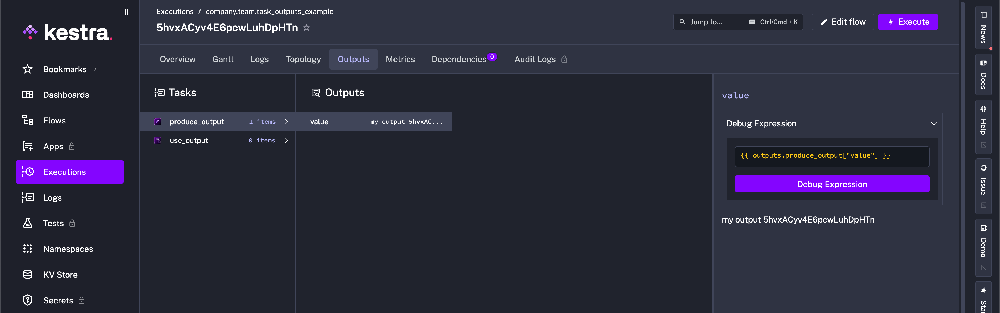
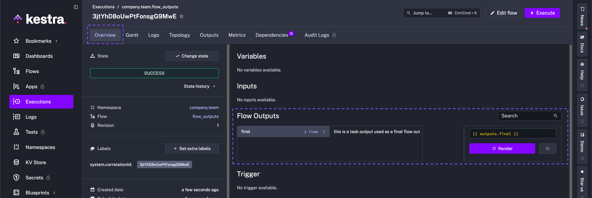
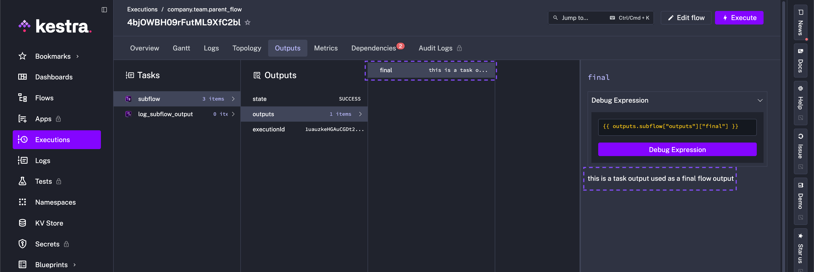
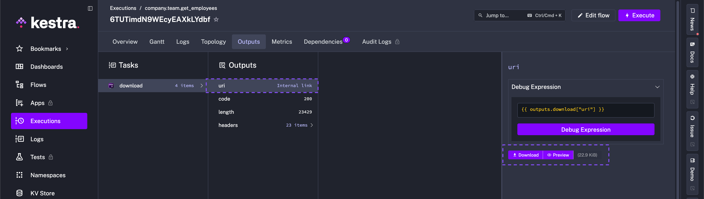
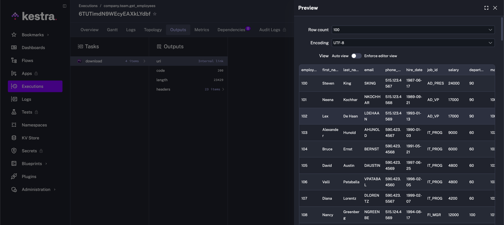
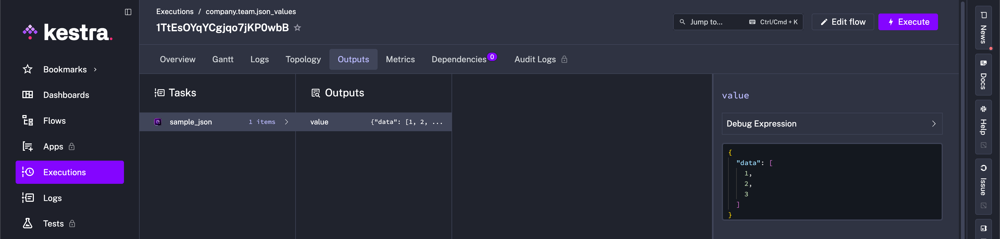
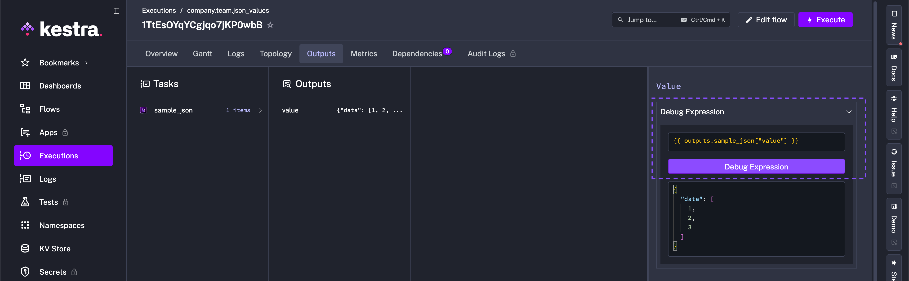
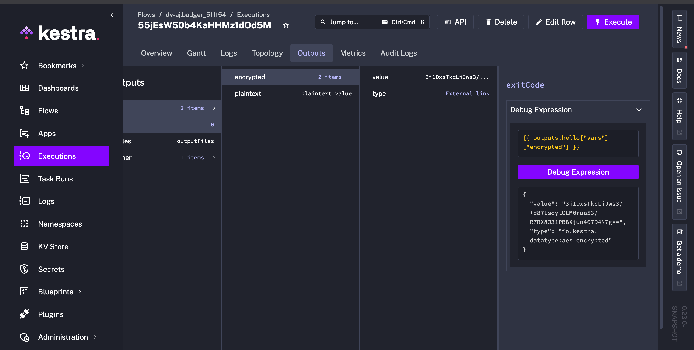

Outputs let you pass data between tasks and flows.

<div class="video-container">
  <iframe src="https://www.youtube.com/embed/j6Iyn5rCeRI?si=2al6ZgqzfNqAJ0Wf" title="YouTube video player" allow="accelerometer; autoplay; clipboard-write; encrypted-media; gyroscope; picture-in-picture; web-share" referrerpolicy="strict-origin-when-cross-origin" allowfullscreen></iframe>
</div>

A workflow execution can generate **outputs**. Outputs are stored in the flow’s execution context and can be accessed by all downstream tasks and flows.

Each task defines its own output attributes — see the task’s documentation for details.

You can retrieve outputs from other tasks within all [dynamic properties](../01.tasks/index.mdx#dynamic-vs-static-task-properties).

:::alert{type="warning"}
**Do not use Outputs to fetch sensitive data (such as passwords, secrets, or API tokens).**

Fetching Secrets from an external Secrets Manager via a task imposes a significant security risk. All data fetched via outputs is **stored in clear text in multiple places** (including the backend database, internal storage, logs, API requests).

For secure handling of secrets, **exclusively** use [Secrets](../../06.concepts/04.secret/index.md). [Kestra EE](../../07.enterprise/02.governance/secrets-manager/index.md) and [Kestra Cloud](/cloud) offer reliable secrets management including native integrations with various [secrets managers](../../07.enterprise/02.governance/secrets-manager/index.md).
:::

## Using outputs

Below is an example of how to use the output of the `produce_output` task in the `use_output` task. We use the [Return](/plugins/core/debug/io.kestra.plugin.core.debug.return) task that has one output attribute named `value`.

```yaml
id: task_outputs_example
namespace: company.team

tasks:
  - id: produce_output
    type: io.kestra.plugin.core.debug.Return
    format: my output {{ execution.id }}

  - id: use_output
    type: io.kestra.plugin.core.log.Log
    message: The previous task output is {{ outputs.produce_output.value }}
```

In this example, the first task produces an output from the `format` property. This output attribute is then used in the second task `message` property.

The expression `{{ outputs.produce_output.value }}` references the previous task output attribute.

:::alert{type="info"}
In the example above, the **Return** task produces an output attribute `value`. Every task produces different output attributes. You can look at each task outputs documentation or use the **Outputs** tab of the **Executions** page to find out about specific task output attributes.
:::

The **Outputs** tab shows the output for `produce_output` task. There is no output for `use_output` task as it only logs a message.



In the next example, we can see a file is passed between an input and a task, where the task generates a new file as an output:

```yaml
id: bash_with_files
namespace: company.team

description: This flow shows how to pass files between inputs and tasks in Shell scripts.

inputs:
  - id: file
    type: FILE

tasks:
  - id: rename
    type: io.kestra.plugin.scripts.shell.Commands
    commands:
      - mv file.tmp output.tmp
    inputFiles:
      file.tmp: "{{ inputs.file }}"
    outputFiles:
      - "*.tmp"
```

:::alert{type="info"}
Since 0.14, Outputs are no longer rendered recursively. You can read more about this change and how to change this behavior in the [0.14 Migration guide](../../11.migration-guide/v0.14.0/recursive-rendering/index.md).
:::

## Internal storage

Each task can store data in Kestra's internal storage. If an output is stored in internal storage, it contains a URI pointing to the file location. This output attribute could be used by other tasks to access the stored data.

The following example stores the query results in internal storage, then accesses it in the `write_to_csv` task:

```yaml
id: output_sample
namespace: company.team

tasks:
  - id: output_from_query
    type: io.kestra.plugin.gcp.bigquery.Query
    sql: |
      SELECT * FROM `bigquery-public-data.wikipedia.pageviews_2023`
      WHERE DATE(datehour) = current_date()
      ORDER BY datehour desc, views desc
      LIMIT 10
    store: true

  - id: write_to_csv
    type: io.kestra.plugin.serdes.csv.IonToCsv
    from: "{{ outputs.output_from_query.uri }}"
```

## Flow outputs

A flow can also produce strongly typed outputs. You can add them using the `outputs` attribute in the flow definition.

Here is an example of a flow that produces an output:

```yaml
id: flow_outputs
namespace: company.team

tasks:
  - id: mytask
    type: io.kestra.plugin.core.debug.Return
    format: this is a task output used as a final flow output

outputs:
  - id: final
    type: STRING
    value: "{{ outputs.mytask.value }}"
```

An Output can have one of the following types: `ARRAY`, `BOOLEAN`, `DATE`, `DATETIME`, `DURATION`, `EMAIL`, `ENUM`, `FILE`, `FLOAT`, `INT`, `JSON`, `MULTISELECT`, `SECRET`, `STRING`, `TIME`, `URI`, or `YAML`.

Outputs are defined as a list of key-value pairs. The `id` is the name of the output attribute (must be unique within a flow), and the `value` is the value of the output. You can also add a `description` to the output.

Flow outputs appear in the **Overview** tab of the **Executions** page.



### Pass data between flows using flow outputs

Here is how you can access the flow output in a parent flow:

```yaml
id: parent_flow
namespace: company.team

tasks:
  - id: subflow
    type: io.kestra.plugin.core.flow.Subflow
    flowId: flow_outputs
    namespace: company.team
    wait: true

  - id: log_subflow_output
    type: io.kestra.plugin.core.log.Log
    message: "{{ outputs.subflow.outputs.final }}"
```

In the example above, the `subflow` task produces an output attribute `final`. This output attribute is then used in the `log_subflow_output` task.

:::alert{type="info"}
Note how the `outputs` are set twice within the `"{{outputs.subflow.outputs.final}}"`:
1. once to access outputs of the `subflow` task
2. once to access the outputs of the subflow itself — specifically, the `final` output
:::

Here is what you will see in the **Outputs** tab of the **Executions** page in the parent flow:



### Return outputs conditionally

You can return different outputs based on conditions. For instance, if a given task is skipped, you may want to return a fallback value or return the output of another task. Here is an example of how you can achieve this:

```yaml
id: conditionally_return_output
namespace: company.team

inputs:
  - id: run_task
    type: BOOLEAN
    defaults: true

tasks:
  - id: main
    type: io.kestra.plugin.core.debug.Return
    format: Hello World!
    runIf: "{{ inputs.run_task }}"

  - id: fallback
    type: io.kestra.plugin.core.debug.Return
    format: fallback output

outputs:
  - id: flow_output
    type: STRING
    value: "{{ tasks.main.state != 'SKIPPED' ? outputs.main.value : outputs.fallback.value }}"
```

Note how the Ternary Operator `{{ condition ? value_if_true : value_if_false }}` is used in the output expression `{{ tasks.main.state != 'SKIPPED' ? outputs.main.value : outputs.fallback.value }}` to return the output of the `main` task if it is not skipped, otherwise, it returns the output of the `fallback` task.

## Loop outputs and iteration context

### Current iteration value

Inside a [Loop](../01.tasks/00.flowable-tasks/index.md#loop) task, each iteration runs as an isolated sub-execution. Use `{{ item.value }}` to access the current value and `{{ item.index }}` for the zero-based position.

```yaml
id: loop_value_example
namespace: company.team

tasks:
  - id: loop
    type: io.kestra.plugin.core.flow.Loop
    values: ["alpha", "beta", "gamma"]
    tasks:
      - id: inner
        type: io.kestra.plugin.core.debug.Return
        format: "{{ task.id }} > {{ item.value }} > {{ item.index }}"
```

The **Outputs** tab shows the output for each iteration of the inner task.

### Loop over a list of JSON objects

When `values` contains objects, each `item.value` is a JSON string. Use `fromJson(item.value).field` to access properties — `item.value.field` does not work.

```yaml
id: loop_json_objects
namespace: company.team

tasks:
  - id: loop
    type: io.kestra.plugin.core.flow.Loop
    values:
      - {"key": "my-key", "value": "my-value"}
      - {"key": "my-complex", "value": {"sub": 1, "bool": true}}
    tasks:
      - id: inner
        type: io.kestra.plugin.core.debug.Return
        format: "{{ fromJson(item.value).key }} > {{ fromJson(item.value).value }}"
```

### Access outputs from loop iterations

By default, task outputs produced inside a loop are not visible to tasks that run after it. Declare an `outputs:` block on the Loop task to surface values explicitly.

```yaml
id: loop_outputs
namespace: company.team

tasks:
  - id: loop
    type: io.kestra.plugin.core.flow.Loop
    values: ["s1", "s2", "s3"]
    fetchType: AUTO
    outputs:
      - id: result
        type: STRING
        value: "{{ outputs.sub.value }}"
    tasks:
      - id: sub
        type: io.kestra.plugin.core.debug.Return
        format: "{{ task.id }} > {{ item.value }}"

  - id: use
    type: io.kestra.plugin.core.debug.Return
    format: "First result: {{ outputs.loop.outputs[0].outputs.result }}"
```

After the loop, `outputs.<loop_id>.outputs` is a list of per-iteration results — each entry has an `item` object (with `value`, `iteration`, and `key`) and an `outputs` map of the declared output values.

- Access one iteration by index: `outputs.<loop_id>.outputs[n].outputs.<output_id>`
- Extract one field across all iterations as a list: `{{ loopOutputs(outputs.<loop_id>.outputs, '<output_id>') }}`

### Sibling task outputs inside a loop

Inside a Loop iteration, sibling task outputs are accessed with the plain `outputs.task_id.attribute` notation — each iteration runs in its own isolated sub-execution, so there is no ambiguity about which iteration's output you are reading.

```yaml
id: loop_with_sibling_tasks
namespace: company.team

tasks:
  - id: loop
    type: io.kestra.plugin.core.flow.Loop
    values: ["alpha", "beta", "gamma"]
    tasks:
      - id: first
        type: io.kestra.plugin.core.output.OutputValues
        values:
          data: "First value: {{ item.value }}"

      - id: second
        type: io.kestra.plugin.core.output.OutputValues
        values:
          data: "{{ outputs.first.values.data }}"
```

For static task trees using [Sequential](/plugins/core/flow/io.kestra.plugin.core.flow.sequential), the same `{{ outputs.task_id.value }}` notation applies outside of a loop.

```yaml
id: sibling_tasks
namespace: company.team

tasks:
  - id: sequential
    type: io.kestra.plugin.core.flow.Sequential
    tasks:
      - id: first
        type: io.kestra.plugin.core.output.OutputValues
        values:
          data: "hello from task 1"

      - id: second
        type: io.kestra.plugin.core.output.OutputValues
        values:
          data: "{{ outputs.first.values.data }}"

  - id: log_siblings
    type: io.kestra.plugin.core.log.Log
    message: "{{ outputs.second.values.data }}"
```

:::alert{type="warning"}
Accessing sibling task outputs is impossible in [Parallel](/plugins/core/flow/io.kestra.plugin.core.flow.parallel) as tasks run simultaneously.
:::

For more output patterns including map-reduce and large-file processing, see [Loop best practices](../../14.best-practices/11.loop/index.md).

## Outputs preview

Kestra provides a preview option for output files stored in internal storage. The following flow demonstrates this feature:

```yaml
id: get_employees
namespace: company.team

tasks:
  - id: download
    type: io.kestra.plugin.core.http.Download
    uri: https://huggingface.co/datasets/kestra/datasets/raw/main/ion/employees.ion
```

On flow execution, the file is downloaded into the Kestra internal storage. When you go to the Outputs tab for this execution, the `uri` attribute of the `download` task contains the file location on Kestra's internal storage and has a Download and a Preview button.



On clicking the Preview button, you can preview the contents of the file in a tabular format, making it extremely easy to check the contents of the file without downloading it.



## Using debug expression

You can evaluate the output further using the **Debug Expression** functionality in the **Outputs** tab. Consider the following flow:

```yaml
id: json_values
namespace: company.team

tasks:
- id: sample_json
  type: io.kestra.plugin.core.debug.Return
  format: '{"data": [1, 2, 3]}'
```

When you run this flow, the **Outputs** tab will contain the output for the `sample_json` task, as shown below:



You can select the task from the drop-down menu. Here, we select "sample_json" and select **Debug Expression**:



You can now use Pebble expressions to evaluate and analyze the output data further.

<div class="video-container">
  <iframe src="https://www.youtube.com/embed/SPGmXSJN3VE?si=c2RkQJdidKig90Ot" title="YouTube video player" allow="accelerometer; autoplay; clipboard-write; encrypted-media; gyroscope; picture-in-picture; web-share" referrerpolicy="strict-origin-when-cross-origin" allowfullscreen></iframe>
</div>

:::alert{type="info"}
Note: This was previously called **Render expression**.
:::

## Encrypted outputs from script tasks

:::badge{version=">=0.23" editions="EE,Cloud"}
:::

For [script task Outputs](../../16.scripts/06.outputs-metrics/index.md) that have sensitive values, you can protect the information by using the `encryptedOutputs` syntax such as `::{"encryptedOutputs":{"encrypted":"my secret value"}}::`.

In the following flow, the `encrypted` output is not shown in plain text in the Outputs UI.

```yaml
id: encryped_output
namespace: company.team

tasks:
  - id: hello
    type: io.kestra.plugin.scripts.shell.Script
    script: |
      echo '::{"outputs":{"plaintext":"plaintext_value"}}::'
      echo '::{"encryptedOutputs":{"encrypted":"my secret value"}}::'

  - id: print
    type: io.kestra.plugin.core.log.Log
    message: "{{ outputs.hello['vars']['encrypted'] }}"
```

The `encrypted` output is displayed encoded:


