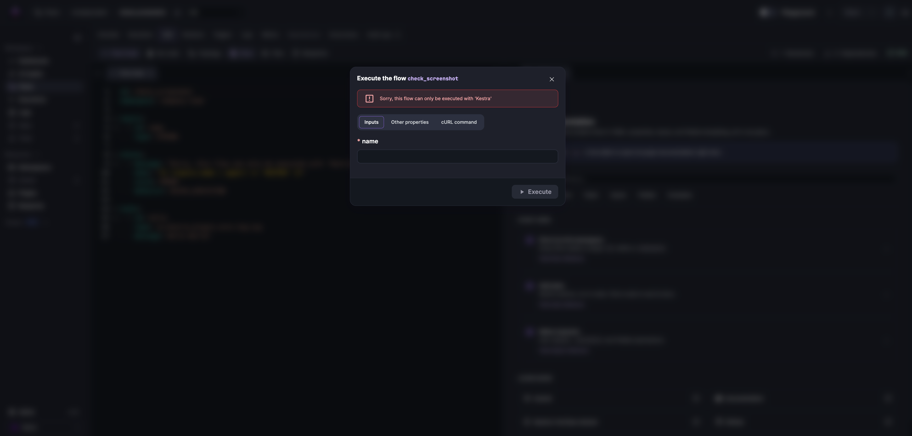

Checks are flow-level assertions evaluated against inputs before an execution is created. Each check defines a boolean `when` expression and a `message` to display when the expression evaluates to false.

## Properties

| Property | Required | Default | Description |
|---|---|---|---|
| `when` | Yes | — | Pebble expression that must evaluate to a boolean. Can reference inputs, KV pairs, and other [expression](../../expressions/index.mdx) variables. |
| `message` | Yes | — | Text displayed in the Execute modal when the condition is false. |
| `style` | No | `INFO` | Visual style for the message: `ERROR`, `SUCCESS`, `WARNING`, or `INFO`. |
| `behavior` | No | `BLOCK_EXECUTION` | How the flow reacts when the condition is false: `BLOCK_EXECUTION` (do not create), `FAIL_EXECUTION` (create in failed state), or `CREATE_EXECUTION` (create anyway). |

When you click **Execute**, the modal displays the `message` as soon as an input fails a check:



## Multiple checks

If several checks fail, the most restrictive behavior wins in this priority order: `BLOCK_EXECUTION` → `FAIL_EXECUTION` → `CREATE_EXECUTION`. This lets you mix hard stops with softer warnings in the same flow.

## Evaluation behavior

Keep these rules in mind when writing `when` expressions:

- **The condition must evaluate to a boolean `true`.** Only a real boolean passes — not the string `"true"`, `"yes"`, a number, or any other truthy value. Use comparisons and boolean operators (e.g. `{{ inputs.age >= 18 }}`) rather than returning a string.
- **An unevaluatable condition always blocks.** If the condition cannot be evaluated (for example, an undefined variable or a syntax error), the check fails safe: the execution is hard-blocked with `BLOCK_EXECUTION` and an `ERROR` style, regardless of the `behavior` and `style` you declared. Fix the expression and reference only variables that exist at validation time to restore your declared behavior.

## Examples

### Simple guard

This flow blocks execution unless the `name` input is `Kestra`.

```yaml
id: simple_check
namespace: company.team

inputs:
  - id: name
    type: STRING

checks:
  - message: "Sorry, this flow can only be executed with 'Kestra'"
    when: "{{ (inputs.name | upper) == 'KESTRA' }}"
    style: ERROR
    behavior: BLOCK_EXECUTION

tasks:
  - id: hello
    type: io.kestra.plugin.core.log.Log
    message: Hello World! 🚀
```

### Advanced guarded ingest

This flow pulls sample data from DummyJSON, blocks prod runs outside a time window, and warns (but allows) when using a non-approved source URL.

```yaml
id: guarded_ingest
namespace: company.team

inputs:
  - id: environment
    type: SELECT
    values: [dev, prod]
    defaults: dev
  - id: run_date
    type: DATETIME
    defaults: "{{ now() }}"
  - id: payload_url
    type: URI
    defaults: https://dummyjson.com/products?limit=5

checks:
  # Block risky prod runs outside the allowed window
  - message: "Prod runs are only allowed between 06:00 and 22:00 UTC"
    when: "{{ inputs.environment != 'prod' or (inputs.run_date | date('HH') | number >= 6 and inputs.run_date | date('HH') | number < 22) }}"
    style: ERROR
    behavior: BLOCK_EXECUTION

  # Warn if the payload is not the approved source
  - message: "Non-approved source detected. Use https://dummyjson.com when possible."
    when: "{{ inputs.payload_url | startsWith('https://dummyjson.com') }}"
    style: WARNING
    behavior: CREATE_EXECUTION

tasks:
  - id: fetch
    type: io.kestra.plugin.core.http.Download
    uri: "{{ inputs.payload_url }}"

  - id: log_run
    type: io.kestra.plugin.core.log.Log
    message: "Run {{ execution.id }} in {{ inputs.environment }} with file {{ outputs.fetch.uri }}"
```

## When to use checks

- Prevent invalid or risky executions based on user inputs.
- Prevent runs when resources are exhausted (e.g., too many VMs provisioned).
- Offer guardrails with warnings while still allowing runs to proceed.
- Enforce “only one path” scenarios by failing early instead of deep in the task sequence.

Checks run before tasks start, so they are a low-cost way to validate inputs and intentions upfront.
