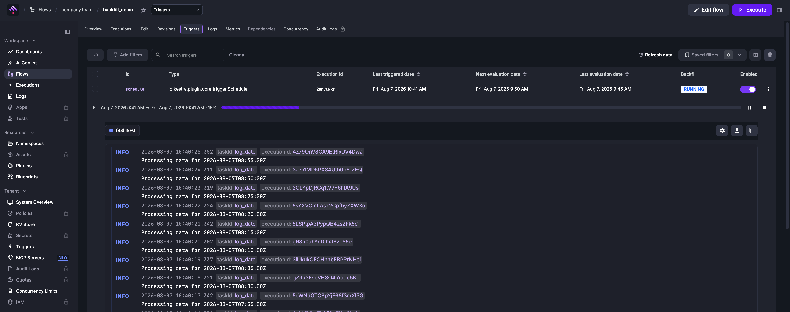
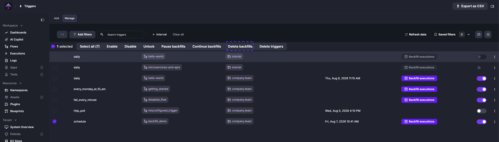

Schedule flows using cron expressions.

The Schedule trigger generates new executions on a regular cadence based on a Cron expression or custom scheduling conditions.

```yaml
type: io.kestra.plugin.core.trigger.Schedule
```

Kestra can trigger flows on a defined schedule. If you need to wait for another system to be ready and no event mechanism is available, you can configure one or more time-based schedules for your flow.

Kestra can automatically handle [backfills](#using-backfill) to recover missed executions.

Check the [Schedule trigger](/plugins/core/trigger/io.kestra.plugin.core.trigger.schedule) documentation for the list of properties and outputs.

:::alert{type="warning"}
To avoid unexpected differences, keep your Kestra server and database timezones aligned. If this isn’t possible, account for timezone implications such as Daylight Saving Time or regional variations.
:::

## Cron shortcuts

Kestra supports the following cron extensions instead of writing a cron expression:
- `@yearly` and `@annually` - runs yearly on 1st January at `00:00`
- `@monthly` - runs monthly on the 1st at `00:00`
- `@weekly` - runs weekly on Sunday at `00:00`
- `@daily` and `@midnight` - runs at `00:00` every day
- `@hourly` - runs every hour, on the hour

## Examples

Schedule that runs every 15 minutes:

```yaml
triggers:
  - id: schedule
    type: io.kestra.plugin.core.trigger.Schedule
    cron: "*/15 * * * *"
```

Schedule that runs only on the first monday of every month at 11 AM:

```yaml
triggers:
  - id: schedule
    type: io.kestra.plugin.core.trigger.Schedule
    cron: "0 11 * * 1"
    when: "{{ isDayWeekInMonth(trigger.date, 'MONDAY', 'FIRST') }}"
```

A schedule that runs daily at midnight US Eastern time:

```yaml
triggers:
  - id: daily
    type: io.kestra.plugin.core.trigger.Schedule
    cron: "@daily"
    timezone: America/New_York
```

Schedule that runs on the last day of every month. The `L` symbol in the day-of-month field represents the last day:

```yaml
triggers:
  - id: month_end
    type: io.kestra.plugin.core.trigger.Schedule
    cron: "0 12 L * *"
```

This runs at `12:00` on the last day of every month, including shorter months like February.

:::alert{type="warning"}
Schedules cannot **overlap**, meaning concurrent schedule executions are not allowed. If the previous schedule is not ended when the next one must start, the scheduler will wait until the end of the previous one. The same applies during backfills.
:::

:::alert{type="info"}
By default, schedule executions depend on `trigger.date`. For example, this may be used when querying files or databases by date. However, this prevents manual execution since trigger.date is only available for scheduled runs.

You can use this expression to make your **manual execution work**: `{{ trigger.date ?? execution.startDate | date("yyyy-MM-dd") }}`. It will use the current date if there is no schedule date making it possible to start the flow manually.
:::


## Refining schedules with `when`

When a `cron` expression alone is not sufficient (e.g., only first Monday of the month, only weekends), you can refine schedules using a `when` Pebble expression.

You can use the `{{ trigger.date }}` expression to access the current schedule date within the `when` expression. The [date and calendar helper functions](../../../expressions/04.functions/06.dates/index.mdx) in the expressions reference cover all available date functions such as `isDayWeekInMonth()`, `dayOfWeek()`, `isWeekend()`, `isPublicHoliday()`, and `isLastWorkingDay()`.

The `when` expression is evaluated and `{{ trigger.previous }}` and `{{ trigger.next }}` reflect the date **with** the condition applied.

Here's an example using a day-of-week check:

```yaml
id: conditions
namespace: company.team

tasks:
  - id: hello
    type: io.kestra.plugin.core.log.Log
    message: This will execute only on Thursday!

triggers:
  - id: schedule
    type: io.kestra.plugin.core.trigger.Schedule
    cron: "@hourly"
    when: "{{ dayOfWeek(trigger.date) == 'THURSDAY' }}"
```

## Recover missed schedules

### Automatically

By default, Kestra automatically recovers missed schedules. This means that if the Kestra server is down, the missed schedules will be executed as soon as the server is back up. However, this behavior is not always desirable, e.g. during a planned maintenance window. This behavior can be disabled by setting the `recoverMissedSchedules` configuration to `NONE`.

Configure `recoverMissedSchedules` behavior in your global Kestra configuration to choose whether you want to recover missed schedules automatically or not:

```yaml
kestra:
  plugins:
    configurations:
      - type: io.kestra.plugin.core.trigger.Schedule
        values:
          # available options: LAST | NONE | ALL -- default: ALL
          recoverMissedSchedules: NONE
```

The `recoverMissedSchedules` configuration can be set to `ALL`, `NONE` or `LAST`:
- `ALL`: Kestra will recover all missed schedules. This is the **default** value.
- `NONE`: Kestra will not recover any missed schedules.
- `LAST`: Kestra will recover only the last missed schedule for each flow.

Note that this is a global configuration that will apply to all flows, unless other behavior is explicitly defined within the flow definition like below:

```yaml
triggers:
  - id: schedule
    type: io.kestra.plugin.core.trigger.Schedule
    cron: "*/15 * * * *"
    recoverMissedSchedules: NONE
```

In this example, the `recoverMissedSchedules` is set to `NONE`, which means that Kestra will not recover any missed schedules for this specific flow regardless of the global configuration or default `recoverMissedSchedules` behavior. If you have a missed window of executions with `recoverMissedSchedules: NONE`, then use Backfill to replay the missed executions.

### Using Backfill

Backfills are replays of missed schedule intervals between a defined start and end date.

Consider a flow that runs every 30 minutes. If the source system had a 5-hour outage, the flow would miss 10 executions. A backfill replays all schedule intervals in the specified time window, including any that succeeded, so set the start and end dates precisely. To replay specific executions rather than a full time window, use [Replay](../../../15.how-to-guides/replay/index.md) instead.

To backfill the missed executions, use **Backfill executions** on the **Triggers** tab of the flow's detail page.


Select the start and end date for the backfill and optionally add custom labels to the executions for tracking.

<div class="video-container">
  <iframe src="https://www.youtube.com/embed/iVTrBdYGbew?si=3GFA0TOZPhOIKc-Q" title="YouTube video player" allow="accelerometer; autoplay; clipboard-write; encrypted-media; gyroscope; picture-in-picture; web-share" allowfullscreen></iframe>
</div>

You can pause and resume the backfill at any time. Click **Details** to see progress and execution status:



:::alert{type="info"}
Backfill executions will not be processed if the associated trigger is disabled.
:::

#### Delete a backfill

Delete a backfill from **Tenant → Triggers**. Select the trigger and remove the backfill to stop pending replays.



Deleting a backfill only cancels the scheduled catch-up executions. This is different from **Delete trigger**, which clears the trigger state itself (effectively recreating the trigger so it starts evaluating from the current time). Use **Delete backfill** to stop pending replays, and **Delete trigger** when you need to reset a stuck trigger or start it fresh.

#### Trigger backfill via API

Use the `PUT /api/v1/{tenant}/triggers` endpoint with a `backfill` body. `start` is required; `end` defaults to the current time if omitted. Use `inputs` to pass flow inputs and `labels` to tag the resulting executions for tracking.

**cURL:**

```sh
curl -X PUT http://localhost:8080/api/v1/main/triggers \
  -H "Authorization: Bearer $KESTRA_API_TOKEN" \
  -H "Content-Type: application/json" \
  -d '{
    "namespace": "company.team",
    "flowId":    "myflow",
    "triggerId": "schedule",
    "backfill":  {
      "start": "2025-04-29T11:30:00Z",
      "end":   null,
      "labels": [
        {
          "key": "reason",
          "value": "outage"
        }
      ]
    }
  }'
```

**Python:**

```python
import requests, json

response = requests.put(
    "http://localhost:8080/api/v1/main/triggers",
    headers={"Content-Type": "application/json"},
    data=json.dumps({
        "namespace": "company.team",
        "flowId": "myflow",
        "triggerId": "schedule",
        "backfill": {
            "start": "2025-06-03T06:30:00.000Z",
            "end": None,
            "labels": [{"key": "reason", "value": "outage"}]
        }
    })
)
```

For service account authentication (EE/Cloud), include `X-Kestra-Tenant` in the header and `tenantId` in the body. See the [API Reference](../../../api-reference/02.open-source/index.mdx) for all available backfill operations.

#### Disabling the trigger

To pause the schedule while you decide what to do next, set `disabled: true` in the YAML or use the **Enabled** toggle in the UI. See [Disabled](../../16.disabled/index.md) for details.

## Passing inputs to the Schedule trigger

Use the `inputs` property to set input values before execution:

In this example, the `user` input is set to "John Smith" by the `schedule` trigger:

```yaml
id: myflow
namespace: company.team

inputs:
  - id: user
    type: STRING
    defaults: Rick Astley

tasks:
  - id: hello
    type: io.kestra.plugin.core.log.Log
    message: "Hello {{ inputs.user }}! 🚀"

triggers:
  - id: schedule
    type: io.kestra.plugin.core.trigger.Schedule
    cron: "*/1 * * * *"
    inputs:
      user: John Smith
```

## Disable a schedule trigger after a specified execution state

The `stopAfter` property disables the trigger when the execution reaches one of the specified states (for example, `FAILED` or `KILLED`), preventing repeated runs of a broken flow until you manually re-enable it.

```yaml
id: myflow
namespace: company.team

inputs:
  - id: user
    type: STRING
    defaults: Rick Astley

tasks:
  - id: hello
    type: io.kestra.plugin.core.log.Log
    message: "Hello {{ inputs.user }}! 🚀"

triggers:
  - id: schedule
    type: io.kestra.plugin.core.trigger.Schedule
    cron: "*/1 * * * *"
    stopAfter:
      - FAILED
      - KILLED
    inputs:
      user: John Smith
```

## Detect stuck Schedule Triggers

Kestra has a plugin, [ScheduleMonitor](/plugins/plugin-kestra/kestra-triggers/io.kestra.plugin.kestra.triggers.schedulemonitor), for detecting stuck or misconfigured Schedule Triggers. It checks periodically and can run at the Tenant level, for a specific Namespace, or for a single Flow.

For example, set this up as a [System Flow](../../../06.concepts/system-flows/index.md) and send an alert if any Schedule Triggers come back showing an issue:

```yaml
id: detect_stuck_schedules
namespace: system

tasks:
  - id: send_alert
    runIf: "{{ trigger.data }}"
    type: io.kestra.plugin.slack.notifications.SlackIncomingWebhook
    url: https://kestra.io/api/mock
    messageText: The following Schedule triggers seem unhealthy {{ trigger.data }}

triggers:
  - id: stuck_schedules
    type: io.kestra.plugin.kestra.triggers.ScheduleMonitor
    auth:
      username: "{{ secret('KESTRA_USERNAME') }}"
      password: "{{ secret('KESTRA_PASSWORD') }}"
    namespace: company.team
    flowId: daily_sync
    interval: PT1H              # poll for stuck schedules every 1h
```

By default, the trigger checks all schedules in the current Tenant ([Multi-tenancy](../../../07.enterprise/02.governance/tenants/index.md) is an Enterprise feature) if no Namespace or Flow is specified.
