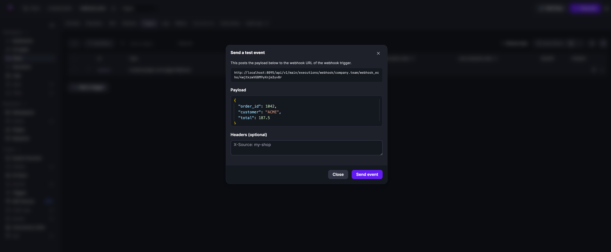

Trigger flows automatically in response to web-based events.

A Webhook trigger generates a unique URL that lets external applications (such as GitHub, Amazon EventBridge, or any system that can send HTTP requests) start new executions in Kestra. Each webhook URL requires a secret `key` — use a randomly generated string rather than something easy to guess. Kestra accepts `GET`, `POST`, and `PUT` requests on the webhook URL.

<div class="video-container">
  <iframe src="https://www.youtube.com/embed/4-KrkkgSeic?si=Ujl09_9Pv5x64YaF" title="YouTube video player" allow="accelerometer; autoplay; clipboard-write; encrypted-media; gyroscope; picture-in-picture; web-share" referrerpolicy="strict-origin-when-cross-origin" allowfullscreen></iframe>
</div>

## Example

```yaml
id: trigger
namespace: company.team

tasks:
  - id: hello
    type: io.kestra.plugin.core.log.Log
    message: "Hello World! 🚀"

triggers:
  - id: webhook
    type: io.kestra.plugin.core.trigger.Webhook
    key: 4wjtkzwVGBM9yKnjm3yv8r
```

The `key` is embedded in the webhook URL: `/api/v1/main/executions/webhook/{namespace}/{flowId}/{key}`. To start the flow:

```bash
https://{kestra_domain}/api/v1/main/executions/webhook/{namespace}/{flowId}/4wjtkzwVGBM9yKnjm3yv8r
```

Replace `kestra_domain`, `namespace`, and `flowId` with your values. You can also copy the webhook URL from the **Triggers** tab.

## Handling the request body

By default, the webhook trigger reads the request body and makes it available as `trigger.body`. Use the `fetchType` property to change this behavior.

```yaml
triggers:
  - id: webhook
    type: io.kestra.plugin.core.trigger.Webhook
    key: 4wjtkzwVGBM9yKnjm3yv8r
    fetchType: FETCH   # FETCH (default) | STORE | NONE
```

| `fetchType` | Body handling |
|---|---|
| `FETCH` | Body is read into memory and exposed as `trigger.body`. Text, JSON, XML, YAML, CSV, and form-urlencoded bodies are decoded as strings or parsed objects. Binary bodies (any other content type) are base64-encoded. This is the default. |
| `STORE` | Body is streamed directly to internal storage without being held in memory. The flow receives a `kestra://` URI on `trigger.uri`. Use this for large payloads or when you do not want body content written into the execution record. |
| `NONE` | Body is read off the connection and dropped. The flow receives neither `trigger.body` nor `trigger.uri`. |

:::alert{type="info"}
File parts in a `multipart/form-data` request are always stored in internal storage, regardless of `fetchType`.
:::

### Binary and non-text bodies

When a request body has a content type that is not text, JSON, XML, YAML, CSV, or form-urlencoded, `FETCH` base64-encodes it and stores the result in `trigger.body`. Pass `trigger.body` to a script task to decode and process the raw bytes.

```yaml
id: webhook_binary_body
namespace: company.team

tasks:
  - id: log_body
    type: io.kestra.plugin.core.log.Log
    message: "base64={{ trigger.body }}"

triggers:
  - id: webhook
    type: io.kestra.plugin.core.trigger.Webhook
    key: 4wjtkzwVGBM9yKnjm3yv8r
    fetchType: FETCH
```

### Stream large bodies to internal storage

Use `STORE` to stream the body directly to internal storage without loading it into memory. The flow receives `trigger.uri` instead of `trigger.body`.

```yaml
id: webhook_store_body
namespace: company.team

tasks:
  - id: log_uri
    type: io.kestra.plugin.core.log.Log
    message: "uri={{ trigger.uri }}"

  - id: measure_body
    type: io.kestra.plugin.core.storage.Size
    uri: "{{ trigger.uri }}"

triggers:
  - id: webhook
    type: io.kestra.plugin.core.trigger.Webhook
    key: 4wjtkzwVGBM9yKnjm3yv8r
    fetchType: STORE
```

:::alert{type="warning"}
When `fetchType: STORE`, the body is never deserialized. `when` conditions that reference `trigger.body` will not work — filter on headers or query parameters instead.
:::

### File uploads — multipart/form-data

When a request arrives as `multipart/form-data`, file parts are stored in internal storage and exposed on `trigger.parts`. Text fields are exposed on `trigger.formFields`. This works regardless of `fetchType`.

Each entry in `trigger.parts` has the following shape:

```yaml
trigger:
  parts:
    - name: photo
      filename: result.jpg
      contentType: image/jpeg
      size: 20345
      uri: kestra:///company/team/executions/5cVhZ…/webhook/0/result.jpg
  formFields:
    note:
      - "looks good"
```

Flow that receives a file upload and measures its size:

```yaml
id: webhook_multipart
namespace: company.team

tasks:
  - id: log_parts
    type: io.kestra.plugin.core.log.Log
    message: "parts={{ trigger.parts }} fields={{ trigger.formFields }}"

  - id: measure_upload
    type: io.kestra.plugin.core.storage.Size
    uri: "{{ trigger.parts[0].uri }}"

  - id: log_size
    type: io.kestra.plugin.core.log.Log
    message: "size={{ outputs.measure_upload.size }}"

triggers:
  - id: webhook
    type: io.kestra.plugin.core.trigger.Webhook
    key: 4wjtkzwVGBM9yKnjm3yv8r
```

Stored bytes are scoped to the execution and purged with it. If no execution is created — for example, because a `when` condition vetoed the request — stored bytes are cleaned up automatically.

## Filtering webhook executions with `when`

Use the `when` property to conditionally fire the trigger based on the request body or headers. The `when` value is a [Pebble expression](../../../expressions/index.mdx) evaluated against the incoming request. If the expression evaluates to a falsy value, Kestra ignores the request and no execution is created.

```yaml
triggers:
  - id: webhook
    type: io.kestra.plugin.core.trigger.Webhook
    key: 4wjtkzwVGBM9yKnjm3yv8r
    when: "{{ trigger.body.hello == 'world' }}"
```

You can combine multiple criteria in a single expression using `and` / `or`:

```yaml
triggers:
  - id: webhook
    type: io.kestra.plugin.core.trigger.Webhook
    key: 4wjtkzwVGBM9yKnjm3yv8r
    when: "{{ trigger.body.event == 'push' and trigger.headers['x-github-event'] == 'push' }}"
```

## Webhook response

By default, the trigger responds immediately with JSON. When the caller needs to wait for the result — for example, a validation handshake that requires `text/plain` — enable `wait` and set `responseContentType`.

```yaml
triggers:
  - id: webhook
    type: io.kestra.plugin.core.trigger.Webhook
    key: your-secret-key
    wait: true
    returnOutputs: true
    responseContentType: text/plain   # optional, defaults to application/json
```

- `wait: true` keeps the HTTP connection open until the flow finishes or the trigger's timeout is reached.
- `returnOutputs: true` returns the flow outputs as the HTTP response body.

## Return flow outputs in the webhook response

To send task outputs back to the caller in the HTTP response, configure the Webhook trigger to wait for the execution and return outputs. The flow must expose at least one `outputs` entry.

```yaml
id: webhook_return_outputs
namespace: company.team

tasks:
  - id: make_payload
    type: io.kestra.plugin.core.debug.Return
    format: "Hello {{ trigger.parameters.name[0] ?? 'world' }}!"

outputs:
  - id: greeting
    type: STRING
    value: "{{ outputs.make_payload.value }}"

triggers:
  - id: webhook
    type: io.kestra.plugin.core.trigger.Webhook
    key: 4wjtkzwVGBM9yKnjm3yv8r
    wait: true
    returnOutputs: true
    # optional: responseContentType: "text/plain"
```

- Call the webhook URL with a query parameter (for example `?name=Alice`). The execution runs synchronously because `wait: true` is set.
- The HTTP response body contains the flow outputs (JSON by default). With the example above, the response includes `"greeting": "Hello Alice!"`.
- Set `responseContentType: "text/plain"` when you want the response body to be plain text (ensure the flow returns a single string output, such as from the `Return` task).

## Test a webhook trigger

To test a webhook trigger without an external tool, go to the flow's **Triggers** tab and click **Send a test event**. The modal lets you post a custom JSON payload and optional headers directly to the webhook URL:



See the [Webhook trigger plugin documentation](/plugins/core/trigger/io.kestra.plugin.core.trigger.webhook) for a full list of properties and outputs.
