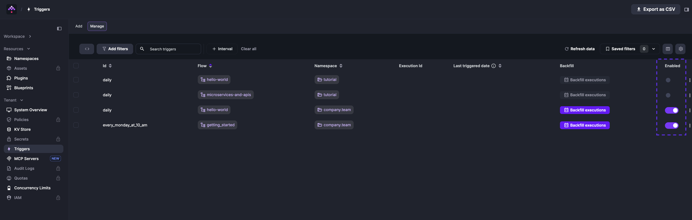
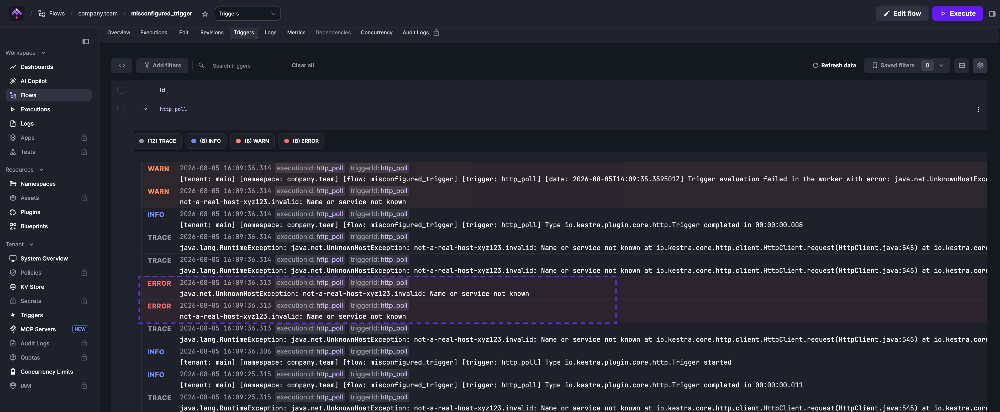

import ChildCard from "~/components/docs/ChildCard.astro"

A trigger starts a flow automatically, either on a schedule or in response to an event.

<div class="video-container">
    <iframe
        src="https://www.youtube.com/embed/qDiQtsVEETs?si=BxrYa-Z1ntqsPvbu"
        title="YouTube video player"
        allow="accelerometer; autoplay; clipboard-write; encrypted-media; gyroscope; picture-in-picture; web-share"
        referrerpolicy="strict-origin-when-cross-origin"
        allowfullscreen
    ></iframe>
</div>

## Trigger types

Kestra supports six core trigger types:

- [Schedule trigger](./01.schedule-trigger/index.md) — runs a flow on a cron schedule with optional calendar conditions.
- [Flow trigger](./02.flow-trigger/index.md) — runs a flow when one or more upstream flows complete in a matching state.
- [Webhook trigger](./03.webhook-trigger/index.md) — runs a flow in response to an inbound HTTP request.
- [Polling trigger](./04.polling-trigger/index.md) — runs a flow when new data is detected in an external system.
- [Realtime trigger](./05.realtime-trigger/index.md) — runs a flow with millisecond latency when an event arrives from a streaming source.
- [MCP Tool trigger](./06.mcp-tool-trigger/index.md) — exposes a flow as a named tool on a Kestra MCP server, callable by AI agents such as Claude Desktop, Claude Code, and Cursor.

Many other triggers are available from the plugins, such as triggers based on file detection events, e.g. the [S3 trigger](/plugins/plugin-aws/aws-s3/io.kestra.plugin.aws.s3.trigger), or a new message arrival in a message queue, such as the [SQS](/plugins/plugin-aws/aws-sqs/io.kestra.plugin.aws.sqs.realtimetrigger) or [Kafka trigger](/plugins/plugin-kafka/io.kestra.plugin.kafka.trigger).

### Trigger common properties

The following properties are common to all triggers:

| Field             | Description                                                                              |
| ----------------- | ---------------------------------------------------------------------------------------- |
| `id`              | The trigger identifier, must be unique within the flow.                                  |
| `type`            | The fully qualified class name of the trigger.                                           |
| `description`     | The description of the trigger.                                                          |
| `disabled`        | Set it to `true` to disable execution of the trigger.                                    |
| `allowConcurrent` | Set it to `true` to allow multiple executions from this trigger to run at the same time. |
| `workerSelector`  | Route this trigger to a specific Worker Queue by tags (EE). See [Worker Groups](../../07.enterprise/04.scalability/worker-group/index.md). |
| `when`            | A Pebble expression that must evaluate to `true` for the trigger to fire.                |

## Trigger variables

Triggers expose metadata through expressions. For example:

- `{{ trigger.date }}` returns the current date for the [Schedule trigger](./01.schedule-trigger/index.md)
- `{{ trigger.uri }}` returns the file or message for file detection or message arrival events
- `{{ trigger.rows }}` provides query results for triggers like the [PostgreSQL Query](/plugins/plugin-jdbc-postgres/io.kestra.plugin.jdbc.postgresql.trigger) trigger
- `{{ trigger._context.id }}` and `{{ trigger._context.type }}` return the ID and fully-qualified type of the trigger that started the execution — available for every trigger type

This example logs the date when the trigger executes the flow:

```yaml
id: variables
namespace: company.team

tasks:
    - id: hello
      type: io.kestra.plugin.core.log.Log
      message: "Hello World on {{ trigger.date }}! 🚀"

triggers:
    - id: schedule
      type: io.kestra.plugin.core.trigger.Schedule
      cron: "@hourly"
      allowConcurrent: false
```

:::alert{type="warning"}
Trigger variables like `{{ trigger.date }}` are only available when the execution is created automatically by the trigger. Running the flow manually will produce an error.
:::

:::alert{type="info"}
You don't need an extra task to consume a file or message from the event. Kestra automatically downloads it to internal storage and makes it available via `{{ trigger.uri }}`. See the plugin docs for a specific trigger and [Blueprints](/blueprints) tagged **Trigger** for examples.
:::

### Identifying the trigger in a multi-trigger flow

When a flow has multiple triggers, use `{{ trigger._context.id }}` and `{{ trigger._context.type }}` to determine which trigger started the current execution. Unlike trigger-specific variables such as `trigger.date`, these two fields are available for every trigger type.

The flow below branches based on which trigger started the execution:

```yaml
id: multi_trigger_flow
namespace: company.team

tasks:
  - id: check_trigger
    type: io.kestra.plugin.core.flow.If
    condition: "{{ trigger._context.type == 'io.kestra.plugin.core.trigger.Schedule' }}"
    then:
      - id: scheduled_path
        type: io.kestra.plugin.core.log.Log
        message: "Started by schedule '{{ trigger._context.id }}' on {{ trigger.date }}"
    else:
      - id: webhook_path
        type: io.kestra.plugin.core.log.Log
        message: "Started by webhook '{{ trigger._context.id }}'"

triggers:
  - id: daily
    type: io.kestra.plugin.core.trigger.Schedule
    cron: "@daily"

  - id: api
    type: io.kestra.plugin.core.trigger.Webhook
    key: my_secret_key
```

### Concurrency

By default, each trigger allows only one active execution at a time. If an execution is still running when the next trigger fires, the new execution is queued rather than started immediately. Manual executions from the UI or API are not subject to this limit — they always start regardless of trigger state.

To allow multiple concurrent executions from the same trigger, set `allowConcurrent: true` on the trigger.

## `when` and `dependsOn`

Kestra 2.0 replaces the old `conditions` list on triggers with two composable properties:

### `when` — Pebble expression (all triggers)

Every trigger type supports a `when` property. It accepts a [Pebble expression](../../expressions/index.mdx) that is evaluated at trigger time. If the expression evaluates to a falsy value (`false`, `0`, empty string), the trigger does not fire.

Use `when` to express time-based conditions on Schedule triggers, to filter Webhook payloads, or to add a global guard on any trigger type:

```yaml
triggers:
  - id: schedule
    type: io.kestra.plugin.core.trigger.Schedule
    cron: "0 9 * * *"
    when: "{{ not isWeekend(trigger.date) and not isPublicHoliday(trigger.date, 'FR') }}"
```

```yaml
triggers:
  - id: webhook
    type: io.kestra.plugin.core.trigger.Webhook
    key: 4wjtkzwVGBM9yKnjm3yv8r
    when: "{{ trigger.body.hello == 'world' }}"
```

For calendar-based scheduling, helper functions like `isWeekend()`, `isPublicHoliday()`, `isDayWeekInMonth()`, and `dayOfWeek()` are available. See [date and calendar helpers](../../expressions/04.functions/06.dates/index.mdx) in the expressions reference.

### `dependsOn` — upstream flow dependencies (Flow trigger only)

The [Flow trigger](./02.flow-trigger/index.md) replaces both `conditions` and `preconditions` with a `dependsOn` list. Each entry declares one upstream flow that must complete in a matching state. All entries must be satisfied before the trigger fires.

```yaml
triggers:
  - id: after_staging
    type: io.kestra.plugin.core.trigger.Flow
    dependsOn:
      - flowId: stg_sales
        namespace: company.team
      - flowId: stg_marketing
        namespace: company.team
    window:
      deadline: "09:00:00+01:00"
```

See the [Flow trigger documentation](./02.flow-trigger/index.md) for the full `dependsOn` and `window` property reference.

:::alert{type="warning"}
The `conditions` list is removed in Kestra 2.0. Flows that still use it will fail to parse after upgrading. See the [trigger conditions migration guide](../../11.migration-guide/v2.0.0/trigger-conditions-redesign/index.md) for before/after examples.
:::

## Unlocking, enabling, and disabling triggers

### Disabling a trigger in the source code

Set `disabled: true` on the trigger to stop it from firing without removing it:

```yaml
id: hello_world
namespace: company.team

tasks:
    - id: sleep
      type: io.kestra.plugin.scripts.shell.Commands
      taskRunner:
          type: io.kestra.plugin.core.runner.Process
      commands:
          - sleep 30

triggers:
    - id: schedule
      type: io.kestra.plugin.core.trigger.Schedule
      cron: "*/1 * * * *"
      disabled: true
```

To avoid a source code change, use the **Enabled** toggle in the UI instead.

### Disabling a trigger from the UI

To disable or re-enable a trigger:

1. Open the flow and go to the **Triggers** tab.
2. Toggle **Enabled** next to the trigger. Toggle again to re-enable.

If your trigger is locked due to an execution in progress, click **Unlock trigger** in the Triggers tab. Manually unlocking a trigger may result in duplicate executions — use it with caution.

:::alert{type="info"}
Only scheduler-based triggers are visible in the Triggers tab and API. Triggers handled by the Executor or Webserver (such as Webhook and Realtime triggers) do not appear there.
:::

### Toggle, unlock, or delete triggers from Tenant → Triggers

From **Tenant → Triggers** you can bulk manage trigger state:

- **Toggle** — enable or disable one or more triggers without editing the flow code.
- **Unlock** — clear the “locked” state if a trigger is stuck waiting on a long-running execution (use carefully, as this may create duplicate executions).
- **Delete trigger** — remove the trigger definition so it behaves as if newly created. This is useful when you need to reset trigger state or force a fresh evaluation window.



Deleting a trigger is different from deleting a backfill: removing a backfill only cancels pending catch-up runs, while deleting a trigger resets the trigger entity itself. Use **Delete backfill** to stop scheduled replays and **Delete trigger** to rebuild the trigger state.

## Troubleshooting a trigger from the UI

If you misconfigured a trigger, and as a result, no Executions are created, take the following actions to troubleshoot.

The example flow below illustrates this scenario — the `http_poll` trigger points to a non-existent host:

```yaml
id: misconfigured_trigger
namespace: company.team

tasks:
  - id: log
    type: io.kestra.plugin.core.log.Log
    message: "{{ trigger.body }}"

triggers:
  - id: http_poll
    type: io.kestra.plugin.core.http.Trigger
    uri: https://not-a-real-host-xyz123.invalid/endpoint
    interval: PT10S
```

When you save the flow, no executions are created. To troubleshoot, go to the **Triggers** tab on the flow's page and click the trigger row to expand its logs. A detailed error message identifies the problem:



## `stopAfter`

The `stopAfter` property is a list of states that disable the trigger after the flow execution reaches one of those states.

This property is most useful with `Schedule` triggers and polling-based triggers such as HTTP, JDBC, or File Detection.

:::alert{type="info"}
Kestra does not automatically re-enable a trigger after it has been disabled by `stopAfter`. You must re-enable it manually once you are ready to resume.
:::

### Pause a schedule after failure

This flow runs daily at 9 AM. If it fails, the schedule pauses until you re-enable it manually — preventing repeated failures on a broken pipeline:

```yaml
id: business_critical_flow
namespace: company.team

tasks:
    - id: important_task
      type: io.kestra.plugin.core.log.Log
      message: if this fails, we want to stop the flow from running until we fix it

triggers:
    - id: stopAfter
      type: io.kestra.plugin.core.trigger.Schedule
      cron: "0 9 * * *"
      stopAfter:
          - FAILED
```

### Disable the HTTP trigger after first success

This flow polls an API every 30 seconds and sends a Slack alert when the price drops below $110. `stopAfter: [SUCCESS]` disables the trigger after one alert fires, preventing repeated notifications for the same condition.

```yaml
id: http
namespace: company.team

tasks:
    - id: slack
      type: io.kestra.plugin.slack.notifications.SlackIncomingWebhook
      url: "{{ secret('SLACK_WEBHOOK') }}"
      messageText: "The price is now: {{ json(trigger.body).price }}"

triggers:
    - id: http
      type: io.kestra.plugin.core.http.Trigger
      uri: https://fakestoreapi.com/products/1
      responseCondition: "{{ json(response.body).price <= 110 }}"
      interval: PT30S
      stopAfter:
          - SUCCESS
```


## Passing inputs to triggers

Use the `inputs` property on any trigger to set input values before execution:

In this example, the `user` input is set to "John Smith" by the `schedule` trigger:

```yaml
id: myflow
namespace: company.team

inputs:
    - id: user
      type: STRING
      defaults: Rick Astley

tasks:
    - id: hello
      type: io.kestra.plugin.core.log.Log
      message: "Hello {{ inputs.user }}! 🚀"

triggers:
    - id: schedule
      type: io.kestra.plugin.core.trigger.Schedule
      cron: "*/1 * * * *"
      inputs:
          user: John Smith
```

## Trigger errors

By default, if a trigger fails, no execution is created; this is by design to avoid excessive executions on the instance. To troubleshoot, you must [investigate the trigger logs](#troubleshooting-a-trigger-from-the-ui). If you'd prefer an execution to be created on trigger failure, set the `failOnTriggerError` property to `true` in the trigger configuration. This will cause the flow to fail and produce an execution with its own logs.

Adding `failOnTriggerError: true` produces a `FAILED` execution with full logs instead of a silent no-op:

```yaml
id: bad_trigger_example
namespace: company.team

tasks:
    - id: hello
      type: io.kestra.plugin.core.log.Log
      message: Hello World!

triggers:
    - id: sqs_trigger
      type: io.kestra.plugin.aws.sqs.Trigger
      accessKeyId: "nonExistingKey"
      secretKeyId: "nonExistingSecret"
      region: "us-east-1"
      queueUrl: "https://sqs.us-east-1.amazonaws.com/123456789/testQueue"
      maxRecords: 10
      failOnTriggerError: true
```

The resulting execution is visible in the UI and can trigger notification flows, in addition to appearing in the trigger logs.

<ChildCard />