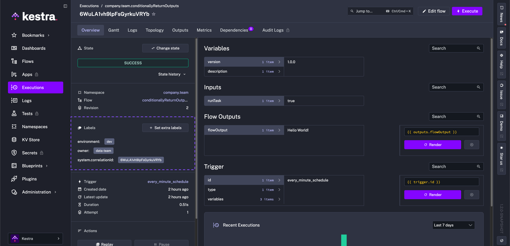
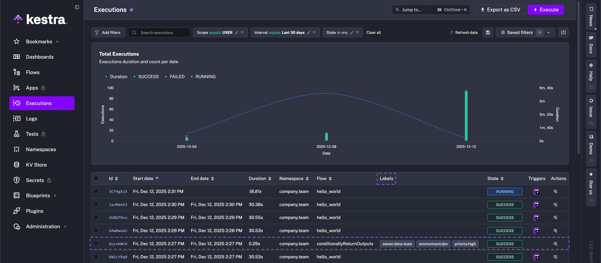
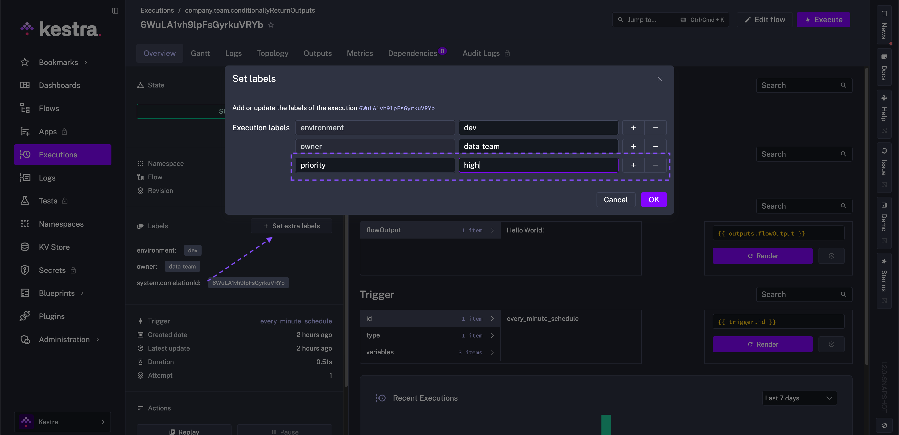
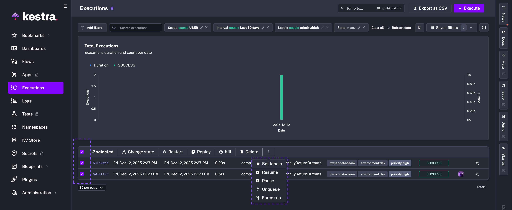

Labels are key-value pairs in Kestra that let you organize [flows](../01.flow/index.md) and [executions](../03.execution/index.md) across multiple dimensions, without being restricted to a single hierarchy.

You can organize flows and executions by project, priority, maintainer, or any other relevant criteria. Unlike fixed categories, labels support flexible filtering, grouping, and discovery.

Labels can be associated with both the flow definition and individual execution instances. This allows you to distinguish between different executions of the same flow.

<div class="video-container">
  <iframe src="https://www.youtube.com/embed/dwuj5jOHIOA?si=ioct3HALKVKojax4" title="YouTube video player" allow="accelerometer; autoplay; clipboard-write; encrypted-media; gyroscope; picture-in-picture; web-share" referrerpolicy="strict-origin-when-cross-origin" allowfullscreen></iframe>
</div>

A flow with two labels:

```yaml
id: process_invoice_flow
namespace: company.team

labels:
  team: finance
  priority: HIGH

tasks:
  - id: hello
    type: io.kestra.plugin.core.log.Log
    message: hello from a flow with labels
```

When you execute this flow, executions inherit both `team: finance` and `priority: HIGH` labels. You can also define additional labels at execution launch.

## Benefits of labels

Labels let you organize and filter flows and their executions. Key benefits include:

- **Observability**: Track execution status, monitor errors, and rerun only a subset of executions.

- **Filtering**: Quickly find executions, mark test runs, track ML experiments, or label runs by runtime inputs.

- **Organization**: Manage workflows at scale by grouping executions by team, project, maintainer, or environment.

You can also build custom dashboards using labels, for example: `http://localhost:8080/ui/executions?filters[labels][EQUALS][team]=finance`.

### Common scenarios

To group flows related to the same project across [Kestra namespaces](../02.namespace/index.md), you can use a common flow label, such as `project: XYZ-123`.

When running the `process_invoice_flow`, you can add execution labels (e.g., `currency`) to capture attributes of the processed invoice. This allows you to filter executions by specific values, like `currency: USD`.

You can also label executions related to a pre-production run. For example, using a `purpose: pre-prod` label. This enables you to safely
delete only those executions associated with the pre-production phase.

In multi-team environments, labels help you separate executions by team, for example `support: EMEA` and `support: APAC`, when the same flow handles data from different regions.

## Execution labels propagated from flow labels

When you execute a flow with labels, those labels are automatically applied to its executions.





## Set execution labels manually

When executing a flow manually, expand **Advanced configuration** to override or define labels at start:

<div class="video-container">
  <iframe src="https://www.youtube.com/embed/XwOQtqdZGZE?si=2jA71fRTDBkBF76P" title="YouTube video player" allow="accelerometer; autoplay; clipboard-write; encrypted-media; gyroscope; picture-in-picture; web-share" allowfullscreen></iframe>
</div>

You can also set labels after an execution completes — useful for collaboration and troubleshooting.

For example, you can add a label to a failed execution to indicate its status, such as whether it has been acknowledged, is being investigated, or has been resolved.

Go to the **Overview** tab of an execution and click **Set labels** to add one or more labels.



You can also set labels for multiple executions at once — useful for bulk operations such as acknowledging multiple failed executions after an outage.



## Set labels based on flow inputs and task outputs

Use the [Labels task](/plugins/core/execution/io.kestra.plugin.core.execution.labels) to set execution labels based on flow inputs, task outputs, or other runtime data. There are two ways to set labels in this task:

1. **Using a map (key-value pairs)**: ideal when the key is static and the value is dynamic. In the example below, `update_labels` overrides the default label `song` with the output of the `get` task and adds a new label `artist`.

```yaml
id: labels_override
namespace: company.team

labels:
  song: never_gonna_give_you_up

tasks:
  - id: get
    type: io.kestra.plugin.core.debug.Return
    format: never_gonna_stop

  - id: update_labels
    type: io.kestra.plugin.core.execution.Labels
    labels:
      song: "{{ outputs.get.value }}"
      artist: rick_astley # new label
```

2. **Using a list of key-value pairs**: use this form when both the key and value are dynamic.

```yaml
id: labels
namespace: company.team

inputs:
  - id: user
    type: STRING
    defaults: Rick Astley

  - id: url
    type: STRING
    defaults: song_url

tasks:
  - id: update_labels_with_map
    type: io.kestra.plugin.core.execution.Labels
    labels:
      customerId: "{{ inputs.user }}"

  - id: get
    type: io.kestra.plugin.core.debug.Return
    format: https://t.ly/Vemr0

  - id: update_labels_with_list
    type: io.kestra.plugin.core.execution.Labels
    labels:
      - key: "{{ inputs.url }}"
        value: "{{ outputs.get.value }}"
```

### Overriding flow labels at runtime

You can set default labels at the flow level and override them during execution based on task results.

The example below shows how to override the default label `song` with the output of the `get` task:

```yaml
id: flow_with_labels
namespace: company.team

labels:
  song: never_gonna_give_you_up
  artist: rick-astley
  genre: pop

tasks:
  - id: get
    type: io.kestra.plugin.core.debug.Return
    format: never_gonna_stop

  - id: update-list
    type: io.kestra.plugin.core.execution.Labels
    labels:
      song: "{{ outputs.get.value }}"
```

In this example, the default label `song` is overridden by the output of the `get` task.

## Dynamic labels in trigger-started executions

When a trigger starts an execution, the trigger's `labels` values accept Pebble expressions. This lets you embed runtime context — such as the current date or a trigger variable — directly in labels at the moment execution begins, without needing a separate `Labels` task.

**Using a Pebble function:**

```yaml
id: scheduled_flow
namespace: company.team

triggers:
  - id: schedule
    type: io.kestra.plugin.core.trigger.Schedule
    cron: "* * * * *"
    labels:
      year: "year-{{now(format='YYYY')}}"

tasks:
  - id: hello
    type: io.kestra.plugin.core.log.Log
    message: Hello World!
```

Each execution started by this trigger carries a `year` label with the current year when the trigger fires, for example `year: year-2026`.

**Using a trigger variable:**

```yaml
id: scheduled_flow
namespace: company.team

triggers:
  - id: schedule
    type: io.kestra.plugin.core.trigger.Schedule
    cron: "* * * * *"
    labels:
      previous_run: "{{trigger.previous}}"

tasks:
  - id: hello
    type: io.kestra.plugin.core.log.Log
    message: Hello World!
```

`trigger.previous` holds the date of the previous scheduled run. Labelling executions with this value helps identify late or catch-up runs.

Static values and expressions can be mixed in the same `labels` block. Available trigger variables differ by trigger type — see the [Schedule trigger](../07.triggers/01.schedule-trigger/index.md), [Realtime trigger](../07.triggers/05.realtime-trigger/index.md), and other trigger reference pages for the full list.
