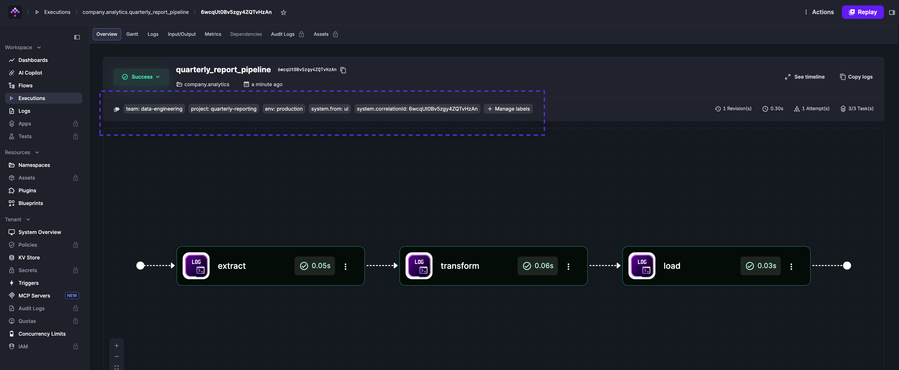
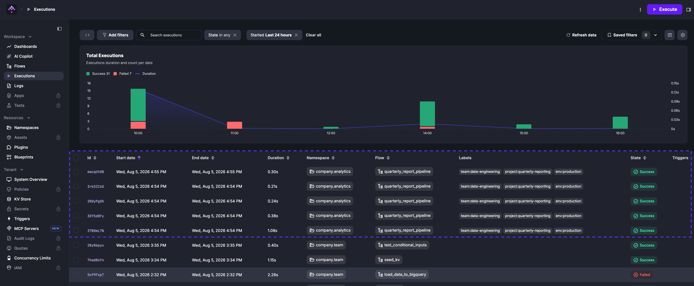
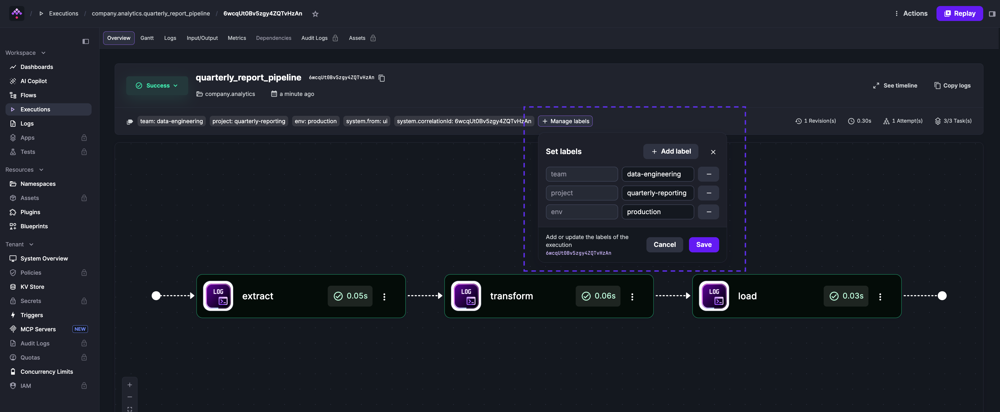
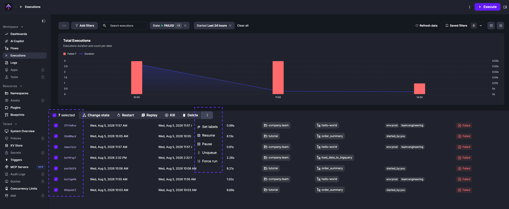

Labels are key-value pairs attached to [flows](../01.flow/index.md) and [executions](../03.execution/index.md). Unlike namespaces, which form a fixed hierarchy, labels let you slice execution data across any dimension (team, project, environment, priority) and combine them freely.

A label can be set on the flow definition, on individual execution instances, or both, making it possible to group across flows or distinguish between runs of the same flow.

<div class="video-container">
  <iframe src="https://www.youtube.com/embed/dwuj5jOHIOA?si=ioct3HALKVKojax4" title="YouTube video player" allow="accelerometer; autoplay; clipboard-write; encrypted-media; gyroscope; picture-in-picture; web-share" referrerpolicy="strict-origin-when-cross-origin" allowfullscreen></iframe>
</div>

A flow with two labels:

```yaml
id: process_invoice_flow
namespace: company.team

labels:
  team: finance
  priority: HIGH

tasks:
  - id: hello
    type: io.kestra.plugin.core.log.Log
    message: hello from a flow with labels
```

When you execute this flow, executions inherit both `team: finance` and `priority: HIGH` labels. You can also define additional labels at execution launch.

## Execution labels propagated from flow labels

When you execute a flow with labels, those labels are automatically applied to its executions.





## Set execution labels manually

Labels can be set or overridden at execution launch via **Advanced configuration** in the Execute modal, or after execution via **Set labels** on the **Overview** tab.

<div class="video-container">
  <iframe src="https://www.youtube.com/embed/XwOQtqdZGZE?si=2jA71fRTDBkBF76P" title="YouTube video player" allow="accelerometer; autoplay; clipboard-write; encrypted-media; gyroscope; picture-in-picture; web-share" allowfullscreen></iframe>
</div>



Labels can also be set on multiple executions at once.



## Set labels based on flow inputs and task outputs

The [Labels task](/plugins/core/execution/io.kestra.plugin.core.execution.labels) sets execution labels from flow inputs, task outputs, or other runtime values. It accepts either a map or a list of key-value pair objects:

1. **Using a map (key-value pairs)**: ideal when the key is static and the value is dynamic. In the example below, `update_labels` overrides the default label `song` with the output of the `get` task and adds a new label `artist`.

```yaml
id: labels_override
namespace: company.team

labels:
  song: never_gonna_give_you_up

tasks:
  - id: get
    type: io.kestra.plugin.core.debug.Return
    format: never_gonna_stop

  - id: update_labels
    type: io.kestra.plugin.core.execution.Labels
    labels:
      song: "{{ outputs.get.value }}"
      artist: rick_astley # new label
```

2. **Using a list of key-value pairs**: use this form when both the key and value are dynamic.

```yaml
id: labels
namespace: company.team

inputs:
  - id: user
    type: STRING
    defaults: Rick Astley

  - id: url
    type: STRING
    defaults: song_url

tasks:
  - id: update_labels_with_map
    type: io.kestra.plugin.core.execution.Labels
    labels:
      customerId: "{{ inputs.user }}"

  - id: get
    type: io.kestra.plugin.core.debug.Return
    format: https://t.ly/Vemr0

  - id: update_labels_with_list
    type: io.kestra.plugin.core.execution.Labels
    labels:
      - key: "{{ inputs.url }}"
        value: "{{ outputs.get.value }}"
```

### Overriding flow labels at runtime

Default labels set at the flow level can be overridden during execution based on task results.

The example below shows how to override the default label `song` with the output of the `get` task:

```yaml
id: flow_with_labels
namespace: company.team

labels:
  song: never_gonna_give_you_up
  artist: rick-astley
  genre: pop

tasks:
  - id: get
    type: io.kestra.plugin.core.debug.Return
    format: never_gonna_stop

  - id: update-list
    type: io.kestra.plugin.core.execution.Labels
    labels:
      song: "{{ outputs.get.value }}"
```

In this example, the default label `song` is overridden by the output of the `get` task.

## Dynamic labels in trigger-started executions

When a trigger starts an execution, the trigger's `labels` values accept Pebble expressions, embedding runtime context (such as the current date or a trigger variable) directly in labels at the moment execution begins.

**Using a Pebble function:**

```yaml
id: scheduled_flow
namespace: company.team

triggers:
  - id: schedule
    type: io.kestra.plugin.core.trigger.Schedule
    cron: "* * * * *"
    labels:
      year: "year-{{now(format='YYYY')}}"

tasks:
  - id: hello
    type: io.kestra.plugin.core.log.Log
    message: Hello World!
```

Each execution started by this trigger carries a `year` label with the current year when the trigger fires.

**Using a trigger variable:**

```yaml
id: scheduled_flow
namespace: company.team

triggers:
  - id: schedule
    type: io.kestra.plugin.core.trigger.Schedule
    cron: "* * * * *"
    labels:
      previous_run: "{{trigger.previous}}"

tasks:
  - id: hello
    type: io.kestra.plugin.core.log.Log
    message: Hello World!
```

`trigger.previous` holds the date of the previous scheduled run. Labelling executions with this value helps identify late or catch-up runs.

Static values and expressions can be mixed in the same `labels` block. Available trigger variables differ by trigger type; see the [Schedule trigger](../07.triggers/01.schedule-trigger/index.md), [Realtime trigger](../07.triggers/05.realtime-trigger/index.md), and other trigger reference pages for the full list.
