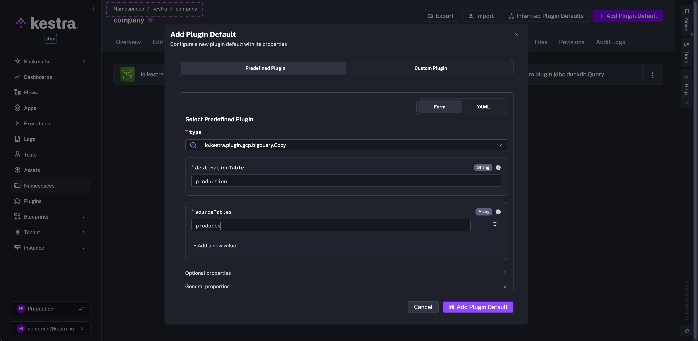
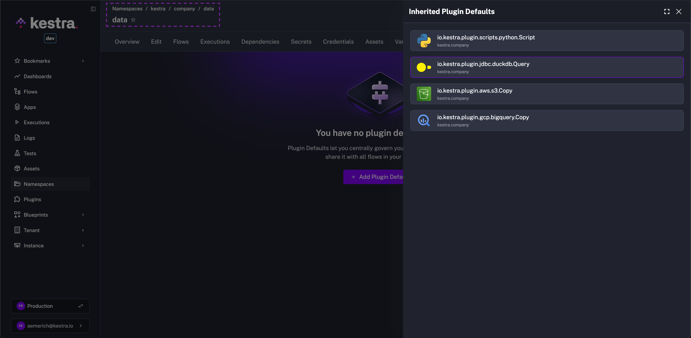

Plugin defaults are default values applied to every task of a given type within one or more flows.

They work like default function arguments, helping you avoid repetition when tasks or plugins frequently use the same values.

<div class="video-container">
  <iframe src="https://www.youtube.com/embed/9zQTUeL0KMc?si=xOAqec_9X79-7YDp" title="YouTube video player" allow="accelerometer; autoplay; clipboard-write; encrypted-media; gyroscope; picture-in-picture; web-share" referrerpolicy="strict-origin-when-cross-origin" allowfullscreen></iframe>
</div>

## Plugin defaults at the flow level

You can define plugin defaults in the `pluginDefaults` section to avoid repeating properties across multiple tasks of the same type. For example:

```yaml
id: api_python_sql
namespace: company.team

tasks:
  - id: api
    type: io.kestra.plugin.core.http.Request
    uri: https://dummyjson.com/products

  - id: hello
    type: io.kestra.plugin.scripts.python.Script
    script: |
      print("Hello World!")

  - id: python
    type: io.kestra.plugin.scripts.python.Script
    beforeCommands:
      - pip install polars
    outputFiles:
      - "products.csv"
    script: |
      import polars as pl
      data = {{outputs.api.body | jq('.products') | first}}
      df = pl.from_dicts(data)
      df.glimpse()
      df.select(["brand", "price"]).write_csv("products.csv")

  - id: sql_query
    type: io.kestra.plugin.jdbc.duckdb.Query
    inputFiles:
      in.csv: "{{ outputs.python.outputFiles['products.csv'] }}"
    sql: |
      SELECT brand, round(avg(price), 2) as avg_price
      FROM read_csv_auto('{{workingDir}}/in.csv', header=True)
      GROUP BY brand
      ORDER BY avg_price DESC;
    store: true

pluginDefaults:
  - type: io.kestra.plugin.scripts.python.Script
    values:
      taskRunner:
        type: io.kestra.plugin.scripts.runner.docker.Docker
        pullPolicy: ALWAYS # set it to NEVER to use a local image
      containerImage: python:slim
```

In this example, Docker and Python configurations are defined once in `pluginDefaults` rather than repeated in every task.

## Precedence of plugin defaults

Kestra applies non-forced plugin defaults from lowest to highest priority:

1. Global plugin defaults (`kestra.plugins.defaults`)
2. Namespace-level plugin defaults
3. Flow-level `pluginDefaults`
4. Properties defined directly on the task

For forced defaults the direction reverses — the most privileged level wins:

1. Global forced defaults (`kestra.plugins.defaults` with `forced: true`) ← highest priority
2. Namespace-level forced defaults
3. Flow-level forced defaults

This means a global forced default cannot be overridden by a namespace-level forced default. Use global forced defaults for platform-wide policies that must apply unconditionally.

## Plugin defaults in a global configuration

Plugin defaults can also be defined globally in your Kestra configuration, applying the same values across all flows. To centrally manage credentials for the `io.kestra.plugin.aws` plugin, add the following to your Kestra configuration:

```yaml
kestra:
  plugins:
    defaults:
      - type: io.kestra.plugin.aws
        values:
          accessKeyId: "{{ secret('AWS_ACCESS_KEY_ID') }}"
          secretKeyId: "{{ secret('AWS_SECRET_ACCESS_KEY') }}"
          region: "us-east-1"
```

Global plugin defaults must be configured under `kestra.plugins.defaults`.

:::alert{type="info"}
The legacy `kestra.tasks.defaults` property is still supported for backward compatibility, but it is deprecated. Use `kestra.plugins.defaults` for all new configurations.
:::

To set defaults for a specific task type only:

```yaml
kestra:
  plugins:
    defaults:
      - type: io.kestra.plugin.aws.s3.Upload
        values:
          accessKeyId: "{{ secret('AWS_ACCESS_KEY_ID') }}"
          secretKeyId: "{{ secret('AWS_SECRET_ACCESS_KEY') }}"
          region: "us-east-1"
```

### Nested property values

For plugins with nested properties, define the values using the same nested YAML structure you would use in a flow. For example, to set resource limits for the Kubernetes task runner:

```yaml
kestra:
  plugins:
    defaults:
      - type: io.kestra.plugin.ee.kubernetes.runner.Kubernetes
        forced: true
        values:
          resources:
            limit:
              cpu: "1"
              memory: "128Mi"
```

This is equivalent to writing the same nested structure directly in a task. The `forced: true` attribute ensures these defaults override any values set at the task level.

### Precedence of global, flow, and task values

Kestra applies plugin defaults in this order:

1. Global plugin defaults from `kestra.plugins.defaults`
2. Flow-level `pluginDefaults`
3. Properties defined directly on the task

That means flow-level defaults override global defaults, and task properties override flow-level defaults.

Global configuration and namespace-level plugin defaults support a `forced` property. Setting `forced: true` on a global or namespace-level default makes it override any value set directly on the task. This is intended for governance use cases — for example, enforcing a specific task runner across all flows in a namespace.

## Plugin Defaults Enterprise Edition

:::alert{type="info"}
In the [Enterprise Edition](../../07.enterprise/index.mdx) or [Kestra Cloud](/cloud), plugin defaults can be configured directly in the UI under the **Plugin Defaults** tab of a Namespace.
:::

You can create them from the Namespace UI using the guided form or YAML editor:



The add/edit dialog lets you:

- choose a predefined plugin type or enter a custom plugin type
- switch between a form view and a YAML view
- preview the generated YAML for an existing plugin default

If you switch to **YAML**, you can paste content such as:

```yaml
- type: io.kestra.plugin.aws.s3.Upload
  values:
    accessKeyId: "{{ secret('AWS_ACCESS_KEY_ID') }}"
    secretKeyId: "{{ secret('AWS_SECRET_ACCESS_KEY') }}"
    region: "us-east-1"
```

### Inherited Plugin Defaults

Plugin Defaults are inherited from the parent Namespace to children Namespaces. In the example above, the image shows the Plugin Default was created in the `kestra.company` Namespace. Navigating to the **Plugin Defaults** tab of a child Namespace, for example `kestra.company.data`, shows the parent Namespace's Plugin Defaults together with the Namespace they come from. This avoids having to recreate Plugin Defaults across children Namespaces, but it still allows for the children Namespaces to maintain their own isolated defaults if needed.



### Import and export

From the Namespace **Plugin Defaults** tab, you can also export the current Namespace plugin defaults to YAML and import them back into another Namespace. This is useful when promoting a curated set of defaults across environments or teams.

<div style="position: relative; padding-bottom: calc(48.9583% + 41px); height: 0px; width: 100%;"><iframe src="https://demo.arcade.software/Qu8BDAn5EOUrGmwrfLyv?embed&embed_mobile=tab&embed_desktop=inline&show_copy_link=true" title="Plugin Defaults | Kestra EE" frameborder="0" loading="lazy" webkitallowfullscreen mozallowfullscreen allowfullscreen allow="clipboard-write" style="position: absolute; top: 0; left: 0; width: 100%; height: 100%; color-scheme: light;" ></iframe></div>
