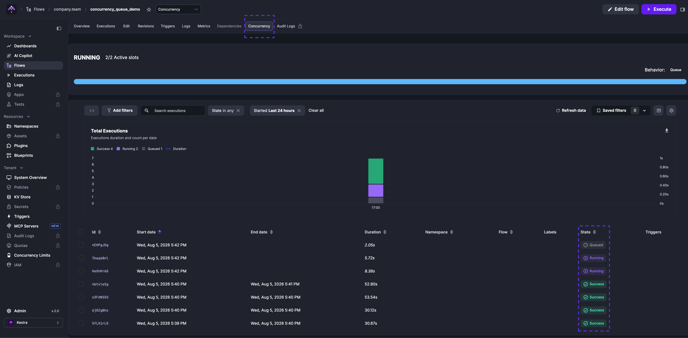
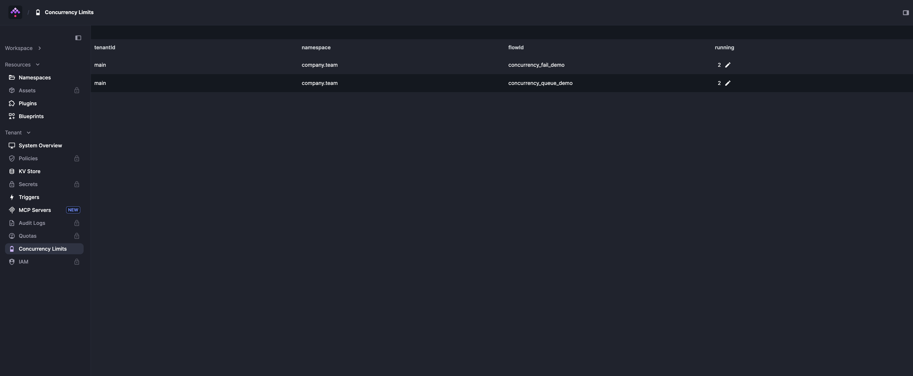
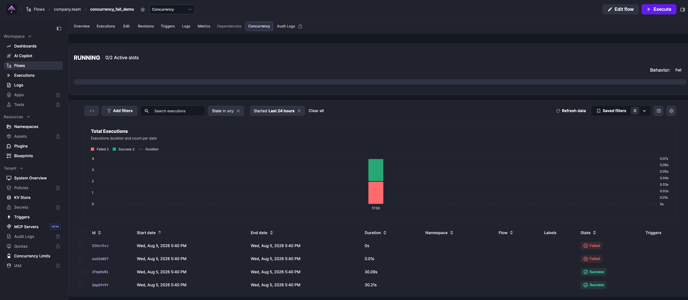

Concurrency limits control how many executions of a flow can run at the same time. When the limit is reached, new executions are queued, cancelled, or failed depending on the configured `behavior`.

:::alert{type="info"}
Concurrency limits executions of a flow, not the number of tasks a worker runs. Task processing is governed by worker thread pools and task runners. Concurrency uses database locks to hold slots, so heavy contention (many executions competing for the same lock) can increase database load and slow scheduling.
:::

<div class="video-container">
  <iframe src="https://www.youtube.com/embed/lDGOqqMyQEo?si=01KzCswO3dHdhYdt" title="YouTube video player" allow="accelerometer; autoplay; clipboard-write; encrypted-media; gyroscope; picture-in-picture; web-share" referrerpolicy="strict-origin-when-cross-origin" allowfullscreen></iframe>
</div>

## When to use concurrency

Use concurrency when you need to:

- Protect a shared target system (databases, SaaS APIs, warehouses) from overload.
- Enforce sequential processing for stateful workloads (one ETL load at a time).
- Keep a small, fixed number of parallel executions within an external rate limit.

Do **not** use concurrency to:

- Throttle worker CPU or memory usage — tune worker thread pools or task runners instead.
- Replace task-level limits — use task runner settings and retry backoff for per-task control.
- Cap how many executions are **created** over time — use [Quotas](../21.quotas/index.md) (Enterprise Edition) for time-window rate limits.

## Configuring concurrency

Set `concurrency.limit` on a flow to cap its parallel executions:

```yaml
id: concurrency_example
namespace: company.team

concurrency:
  limit: 2

tasks:
  - id: wait
    type: io.kestra.plugin.scripts.shell.Commands
    taskRunner:
      type: io.kestra.plugin.core.runner.Process
    commands:
      - sleep 10
```

With `limit: 2`, a third execution waits until one of the two running executions completes.

## `behavior` property

By default, executions that exceed the limit are queued. Set `behavior` to control what happens instead:

- `QUEUE` — hold the execution until a slot opens (default).
- `CANCEL` — immediately mark the execution as `CANCELLED`.
- `FAIL` — immediately mark the execution as `FAILED`.

```yaml
id: concurrency_limited_flow
namespace: company.team

concurrency:
  behavior: FAIL # QUEUE, CANCEL, or FAIL
  limit: 2

tasks:
  - id: wait
    type: io.kestra.plugin.scripts.shell.Commands
    taskRunner:
      type: io.kestra.plugin.core.runner.Process
    commands:
      - sleep 10
```

:::alert{type="warning"}
Each execution waiting for a concurrency slot holds a database lock. Large backlogs of queued executions can increase lock contention and slow scheduling. If you expect spikes, combine conservative limits with backoff at the source (e.g., trigger rates).
:::

:::alert{type="warning"}
When an execution starts from a [Trigger](../07.triggers/index.mdx), the trigger locks until it finishes, preventing multiple executions from that trigger from running concurrently. The `behavior` property does not apply in this case — no new executions start while the trigger is locked.

Read more in the [Locked Triggers](../07.triggers/index.mdx#locked-triggers) section.
:::

## Monitoring concurrency

### Per-flow Concurrency tab

The **Concurrency** tab on a Flow page shows current slot usage, the configured behavior, and a list of running and queued executions for that flow.



### Concurrency Limits page

The **Concurrency Limits** page under **Tenant** in the sidebar lists every flow that has a concurrency limit configured, along with its live running count. Use it for a tenant-wide view of concurrency usage across all flows.



## Concurrent trigger executions

Any [Trigger](../07.triggers/index.mdx) type supports concurrent executions through the `allowConcurrent` property. By default, `allowConcurrent: false` — if a trigger fires while a previous execution is still running, the new execution is skipped.

```yaml
id: sleep_concurrent
namespace: company.team
tasks:
  - id: sleep
    type: io.kestra.plugin.core.flow.Sleep
    duration: PT60S
triggers:
  - id: schedule
    type: io.kestra.plugin.core.trigger.Schedule
    cron: "* * * * * *"
    withSeconds: true
    allowConcurrent: false
```

Set `allowConcurrent: true` to allow multiple executions to run simultaneously from the same trigger.

## Troubleshooting concurrency issues

### Check the Concurrency tab

Open the **Concurrency** tab on the Flow page to see which executions are running, queued, or failed. This shows which executions hold slots and which are waiting.



### Edit the concurrency limit

You can change or remove the `concurrency` property in the flow editor and save. The executor always reads the latest flow revision, so the updated limit takes effect immediately for all in-progress executions.

### Reset a stuck running counter

If executions were deleted while running, their concurrency slots can remain occupied indefinitely. Use the **Concurrency Limits** page to correct this: click the edit icon next to the affected flow and adjust the running counter directly.


:::alert{type="warning"}
Do **not** delete executions to free stuck slots — deleted executions still hold concurrency slots. Instead, select stuck executions and click **Kill** to cancel them and release their slots. Use the counter reset only when slots remain stuck after killing all relevant executions.
:::
