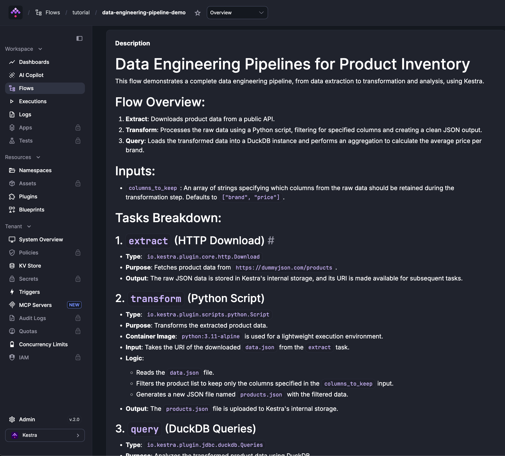

The `description` property accepts [Markdown](https://en.wikipedia.org/wiki/Markdown) and is available on flows, inputs, outputs, tasks, and triggers. Descriptions are rendered in the UI wherever the component appears.

<div class="video-container">
  <iframe src="https://www.youtube.com/embed/coxJhDSRqvg?si=9vX7yl7iD5-R-pFz" title="YouTube video player" allow="accelerometer; autoplay; clipboard-write; encrypted-media; gyroscope; picture-in-picture; web-share" referrerpolicy="strict-origin-when-cross-origin" allowfullscreen></iframe>
</div>

Flow descriptions support full Markdown — headings, lists, bold, code spans, and more:

```yaml
id: data-engineering-pipeline-demo
namespace: tutorial
description: |
  # Data Engineering Pipelines for Product Inventory

  This flow demonstrates a complete data engineering pipeline, from data extraction to transformation and analysis, using Kestra.

  ## Flow Overview:
  1.  **Extract**: Downloads product data from a public API.
  2.  **Transform**: Processes the raw data using a Python script, filtering for specified columns and creating a clean JSON output.
  3.  **Query**: Loads the transformed data into a DuckDB instance and performs an aggregation to calculate the average price per brand.

  ## Inputs:
  -   `columns_to_keep`: An array of strings specifying which columns from the raw data should be retained during the transformation step. Defaults to `["brand", "price"]`.

  ## Tasks Breakdown:

  ### 1. `extract` (HTTP Download)
  -   **Type**: `io.kestra.plugin.core.http.Download`
  -   **Purpose**: Fetches product data from `https://dummyjson.com/products`.
  -   **Output**: The raw JSON data is stored in Kestra's internal storage, and its URI is made available for subsequent tasks.

  ### 2. `transform` (Python Script)
  -   **Type**: `io.kestra.plugin.scripts.python.Script`
  -   **Purpose**: Transforms the extracted product data.
  -   **Container Image**: `python:3.11-alpine` is used for a lightweight execution environment.
  -   **Input**: Takes the URI of the downloaded `data.json` from the `extract` task.
  -   **Logic**:
      -   Reads the `data.json` file.
      -   Filters the product list to keep only the columns specified in the `columns_to_keep` input.
      -   Generates a new JSON file named `products.json` with the filtered data.
  -   **Output**: The `products.json` file is uploaded to Kestra's internal storage.

  ### 3. `query` (DuckDB Queries)
  -   **Type**: `io.kestra.plugin.jdbc.duckdb.Queries`
  -   **Purpose**: Analyzes the transformed product data using DuckDB.
  -   **Input**: Uses the `products.json` file generated by the `transform` task.
  -   **SQL Queries**:
      -   `INSTALL json; LOAD json;`: Installs and loads the JSON extension for DuckDB to handle JSON files.
      -   `SELECT brand, round(avg(price), 2) as avg_price FROM read_json_auto('{{ workingDir }}/products.json') GROUP BY brand ORDER BY avg_price DESC;`: Reads the `products.json` file, calculates the average price for each brand, and orders the results by average price in descending order.
  -   **Fetch Type**: `STORE` ensures that the results of the SQL query are stored as an output file in Kestra's internal storage, making them accessible for further use or inspection.

inputs:
  - id: columns_to_keep
    type: ARRAY
    itemType: STRING
    defaults:
      - brand
      - price

tasks:
  - id: extract
    type: io.kestra.plugin.core.http.Download
    uri: https://dummyjson.com/products

  - id: transform
    type: io.kestra.plugin.scripts.python.Script
    taskRunner:
      type: io.kestra.plugin.scripts.runner.docker.Docker
    containerImage: python:3.11-alpine
    inputFiles:
      data.json: "{{ outputs.extract.uri }}"
    script: |
      import json

      columns_to_keep = {{ inputs.columns_to_keep | toJson }}

      with open("data.json") as f:
          data = json.load(f)

      products = [
          {col: p[col] for col in columns_to_keep if col in p}
          for p in data["products"]
      ]

      with open("products.json", "w") as f:
          json.dump(products, f)
    outputFiles:
      - products.json

  - id: query
    type: io.kestra.plugin.jdbc.duckdb.Query
    inputFiles:
      products.json: "{{ outputs.transform.outputFiles['products.json'] }}"
    sql: |
      INSTALL json;
      LOAD json;
      SELECT brand, round(avg(price), 2) AS avg_price
      FROM read_json_auto('products.json')
      GROUP BY brand
      ORDER BY avg_price DESC;
    store: true
```



The `description` property works on all supported components in the same flow:

```yaml
id: myflow
namespace: company.team
description: |
  This is the **Flow Description**.
  You can look at `input description`, `task description`, `output description` and `trigger description` as well in this example.

labels:
  env: dev
  project: myproject

inputs:
  - id: payload
    type: JSON
    description: JSON request payload to the API # Input description example
    defaults: |
      [{"name": "kestra", "rating": "best in class"}]

tasks:
  - id: send_data
    type: io.kestra.plugin.core.http.Request
    description: Sends a POST API request to https://kestra.io/api/mock # Task description example
    uri: https://kestra.io/api/mock
    method: POST
    contentType: application/json
    body: "{{ inputs.payload }}"

  - id: print_status
    type: io.kestra.plugin.core.debug.Return
    description: Prints the API request date # Task description example
    format: hello on {{ outputs.send_data.headers.date | first }}

outputs:
  - id: final
    type: STRING
    description: Final flow output derived from the task result
    value: "{{ outputs.print_status.value }}"

triggers:
  - id: daily
    type: io.kestra.plugin.core.trigger.Schedule
    description: Triggers the flow every day at 09:00 AM # Trigger description example
    cron: "0 9 * * *"
```
