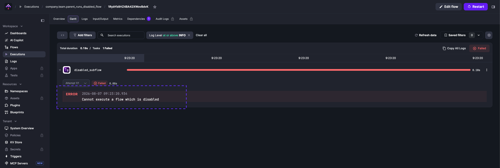
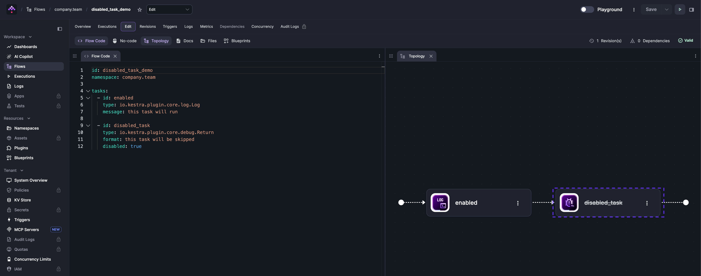

The `disabled` property is a boolean that skips a flow, task, or trigger without removing it — useful for debugging without deleting YAML.

<div class="video-container">
  <iframe src="https://www.youtube.com/embed/FcDsU1YIToI?si=xc5fuRlIDaWNUjWn" title="YouTube video player" allow="accelerometer; autoplay; clipboard-write; encrypted-media; gyroscope; picture-in-picture; web-share" referrerpolicy="strict-origin-when-cross-origin" allowfullscreen></iframe>
</div>

## Disabled flow

A disabled flow will not execute and its triggers are automatically ignored — you do not need to disable each trigger separately.

```yaml
id: disabled_flow
namespace: company.team
disabled: true

tasks:
  - id: hello
    type: io.kestra.plugin.core.log.Log
    message: Kestra team wishes you a great day! 👋

triggers:
  - id: fail_every_minute
    type: io.kestra.plugin.core.trigger.Schedule
    cron: "*/1 * * * *"
```

The Execute dialog warns that the flow is disabled and no executions are created:


When executing a disabled flow from a subflow:

```yaml
id: parent_runs_disabled_flow
namespace: company.team
tasks:
  - id: disabled_subflow
    type: io.kestra.plugin.core.flow.Subflow
    flowId: disabled_flow
    namespace: company.team
```

The parent flow immediately fails with the error: `Cannot execute a flow which is disabled`.



The same error occurs when triggering via API — the execution is created then immediately marked as failed:

```bash
curl -X POST http://localhost:8080/api/v1/main/executions/trigger/company.team/parent_runs_disabled_flow
```

## Disabled trigger

To disable a trigger without disabling the entire flow, set `disabled: true` on the trigger:

```yaml
id: myflow
namespace: company.team

tasks:
  - id: hello
    type: io.kestra.plugin.core.log.Log
    message: hello from a scheduled flow

triggers:
  - id: daily
    type: io.kestra.plugin.core.trigger.Schedule
    cron: "0 9 * * *"
    disabled: true
```

No scheduled executions are created while the trigger is disabled. To re-enable it, set `disabled: false` or remove the property entirely.

## Disabled task

You can disable a single task to skip it without deleting it — useful when isolating a failure during debugging:

```yaml
id: myflow
namespace: company.team

tasks:
  - id: enabled
    type: io.kestra.plugin.core.log.Log
    message: this task will run

  - id: disabled
    type: io.kestra.plugin.core.debug.Return
    format: this task will be skipped
    disabled: true
```

Disabled tasks appear with a strikethrough on the task name in the Topology view:


