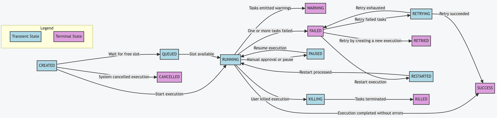
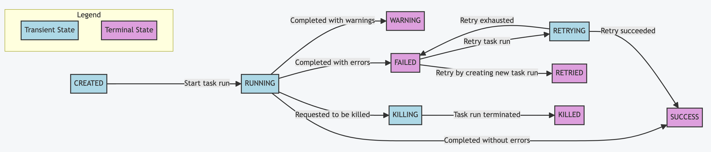

States represent where an execution or task run is in its lifecycle. Each state determines what Kestra does next — whether to continue, retry, wait for input, or terminate. For a broader overview of executions, see the [Execution documentation](../03.execution/index.md).

    <iframe src="https://www.youtube.com/embed/h5AigXBAs6Y?si=ftaD1zM24b7BDUMo" title="YouTube video player" allow="accelerometer; autoplay; clipboard-write; encrypted-media; gyroscope; picture-in-picture; web-share" referrerpolicy="strict-origin-when-cross-origin" allowfullscreen></iframe>

## Execution states

| State | Type | Description |
|-------|------|-------------|
| `CREATED` | Transient | Created but not yet started. Transitions quickly to `SUBMITTED`, `RUNNING`, `QUEUED`, or `CANCELLED`. Executions stuck here may indicate a system issue. |
| `SUBMITTED` | Transient | Submitted to the Executor queue but not yet running. Appears briefly between `CREATED` and `RUNNING`. |
| `QUEUED` | Transient | Waiting for a free slot. Only occurs when [concurrency](../14.concurrency/index.md) limits are set and all slots are occupied. |
| `RUNNING` | Transient | Currently in progress. Continues until all task runs complete. |
| `PAUSED` | Transient | Awaiting manual approval or a fixed delay before continuing. Transitions directly back to `RUNNING` when resumed — there is no `RESUMING` or `RESUMED` state. |
| `BREAKPOINT` | Transient | The execution is paused at a debug breakpoint set in the flow editor (Enterprise Edition). Distinct from `PAUSED`, which handles manual approvals and configured delays. Resume via the **Resume from Breakpoint** command. |
| `RESTARTED` | Transient | Equivalent to `CREATED` but for a failed execution that has been manually restarted from the UI. Transitions to `RUNNING` once processed. |
| `RETRYING` | Transient | One or more failed task runs are being retried under a [flow-level retry policy](../12.retries/index.md#flow-level-retries). Transitions to `SUCCESS`, `WARNING`, or `FAILED` once all attempts are exhausted. |
| `KILLING` | Transient | The user has issued a kill command. The system is terminating any task runs still in progress. Transitions to `KILLED` once all task runs are terminated. |
| `SUCCESS` | Terminal | All tasks completed without errors, or any failures were explicitly allowed. |
| `WARNING` | Terminal | Completed successfully, but one or more tasks emitted warnings. |
| `FAILED` | Terminal | One or more tasks failed and will not be retried. If an [`errors` handler](../11.errors/index.md) is defined, its tasks run before the execution ends. With a [flow-level retry policy](../12.retries/index.md#flow-level-retries) set to `RETRY_FAILED_TASK`, the execution transitions to `RETRYING` instead. |
| `RETRIED` | Terminal | The original execution failed and was retried under a flow-level retry policy set to `CREATE_NEW_EXECUTION`. The original execution is marked `RETRIED` and a new execution is created in its place. |
| `RESUBMITTED` | Terminal | The execution was resubmitted directly (not via an automatic retry policy). The original execution is marked `RESUBMITTED` and a new execution continues in its place. |
| `SKIPPED` | Terminal | The execution was skipped. A condition, SLA policy, or concurrency behavior prevented it from starting. |
| `CANCELLED` | Terminal | Automatically cancelled by the system because the [concurrency](../14.concurrency/index.md) limit was reached and `behavior` was set to `CANCEL`. |
| `KILLED` | Terminal | Killed on request by the user. No further tasks will run. |

## CANCELLED vs. KILLED

Both are terminal states that stop an execution, but they have different causes:

- **`CANCELLED`** — triggered by the **system** when the concurrency limit is reached and `behavior: CANCEL` is configured. No user action required.
- **`KILLED`** — triggered by the **user** via the **Kill** button in the UI or an API call. The execution first passes through `KILLING` while in-progress task runs are terminated, then settles in `KILLED`.

## Task run states

Task run states represent the status of a single task run within an execution. The lifecycle is similar but not identical. Executions have `QUEUED`, `CANCELLED`, and `PAUSED` states that task runs do not, while task runs use `SUBMITTED` specifically to indicate they have been queued to a Worker and are waiting to run.

| State | Description |
|-------|-------------|
| `CREATED` | Created but not yet started. |
| `SUBMITTED` | Submitted to a Worker but not yet running. |
| `RUNNING` | Currently in progress. |
| `SUCCESS` | Completed successfully. |
| `WARNING` | Completed with warnings. |
| `FAILED` | Failed. |
| `RETRYING` | Being retried. |
| `RETRIED` | Retried and superseded by a new attempt. |
| `RESUBMITTED` | Resubmitted directly; superseded by a new attempt. |
| `RESTARTED` | Being restarted. |
| `KILLING` | Kill in progress. |
| `KILLED` | Killed on request by the user. |
| `SKIPPED` | Skipped. Did not run due to a condition or policy. |
