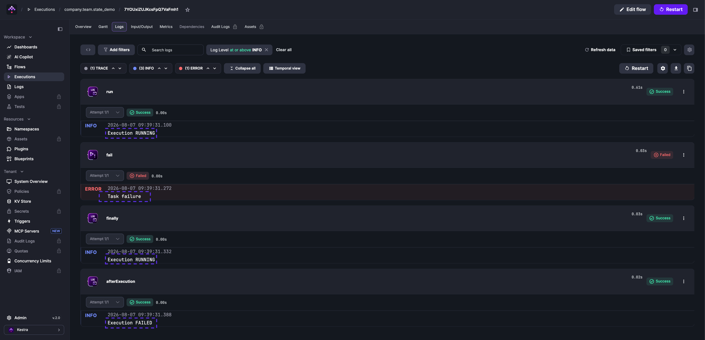

`afterExecution` tasks run once a flow reaches a terminal state, giving you access to the final execution status for notifications, reporting, or conditional follow-up actions.

<div class="video-container">
    <iframe src="https://www.youtube.com/embed/7PCOvxOl9LI?si=opJjV_Drs-dsjy_L" title="YouTube video player" allow="accelerometer; autoplay; clipboard-write; encrypted-media; gyroscope; picture-in-picture; web-share" referrerpolicy="strict-origin-when-cross-origin" allowfullscreen></iframe>
</div>

Use `afterExecution` with `runIf` to branch on the final execution state:

```yaml
id: alerts_demo
namespace: company.team

tasks:
  - id: fail
    type: io.kestra.plugin.core.execution.Fail

afterExecution:
  - id: onSuccess
    runIf: "{{ execution.state == 'SUCCESS' }}"
    type: io.kestra.plugin.slack.notifications.SlackIncomingWebhook
    url: https://hooks.slack.com/services/xxxxx
    messageText: "{{ flow.namespace }}.{{ flow.id }} finished successfully!"

  - id: onFailure
    runIf: "{{ execution.state == 'FAILED' }}"
    type: io.kestra.plugin.slack.notifications.SlackIncomingWebhook
    url: https://hooks.slack.com/services/xxxxx
    messageText: "Oh no, {{ flow.namespace }}.{{ flow.id }} failed!!!"
```

## `afterExecution` vs `errors`

Both run near the end of a flow, but at different moments and for different purposes:

| | `afterExecution` | `errors` |
|---|---|---|
| When it runs | After the execution reaches a terminal state | When a task or flow errors |
| State visibility | Sees the final execution state (`SUCCESS`, `FAILED`, etc.) | Sees `RUNNING` — the execution hasn't settled yet |
| Scope | Flow level only | Flow level or local to a flowable task |

Use `afterExecution` when you need to branch on the final status — one message for `SUCCESS`, another for `FAILED`, a third for `WARNING`. Use `errors` when you only need failure handling or local error handling inside a specific flowable task. See the [`errors` documentation](../11.errors/index.md) for details.

:::alert{type="warning"}
Errors inside an `afterExecution` block do not change the final execution state. A failing `afterExecution` task will not flip the execution from `SUCCESS` to `FAILED`, and will not trigger flows that listen for `FAILED` executions. To force a state change, use a [Sequential](../01.tasks/00.flowable-tasks/index.md#sequential) task with its own `errors` block:

```yaml
afterExecution:
  - id: t2
    type: io.kestra.plugin.core.flow.Sequential
    tasks:
      - id: t2-t1
        type: io.kestra.plugin.core.flow.Sleep
        duration: "PT5S"
      - id: t2-t2
        type: io.kestra.plugin.core.execution.Fail
    errors:
      - id: sendAlert
        type: io.kestra.plugin.slack.notifications.SlackIncomingWebhook
        url: https://hooks.slack.com/services/xxxxx
        messageText: "Flow {{ flow.namespace }}.{{ flow.id }} with execution ID {{ execution.id }} failed."
```
:::

## `afterExecution` vs `finally`

`finally` runs while the execution is still `RUNNING` — it cannot see the terminal state. `afterExecution` runs after the execution settles, so it sees `SUCCESS`, `FAILED`, or `WARNING`. Use `finally` for cleanup that must always happen; use `afterExecution` when follow-up logic depends on the outcome.

The following flow demonstrates the difference:

```yaml
id: state_demo
namespace: company.team

tasks:
  - id: run
    type: io.kestra.plugin.core.log.Log
    message: Execution {{ execution.state }} # Will show RUNNING

  - id: fail
    type: io.kestra.plugin.core.execution.Fail

finally:
  - id: finally
    type: io.kestra.plugin.core.log.Log
    message: Execution {{ execution.state }} # Will show RUNNING

afterExecution:
  - id: afterExecution
    type: io.kestra.plugin.core.log.Log
    message: Execution {{ execution.state }} # Will show FAILED
```

The `finally` task logs `Execution RUNNING` because it runs before the execution reaches its terminal state. The `afterExecution` task logs `Execution FAILED` because it runs after. See the [`finally` documentation](../19.finally/index.md) for more on cleanup patterns.


