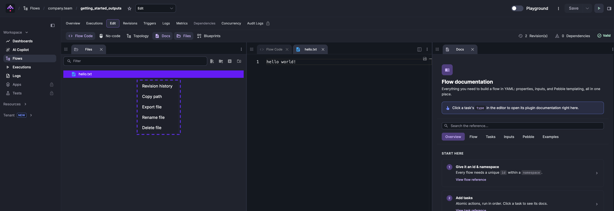
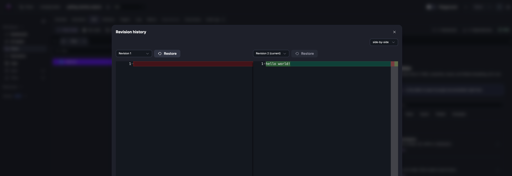

Namespace Files are files tied to a namespace — scripts, queries, configs, and other assets you can reference in any flow within that namespace.

<div class="video-container">
  <iframe src="https://www.youtube.com/embed/BeQNI2XRddA?si=nvoIqA1SIrMaKyYs" title="YouTube video player" allow="accelerometer; autoplay; clipboard-write; encrypted-media; gyroscope; picture-in-picture; web-share" referrerpolicy="strict-origin-when-cross-origin" allowfullscreen></iframe>
</div>

A namespace holds Python files, R or Node.js scripts, SQL queries, dbt or Terraform projects, and more: equivalent to a project directory in your IDE or a Git repository clone. Any file in a namespace is referenceable from any flow in that namespace via the `read()` function.

For example, a SQL query at `queries/my_query.sql` in the `company.team` namespace is accessible as `{{ read('queries/my_query.sql') }}` in any `Query` task or JDBC trigger.

The [ClickHouse Trigger](/plugins/plugin-jdbc-clickhouse/io.kestra.plugin.jdbc.clickhouse.trigger) below reads a SQL query stored as a namespace file:

```yaml
id: jdbc_trigger
namespace: company.team

tasks:
  - id: for_each_row
    type: io.kestra.plugin.core.flow.Loop
    values: "{{ trigger.rows }}"
    tasks:
      - id: return
        type: io.kestra.plugin.core.debug.Return
        format: "{{ fromJson(item.value) }}"

triggers:
  - id: query_trigger
    type: io.kestra.plugin.jdbc.clickhouse.Trigger
    interval: "PT5M"
    url: jdbc:clickhouse://127.0.0.1:56982/
    username: "{{ secret('CLICKHOUSE_USERNAME') }}"
    password: "{{ secret('CLICKHOUSE_PASSWORD') }}"
    sql: "{{ read('queries/my_query.sql') }}"
    fetchType: FETCH
```

:::alert{type="info"}
The `namespaceFiles.enabled: true` property is not required here — it is only needed to inject an entire directory of namespace files into the working directory of a script task. If you only need to read a file’s contents, use `read()` without mounting; mounting is for when the task needs files on disk.
:::

## Adding namespace files

### Embedded code editor

Access Namespace Files from the **Files** tab while creating or editing a flow. From there you can write, import, or paste scripts, queries, and configuration files directly.

Example: a folder named `scripts` with a file called `hello.py`:

```python
print("Hello from the Editor!")
```

The flow below references that file:

```yaml
id: editor
namespace: company.team

tasks:
  - id: hello
    type: io.kestra.plugin.scripts.python.Commands
    namespaceFiles:
      enabled: true
    commands:
      - python scripts/hello.py
```

The **Execute** button runs the flow directly from the Code Editor. The **Logs** tab shows `Hello from the Editor!`.

### Namespace Files Revision History

Namespace Files include revision history just like flows, so you can inspect or roll back earlier uploads without leaving the Editor.

- First upload of a path is stored as `queries/my_query.sql` and treated as version 0 for backward compatibility.
- Each subsequent upload keeps `queries/my_query.sql` as the latest version while adding suffixed revisions such as `queries/my_query.sql.v1`, `queries/my_query.sql.v2`, and so on.
- Older revisions remain available under their suffixed filenames, letting you compare and restore as needed.

Right-clicking on a file opens its revision history.



The history view allows comparing and restoring prior versions.



The **Revisions** list supports deleting a given revision or all revisions older than a selected one. Deleted revisions cannot be restored.

Revisions can also be purged by count or by date. See the [Purge documentation](../../10.administrator-guide/purge/index.md#purge-namespace-files).

### PushNamespaceFiles and SyncNamespaceFiles tasks

Two tasks automate namespace file management with Git, syncing the latest changes from a repository.

This example pushes Namespace Files you already have in Kestra to a Git repository for you:

```yaml
id: push_to_git
namespace: system

tasks:
  - id: commit_and_push
    type: io.kestra.plugin.git.PushNamespaceFiles
    username: git_username
    password: "{{ secret('GITHUB_ACCESS_TOKEN') }}"
    url: https://github.com/git_username/scripts
    branch: dev
    namespace: company.team
    files:
      - "example.py"
    gitDirectory: _files
    commitMessage: "add namespace files"
    dryRun: true
```

This example syncs Namespace Files inside of a Git repository to your Kestra instance:

```yaml
id: sync_files_from_git
namespace: system

tasks:
  - id: sync_files
    type: io.kestra.plugin.git.SyncNamespaceFiles
    username: git_username
    password: "{{ secret('GITHUB_ACCESS_TOKEN') }}"
    url: https://github.com/git_username/scripts
    branch: main
    namespace: git
    gitDirectory: _files
    dryRun: true
```

Dedicated guides:
- [PushNamespaceFiles](../../15.how-to-guides/pushnamespacefiles/index.md)
- [SyncNamespaceFiles](../../15.how-to-guides/syncnamespacefiles/index.md)

### GitHub Actions CI/CD

The official Kestra [GitHub Actions](../../version-control-cicd/cicd/01.github-action/index.md) upload namespace files directly from a repository, suited to configuration, scripts, or other assets that live alongside code.

Example workflow deploying the `scripts/` folder to the `prod` namespace using the `deploy-namespace-files` action:

```yaml
name: Kestra Namespace Files
on: [push]

jobs:
  upload-namespace-files:
    runs-on: ubuntu-latest
    steps:
      - uses: actions/checkout@v5
      - name: Upload scripts folder to prod
        uses: kestra-io/github-actions/deploy-namespace-files@main
        with:
          localPath: ./scripts           # folder in the repo
          namespacePath: scripts         # destination path in the namespace
          namespace: prod
          server: ${{ secrets.KESTRA_HOSTNAME }}
          # Choose one auth method:
          # apiToken: ${{ secrets.KESTRA_API_TOKEN }}   # Enterprise Edition
          user: ${{ secrets.KESTRA_USERNAME }}          # Basic auth
          password: ${{ secrets.KESTRA_PASSWORD }}
```

:::alert{type="info"}
- Store credentials as GitHub Secrets. Provide `tenant` when targeting multi-tenant Enterprise environments.
- Ensure the service account role grants namespace file permissions (and `FLOWS` when deploying flows) to your target namespace.
:::

### Terraform provider

The `kestra_namespace_file` resource from the official [Kestra Terraform Provider](https://registry.terraform.io/providers/kestra-io/kestra/latest/docs) deploys script files from a local directory to a given namespace.

This example synchronizes an entire directory of scripts from `src` to the `company.team` namespace:

```hcl
resource "kestra_namespace_file" "prod_scripts" {
  for_each  = fileset(path.module, "src/**")
  namespace = "company.team"
  filename   = each.value # or "/${each.value}"
  content   = file(each.value)
}
```

### Deploy namespace files via kestractl

[kestractl](../../kestra-cli/kestractl/index.md) uploads namespace files from the command line. The following example synchronizes an entire local directory with the `prod` namespace:

```bash
kestractl nsfiles upload prod ./scripts --override
```

To upload to a specific path within the namespace rather than the root:

```bash
kestractl nsfiles upload prod ./assets --path resources --override --fail-fast
```

The `--override` flag replaces existing files; `--fail-fast` stops on the first error rather than continuing.

`kestractl nsfiles` also supports `list`, `get`, and `delete` for inspecting and removing individual files. Run `kestractl nsfiles --help` for the full reference.


## Using namespace files in flows

Namespace files are accessible via the `read()` function (returns content as a string), by pointing to the file path in supported tasks, or via a dedicated namespace task that retrieves the file as an output.

:::alert{type="info"}
Kestra 0.24 introduced a universal file protocol that simplifies accessing files — local or namespace — in your flow. For more details, refer to the [File Access documentation page](../file-access/index.md).
:::

Usually, pointing to a file location, rather than reading the file's content, is required when you want to use a file as an input to a CLI command (e.g., in a `Commands` task such as `io.kestra.plugin.scripts.python.Commands` or `io.kestra.plugin.scripts.node.Commands`). In all other cases, the `read()` function can be used to read the content of a file as a string (e.g., in `Query` or `Script` tasks).

You can also use the `io.kestra.plugin.core.flow.WorkingDirectory` task to read namespace files and then use them in child tasks that require a file path in CLI commands, for example: `python scripts/hello.py`.

### The `read()` function

`read()` returns the **contents** of a namespace file as a string, accepted by tasks like `io.kestra.plugin.scripts.python.Script`, `io.kestra.plugin.scripts.node.Script`, and SQL query properties. It is not for `Commands` tasks that expect a file path on disk. The path must point to a file in the same namespace as the flow.

This example logs the contents of `example.txt`:

```yaml
id: files
namespace: company.team

tasks:
  - id: log
    type: io.kestra.plugin.core.log.Log
    message: "{{ read('example.txt') }}"
```

### `namespaceFiles.enabled` on supported tasks

Supported tasks in the `io.kestra.plugin.scripts` group accept namespace files by path when `namespaceFiles.enabled` is set to `true`.

Below is a simple `weather.py` script that reads a secret to talk to a Weather Data API:

```python
import requests
api_key = '{{ secret("WEATHER_DATA_API_KEY") }}'
url = f"https://api.openweathermap.org/data/2.5/weather?q=Paris&APPID={api_key}"
weather_data = requests.get(url)
print(weather_data.json())
```

Next, is a flow that uses the script:
```yaml
id: weather_data
namespace: company.team

tasks:
  - id: get_weather
    type: io.kestra.plugin.scripts.python.Commands
    namespaceFiles:
      enabled: true
      include:
        - scripts/weather.py
    taskRunner:
      type: io.kestra.plugin.scripts.runner.docker.Docker
    containerImage: ghcr.io/kestra-io/pydata:latest
    commands:
      - python scripts/weather.py
```

#### `namespaceFiles` property

The example above uses the `include` field to only allow the `scripts/weather.py` file to be accessible by the task.

We can control what namespace files are available to our flow with the `namespaceFiles` property.

`namespaceFiles` has several configurable attributes:
- `enabled`: when set to `true`, makes all files in the namespace visible to the task.
- `include`: restricts which files are accessible — only the listed paths are mounted.
- `exclude`: mounts all namespace files except those listed.
- `namespaces`: a list of additional namespaces to load files from.
- `ifExists`: controls what happens when a namespace file conflicts with an existing file in the working directory.
- `folderPerNamespace`: when `true`, mounts each namespace's files into a separate subdirectory instead of the working directory root.

The `namespaces` attribute can be used like in the following example:

```yaml
id: namespace_files_example
namespace: dev.test

tasks:

  - id: namespace
    type: io.kestra.plugin.scripts.python.Commands
    namespaceFiles:
      enabled: true
      namespaces:
        - "dev.test"
        - "company"
    commands:
      - python test.py


  - id: namespace2
    type: io.kestra.plugin.scripts.python.Script
    namespaceFiles:
      enabled: true
    script: "{{ read('test.py') }}"
```

Namespaces are loaded in list order, but when the same file exists in multiple namespaces, the last listed namespace wins. In the first task, `dev.test` is listed first and `company` is listed second, so `company`'s `test.py` takes precedence.

For the second task, the `test.py` file in the `dev.test` namespace will be used because no namespace has been defined in the `read()` function. If you want to fetch the `test.py` script from a different namespace, you need to explicitly define it as follows: `"{{ read('test.py', namespace='company.team') }}"`.


The `ifExists` attribute has four possible options for behavior when tasks invoke a Namespace file that already exists in the working directory:

- `OVERWRITE`: set by default, adds a debug log that the file was overwritten
- `FAIL`: logs and ERROR and fails the task
- `WARN`: logs a WARNING but continues running the execution
- `IGNORE`: doesn't overwrite the file or log any warnings

For example, in the following task the second instance of `sample_python.py` will overwrite the first:

```yaml
id: test_workdir_issue
namespace: prod

tasks:
  - id: git_wdir
    type: io.kestra.plugin.core.flow.WorkingDirectory
    tasks:
      - id: clone
        type: io.kestra.plugin.git.Clone
        branch: main
        url: https://github.com/kestra-io/examples

      - id: python_command_1
        type: io.kestra.plugin.scripts.python.Commands
        namespaceFiles:
          enabled: true
        commands:
          - python scripts/sample_python.py

      - id: python_command_2
        type: io.kestra.plugin.scripts.python.Commands
        namespaceFiles:
          enabled: true
          ifExists: OVERWRITE
        commands:
          - python scripts/sample_python.py
```

### Namespace tasks

Namespace Tasks upload, download, and delete files in Kestra.

In the example below, we have a namespace file called `example.ion` that we want to convert to a `.csv` file. We can use the `DownloadFiles` task to generate an output that contains the file so we can easily pass it dynamically to the `IonToCsv` task.

```yaml
id: files
namespace: company.team
tasks:
  - id: namespace
    type: io.kestra.plugin.core.namespace.DownloadFiles
    namespace: company.team
    files:
      - example.ion

  - id: ion_to_csv
    type: io.kestra.plugin.serdes.csv.IonToCsv
    from: "{{ outputs.namespace.files['/example.ion'] }}"
```

Read more about the tasks below:
- [UploadFiles](/plugins/core/namespace/io.kestra.plugin.core.namespace.uploadfiles)
- [DownloadFiles](/plugins/core/namespace/io.kestra.plugin.core.namespace.downloadfiles)
- [DeleteFiles](/plugins/core/namespace/io.kestra.plugin.core.namespace.deletefiles)

## Include / exclude namespace files

Namespace files are selectively included or excluded via the `namespaceFiles` property.

Given namespace files: `file1.txt`, `file2.txt`, `file3.json`, `file4.yml` — the `include` attribute under `namespaceFiles` restricts which files are mounted:

```yaml
id: include_namespace_files
namespace: company.team

tasks:
  - id: include_files
    type: io.kestra.plugin.scripts.shell.Commands
    namespaceFiles:
      enabled: true
      include:
        - file1.txt
        - file3.json
    commands:
      - ls
```

The `include_files` task lists only `file1.txt` and `file3.json`, the files matched by `include`.

The `exclude` attribute mounts all namespace files except those listed.

```yaml
id: exclude_namespace_files
namespace: company.team

tasks:
  - id: exclude_files
    type: io.kestra.plugin.scripts.shell.Commands
    namespaceFiles:
      enabled: true
      exclude:
        - file1.txt
        - file3.json
    commands:
      - ls
```

The `exclude_files` task from the above flow lists `file2.txt` and `file4.yml`, all the namespace files except those that were excluded using `exclude`.

### Pattern matching rules for `include` / `exclude`

- Patterns that do **not** start with `/` are automatically prefixed with `**/`, so they match recursively (e.g., `file1.txt` becomes `**/file1.txt`).
- Patterns that start with `/` match from the namespace root only (e.g., `/config/settings.json`).
- You can force explicit types with `glob:` or `regex:`:
  - `glob:/src/**/*.py`
  - `regex:^src/.*\\.py$`

Examples:

```yaml
namespaceFiles:
  enabled: true
  include:
    # Root-only matches
    - /file1.txt
    - /config/settings.json

    # Recursive matches (auto **/ prefix)
    - file1.txt          # becomes **/file1.txt
    - src/**             # becomes **/src/**

    # Explicit glob
    - glob:/src/**/*.py
    - glob:config/*.json

    # Regex
    - regex:^src/.*\.py$
    - regex:.*test.*\.json
```

:::alert{type="warning"}
Patterns without a leading `/` are automatically prefixed with `**/`, which makes them recursive. Use a leading `/` or explicit `glob:`/`regex:` to restrict matching to the namespace root. Patterns that already contain `**` (e.g. `my_dir/**`) are still prefixed, producing `**/my_dir/**`; use `/my_dir/**` or `glob:/my_dir/**` to avoid the double prefix.
:::
