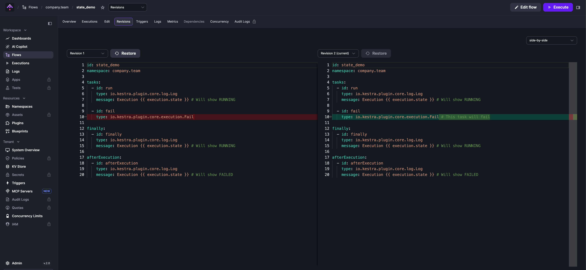

Every time you save a flow, Kestra creates a new revision. The **Revisions** tab lists all revisions for a flow — compare any two side-by-side or line-by-line, and roll back to a previous version at any time.

    <iframe src="https://www.youtube.com/embed/lpHl52Rlvr0?si=RyPvvhGNkTmskLKP" title="YouTube video player" allow="accelerometer; autoplay; clipboard-write; encrypted-media; gyroscope; picture-in-picture; web-share" referrerpolicy="strict-origin-when-cross-origin" allowfullscreen></iframe>

## Draft revisions

When you click **Save as draft** in the flow editor, Kestra saves your changes as a draft revision rather than publishing them immediately.

:::alert{type="warning"}
Executions do not run against a draft revision. If the latest revision of a flow is a draft, any execution — whether triggered manually, by a schedule, or by an event — will run against the last published revision instead. A warning banner in the run panel makes this explicit.
:::

To make your latest changes active, open the run panel — it displays a draft warning banner with a **Publish** button that promotes the draft to a published revision.

Use **Save as draft** when you want to stage changes without affecting running executions — for example, while iterating on a flow that is already in production.
