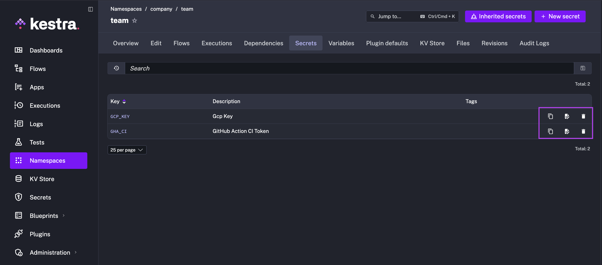
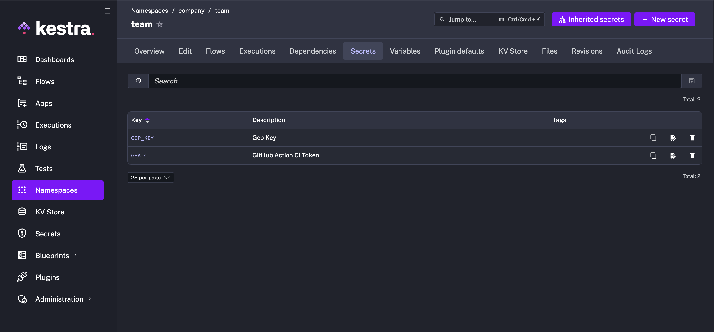
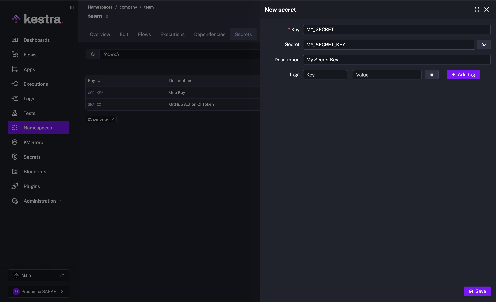

Secrets let you store sensitive values (API keys, passwords, certificates) outside your flow definitions and inject them at runtime via the `secret()` function.

<div class="video-container">
  <iframe src="https://www.youtube.com/embed/u0yuOYG-qMI?si=9T-mMYgs-_SOIPoG" title="YouTube video player" allow="accelerometer; autoplay; clipboard-write; encrypted-media; gyroscope; picture-in-picture; web-share" referrerpolicy="strict-origin-when-cross-origin" allowfullscreen></iframe>
</div>

How secrets are stored and managed depends on your edition. In **Enterprise Edition**, Kestra connects to a dedicated Secrets Manager (namespace-scoped, backed by AWS Secrets Manager, Azure Key Vault, HashiCorp Vault, or Kestra's own store). In **Open-Source**, there is no secret store — `secret()` reads a base64-encoded environment variable instead.

## Enterprise Edition

Use secrets for static sensitive values such as API keys, passwords, webhook URLs, certificates, and long-lived tokens. Use [Credentials](../../07.enterprise/03.auth/credentials/index.md) when Kestra needs to manage reusable server-to-server authentication for supported integrations — for example, minting or refreshing short-lived access tokens at runtime. Credentials can reference secrets for sensitive inputs such as client secrets and private keys.

For available backends (AWS Secrets Manager, Azure Key Vault, HashiCorp Vault, and Kestra's built-in store), see the [Secrets Manager](../../07.enterprise/02.governance/secrets-manager/index.md) page.

From the **Secrets** tab, you can edit, delete, and copy your secret to your clipboard as a Pebble expression for use in a flow, such as `"{{ secret('API_TOKEN') }}"`.



### Adding a new secret from the UI

Go to **Namespaces** in the left navigation menu and select the namespace where you want to add a secret. Open the **Secrets** tab and add a new secret.



Set a key name such as `MY_SECRET`. You can also include a short description and tags.




### Reading secrets from another namespace (EE)

By default, `secret()` reads from the flow's own namespace. In Enterprise Edition, you can pass a `namespace` argument to read a secret stored in a different namespace:

```yaml
tasks:
  - id: use_shared_secret
    type: io.kestra.plugin.core.log.Log
    message: "{{ secret('SHARED_TOKEN', namespace='shared.secrets') }}"
```

The secret is resolved using the target namespace's own secret backend, so a flow can read a value from a namespace backed by a different secrets manager. Cross-namespace reads stay within the same tenant. Access to another namespace's secrets is allowed by default; restrict it by configuring `allowedNamespaces` on the target namespace.

## Environment variables as secrets (OSS)

The Open-Source Edition has no dedicated secret store. As a workaround, Kestra reads base64-encoded environment variables prefixed with `SECRET_` and exposes them via the `secret()` function. This keeps sensitive values out of flow YAML, but it is not a secrets manager — there is no encryption at rest, no audit trail, and no access control beyond what your host environment provides.

See [Configure secrets in Kestra (OSS)](../../15.how-to-guides/secrets/index.md) for step-by-step instructions on encoding values and wiring them into your Docker Compose file.
