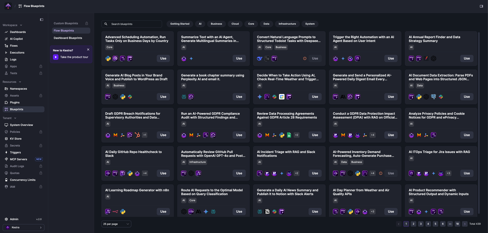
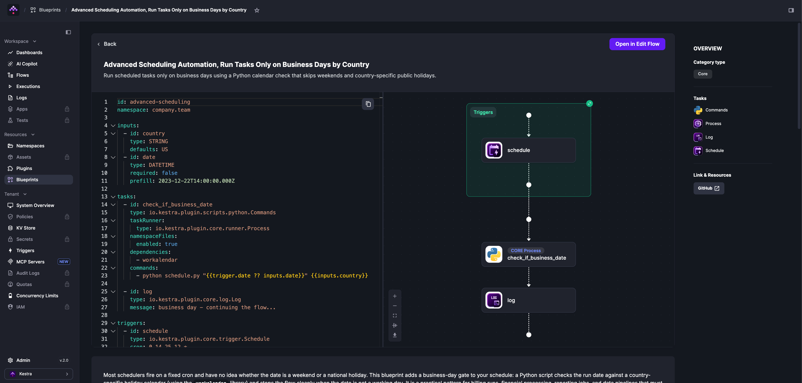

Blueprints are a searchable catalog of validated, documented flow examples. Each blueprint combines code and documentation with tags for discoverability. Click **Use** to copy any blueprint into your editor and customize it from there.

  <iframe src="https://www.youtube.com/embed/5mvYVLKLzGk?si=Ga4ndYv_pI3NIlLK" title="YouTube video player" allow="accelerometer; autoplay; clipboard-write; encrypted-media; gyroscope; picture-in-picture; web-share" referrerpolicy="strict-origin-when-cross-origin" allowfullscreen></iframe>

Browse the full catalog at the [Blueprints library](/blueprints).

:::alert{type="info"}
The [Kestra MCP server](../../ai-tools/02.kestra-mcp-resources/index.md) exposes the blueprints library directly to AI coding agents like Claude Code and Cursor. Ask your agent to find a blueprint by use case and it will retrieve the full flow YAML for you.
:::

## Community blueprints

Community blueprints are available in the open-source product and reflect common workflow patterns across the Kestra user base. All blueprints are verified by the Kestra team. To contribute a new blueprint or suggest improvements, use the [GitHub issue template](https://github.com/kestra-io/kestra/issues/new?assignees=&labels=blueprint&projects=&template=blueprint.yml).

### Where to find blueprints

Blueprints are available from the **Blueprints** item in the left sidebar. Each blueprint shows its full YAML and topology before you commit — click **Open in Edit Flow** to load it directly into the editor.

### How to find the right blueprint

From the Blueprints page, **search** by use case or integration (Snowflake, DuckDB, Slack, dbt, Docker, etc.) or **filter** by tag to narrow results.

## Custom blueprints

:::alert{type="info"}
This feature requires the [Enterprise Edition](../../07.enterprise/index.mdx).
:::

Custom Blueprints are private blueprints available only to your organization. Beyond static templates, you can create **Templated Blueprints** — form-driven blueprints that generate complete flows from user inputs using Pebble-style templating, without requiring users to edit YAML directly. Custom Blueprints can also be version-controlled with Git using the `PushBlueprints` and `SyncBlueprints` tasks. See the [Custom Blueprints](../../07.enterprise/02.governance/custom-blueprints/index.md) documentation for details.
