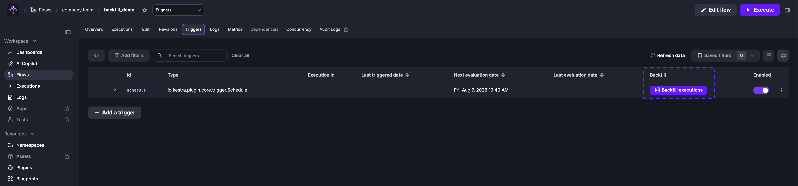

Backfills are replays of missed schedule intervals between a defined start and end date.

Consider a flow that runs every 30 minutes:

```yaml
id: scheduled_flow
namespace: company.team

tasks:
  - id: label
    type: io.kestra.plugin.core.execution.Labels
    labels: # label to track scheduled date
      scheduledDate: "{{ trigger.date ?? execution.startDate }}"
  - id: external_system_export
    type: io.kestra.plugin.scripts.shell.Commands
    taskRunner:
      type: io.kestra.plugin.core.runner.Process
    commands:
      - echo "processing data for {{ trigger.date ?? execution.startDate }}"
      - sleep $((RANDOM % 5 + 1))

triggers:
  - id: schedule
    type: io.kestra.plugin.core.trigger.Schedule
    cron: "*/30 * * * *"
```

If the source system had a 5-hour outage, this flow would miss 10 executions. A backfill replays all schedule intervals in the specified time window — including any that succeeded — so set the start and end dates precisely. To replay specific executions rather than a full time window, use [Replay](../10.replay/index.md) instead.

:::alert{type="info"}
**All missed schedules are automatically recovered by default** if the Kestra server is down. The missed schedules will be executed as soon as Kestra is back up because of the `recoverMissedSchedules: ALL` property default. If you have configured this differently in your global Kestra configuration or specifically on a trigger, a Backfill achieves the same behavior. Read more about `recoverMissedSchedules` in the [dedicated documentation](../../05.workflow-components/07.triggers/01.schedule-trigger/index.md#recover-missed-schedules).
:::

To backfill the missed executions, use **Backfill executions** on the **Triggers** tab of the flow's detail page.



Select the start and end date for the backfill and optionally add custom labels to the executions for tracking.

<div class="video-container">
  <iframe src="https://www.youtube.com/embed/iVTrBdYGbew?si=3GFA0TOZPhOIKc-Q" title="YouTube video player" allow="accelerometer; autoplay; clipboard-write; encrypted-media; gyroscope; picture-in-picture; web-share" allowfullscreen></iframe>
</div>

You can pause and resume the backfill at any time. Click **Details** to see progress and execution status:


:::alert{type="info"}
Backfill executions will not be processed if the associated trigger is disabled.
:::

## Delete a backfill

Delete a backfill from **Tenant → Triggers**. Select the trigger and remove the backfill to stop pending replays.


Deleting a backfill only cancels the scheduled catch-up executions. For example, if you defined a `* * * * *` schedule and backfilled the last five minutes, removing that backfill prevents those five replayed runs from being emitted. This is different from **Delete trigger**, which clears the trigger state itself — effectively recreating the trigger so it starts evaluating from the current time. Use **Delete backfill** to stop pending replays, and **Delete trigger** when you need to reset a stuck trigger or start it fresh.

## Trigger backfill via an API call

### Using cURL

```sh
curl -X PUT http://localhost:8080/api/v1/main/triggers \
  -H "Authorization: Bearer $KESTRA_API_TOKEN" \
  -H "Content-Type: application/json" \
  -d '{
    "namespace": "company.team",
    "flowId":    "myflow",
    "triggerId": "schedule",
    "backfill":  {
      "start": "2025-04-29T11:30:00Z",
      "end":   null,
      "labels": [
        {
          "key": "reason",
          "value": "outage"
        }
      ]
    }
  }'
```

`start` is required; `end` defaults to the current time if omitted. Use `inputs` to pass flow inputs and `labels` to tag the resulting executions for tracking. See the [API Reference](../../api-reference/02.open-source/index.mdx) for all available backfill operations.

### Using a service account

:::badge{version=">=0.15" editions="EE,Cloud"}
:::

Use a [Service Account](../../07.enterprise/03.auth/service-accounts/index.md) token instead of a user token, and include the tenant in the request header and body:

```sh
curl -X PUT http://localhost:8080/api/v1/main/triggers \
  -H "Authorization: Bearer $KESTRA_API_TOKEN" \
  -H "X-Kestra-Tenant: production" \
  -H "Content-Type: application/json" \
  -d '{
    "namespace": "company.team",
    "flowId":    "myflow",
    "triggerId": "schedule",
    "tenantId": "production",
    "backfill":  {
      "start": "2025-04-29T11:30:00Z",
      "end":   null,
      "labels": [
        {
          "key": "reason",
          "value": "outage"
        }
      ]
    }
  }'
```

### Using Python requests

```python
import requests
import json

url = 'http://localhost:8080/api/v1/main/triggers'

headers = {
    'Content-Type': 'application/json'
}

data = {
  "backfill": {
    "start": "2025-06-03T06:30:00.000Z",
    "end": None,
    "inputs": None,
    "labels": [
      {
        "key": "reason",
        "value": "outage"
      }
    ]
  },
  "flowId": "myflow",
  "namespace": "company.team",
  "triggerId": "schedule"
}

response = requests.put(url, headers=headers, data=json.dumps(data))

print(response.status_code)
print(response.text)
```

When `end` is `None`, the backfill runs up to the current time.
