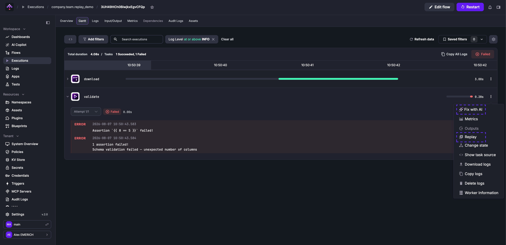
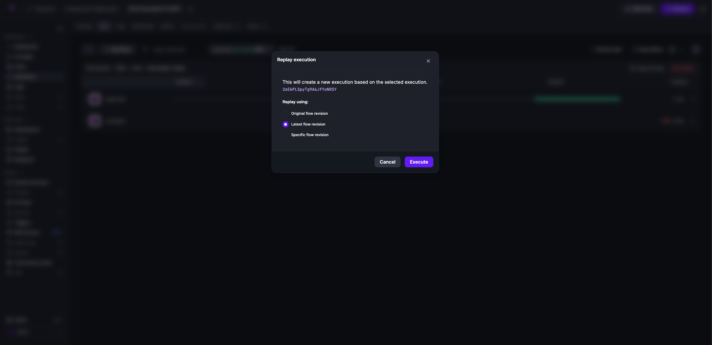
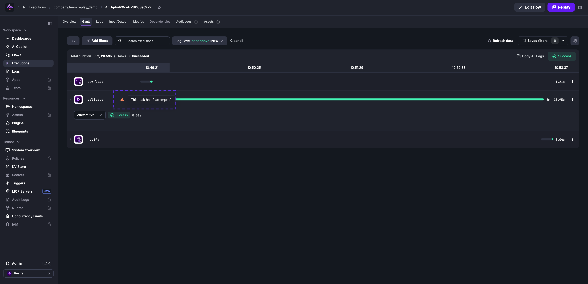
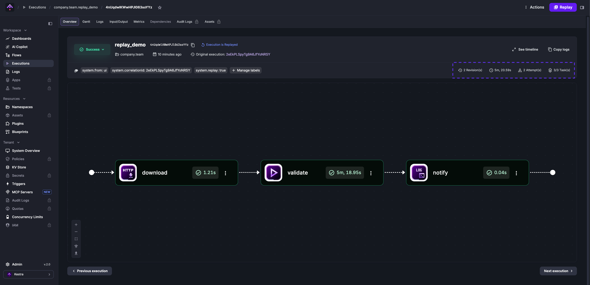

Replay re-runs a workflow execution from any chosen task — skipping tasks that already completed successfully. Use it to recover from failures without reprocessing upstream work, or to iterate on a specific task without re-running the full flow.

<div class="video-container">
  <iframe src="https://www.youtube.com/embed/RvNc3gLXMEs?si=sBuEo3yPfJvi4K48" title="YouTube video player" allow="accelerometer; autoplay; clipboard-write; encrypted-media; gyroscope; picture-in-picture; web-share" referrerpolicy="strict-origin-when-cross-origin" allowfullscreen></iframe>
</div>

To replay from a specific task, open the **Gantt** or **Logs** tab of any execution and use the three-dot menu on the task run. You can also replay a single execution or bulk-replay from the **Executions** page, with the option to use the latest flow revision.

## Example: fixing a failed task and replaying

Consider a flow that downloads a file and then validates its schema:

```yaml
id: replay_demo
namespace: company.team

tasks:
  - id: download
    type: io.kestra.plugin.core.http.Download
    uri: https://huggingface.co/datasets/kestra/datasets/raw/main/csv/orders.csv

  - id: validate
    type: io.kestra.plugin.core.execution.Assert
    errorMessage: "Schema validation failed — unexpected number of columns"
    conditions:
      - "{{ 8 >= 5 }}"

  - id: notify
    type: io.kestra.plugin.core.log.Log
    message: Validation passed, data is ready for processing.
```

Run the flow once with `8 == 5` as the condition — `download` succeeds, then `validate` fails because the assertion is always false.

Open the failed execution and go to the **Gantt** tab. Use the three-dot menu on `validate` to select **Fix with AI** or correct the condition yourself — change `8 == 5` to `8 >= 5` and save as a new revision. Then select **Replay** from the same menu.



In the confirmation dialog, select **Latest flow revision** to use the revision containing your fix.



The `download` task is skipped — Kestra reuses its output from the original execution. Only `validate` and `notify` run again. The **Attempt 2/2** label on `validate` confirms this is the replayed run.



The **Overview** tab shows the attempt number, the revision used, a `system.replay: true` label marking this as a replay, and a `system.correlationId` label linking back to the original execution.


