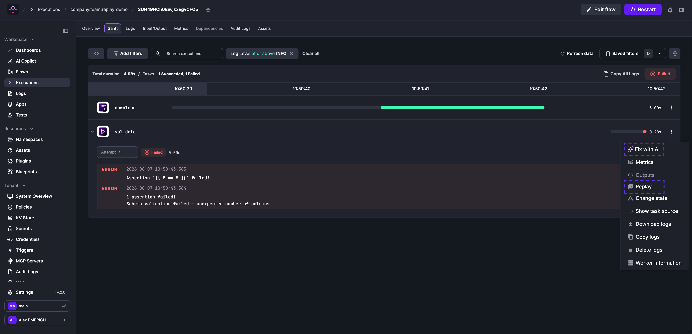
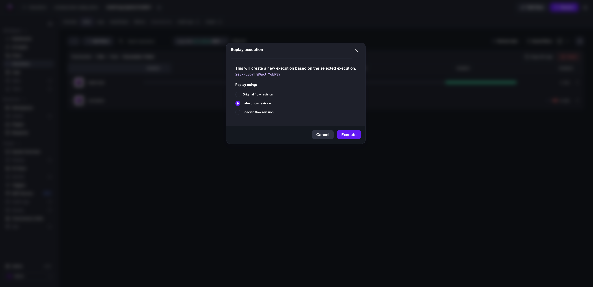
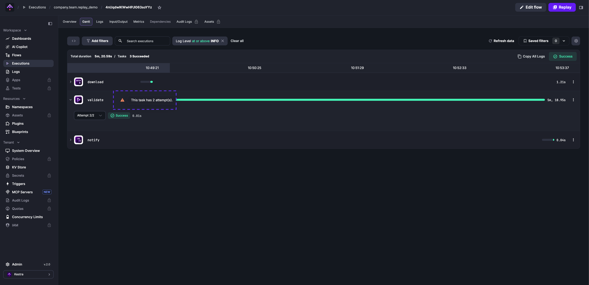
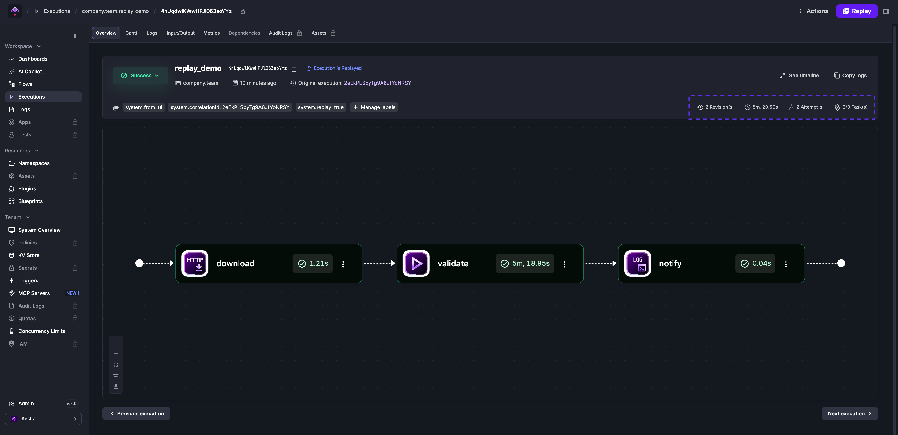

Replay re-runs a workflow execution from any chosen task — skipping tasks that already completed successfully. Use it to recover from failures without reprocessing upstream work, or to iterate on a specific task without re-running the full flow.

<div class="video-container">
  <iframe src="https://www.youtube.com/embed/RvNc3gLXMEs?si=sBuEo3yPfJvi4K48" title="YouTube video player" allow="accelerometer; autoplay; clipboard-write; encrypted-media; gyroscope; picture-in-picture; web-share" referrerpolicy="strict-origin-when-cross-origin" allowfullscreen></iframe>
</div>

To replay from a specific task, open the **Gantt** or **Logs** tab of any execution and use the three-dot menu on the task run. You can also replay a single execution or bulk-replay from the **Executions** page, with the option to use the latest flow revision.

## Example: fixing a failed task and replaying

Consider a flow that downloads a file and then validates its schema:

```yaml
id: replay_demo
namespace: company.team

tasks:
  - id: download
    type: io.kestra.plugin.core.http.Download
    uri: https://huggingface.co/datasets/kestra/datasets/raw/main/csv/orders.csv

  - id: validate
    type: io.kestra.plugin.core.execution.Assert
    errorMessage: "Schema validation failed — unexpected number of columns"
    conditions:
      - "{{ 8 >= 5 }}"

  - id: notify
    type: io.kestra.plugin.core.log.Log
    message: Validation passed, data is ready for processing.
```

Run the flow once with `8 == 5` as the condition — `download` succeeds, then `validate` fails because the assertion is always false.

Open the failed execution and go to the **Gantt** tab. Use the three-dot menu on `validate` to select **Fix with AI** or correct the condition yourself — change `8 == 5` to `8 >= 5` and save as a new revision. Then select **Replay** from the same menu.



In the confirmation dialog, select **Latest flow revision** to use the revision containing your fix.



The `download` task is skipped — Kestra reuses its output from the original execution. Only `validate` and `notify` run again. The **Attempt 2/2** label on `validate` confirms this is the replayed run.



The **Overview** tab shows the attempt number, the revision used, a `system.replay: true` label marking this as a replay, and a `system.correlationId` label linking back to the original execution.



## Replay on another flow revision

When you replay from a task run on the **Latest flow revision** or a **Specific flow revision**, Kestra reuses the stored results of the tasks before it. The original revision produced those results, so Kestra first checks that the chosen revision would have produced the same ones, and refuses the replay otherwise.

Compared with the revision the execution ran on, Kestra refuses the replay when:

- a task before the one you replay from changed, was renamed, was removed, or had a task inserted in front of it. Flowable tasks are compared recursively, and changes to `description`, `retry`, `timeout`, `workerSelector`, `allowFailure` and `allowWarning` are ignored.
- an input was removed, changed type, or lost its default value.
- a variable was removed or changed.

You can still edit the task you replay from, any task after it, and any task that never ran. Replaying on the original revision, or replaying a whole execution without selecting a task run, needs no check because nothing is reused.

The replay dialog runs the check as soon as you pick a revision and shows the result before you confirm. When the check fails, the confirm button is disabled and the dialog shows the reason. Select **Replay the whole execution instead** to keep the chosen revision and run every task again. Kestra keeps and links the original execution, as with any replay.

The API applies the same check. `POST /api/v1/{tenant}/executions/{executionId}/actions/replay/validate` takes the `taskRunId` and `revision` query parameters and returns `200` when the replay is possible, or `409` with the reason when it is not. The replay endpoint itself applies the same check and returns the same reason.

### What the check cannot tell

Kestra compares flow definitions. A passing check does not make a replay on another revision deterministic, because the results of the tasks after the chosen one can still depend on things outside the flow:

- secrets, which Kestra reads on every call and which may have been rotated or expired
- file inputs and non-interactive inputs, which may have changed since the original run
- [Pebble](../../06.concepts/06.pebble/index.md) expressions that call external systems, which may return different values today
