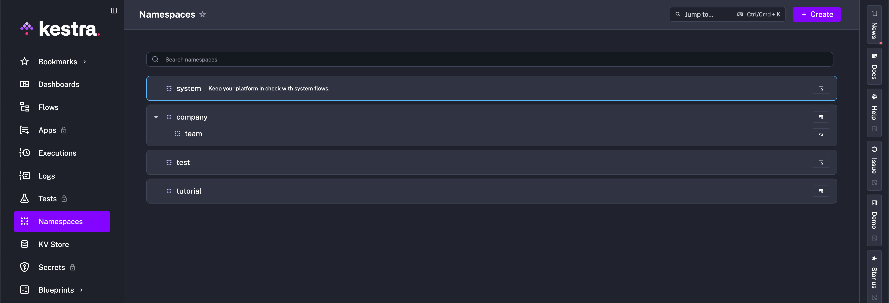
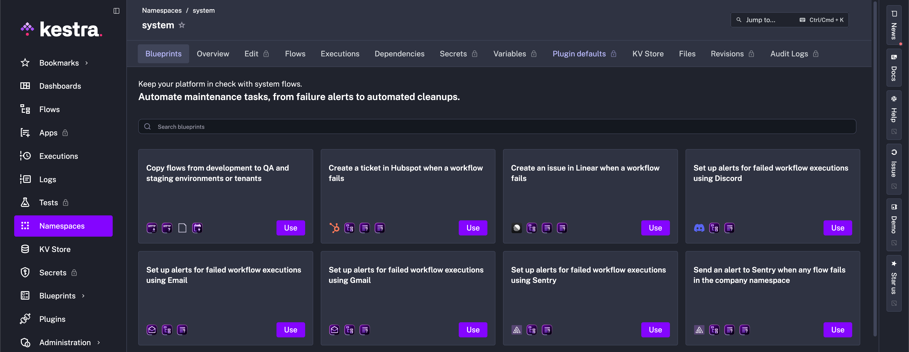
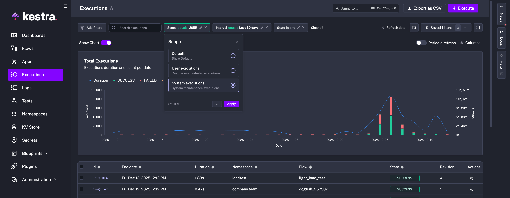

Automate maintenance workflows with System Flows.

<div class="video-container">
  <iframe src="https://www.youtube.com/embed/o05hcKNI_7I?si=sRuuMei3YJb4f7nC" title="YouTube video player" allow="accelerometer; autoplay; clipboard-write; encrypted-media; gyroscope; picture-in-picture; web-share" referrerpolicy="strict-origin-when-cross-origin" allowfullscreen></iframe>
</div>

---

## System Flows – automate platform maintenance

System Flows periodically execute background operations that keep your platform running but which you would generally prefer to keep out of sight. These flows automate maintenance workflows, such as:

1. Sending [alert notifications](/blueprints/failure-alert-slack)
2. Creating automated support tickets when critical workflows fail
3. [Purging logs](/blueprints/purge) and removing old executions or internal storage files to save space
4. Syncing code from Git or pushing code to Git
5. Automatically [releasing flows](/blueprints/copy-flows-to-new-tenant) from development to QA and staging environments

We refer to these as **System Flows** because by default they are only visible within the `system` namespace and to users with appropriate access. If you prefer, you can use a different namespace name instead of `system` by overwriting the following [configuration](../../configuration/index.md#system-flows):

```yaml
kestra:
  systemFlows:
    namespace: system
```

To access System Flows, navigate to the **Namespaces** section in the UI. The `system` namespace is pinned at the top for quick access.



From this section, you’ll find the **System Blueprints** tab, which provides fully customizable templates that you can modify to suit your organization’s needs.



:::alert{type="info"}
Keep in mind that System Flows are not restricted to System Blueprints — any valid Kestra flow can become a System Flow if it's added to the `system` namespace.
:::

System flow executions appear across the Dashboard, Flows, and Executions pages, each with a multi-select **Scope** filter (`User`, `System`) so you can view user-facing and system executions separately or together.



In terms of permissions, `system` namespace is open by default, but using the namespace-level RBAC functionality in the Enterprise Edition, you can restrict access to the `system` namespace only to Admins, while assigning `company.*` namespaces to your general user base.
