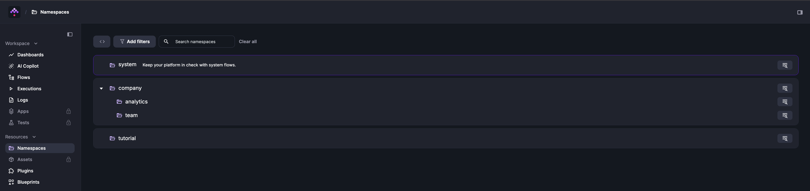
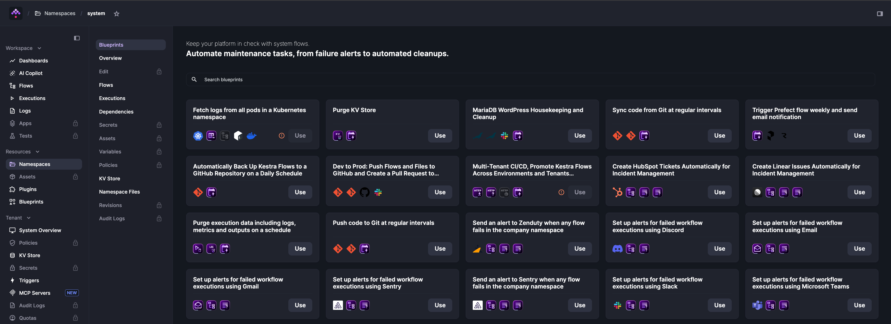
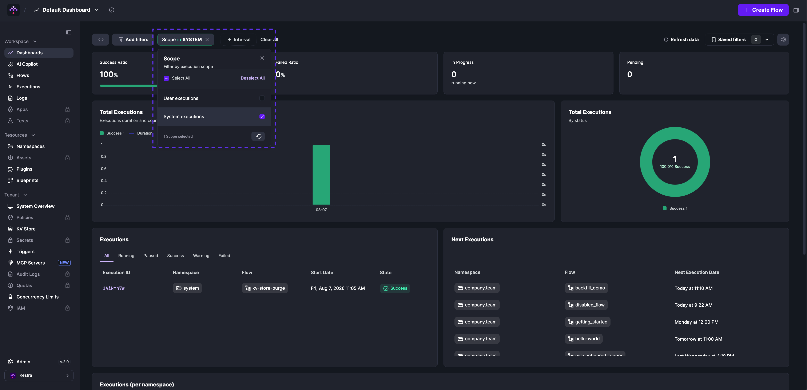

System Flows are flows in the `system` namespace that automate recurring platform maintenance — running on a fixed cadence and kept separate from your user-facing executions.

<div class="video-container">
  <iframe src="https://www.youtube.com/embed/o05hcKNI_7I?si=sRuuMei3YJb4f7nC" title="YouTube video player" allow="accelerometer; autoplay; clipboard-write; encrypted-media; gyroscope; picture-in-picture; web-share" referrerpolicy="strict-origin-when-cross-origin" allowfullscreen></iframe>
</div>

Common uses include:

1. Sending [alert notifications](/blueprints/failure-alert-slack)
2. Creating automated support tickets when critical workflows fail
3. [Purging logs](/blueprints/purge) and removing old executions or internal storage files to save space
4. Syncing code from Git or pushing code to Git
5. Automatically [releasing flows](/blueprints/copy-flows-to-new-tenant) from development to QA and staging environments

By default, System Flows are only visible within the `system` namespace and to users with appropriate access. To use a different namespace name, set the following in your [Plugins and Execution configuration](../../configuration/04.plugins-and-execution/index.md):

```yaml
kestra:
  systemFlows:
    namespace: system
```

System Flows live in the `system` namespace, pinned at the top of **Namespaces**.



The **Blueprints** tab inside the system namespace provides ready-to-use templates you can customize for your organization.



:::alert{type="info"}
System Flows are not restricted to System Blueprints — any valid Kestra flow added to the `system` namespace becomes a System Flow.
:::

System flow executions appear across the Dashboard, Flows, and Executions pages. Use the **Scope** filter to view user and system executions separately or together.



The `system` namespace is open by default. Using namespace-level RBAC in the Enterprise Edition, you can restrict it to admins while assigning `company.*` namespaces to your general user base.
