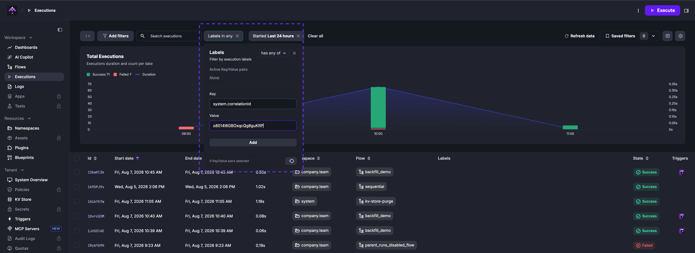
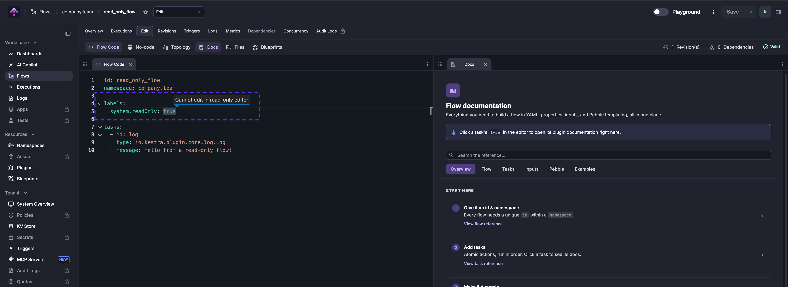

System Labels and Hidden Labels are reserved metadata labels used to manage and monitor Kestra. They are hidden in the UI by default. To find executions tagged with a specific hidden label, use the **Labels** filter with the key and value explicitly — for example, `system.correlationId: o8014I6GBOxqcQg8guKRP`.



After applying the filter, the executions table shows only the matching execution.

## Hidden labels

Hidden Labels are labels excluded from the UI by default. You can configure which prefixes should be hidden via the `kestra.hidden-labels.prefixes` configuration. For example, to hide labels starting with `admin.`, `internal.`, and `system.`, you can use the following configuration in your `application.yaml`:

```yaml
kestra:
  hidden-labels:
    prefixes:
      - system.
      - internal.
      - admin.
```

By default, System Labels (prefixed with `system.`) are hidden. To display them, remove `system.` from the list of hidden prefixes.

## System labels

System Labels are labels prefixed with `system.` that serve specific purposes. The labels below are set automatically by Kestra. For a step-by-step guide on using `system.correlationId` as an idempotency key, see [Idempotency with correlation IDs](../../15.how-to-guides/idempotency/index.md).

### `system.correlationId`

- Automatically set for every execution and propagated to downstream executions created by `Subflow` or `Loop` tasks
- Represents the ID of the first execution in a chain of executions, enabling tracking of execution lineage
- Can also be set to a stable business key and used as an idempotency key for flows that must not process the same event twice
- Use this label to filter all executions originating from a specific parent execution or business event.

For example, if a parent flow triggers multiple subflows, filtering by the parent's `system.correlationId` displays all related executions.

:::alert{type="info"}
The Execution API supports setting this label at execution creation but not modification.
:::

### `system.username`

- Automatically set for every execution and contains the username of the user who triggered the execution
- Useful for auditing and identifying who initiated specific executions

### `system.readOnly`

- Used to mark a flow as read-only, disabling the flow editor in the UI
- Helps prevent modifications to critical workflows, such as production flows managed through CI/CD pipelines

**Example:**

```yaml
id: read_only_flow
namespace: company.team

labels:
  system.readOnly: true

tasks:
  - id: log
    type: io.kestra.plugin.core.log.Log
    message: Hello from a read-only flow!
```



:::alert{type="info"}
In the Enterprise Edition, updating a read-only flow server-side is restricted to service accounts or API keys.
:::

### `system.from`

- Automatically set on every execution to indicate how it was triggered
- Common values include `ui` (triggered from the Kestra UI) and `mcp` (triggered by a Kestra MCP server)
- Use this label to filter executions by their trigger source

### `system.mcpServerId`

- Automatically set on every execution created by a Kestra MCP server
- Value is the `id` of the MCP server that invoked the tool
- Use this label together with `system.from: mcp` to identify which server triggered a specific execution

### `system.mcpSessionId`

- Automatically set on every execution created by a Kestra MCP server
- Value is the session ID of the MCP client connection that triggered the execution
- Use this label to correlate multiple executions that originated from the same agent session
