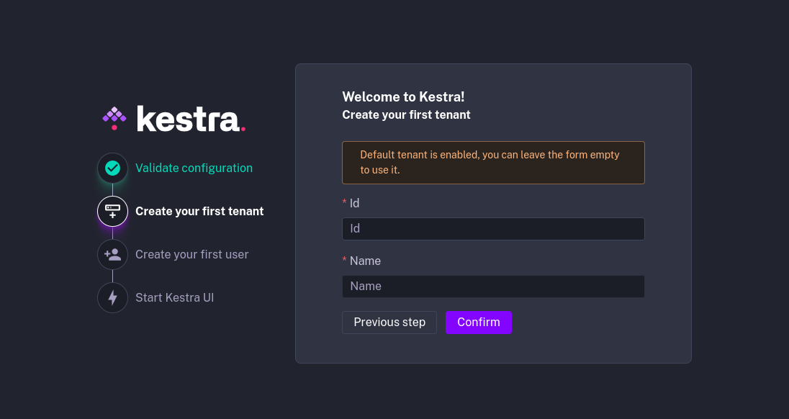
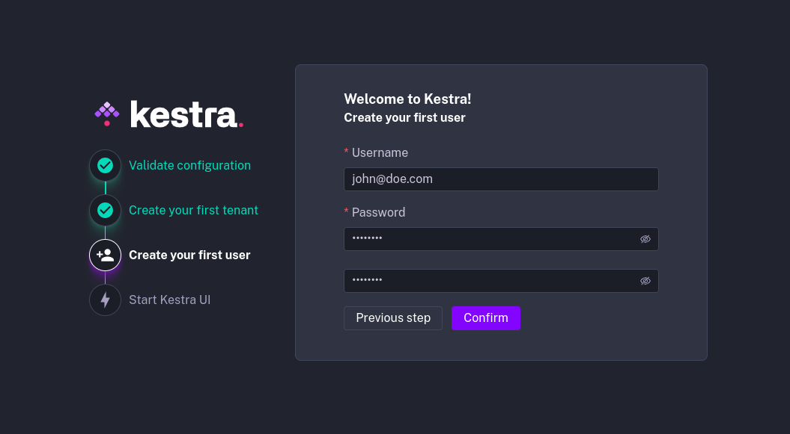

How to set up Kestra Enterprise Edition.

## Set up Kestra Enterprise – license and first tenant

These setup instructions guide you through the initial configuration of your instance.

When you launch Kestra Enterprise Edition for the first time, Kestra will prompt you to configure your instance. This includes setting up your first tenant, creating your first user, and starting the Kestra UI.

## Prerequisites

To use Kestra Enterprise Edition, you will need a valid license configured under the `kestra.ee.license` configuration. The license is unique to your organization. If you need a license, please reach out to our Sales team at [sales@kestra.io](mailto:sales@kestra.io).

The license is set up using three configuration properties: `id`, `fingerprint`, and `key`.

- `kestra.ee.license.id`: license identifier.
- `kestra.ee.license.fingerprint`: license authentication. This is required to use [Versioned Plugins](../../05.instance/versioned-plugins/index.md).
- `kestra.ee.license.key`: license key.

```yaml
kestra:
  ee:
    license:
      id: <LICENSE ID>
      fingerprint: <LICENSE FINGERPRINT>
      key: |
        <LICENSE KEY>
```

When you launch Kestra Enterprise Edition, it will check the license and display the validation step in the log.

## Step 1: Validate configuration

The first screen shows the main configuration of your instance. It displays:
- whether `multitenancy` is enabled
- whether `default tenant` is enabled — if yes, you can skip Step 2 allowing you to create your first tenant
- which `database` backend is configured (e.g., PostgreSQL or Elasticsearch)
- which `queue` backend is configured (e.g., PostgreSQL or Kafka)
- which `internal storage` backend is configured (e.g., S3, GCS, Azure Blob Storage, MinIO, or local storage)
- which `secret` backend is configured (e.g., Vault, AWS Secrets Manager, Elasticsearch, or not set up yet)


This step asks you to confirm whether your configuration is valid. If not, you can correct the configuration, restart the instance, and start the setup from scratch.

## Step 2: Create your first tenant

If `multitenancy` is enabled, Kestra, will prompt you to create your first tenant.

If you choose to create a tenant, you will be asked to input the Tenant ID and Tenant Name, for example:
- tenant id: `stage`
- tenant name: `Staging Environment`

If you enabled a default tenant, you can skip this step.




## Step 3: Create your first user

Now that you have your instance configured, you will create your first user. This user will have a [Superadmin](../../03.auth/rbac/index.md#super-admin) role for the instance and will be able to manage tenants, users, and roles.



## Step 4: Start Kestra UI

Once your tenant and user are configured, Kestra will launch the UI and log you into your new tenant as the first user.


